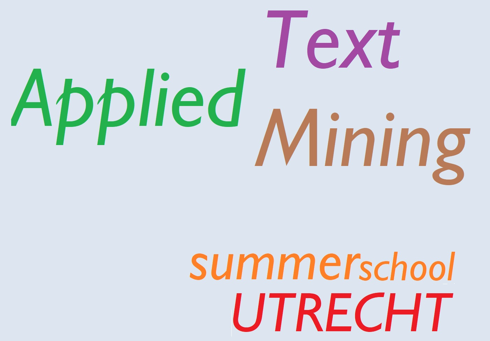

# Intro {.sidebar}
This dashboard covers the course materials for the course [S42: Data Science: Applied Text Mining](https://www.utrechtsummerschool.nl/courses/social-sciences/data-science-applied-text-mining).

---

{width=100%}

---
ADD COURSE INFO
Instructor: FILL   
Study load: FILL   
Assessment: FILL   

---

\
Course director: [Ayoub Bagheri](https://ayoubbagheri.nl/)

Instructors:

* [Ayoub Bagheri](https://ayoubbagheri.nl/)\
+ [Dong Nguyen](https://dongnguyen.nl/)\
* [Berit Janssen](https://www.uu.nl/staff/BDJanssen)\
- [Anastasia Giachanou](http://giachanou.com/)

---

# Quick Overview

## Column 1

### Outline

Given the rapid rate at which text data are being digitally gathered in many domains of science, there is growing need for automated tools that can analyse, classify, and interpret this kind of data. Text mining techniques can be applied to create a structured representation of text, making its content more accessible for researchers. Applications of text mining are everywhere: social media, web search, advertising, emails, customer service, healthcare, marketing, etc. This course offers an extensive exploration into text mining with Python. The course has a strongly practical hands-on focus, and students will gain experience in using text mining on real data from for example social sciences and healthcare and interpreting the results. Through lectures and practicals, the students will learn the necessary skills to design, implement, and understand their own text mining pipeline. The topics in this course include preprocessing text, text classification, topic modeling, word embedding, deep learning models, and responsible text mining.

The course deals with the following topics:

* Review the fundamental approaches to text mining;
* Understand and apply current methods for analysing texts;
* Define a text mining pipeline given a practical data science problem;
* Implement all steps in a text mining pipeline: feature extraction, feature selection, model learning, model evaluation;
* Understand and apply state-of-the-art methods in text mining;
* Implement word embedding and advanced deep learning techniques.

The course starts with reviewing basic concepts of text mining and implementing advanced concepts in natural language processing. At the end of the week, participants will master advanced skills of text mining with Python.

### Requirements
Participants should have a basic knowledge of data science and programming and a motivation of scripting and programming in Python.

### Certificate
Participants will receive a certificate at the end of the course.

## Column 2

### Daily schedule

| Start time | End time | Type      |
|:-----------|:---------|:----------|
|  09:00     | 10:30    | Lecture   |
|            |**Break** |           |
|  10:45     | 11:45    | Practical |
|  11:45     | 12:30    | Discussion|
|            |**Lunch** |           |
|  14:00     | 15:30    | Lecture   |
|            |**Break** |           |
|  15:45     | 16:30    | Practical |
|  16:30     | 17:00    | Discussion|

# How to prepare

## Column 1

### Preparing your machine for the course

Add machine preparation

### System requirements

Add system requirements

## Column 2

### What if the steps to the left do not work for me?

Add info

# Monday
## Column 1

### Materials

Here you will find the lecture slides as well as the practical for Monday.

- [Lecture 1](monday/Lectures/Lecture 1.slides.html)
- [Impractical 1](monday/Practicals/Impractical 1.html)
- [Practical 1](monday/Practicals/Practical 1.html) 
- [Practical 1 in Colab](https://colab.research.google.com/)

- [Lecture 2]()
- [Impractical 2]()
- [Practical 2]() 
- [Practical 2 in Colab]()

## Column 2

### References

Add additional info/references

# Tuesday
## Column 1

### Materials

Here you will find the lecture slides as well as the practical for Tuesday.

- [Lecture 3]()
- [Impractical 3]()
- [Practical 3]() 
- [Practical 3 in Colab]()

- [Lecture 4]()
- [Impractical 4]()
- [Practical 4]() 
- [Practical 4 in Colab]()

## Column 2

### References

Add additional info/references

# Wednesday
## Column 1

### Materials

Here you will find the lecture slides as well as the practical for Wednesday.

- [Lecture 5]()
- [Impractical 5]()
- [Practical 5]() 
- [Practical 5 in Colab]()

- [Lecture 6]()
- [Impractical 6]()
- [Practical 6]() 
- [Practical 6 in Colab]()

## Column 2

### References

Add additional info/references

# Thursday
## Column 1

### Materials

Here you will find the lecture slides as well as the practical for Thursday.

- [Lecture 7]()
- [Impractical 7]()
- [Practical 7]() 
- [Practical 7 in Colab]()

- [Lecture 8]()
- [Impractical 8]()
- [Practical 8]() 
- [Practical 8 in Colab]()

## Column 2

### References

Add additional info/references

