```{r, include=FALSE}
library(knitr)
library(kableExtra)
```

## Text mining in an example 

<div style="float: left; width: 20%;">
```{r, echo=FALSE}

```
</div>

<div style="float: right; width: 80%;">
- **Garry** works at <span style="color:blue">Bol.com</span> (a webshop in the Netherlands)
- He works in the dep of **Customer relationship management**.


- He reads <span style="color:blue">customers’ reviews</span> (comments), extracts <span style="color:blue">aspects</span> they wrote their reviews on, and identifies their <span style="color:blue">sentiments</span>.

- Curious about his job? See two examples!
</div>

## 

<div style="float: left; width: 60%;">
This is a nice book for both young and old. It gives beautiful life lessons in a fun way. Definitely worth the money!

<span style="color:green">+ Educational</span>

<span style="color:green">+ Funny</span>

<span style="color:green">+ Price</span>

<hr align=left width="90%" color=#987cb9 size=3>

Nice story for older children.

<span style="color:green">+ Funny</span>

<span style="color:red">- Readability</span>
</div>

<div style="float: right; width: 40%;">
```{r, echo=FALSE}
include_graphics("img/page3_littleprince.png")
```

## Example
<div style="float: left; with: 20%">
```{r, echo=FALSE}

```
</div>

<div style="float: right; width: 80%">
- Garry likes his job a lot, but sometimes it is frustrating!

- This is mainly because their company is expanding quickly!

- Garry decides to hire **Larry** as his assistant.

```{r, echo=FALSE, fig.align='right'}
include_graphics("img/page4_person2.png")
```
</div>

## Example
<div style="float: left; width: 20%">
```{r, echo=FALSE}

```


```{r, echo=FALSE, out.width = "80%"}
include_graphics("img/page4_person2.png")
```
</div>

<div style="float: right; width: 80%">
- Still, a lot to do for two people!

- Garry has some budget left to hire another assistant for couple of years!

- He decides to hire **Harry** too!

- Still, manual labeling is labor-intensive!

```{r, echo=FALSE, fig.align='right'}
include_graphics("img/page5_person3.png")
```
</div>

## Challenges?

- What are the challenges Garry, Larry, and Harry encounter in doing their job, when working with text data?

  - Go to <a href="www.menti.com">www.menti.com</a> and use the code 22 07 62 0

## Challenges with text data

- Huge amount of data

- High dimensional but sparse

  - all possible word and phrase types in the language!!

## Challenges with text data
<div style="float: left; width: 60%">
- Ambiguity
</div>

<div style="float: left; width: 40%">
```{r, echo=FALSE, out.width="70%"}
include_graphics("img/page 8.png")
```
</div>

## Challenges with text data
- Noisy data
  
  - Examples: Abbreviations, spelling errors, short text

- Complex relationships between words
  
  - “Hema merges with Intertoys”
  
  - “Intertoys is bought by Hema”

##
Back to the story

## Example {.smaller}
<div style="float: left; width: 20%">
```{r, echo=FALSE}

```

```{r,echo = FALSE, out.width="90%"}
include_graphics("img/page 11.png")
```
</div>

<div style="float: right; width: 80%">
  - During one of the coffee moments at the company, **Garry** was talking about their situation at the dep of Customer relationship management.

  - When **Carrie**, her colleague from the **IT department**, hears the situation, she offers Garry to use Text Mining!!

  - She says: “<span style="color:blue">Text mining is your friend; it can help you to make the faster by filtering and recommending possible words…</span>”

  - She continues : “Text mining is a subfield of AI and NLP and is related to data science, data mining and machine learning. It will make the process faster and cuts some of the expenses!”

  - After consulting with Larry and Harry, They decide to give text mining a try!
</div>

## Example
```{r, echo=FALSE, out.width="90%", fig.align='center'}
include_graphics("img/page 12.png")
```

## Text mining definition?

- Which can be a part of Text Mining definition?
  - The discovery by computer of new, previously unknown information from textual data
  - Automatically extracting information from text
  - Text mining is about looking for patterns in text
  - Text mining describes a set of techniques that model and structure the information content of textual sources

<br>

<span style="color:green">(You can choose multiple choices)</span>

Go to <a href="www.menti.com">www.menti.com</a> and use the code 22 07 62 0

## Text mining definition
- “the discovery by computer of <span style="color:blue">new</span>, <span style="color:blue">previously unknown</span> information, by <span style="color:blue">automatically extracting</span> information from <span style="color:blue">different</span> written resources” Hearst (1999)

- Text mining is about looking for <span style="color:red">patterns in text</span>, in a similar way that <span style="color:red">data mining</span> can be loosely described as looking for patterns in data.

- Text mining describes a set of <span style="color:green">linguistic</span>, <span style="color:green">statistical</span>, and <span style="color:green">machine learning</span> techniques that model and structure the information content of textual sources. (Wikipedia)

# Logistics

## Access
- You can view my screen on your machine:
  
  - <a href="join.me/TMPython">join.me/TMPython</a>

- Access the course materials from:

  - <a href="www.ayoubbagheri.nl/TMPython">www.ayoubbagheri.nl/TMPython</a>

## Program {.smaller}
```{r, echo = FALSE}
time <- c("9:00 - 10:30", "", "10:45 – 11:45", "11:45 – 12:30", "12:30 – 14:00", "14:00 – 15:30", "", "15:45 – 16:30", "16:30 – 17:00")
monday <- c("Lecture 1", "Break", "Practical 1", "Discussion 1", "Lunch", "Lecture 2", "Break", "Practical 2", "Discussion 2")
tuesday <- c("Lecture 3", "Break", "Practical 3", "Discussion 3", "Lunch", "Lecture 4", "Break", "Practical 4", "Discussion 4")
wednesday <- c("Lecture 5", "Break", "Practical 5", "Discussion 5", "Lunch", "Lecture 6", "Break", "Practical 6", "Discussion 6")
thursday <- c("Lecture 7", "Break", "Practical 7", "Discussion 7", "Lunch", "Lecture 8", "Break", "Practical 8", "Discussion 8")

program <- data.frame(Time = time, Monday = monday, Tuesday = tuesday, Wednesday = wednesday, Thursday = thursday)

program %>% 
  kbl() %>% 
  kable_paper("hover", html_font = "Arial", full_width = T) %>% 
  row_spec(c(1,6), bold = T, color = "#E60B60") %>% 
  row_spec(c(2,7), color = "grey", font_size = 12) %>% 
  row_spec(c(3,8), color = "blue") %>% 
  row_spec(c(4,9), color = "green")
```

## Goal of the course
- The course teaches students the basic and advanced text mining techniques using Python on a variety of applications in many domains of science.

## Python?

- From 1 to 5 how familiar are you with Python?

  - Go to <a hre="www.menti.com">www.menti.com</a> and use the code 81 09 57 8
  
## Python IDE?!

- Which Python IDE do you mostly use?

  - Go to <a href="www.menti.com">www.menti.com</a> and use the code 81 09 57 8

- From 1 to 10 how familiar are you with Google Colab?

## Python

- Latest: <a href="https://www.python.org/downloads/release/python-391/">Python 3.9.1</a>

- Python For Beginners
    - <a href="https://www.python.org/about/gettingstarted/">https://www.python.org/about/gettingstarted/</a>

- The Python Language Reference
    - <a href="https://docs.python.org/3/reference/">https://docs.python.org/3/reference/</a>

- Python 3.9.1 documentation
    - <a href="https://docs.python.org/3/">https://docs.python.org/3/</a>

## Google Colab

- Colaboratory, or "Colab" for short, allows you to write and execute Python in your browser, with
  - Zero configuration required
  - Free access to GPUs
  - Easy sharing

- <a href="https://colab.research.google.com/notebooks/intro.ipynb">https://colab.research.google.com/notebooks/intro.ipynb</a>

## Google Colab?!

- From 1 to 5 how familiar are you with Google Colab?
  
  - Go to <a href="www.menti.com">www.menti.com</a> and use the code 81 09 57 8
  
## Python: Quick & Easy to Learn!

Code in Colab


## Do you have any questions?

- **During the lecture**

  - Post your question to the chat; we will read them during a break.

- **During the computer lab**

  - Post your question in general; we will answer them.

- **After the lecture**

  - Feel free to send me an email or text me in Microsoft Teams

# Introduction | Ayoub Bagheri, a.bagheri@uu.nl 
Utrecht Summer School: Applied Text Mining

## Another TM definition

```{r, echo=FALSE, out.width="90%", fig.align='center'}
include_graphics("img/page 28.png")
```


## Text mining process
```{r, echo=FALSE, out.width="90%", fig.align='center'}
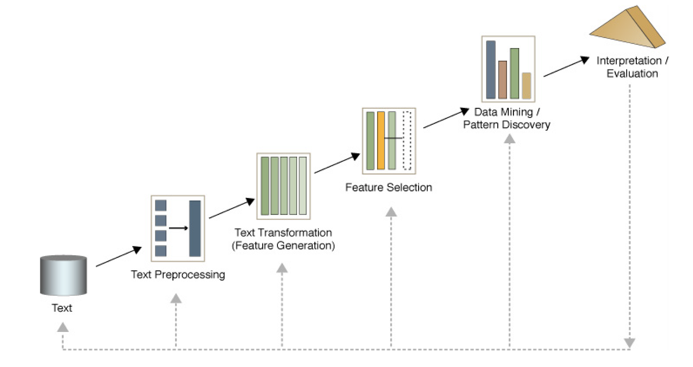
```

##
```{r, echo=FALSE, out.width="80%", fig.align='center'}
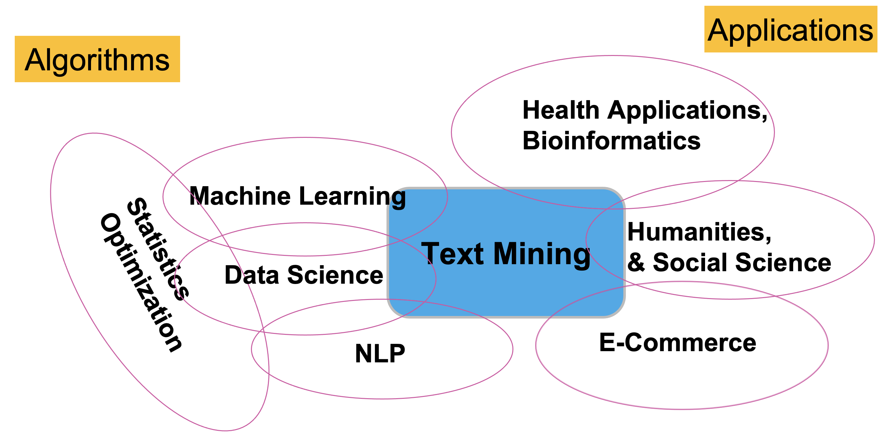
```

## Text mining tasks {.smaller}
- Text classification
- Text clustering

<br>
We will also cover:
  
  - Sentiment analysis
  - Feature selection
  - Topic modelling
  - Word embedding
  - Deep learning models
  - Responsible text mining
  - Text summarization

## Text classification {.smaller}
- Supervised learning
- Human experts annotate a set of text data
  - Training set
- Learn a classification model

```{r, echo=FALSE}
document <- c("Email1", "Email2", "Email3", "...")
class <- c("Not spam", "Not spam", "Spam", "...")
data.frame(Document = document, Class = class) %>% 
  kbl() %>% 
  kable_styling(fixed_thead = T, position ="float_left") %>% 
  kable_paper("hover", full_width=F, ) %>% 
  row_spec(1:4, color = "green") %>% 
  column_spec(1:2, width = "5cm")
```

## Text classification? {.smaller}
- Which problem is not a text classification task? (less likely to be)
  
  - Author's gender detection from text
  
  - Finding about the smoking conditions of patients from clinical letters
  
  - Grouping news articles into political vs non-political news
  
  - Classifying reviews into positive and negative sentiment

<br>
Go to <a href="www.menti.com">www.menti.com</a> and use the code 86 08 86 5

## Text clustering
- Unsupervised learning
- Finding Groups of Similar Documents
- No labeled data

```{r, echo=FALSE}
document <- c("News article1", "News article2", "News article3", "...")
cluster <- c("?", "?", "?", "...")
data.frame(Document = document, Cluster = cluster) %>% 
  kbl() %>% 
  kable_styling(fixed_thead = T, position ="float_left") %>% 
  kable_paper("hover", full_width=F) %>% 
  row_spec(1:4, color = "green") %>% 
  column_spec(1:2, width = "5cm")
```

## Text Clustering?
- Which problem is not a text clustering task? (less likely to be)
  
  - Grouping similar news articles
  
  - Grouping discharge letters in two categories: heart disease vs cancer
  
  - Grouping tweets which support Trump into three undefined subgroups
  
  - Grouping online books of a library in 10 categories

<br>
Go to <a href="www.menti.com">www.menti.com</a> and use the code 86 08 86 5

# Text preprocessing

## Vector space model

- Represent documents by concept vectors
  
  - Each concept defines one dimension
  
  - $k$ concepts define a high-dimensional space
  
  - Element of vector corresponds to concept weight
    
    - E.g., $d=(x_1,…,x_k)$, $x_i$ is “importance” of concept $i$ in $d$

## Vector space model

- Represent documents by concept vectors
  
  - Each concept defines one dimension

  - $k$ concepts define a high-dimensional space
    
  - Element of vector corresponds to concept weight
        
    - E.g., $d=(x_1,…,x_k)$, $x_i$ is “importance” of concept $i$ in $d$

- Distance between the vectors in this concept space
  
  - Relationship among documents  

## An illustration of VS model

- All documents are projected into this concept space

```{r, echo=FALSE, out.width="80%", fig.align='center'}
include_graphics("img/page 38.png")
```

## An illustration of VS model

- All documents are projected into this concept space

```{r, echo=FALSE, out.width="80%", fig.align='center'}
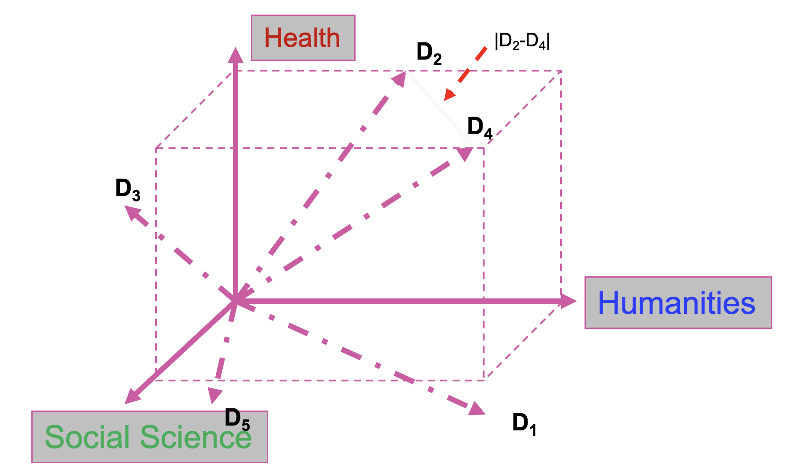
```

## Bag-of-Words representation

- Term as the basis for vector space

```{r, echo=FALSE, out.width="80%", fig.align='center'}
include_graphics("img/page 39.png")
```

## Tokenization

- Break a stream of text into meaningful units
  
  - Tokens: words, phrases, symbols
    
    - Input: It’s not straight-forward to perform so-called “tokenization.” 

## Tokenization

- Break a stream of text into meaningful units
  
  - Tokens: words, phrases, symbols
    
    - Input: It’s not straight-forward to perform so-called “tokenization.”  
    
    - Output(1): 'It’s', 'not', 'straight-forward', 'to', 'perform', 'so-called', '“tokenization.”' 
    
    - Output(2): 'It', '’', 's', 'not', 'straight', '-', 'forward, 'to', 'perform', 'so', '-', 'called', ‘“', 'tokenization', '.', '”‘

## Tokenization

- Break a stream of text into meaningful units
  
  - Tokens: words, phrases, symbols
    
    - Input: It’s not straight-forward to perform so-called “tokenization.”  
    
    - Output(1): 'It’s', 'not', 'straight-forward', 'to', 'perform', 'so-called', '“tokenization.”' 
    
    - Output(2): 'It', '’', 's', 'not', 'straight', '-', 'forward, 'to', 'perform', 'so', '-', 'called', ‘“', 'tokenization', '.', '”‘
    
  >- Definition depends on language, corpus, or even context

## Tokenization

- Solutions
  
  - Regular expressions
    
    - [\w]+: so-called -> ‘so’, ‘called’
    
    - [\S]+: It’s -> ‘It’s’ instead of ‘It’, ‘’s’

\newpage

## Tokenization

- Solutions
  
  - Regular expressions
    
    - [\w]+: so-called -> ‘so’, ‘called’
    
    - [\S]+: It’s -> ‘It’s’ instead of ‘It’, ‘’s’
  
  - Statistical methods
    
    - Explore rich features to decide where the boundary of a word is
      
      - Apache OpenNLP (<a href="http://opennlp.apache.org/">http://opennlp.apache.org/</a>)
      
      - Stanford NLP Parser (<a href="http://nlp.stanford.edu/software/lex-parser.shtml">http://nlp.stanford.edu/software/lex-parser.shtml</a>) 
      
    - Online Demo
      
      - Stanford (<a href="http://nlp.stanford.edu:8080/parser/index.jsp">http://nlp.stanford.edu:8080/parser/index.jsp</a>) 
      
      - UIUC (<a href="http://nlp.stanford.edu:8080/parser/index.jsp">http://cogcomp.cs.illinois.edu/curator/demo/index.html</a>) 

\newpage

## Bag-of-Words with N-grams

- N-grams: a contiguous sequence of N tokens from a given piece of text
  - E.g., *‘Text mining is to identify useful information.’*
  - Bigrams: *‘text_mining’, ‘mining_is’, ‘is_to’, ‘to_identify’, ‘identify_useful’, ‘useful_information’, ‘information_.’*

>- Pros: capture local dependency and order

>- Cons: a purely statistical view, increase the vocabulary size $O(V^N)$

## Automatic document representation

- Represent a document with all the occurring words
  
  - Pros
    
    - Preserve all information in the text (hopefully)
    
    - Fully automatic
  
  - Cons
    
    - Vocabulary gap: cars v.s., car, talk v.s., talking
    
    - Large storage: N-grams needs $𝑂(𝑉^𝑁)$
  
  - Solution
    
    > - Construct controlled vocabulary

## A statistical property of language

- Zipf’s law

  - Frequency of any word is inversely proportional to its rank in the frequency table

## A statistical property of language

```{r, echo=FALSE, out.width="70%", fig.align='center'}
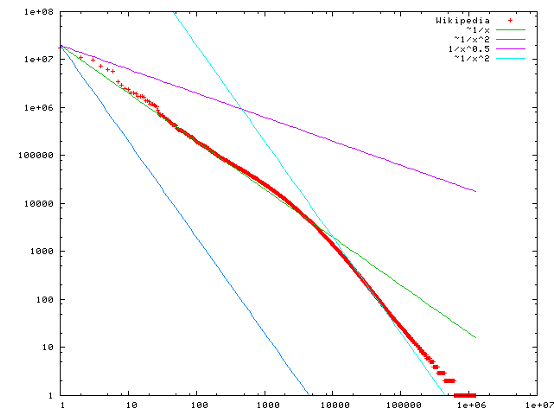
```

## A statistical property of language

- Zipf’s law
  
  - Frequency of any word is inversely proportional to its rank in the frequency table

  - Formally
    
    - $f(k;s,N)=\frac{1/k^S}{\sum_{n=1}^N{1/n^S}}$
        
        where $k$ is rank of the word; $N$ is the vocabulary size; $s$ is language-specific parameter

## A statistical property of language

- Zipf’s law
  
  - Frequency of any word is inversely proportional to its rank in the frequency table

  - Formally
    
    - $f(k;s,N)=\frac{1/k^S}{\sum_{n=1}^N{1/n^S}}$
        
        where $k$ is rank of the word; $N$ is the vocabulary size; $s$ is language-specific parameter
        
  - Simply: $f(k;s,N) \propto 1/k^s$

## A statistical property of language

- Zipf’s law
  
  - Frequency of any word is inversely proportional to its rank in the frequency table

  - Formally
    
    - $f(k;s,N)=\frac{1/k^S}{\sum_{n=1}^N{1/n^S}}$
        
        where $k$ is rank of the word; $N$ is the vocabulary size; $s$ is language-specific parameter
        
  - Simply: $f(k;s,N) \propto 1/k^s$
    
```{r, echo=FALSE, out.width="80%", fig.align='center'}
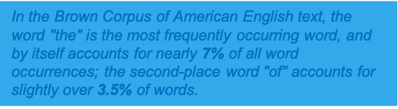
```

## A statistical property of language
&nbsp;

<p style="color:red">Discrete version of power law</p>

```{r, echo=FALSE, out.width="60%", fig.align='center'}

```

## Menti

- In a large Spanish text corpus, if we know the most popular word’s frequency is 145,872, what is your best estimate of its second most popular word’s frequency? 

## Tokenization/Segmentation

- Split text into words and sentences

## Tokenization/Segmentation

- Split text into words and sentences
    
```{r, echo=FALSE, out.width="80%", fig.align='center'}
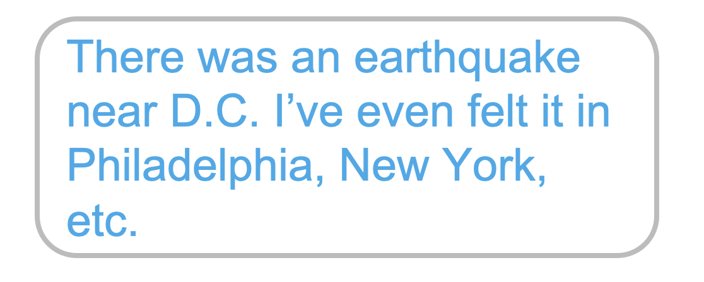
```


## Tokenization/Segmentation

- Split text into words and sentences
    
```{r, echo=FALSE, out.width="80%", fig.align='center'}
include_graphics("img/page 46_2.png")
```

## Tokenization/Segmentation

- Split text into words and sentences
   
  - Task: what is the most <span style="color:red">likely</span> segmentation /tokenization?
    
```{r, echo=FALSE, out.width="80%", fig.align='center'}
include_graphics("img/page 46_2.png")
```

## In Python

## Named entity recognition
&nbsp;

- Determine text mapping to proper names

```{r, echo=FALSE, out.width="80%", fig.align='center'}
include_graphics("img/page 48_1.png")
```

## Named entity recognition

- Determine text mapping to proper names

```{r, echo=FALSE, out.width="80%", fig.align='center'}
include_graphics("img/page 48_2.png")
```

## Named entity recognition

- Determine text mapping to proper names
  
  - Task: what is the most <span style="color:red">likely</span> mapping 

```{r, echo=FALSE, out.width="80%", fig.align='center'}
include_graphics("img/page 48_2.png")
```

## In Python

## Part Of Speech (POS) Tagging

- Annotate each word in a sentence with a part-of-speech.

```{r, echo=FALSE, out.width="80%", fig.align='center'}
include_graphics("img/page 50.png")
```

- Useful for subsequent syntactic parsing and word sense disambiguation.

## In Python

## Zipf’s law tells us

- Head words take large portion of occurrences, but they are semantically meaningless
  
  - E.g., the, a, an, we, do, to
  
## Zipf’s law tells us

- Head words take large portion of occurrences, but they are semantically meaningless
  
  - E.g., the, a, an, we, do, to

- Tail words take major portion of vocabulary, but they rarely occur in documents
  
  - E.g., *sesquipedalianism*

## Zipf’s law tells us

- Head words take large portion of occurrences, but they are semantically meaningless
  
  - E.g., the, a, an, we, do, to

- Tail words take major portion of vocabulary, but they rarely occur in documents
  
  - E.g., *sesquipedalianism*
  
- The rest is most representative
  
  - To be included in the controlled vocabulary

## Automatic document representation

```{r, echo=FALSE, out.width="80%", fig.align='center'}
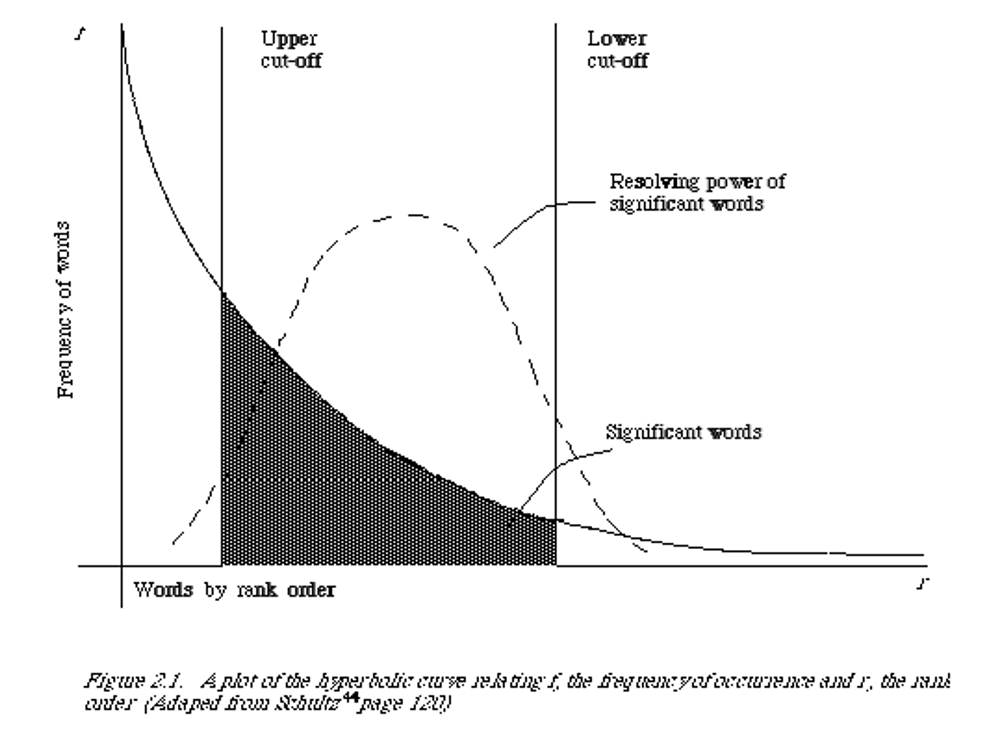
```

## Automatic document representation

```{r, echo=FALSE, out.width="80%", fig.align='center'}
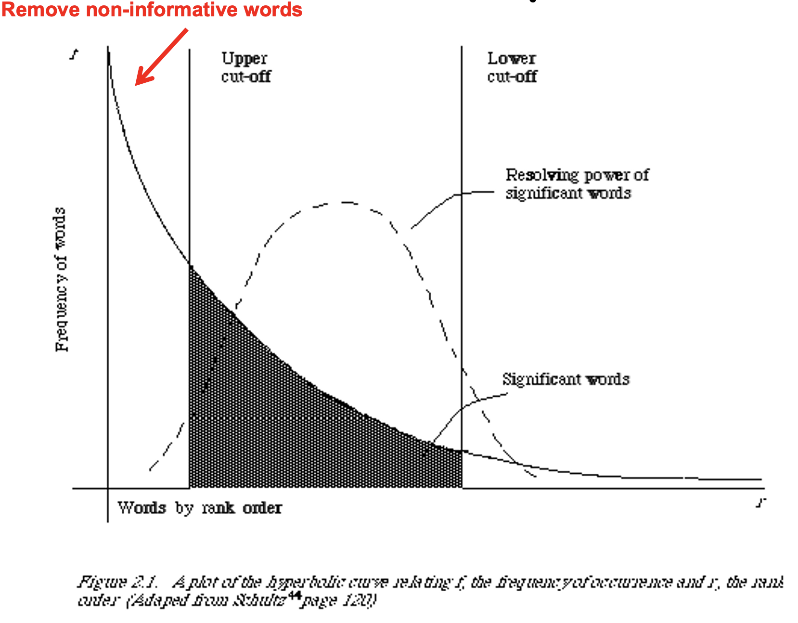
```

## Automatic document representation

```{r, echo=FALSE, out.width="80%", fig.align='center'}
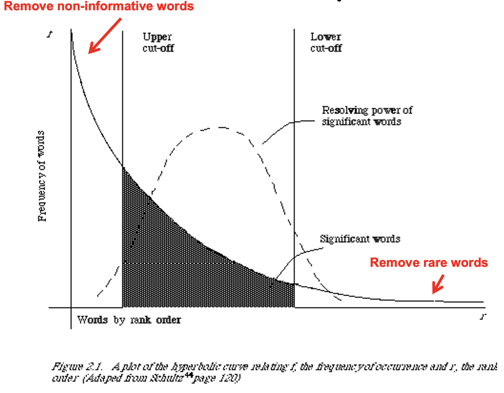
```

## Normalization

- Convert different forms of a word to a normalized form in the vocabulary
  
  - U.S.A. -> USA, St. Louis -> Saint Louis

## Normalization

- Convert different forms of a word to a normalized form in the vocabulary
  
  - U.S.A. -> USA, St. Louis -> Saint Louis

- Solution
  
  - Rule-based
    
    - Delete periods and hyphens
    
    - All in lower cases
  
  - Dictionary-based
    
    - Construct equivalent class 
      
      - Car -> “automobile, vehicle”
      
      - Mobile phone -> “cellphone”

## Normalization

- Convert different forms of a word to a normalized form in the vocabulary
  
  - U.S.A. -> USA, St. Louis -> Saint Louis

- Solution
  
  - Rule-based
    
    - Delete periods and hyphens
    
    - All in lower cases
  
  - Dictionary-based
    
    - Construct equivalent class <span style="color:red">&#x2190; We will come back to this later</span>
      
      - Car -> “automobile, vehicle”
      
      - Mobile phone -> “cellphone”

## In Python

## Stemming

- Reduce inflected or derived words to their root form 
    
  - Plurals, adverbs, inflected word forms
    
    - E.g., ladies -> lady, referring -> refer, forgotten -> forget
  
  - Bridge the vocabulary gap

## Stemming

- Reduce inflected or derived words to their root form 
  
  - Plurals, adverbs, inflected word forms
    
    - E.g., ladies -> lady, referring -> refer, forgotten -> forget
  
  - Bridge the vocabulary gap
  
  - Solutions (for English)
    
    - Porter stemmer: patterns of vowel-consonant sequence
    
    - Krovetz stemmer: morphological rules 

## Stemming

- Reduce inflected or derived words to their root form 
  
  - Plurals, adverbs, inflected word forms
    
    - E.g., ladies -> lady, referring -> refer, forgotten -> forget
  
  - Bridge the vocabulary gap
  
  - Solutions (for English)
    
    - Porter stemmer: patterns of vowel-consonant sequence
    
    - Krovetz stemmer: morphological rules 
  
  - Risk: lose precise meaning of the word
    
    - E.g., lay -> lie (a false statement? or be in a horizontal position?) 

## In Python

## Stopwords

- Useless words for document analysis
  
  - Not all words are informative
  
  - Remove such words to reduce vocabulary size
  
## Stopwords

- Useless words for document analysis
  
  - Not all words are informative
  
  - Remove such words to reduce vocabulary size
  
  - No universal definition

## Stopwords

- Useless words for document analysis
  
  - Not all words are informative
  
  - Remove such words to reduce vocabulary size
  
  - No universal definition
  
  - Risk: break the original meaning and structure of text
    
    - E.g., this is not a good option -> option
    
    <br> to be or not to be -> null

## In Python

## Recap: a statistical property of language

```{r, echo=FALSE, out.width="70%", fig.align='center'}
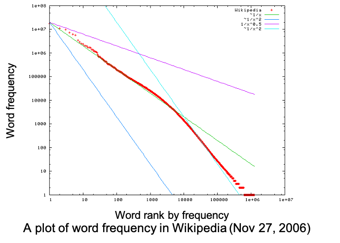
```

## Recap: a statistical property of language

<p style="color:red">Discrete version of power law</p>

```{r, echo=FALSE, out.width="70%", fig.align='center'}

```

## Constructing a VSM representation

<center>D1: <em>‘Text mining is to identify useful information.’</em>
</center>

## Constructing a VSM representation

<center>D1: <em>‘Text mining is to identify useful information.’</em>
</center>

<ol>
<li><span style="color:red;font-weight:bold">Tokenization:</span></li>
</ol>

## Constructing a VSM representation

<center>D1: <em>‘Text mining is to identify useful information.’</em>
</center>

<ol>
<li><span style="color:red;font-weight:bold">Tokenization:</span></li>

D1: <em>‘Text’, ‘mining’, ‘is’, ‘to’, ‘identify’, ‘useful’, ‘information’, ‘.’</em>
</ol>

## Constructing a VSM representation

<center>D1: <em>‘Text mining is to identify useful information.’</em>
</center>

<ol>
<li><span style="color:red;font-weight:bold">Tokenization:</span></li>

D1: <em>‘Text’, ‘mining’, ‘is’, ‘to’, ‘identify’, ‘useful’, ‘information’, ‘.’</em>

<li><span style="color:red;font-weight:bold">Stemming/normalization:</span></li>
</ol>

## Constructing a VSM representation

<center>D1: <em>‘Text mining is to identify useful information.’</em>
</center>

<ol>
<li><span style="color:red;font-weight:bold">Tokenization:</span></li>

D1: <em>‘Text’, ‘mining’, ‘is’, ‘to’, ‘identify’, ‘useful’, ‘information’, ‘.’</em>

<li><span style="color:red;font-weight:bold">Stemming/normalization:</span></li>

D1: <em>‘text’, ‘mine’, ‘is’, ‘to’, ‘identify’, ‘use’, ‘inform’, ‘.’</em>

</ol>

## Constructing a VSM representation

<center>D1: <em>‘Text mining is to identify useful information.’</em>
</center>

<ol>
<li><span style="color:red;font-weight:bold">Tokenization:</span></li>

D1: *‘Text’, ‘mining’, ‘is’, ‘to’, ‘identify’, ‘useful’, ‘information’, ‘.’*

<li><span style="color:red;font-weight:bold">Stemming/normalization:</span></li>

D1: *‘text’, ‘mine’, ‘is’, ‘to’, ‘identify’, ‘use’, ‘inform’, ‘.’*

<li><span style="color:red;font-weight:bold">N-gram construction:</span></li>

</ol>

## Constructing a VSM representation

<center>D1: <em>‘Text mining is to identify useful information.’</em>
</center>

<ol>
<li><span style="color:red;font-weight:bold">Tokenization:</span></li>

D1: <em>‘Text’, ‘mining’, ‘is’, ‘to’, ‘identify’, ‘useful’, ‘information’, ‘.’</em>

<li><span style="color:red;font-weight:bold">Stemming/normalization:</span></li>

D1: <em>‘text’, ‘mine’, ‘is’, ‘to’, ‘identify’, ‘use’, ‘inform’, ‘.’</em>

<li><span style="color:red;font-weight:bold">N-gram construction:</span></li>

D1: <em>‘text-mine’, ‘mine-is’, ‘is-to’, ‘to-identify’, ‘identify-use’, ‘use-inform’, ‘inform-.’</em>

</ol>

## Constructing a VSM representation

<center>D1: <em>‘Text mining is to identify useful information.’</em>
</center>

<ol>
<li><span style="color:red;font-weight:bold">Tokenization:</span></li>

D1: <em>‘Text’, ‘mining’, ‘is’, ‘to’, ‘identify’, ‘useful’, ‘information’, ‘.’</em>

<li><span style="color:red;font-weight:bold">Stemming/normalization:</span></li>

D1: <em>‘text’, ‘mine’, ‘is’, ‘to’, ‘identify’, ‘use’, ‘inform’, ‘.’</em>

<li><span style="color:red;font-weight:bold">N-gram construction:</span></li>

D1: <em>‘text-mine’, ‘mine-is’, ‘is-to’, ‘to-identify’, ‘identify-use’, ‘use-inform’, ‘inform-.’</em>

<li><span style="color:red;font-weight:bold">Stopword/controlled vocabulary filtering::</span></li>

</ol>

## Constructing a VSM representation

<center>D1: <em>‘Text mining is to identify useful information.’</em>
</center>

<ol>
<li><span style="color:red;font-weight:bold">Tokenization:</span></li>

D1: <em>‘Text’, ‘mining’, ‘is’, ‘to’, ‘identify’, ‘useful’, ‘information’, ‘.’</em>

<li><span style="color:red;font-weight:bold">Stemming/normalization:</span></li>

D1: <em>‘text’, ‘mine’, ‘is’, ‘to’, ‘identify’, ‘use’, ‘inform’, ‘.’</em>

<li><span style="color:red;font-weight:bold">N-gram construction:</span></li>

D1: <em>‘text-mine’, ‘mine-is’, ‘is-to’, ‘to-identify’, ‘identify-use’, ‘use-inform’, ‘inform-.’</em>

<li><span style="color:red;font-weight:bold">Stopword/controlled vocabulary filtering::</span></li>

D1: <em>‘text-mine’, ‘to-identify’, ‘identify-use’, ‘use-inform’</em>
</ol>

## How to assign weights?

- <u>Important!</u>
- Why?
    - Corpus-wise: some terms carry more information about the document content
    - Document-wise: not all terms are equally important

## How to assign weights?

- <u>Important!</u>
- Why?
    - Corpus-wise: some terms carry more information about the document content
    - Document-wise: not all terms are equally important
- How? 
    - Two basic <u>heuristics</u>
        - TF (Term Frequency) = Within-doc-frequency
        - IDF (Inverse Document Frequency)

## Binary representation

## Term frequency
&nbsp;

- Idea: a term is more important if it occurs more frequently in a document

- TF Formulas
  
  - Let $c(t,d)$ be the frequency count of term $t$ in doc $d$
  
  - Raw TF:  $tf(t,d) =c(t,d)$
    
## Term frequency
&nbsp;

- Idea: a term is more important if it occurs more frequently in a document
- TF Formulas
    - Let $c(t,d)$ be the frequency count of term $t$ in doc $d$
    - Raw TF:  $tf(t,d) =c(t,d)$
    
```{r, echo=FALSE, out.width="70%", fig.align='center'}
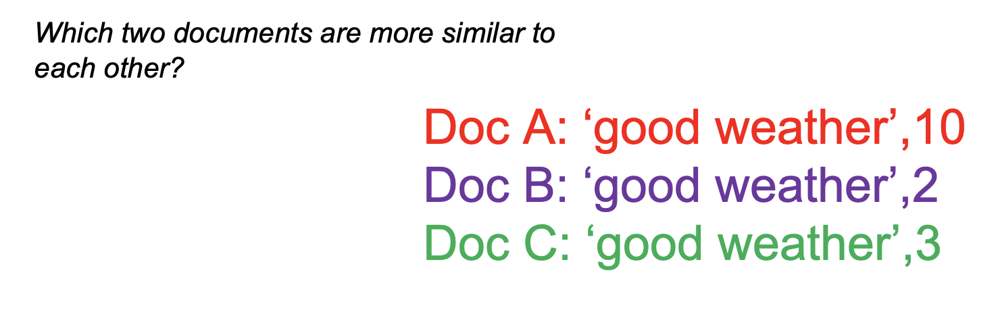
```

## TF normalization

- Two views of document length
    - A doc is long because it is verbose
    - A doc is long because it has more content

## TF normalization

- Two views of document length
    - A doc is long because it is verbose
    - A doc is long because it has more content
- Raw TF is inaccurate
    - Document length variation
    - “Repeated occurrences” are less informative than the “first occurrence”
    - Information about semantic does not increase proportionally with number of term occurrence

## TF normalization

- Two views of document length
    - A doc is long because it is verbose
    - A doc is long because it has more content
- Raw TF is inaccurate
    - Document length variation
    - “Repeated occurrences” are less informative than the “first occurrence”
    - Information about semantic does not increase proportionally with number of term occurrence
- Generally penalize long document, but avoid over-penalizing

## TF normalization

- Two views of document length
    - A doc is long because it is verbose
    - A doc is long because it has more content
- Raw TF is inaccurate
    - Document length variation
    - “Repeated occurrences” are less informative than the “first occurrence”
    - Information about semantic does not increase proportionally with number of term occurrence
- Generally penalize long document, but avoid over-penalizing
    - Pivoted length normalization

## TF normalization

- Maximum TF scaling
    - $tf(t,d) = \alpha + (1 - \alpha)\frac{c(t,d}{\underset{t}{\operatorname{max}} 
{c(t,d)}}$, if $c(t,d)>0$
    - Normalize by the most frequent word in this doc

## TF normalization

- Maximum TF scaling
    - $tf(t,d) = \alpha + (1 - \alpha)\frac{c(t,d}{\underset{t}{\operatorname{max}} 
{c(t,d)}}$, if $c(t,d)>0$
    - Normalize by the most frequent word in this doc

```{r, echo=FALSE, out.width="80%", fig.align='center'}
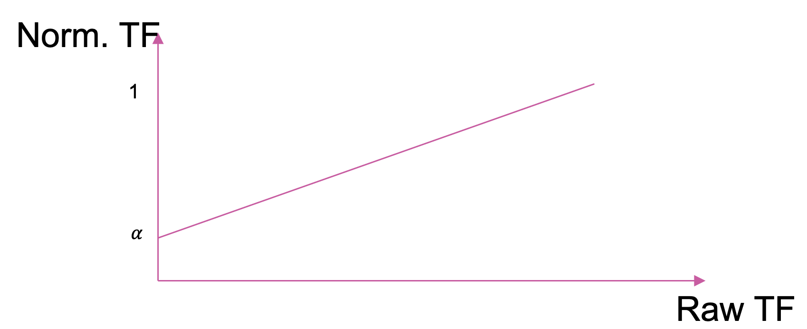
```

## TF normalization

- Sub-linear TF scaling
    - $$tf(t,d)= \left\{  
\begin{array}{**rcl**}
    1 + logc(t,d), if \ c(t,d)>0 & \\
    0, \ \ otherwise&   
\end{array}
\right. $$

## In Python

## Document frequency

- Idea: a term is more discriminative if it occurs only in fewer documents

```{r, echo=FALSE, out.width="70%", fig.align='center'}

```

## In Python

## Inverse document frequency

- Solution
    - Assign higher weights to rare terms	
    - Formula
        - $IDF(t) = 1 + log(\frac{N}{df(t)})$

## Inverse document frequency

- Solution
    - Assign higher weights to rare terms	
    - Formula
        - $IDF(t) = 1 + log(\frac{N}{df(t)})$
        
        <span style="color:red">$log$: Non-linear scaling; $N$: total number of documents; $df(t)$: number of docs containing term $t$</span>    

## Inverse document frequency
&nbsp;

- Solution
    - Assign higher weights to rare terms	
    - Formula
        - $IDF(t) = 1 + log(\frac{N}{df(t)})$
        
        <span style="color:red">$log$: Non-linear scaling; $N$: total number of documents; $df(t)$: number of docs containing term $t$</span>
    - A corpus-specific property
        - Independent of a single document
        
## Menti

- If we remove one document from the corpus, how would it affect the IDF of words in the vocabulary?

## Menti

- If we remove one document from the corpus, how would it affect the IDF of words in the vocabulary?
- If we add one document from the corpus, how would it affect the IDF of words in the vocabulary?

## Why document frequency

- How about total term frequency?
    - $ttf(t) = \sum_d{c(t,d)}$

## Why document frequency

- How about total term frequency?
  - $ttf(t) = \sum_d{c(t,d)}$
    
```{r, echo=FALSE, out.width="80%", fig.align='center'}
include_graphics("img/page 73.png")
```

  - Cannot recognize words frequently occurring in a subset of documents

## TF-IDF weighting 

- Combining TF and IDF 
    - Common in doc &#x2192; high tf &#x2192; high weight
    - Rare in collection &#x2192; high idf &#x2192; high weight
    - $w(t,d)=TF(t,d) \times IDF(t)$
       
## TF-IDF weighting 

- Combining TF and IDF 
    - Common in doc &#x2192; high tf &#x2192; high weight
    - Rare in collection &#x2192; high idf &#x2192; high weight
    - $w(t,d)=TF(t,d) \times IDF(t)$
    
- Most well-known document representation schema in IR! (G Salton et al. 1983)

## TF-IDF weighting 

- Combining TF and IDF 
    - Common in doc &#x2192; high tf &#x2192; high weight
    - Rare in collection &#x2192; high idf &#x2192; high weight
    - $w(t,d)=TF(t,d) \times IDF(t)$
    
- Most well-known document representation schema in IR! (G Salton et al. 1983)

```{r, echo=FALSE, out.width="60%", fig.align='center'}
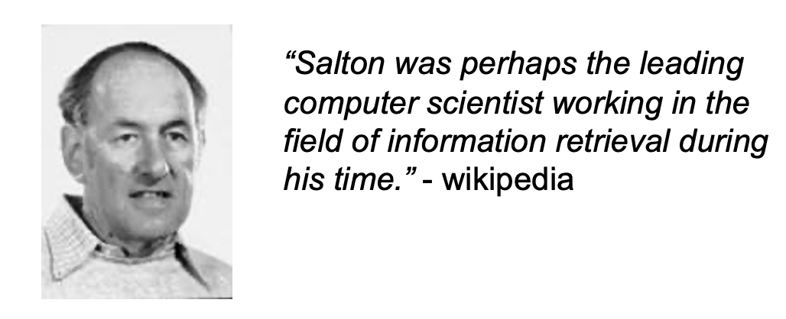
```

## TF-IDF weighting 

- Combining TF and IDF 
    - Common in doc &#x2192; high tf &#x2192; high weight
    - Rare in collection &#x2192; high idf &#x2192; high weight
    - $w(t,d)=TF(t,d) \times IDF(t)$
    
- Most well-known document representation schema in IR! (G Salton et al. 1983)

```{r, echo=FALSE, out.width="60%", fig.align='center'}
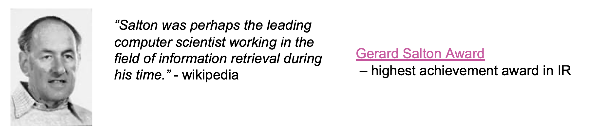
```

## How to define a good similarity metric?

```{r, echo=FALSE, out.width="70%", fig.align='center'}
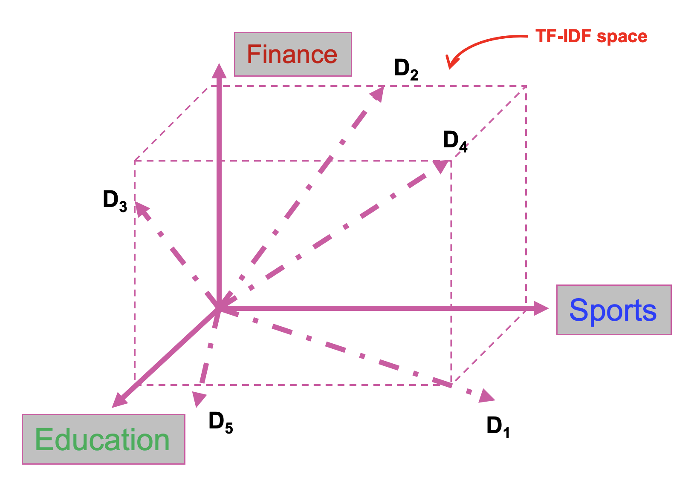
```

## How to define a good similarity metric?

- Euclidean distance?

```{r, echo=FALSE, out.width="70%", fig.align='center'}
include_graphics("img/page 75_2.png")
```

## How to define a good similarity metric?

- Euclidean distance
    - $dist(d_i, d_j) = \sqrt{\sum_{t\in V}{[tf(t,d_i)idf(t) - tf(t, d_j)idf(t)]^2}}$

## How to define a good similarity metric?

- Euclidean distance
    - $dist(d_i, d_j) = \sqrt{\sum_{t\in V}{[tf(t,d_i)idf(t) - tf(t, d_j)idf(t)]^2}}$
    - Longer documents will be penalized by the extra words

## How to define a good similarity metric?

- Euclidean distance
    - $dist(d_i, d_j) = \sqrt{\sum_{t\in V}{[tf(t,d_i)idf(t) - tf(t, d_j)idf(t)]^2}}$
    - Longer documents will be penalized by the extra words
    - We care more about how these two vectors are overlapped
    
## From distance to angle

```{r, echo=FALSE, out.width="70%", fig.align='center'}
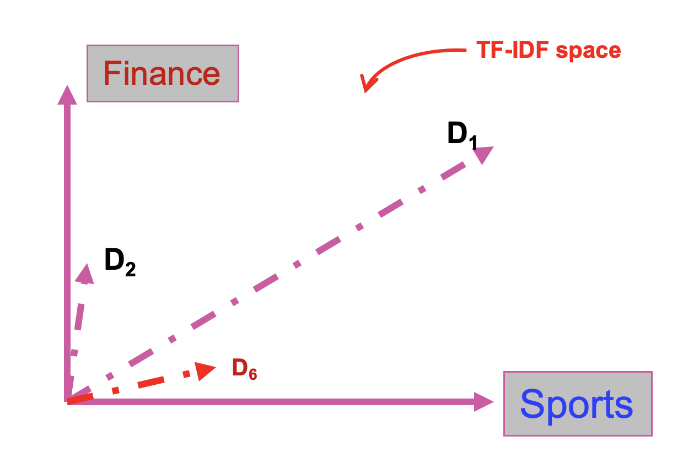
```

## From distance to angle

```{r, echo=FALSE, out.width="70%", fig.align='center'}
include_graphics("img/page 77_2.png")
```

## From distance to angle

```{r, echo=FALSE, out.width="70%", fig.align='center'}
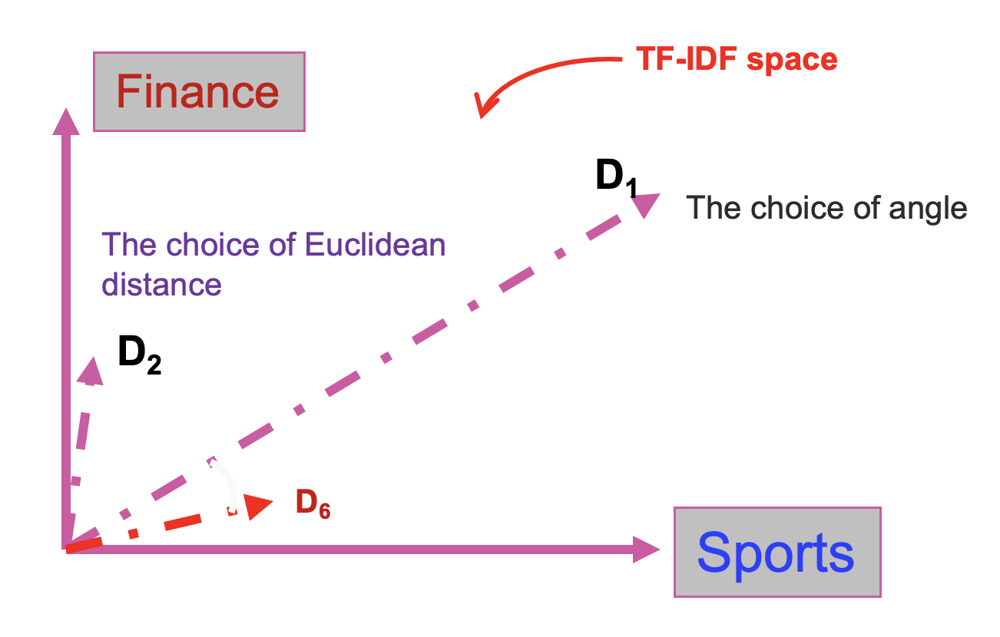
```

## From distance to angle

- Angle: how vectors are overlapped
    - Cosine similarity – projection of one vector onto another
    
```{r, echo=FALSE, out.width="70%", fig.align='center'}

```

## Cosine similarity

- Angle between two vectors 
    - $cosine(d_i, d_j) = \frac{V_{d_i}^TV_{d_j}}{|V_{d_i}|_2 \times |V_{d_j}|_2}$ <span style="color:red">&#x2190; TF-IDF vector</span>
    
```{r, echo=FALSE, out.width="30%", fig.align='center'}
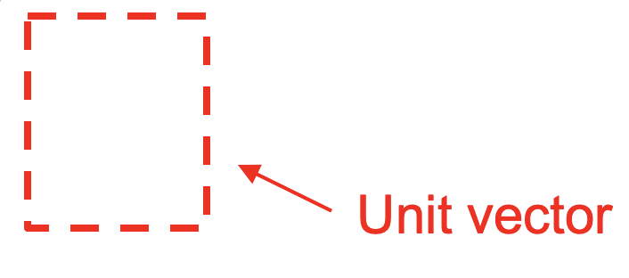
```

## Cosine similarity

- Angle between two vectors 
  
  - $cosine(d_i, d_j) = \frac{V_{d_i}^TV_{d_j}}{|V_{d_i}|_2 \times |V_{d_j}|_2}$ <span style="color:red">&#x2190; TF-IDF vector</span>
    
```{r, echo=FALSE, out.width="30%", fig.align='center'}

```
    
  - Documents are normalized by length
  
## Cosine similarity

- Angle between two vectors 
  
  - $cosine(d_i, d_j) = \frac{V_{d_i}^TV_{d_j}}{|V_{d_i}|_2 \times |V_{d_j}|_2}$ <span style="color:red">&#x2190; TF-IDF vector</span>
    
```{r, echo=FALSE, out.width="30%", fig.align='center'}

```
    
  - Documents are normalized by length

```{r, echo=FALSE, out.width="40%", fig.align='center'}
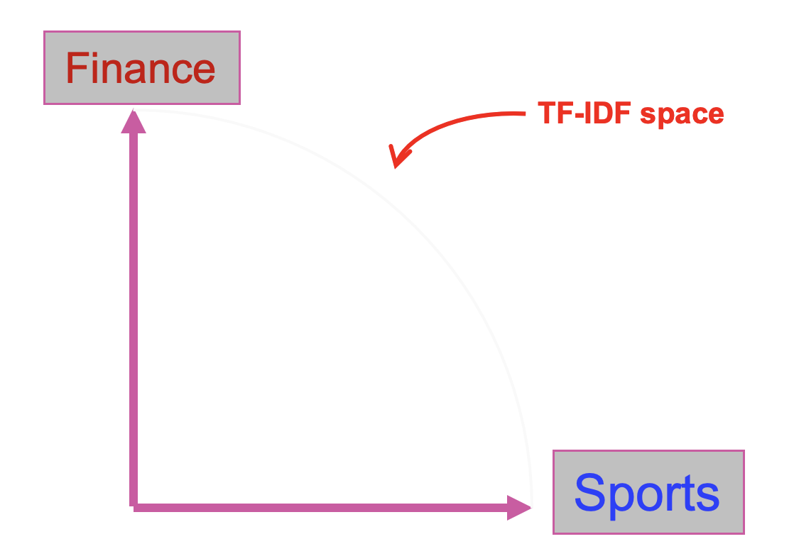
```

## Cosine similarity

- Angle between two vectors 
  
  - $cosine(d_i, d_j) = \frac{V_{d_i}^TV_{d_j}}{|V_{d_i}|_2 \times |V_{d_j}|_2}$ <span style="color:red">&#x2190; TF-IDF vector</span>
    
```{r, echo=FALSE, out.width="30%", fig.align='center'}

```
    
  - Documents are normalized by length

```{r, echo=FALSE, out.width="40%", fig.align='center'}
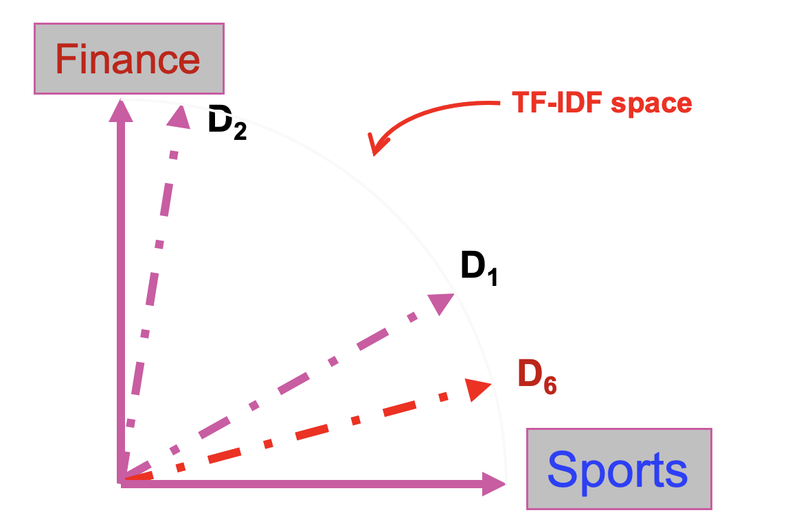
```  
  
## Advantages and disadvantages of VS model

- Empirically effective! 
- Intuitive
- Easy to implement
- Well-studied/mostly evaluated
- The Smart system
    - Developed at Cornell: 1960-1999
    - Still widely used 

## Advantages and disadvantages of VS model

- Empirically effective! 
- Intuitive
- Easy to implement
- Well-studied/mostly evaluated
- The Smart system
    - Developed at Cornell: 1960-1999
    - Still widely used 
- <span style="color:red">Warning: many variants of TF-IDF!</span>

## Disadvantages of VS model

- Assume term independence

## Disadvantages of VS model

- Assume term independence
- Lack of “predictive adequacy” 
    - Arbitrary term weighting
    - Arbitrary similarity measure

## Disadvantages of VS model

- Assume term independence
- Lack of “predictive adequacy” 
    - Arbitrary term weighting
    - Arbitrary similarity measure
- Lots of parameter tuning!
  
## Regular expressions  

## Menti

## Other examples (from different disciplines)

- SALTClass
- ICD Classification
- ASReview

## 
```{r, echo=FALSE, out.width="90%", fig.align='center'}
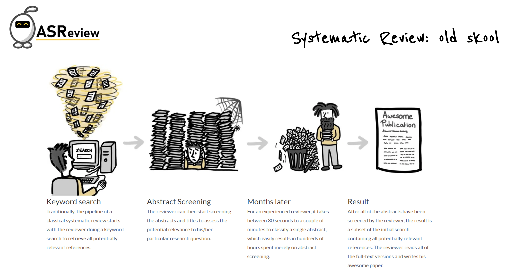
```  

## 
```{r, echo=FALSE, out.width="90%", fig.align='center'}
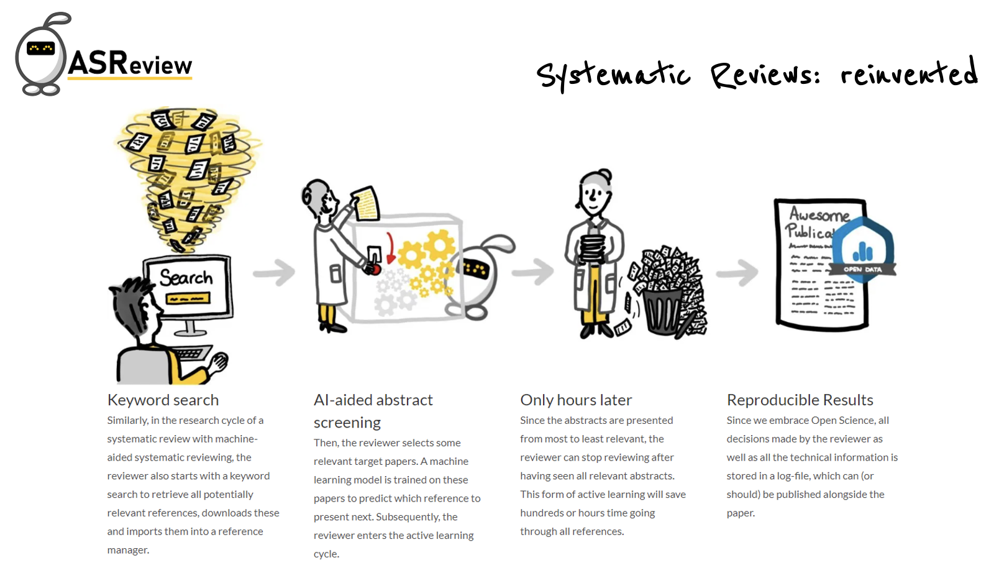
```  
  
## 
```{r, echo=FALSE, out.width="80%", fig.align='center'}
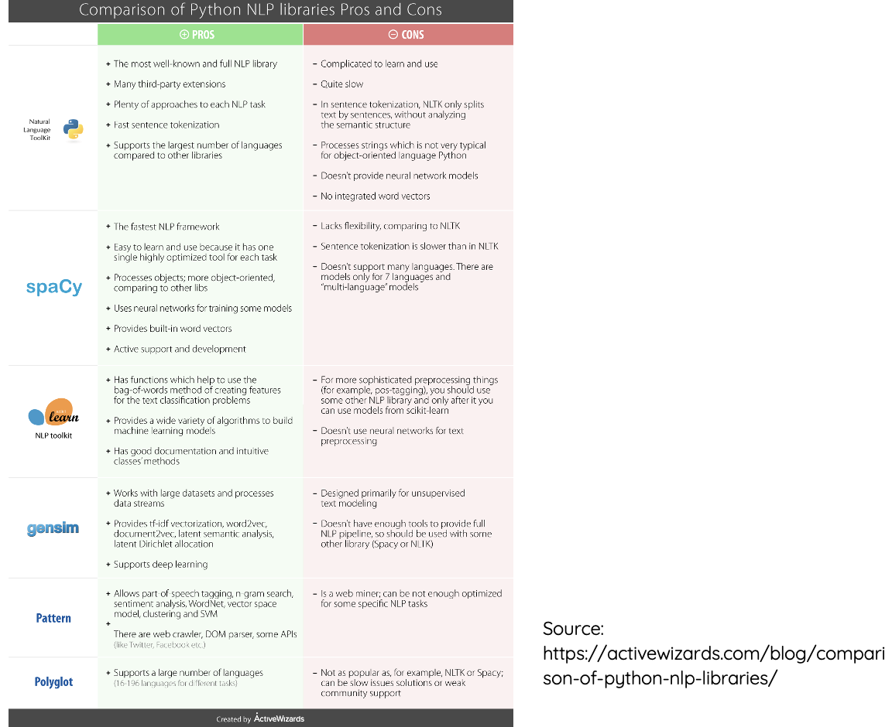
```    

## 
```{r, echo=FALSE, out.width="80%", fig.align='center'}
include_graphics("img/page 87.png")
```  

# Summary

## Summary: what did we learn?

# Time for Practical 1!
