```{r, include=FALSE}
library(knitr)
library(kableExtra)
```

## Very useful

You can access the course materials quickly from

https://ayoubbagheri.nl/applied_tm/

Some guidelines

1- Please keep your microphone off

2- If you have a question, raise your hand or type your question in the chat

3- You may always interrupt me

4- We will introduce frequent question breaks

## Lecturers and assistants
<div style="float:right; width:50%">
```{r, echo=FALSE, fig.align='center', out.width="35%"}

```
  <div class="centered">
  **Dong Nguyen**
  </div>
</div>

<div style="float:left; width:50%">
```{r, echo=FALSE, fig.align='center', out.width="35%"}

```
  <div class="centered">
  **Berit Janssen**
  </div>
</div>


<div style="float:left; width:50%">
```{r, echo=FALSE, fig.align='center', out.width="35%"}

```
  <div class="centered">
  **Anastasia Giachanou**
  </div>
</div>

<div style="float:right; width:50%">
```{r, echo=FALSE, fig.align='center', out.width="40%"}

```
  <div class="centered">
  **Nikos Bentis**
  </div>
</div>

<div style="float:right; width:50%">
```{r, echo=FALSE, fig.align='center', out.width="40%"}

```
  <div class="centered">
  **Jelle Teijema**
  </div>
</div>

## Program {.smaller}
```{r, echo = FALSE}
time <- c("9:00 - 10:30", "", "10:45 – 11:45", "11:45 – 12:15", "", "13:45 – 15:15", "", "15:30 – 16:30", "16:30 – 17:00")
monday <- c("Lecture 1", "Break", "Practical 1", "Discussion 1", "Lunch", "Lecture 2", "Break", "Practical 2", "Discussion 2")
tuesday <- c("Lecture 3", "Break", "Practical 3", "Discussion 3", "Lunch", "Lecture 4", "Break", "Practical 4", "Discussion 4")
wednesday <- c("Lecture 5", "Break", "Practical 5", "Discussion 5", "Lunch", "Lecture 6", "Break", "Practical 6", "Discussion 6")
thursday <- c("Lecture 7", "Break", "Practical 7", "Discussion 7", "Lunch", "Lecture 8", "Break", "Practical 8", "Discussion 8")

program <- data.frame(Time = time, Monday = monday, Tuesday = tuesday, Wednesday = wednesday, Thursday = thursday)

program %>% 
  kbl() %>% 
  kable_paper("hover", html_font = "Arial", full_width = T) %>% 
  row_spec(c(1,6), bold = T, color = "#E60B60") %>% 
  row_spec(c(2,7), color = "grey", font_size = 12) %>% 
  row_spec(c(3,8), color = "blue") %>% 
  row_spec(c(4,9), color = "green")
```


## Goal of the course
- Text data is everywhere!
- A lot of world’s data is in unstructured text format
- The course teaches 
  - text mining techniques 
  - using Python 
  - on a variety of applications 
  - in many domains.

# What is Text Mining?

## Text mining in an example 

<div style="float: left; width: 20%;">
```{r, echo=FALSE}

```
</div>

<div style="float: right; width: 80%;">
- This is **Garry**!
- **Garry** works at <span style="color:blue">Bol.com</span> (a webshop in the Netherlands)
- He works in the dep of **Customer relationship management**.


- He uses Excel to read and search <span style="color:blue">customers’ reviews</span>, extract <span style="color:blue">aspects</span> they wrote their reviews on, and identify their <span style="color:blue">sentiments</span>.

- Curious about his job? See two examples!
</div>

## 

<div style="float: left; width: 60%;">
This is a nice book for both young and old. It gives beautiful life lessons in a fun way. Definitely worth the money!

<span style="color:green">+ Educational</span>

<span style="color:green">+ Funny</span>

<span style="color:green">+ Price</span>

<hr align=left width="90%" color=#987cb9 size=3>

Nice story for older children.

<span style="color:green">+ Funny</span>

<span style="color:red">- Readability</span>
</div>

<div style="float: right; width: 40%;">
```{r, echo=FALSE}
include_graphics("img/page3_littleprince.png")
```

## Example
<div style="float: left; with: 20%">
```{r, echo=FALSE}

```
</div>

<div style="float: right; width: 80%">
- Garry likes his job a lot, but sometimes it is frustrating!

- This is mainly because their company is expanding quickly!

- Garry decides to hire **Larry** as his assistant.

```{r, echo=FALSE, fig.align='right'}

```
</div>

## Example
<div style="float: left; width: 20%">
```{r, echo=FALSE}

```


```{r, echo=FALSE, out.width = "80%"}

```
</div>

<div style="float: right; width: 80%">
- Still, a lot to do for two people!

- Garry has some budget left to hire another assistant for couple of years!

- He decides to hire **Harry** too!

- Still, manual labeling using Excel is labor-intensive!

```{r, echo=FALSE, fig.align='right'}

```
</div>

## Challenges?

- Can you guess what are the challenges Garry, Larry, and Harry encounter in doing their job, when working with text data?

  - Go to [www.menti.com](https://www.menti.com/) and use the code 7338 2184

# Challenges with Text Data

## Challenges with text data

- Huge amount of data

- High dimensional but sparse

  - all possible word and phrase types in the language!!

## Challenges with text data
<div style="float: left; width: 60%">
- Ambiguity
</div>

<div style="float: left; width: 40%">
```{r, echo=FALSE, out.width="70%"}
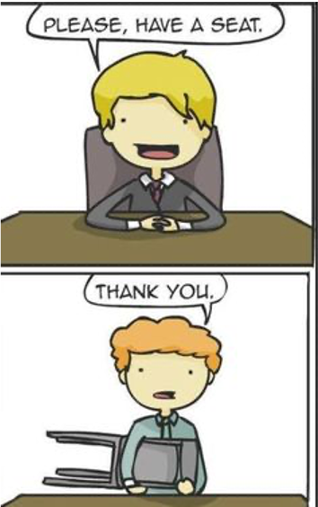
```
</div>

## Challenges with text data
- Noisy data
  
  - Examples: Abbreviations, spelling errors, short text

- Complex relationships between words
  
  - “Hema merges with Intertoys”
  
  - “Intertoys is bought by Hema”

## Example {.smaller}
<div style="float: left; width: 20%">
```{r, echo=FALSE}

```

```{r,echo = FALSE, out.width="90%"}
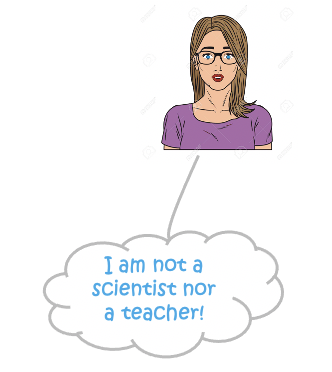
```
</div>

<div style="float: right; width: 80%">
  - During one of the coffee moments at the company, **Garry** was talking about their situation at the dep of Customer relationship management.

  - When **Carrie**, her colleague from the **Data Science department**, hears the situation, she offers Garry to use Text Mining!!

  - She says: “<span style="color:blue">Text mining is your friend; it can help you to make the process way faster than Excel by filtering words and recommending labels.</span>”

  - She continues : “Text mining is a subfield of AI and NLP and is related to data science, data mining and machine learning.”

  - After consulting with Larry and Harry, they decide to give text mining a try!
</div>

## Example
```{r, echo=FALSE, out.width="90%", fig.align='center'}
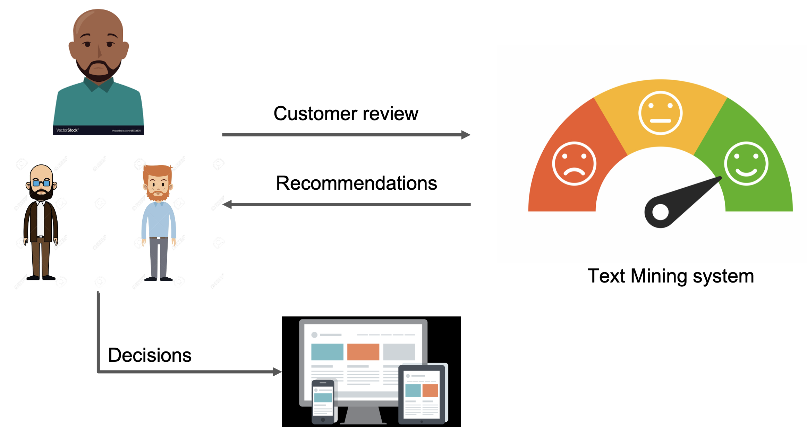
```

## Language is hard

- Different things can mean more or less the same ("data science" vs. "statistics")
- Context dependency ("You have very nice shoes");
- Same words with different meanings ("to sanction", "bank");
- Lexical ambiguity ("we saw her duck")
- Irony, sarcasm ("That's just what I needed today!", "Great!", "Well, what a surprise.")
- Figurative language ("He has a heart of stone")
- Negation ("not good" vs. "good"), spelling variations, jargon, abbreviations
- All the above are different over languages, 99\% of work is on English!

## Language is hard

- We won't solve linguistics ...
- In spite of the problems, text mining can be quite effective!

## Text mining definition?

- Which can be a part of Text Mining definition?
  - The discovery by computer of new, previously unknown information from textual data
  - Automatically extracting information from text
  - Text mining is about looking for patterns in text
  - Text mining describes a set of techniques that model and structure the information content of textual sources

<br>

<span style="color:green">(You can choose multiple answers)</span>

Go to [www.menti.com](https://www.menti.com/) and use the code 7338 2184

## Text mining definition
- “the discovery by computer of <span style="color:blue">new</span>, <span style="color:blue">previously unknown</span> information, by <span style="color:blue">automatically extracting</span> information from <span style="color:blue">different</span> written resources” Hearst (1999)

- Text mining is about looking for <span style="color:red">patterns in text</span>, in a similar way that <span style="color:red">data mining</span> can be loosely described as looking for patterns in data.

- Text mining describes a set of <span style="color:green">linguistic</span>, <span style="color:green">statistical</span>, and <span style="color:green">machine learning</span> techniques that model and structure the information content of textual sources. (Wikipedia)

## Another TM definition

```{r, echo=FALSE, out.width="90%", fig.align='center'}
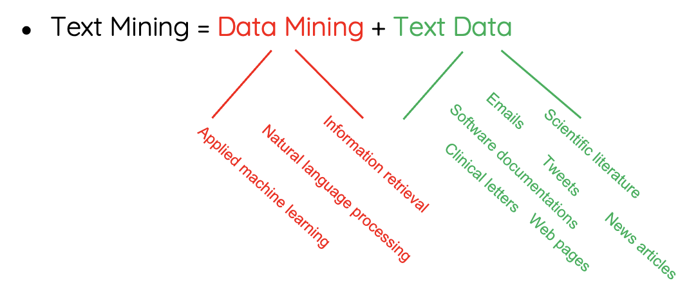
```

# Examples & Applications

## Who wrote the Wilhelmus?

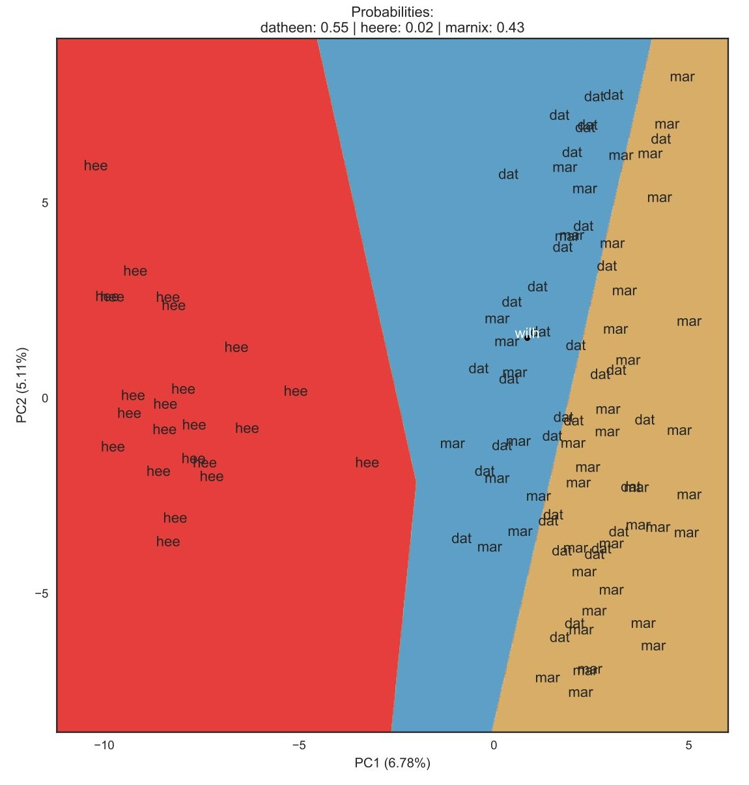

https://dh2017.adho.org/abstracts/079/079.pdf

## Text classification
```{r, echo=FALSE, out.width="100%", fig.align='center'}
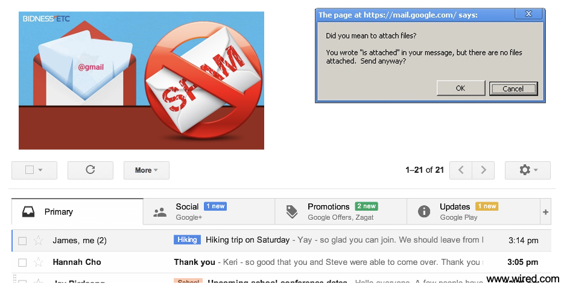
```

## Which ICD-10 codes should I give this doctor's note?
<div style="font-size:4pt; border:1px solid;">

Bovengenoemde patiënt was opgenomen op <DATUM-1> op de <PERSOON-1> voor het specialisme **Cardiologie.** 

**Cardiovasculaire risicofactoren**: Roken(-) Diabetes(-) Hypertensie(?) Hypercholesterolemie (?)

**Anamnese**. Om 18.30 pijn op de borst met uitstraling naar de linkerarm, zweten, misselijk. Ambulance gebeld en bij aansluiten monitor beeld van acuut onderwandinfarct.
AMBU overdracht:.500mg aspegic iv, ticagrelor 180mg oraal, heparine, zofran eenmalig, 3x NTG spray. HD stabiel gebleven. . .Medicatie bij presentatie.Geen..

**Lichamelijk onderzoek**. Grauw, vegetatief, Halsvenen niet gestuwd. Cor s1 s2 geen souffles.Pulm schoon. Extr warm en slank .

**Aanvullend onderzoek**. AMBU ECG: Sinusritme, STEMI inferior III)II C/vermoedelijk RCA.
Coronair angiografie. (...) .Conclusie angio: 1-vatslijden..PCI 

**Conclusie en beleid**
Bovengenoemde <LEEFTIJD-1> jarige man, blanco cardiale voorgeschiedenis, werd gepresenteerd vanwege een  STEMI inferior waarvoor een spoed PCI werd verricht van de mid-RCA. Er bestaan geen relevante nevenletsels. Hij kon na de procedure worden overgeplaatst naar de CCU van het <INSTELLING-2>. ..Dank voor de snelle overname. ..Medicatie bij overplaatsing. Acetylsalicylzuur dispertablet 80mg ; oraal; 1 x per dag 80 milligram ; <DATUM-1> .Ticagrelor tablet 90mg ; oraal; 2 x per dag 90 milligram ; <DATUM-1> .Metoprolol tablet   50mg ; oraal; 2 x per dag 25 milligram ; <DATUM-1> .Atorvastatine tablet 40mg (als ca-zout-3-water) ; oraal; 1 x per dag 40 milligram ; <DATUM-1> 
**Samenvatting**
Hoofddiagnose: STEMI inferior wv PCI RCA. Geen nevenletsels. Nevendiagnoses: geen.
Complicaties: geen Ontslag naar: CCU <INSTELLING-2>.
</div>

## Which ICD-10 codes should I give this doctor's note?
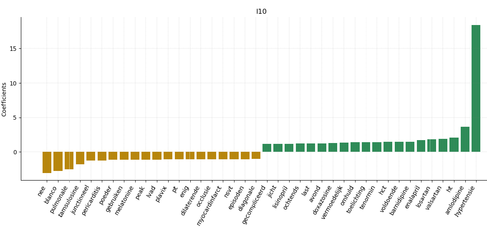

## Sentiment analysis / Opinion mining
```{r, echo=FALSE, out.width="100%", fig.align='center'}

```

## Statistical machine translation
```{r, echo=FALSE, out.width="100%", fig.align='center'}
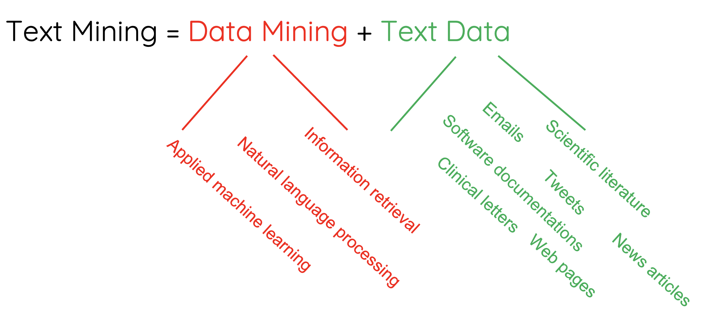
```

## Which studies go in my systematic review?


##
```{r, echo=FALSE, out.width="100%"}
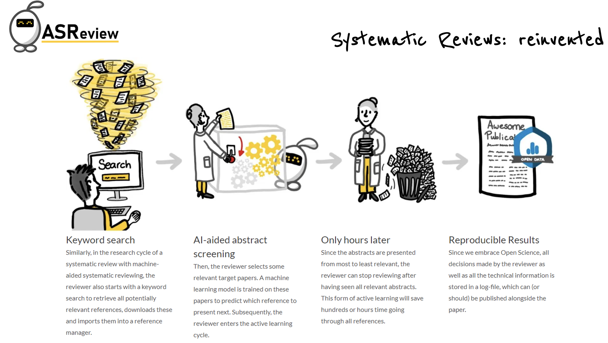

```
https://asreview.nl/

# Process & Tasks

## Text mining process
```{r, echo=FALSE, out.width="90%", fig.align='center'}
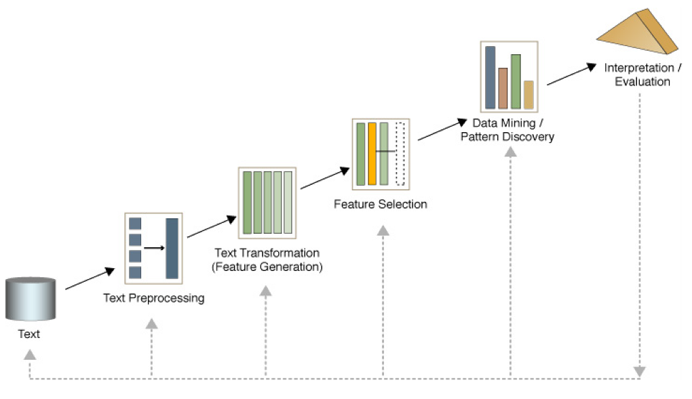
```

## Text mining tasks {.smaller}
- Text classification
- Text clustering
- Sentiment analysis
- Feature selection
- Topic modelling
- Word embedding
- Deep learning models
- Responsible text mining
- Text summarization

## And more in NLP
```{r, echo=FALSE, out.width="80%", fig.align='center'}
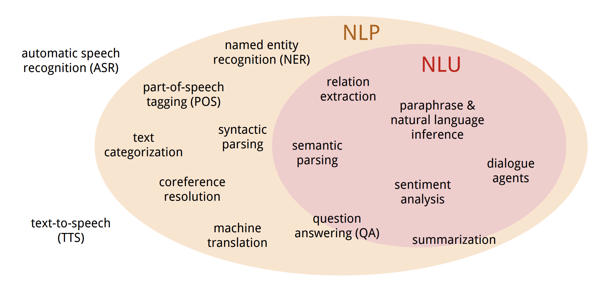
```

<br>
<br>
<div style="font-size:12px">
source: https://nlp.stanford.edu/~wcmac/papers/20140716-UNLU.pdf
</div>


# Text Preprocessing

## How to represent a document

- Represent by a string?
  
  - No semantic meaning

- Represent by a list of sentences?

  - Sentence is just like a short document (recursive definition)

- Represent by a vector?
  
  - A vector is an ordered finite list of numbers.

## Vector space model

- A vector space is a collection of vectors

- Represent documents by <u>concept</u> vectors
  
  - Each concept defines one dimension

  - k concepts define a high-dimensional space
  
  - Element of vector corresponds to concept weight	


## Vector space model

- Distance between the vectors in this concept space

  - Relationship among documents

- The process of converting text into numbers is called <b>Vectorization</b>

## Vector space model

- Terms are generic features that can be extracted from text

- Typically, terms are single words, keywords, n-grams, or phrases

- Documents are represented as vectors of terms

- Each dimension (concept) corresponds to a separate term

$$d = (w_1, ..., w_n)$$

## An illustration of VS model 

- All documents are projected into this concept space

```{r,echo=FALSE, out.width="70%"}
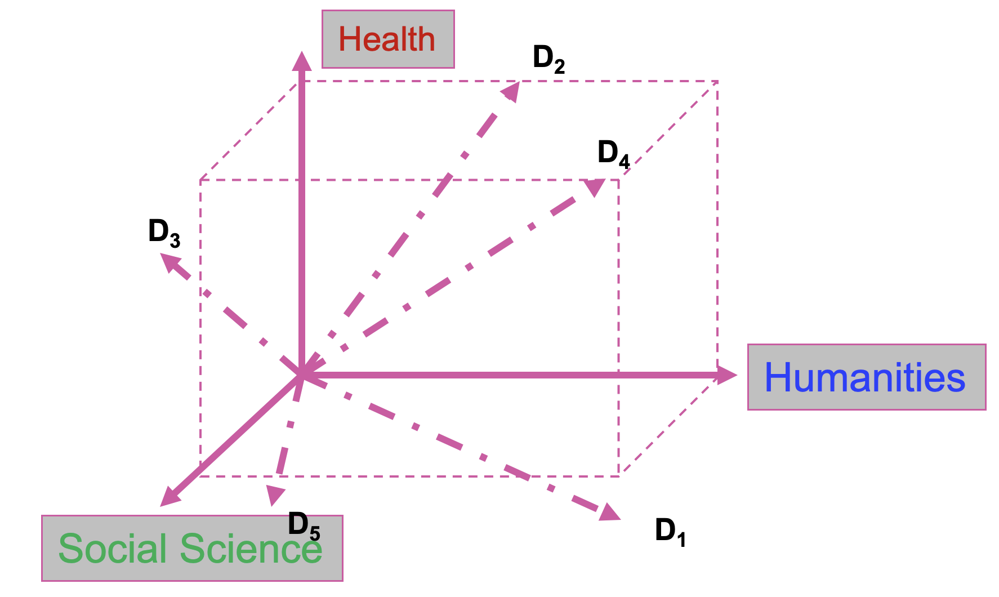
```

## Tokenization/Segmentation

- Split text into words and sentences
    
```{r, echo=FALSE, out.width="80%", fig.align='center'}
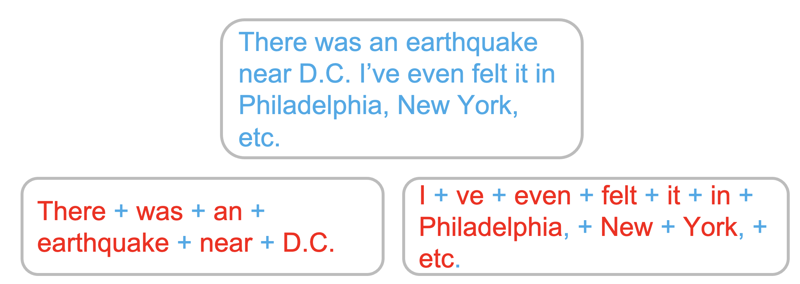
```

## N-grams

- N-grams: a contiguous sequence of N tokens from a given piece of text
  
  - E.g., *‘Text mining is to identify useful information.’*
  
  - Bigrams: *‘text_mining’, ‘mining_is’, ‘is_to’, ‘to_identify’, ‘identify_useful’, ‘useful_information’, ‘information_.’*

>- Pros: capture local dependency and order

>- Cons: a purely statistical view, increase the vocabulary size $O(V^N)$


## Preprocessing

Typical steps:

- Stemming ("running"$\to$"run") or Lemmatization ("were"$\to$"is")
- Lowercasing ("And"$\to$"and")
- Stopword removal ("evning morning is third day.")
- Punctuation removal ("evning morning is third day")
- Number removal ("day 3"$\to$"day")
- Spell correction ("evning"$\to$"evening")
- Tokenization ("evening", "morning", "is", "third", "day")

**Not all of these are appropriate at all times!**

## Stemming

- Unifies variations in the text data:
    - e.g., ’walking’, ‘walks’, ‘walked’ $\to$ walk
- Inflectional stemming:
    - Remove plurals
    - Normalize verb tenses
    - Remove other affixes
- Stemming to root:
    - Reduce word to most basic element
    - More aggressive than inflictional
    - e.g., ‘denormalization’ $\to$ norm;
    - e.g., ‘Apply’, ‘applications’, ‘reapplied’ $\to$ apply

<!-- ## Constructing a VSM representation -->

<!-- <center>D1: <em>‘Text mining is to identify useful information.’</em> -->
<!-- </center> -->

<!-- ## Constructing a VSM representation -->

<!-- <center>D1: <em>‘Text mining is to identify useful information.’</em> -->
<!-- </center> -->

<!-- <ol> -->
<!-- <li><span style="color:red;font-weight:bold">Tokenization:</span></li> -->
<!-- </ol> -->

<!-- ## Constructing a VSM representation -->

<!-- <center>D1: <em>‘Text mining is to identify useful information.’</em> -->
<!-- </center> -->

<!-- <ol> -->
<!-- <li><span style="color:red;font-weight:bold">Tokenization:</span></li> -->

<!-- D1: <em>‘Text’, ‘mining’, ‘is’, ‘to’, ‘identify’, ‘useful’, ‘information’, ‘.’</em> -->
<!-- </ol> -->

<!-- ## Constructing a VSM representation -->

<!-- <center>D1: <em>‘Text mining is to identify useful information.’</em> -->
<!-- </center> -->

<!-- <ol> -->
<!-- <li><span style="color:red;font-weight:bold">Tokenization:</span></li> -->

<!-- D1: <em>‘Text’, ‘mining’, ‘is’, ‘to’, ‘identify’, ‘useful’, ‘information’, ‘.’</em> -->

<!-- <li><span style="color:red;font-weight:bold">Stemming/normalization:</span></li> -->
<!-- </ol> -->

<!-- ## Constructing a VSM representation -->

<!-- <center>D1: <em>‘Text mining is to identify useful information.’</em> -->
<!-- </center> -->

<!-- <ol> -->
<!-- <li><span style="color:red;font-weight:bold">Tokenization:</span></li> -->

<!-- D1: <em>‘Text’, ‘mining’, ‘is’, ‘to’, ‘identify’, ‘useful’, ‘information’, ‘.’</em> -->

<!-- <li><span style="color:red;font-weight:bold">Stemming/normalization:</span></li> -->

<!-- D1: <em>‘text’, ‘mine’, ‘is’, ‘to’, ‘identify’, ‘use’, ‘inform’, ‘.’</em> -->

<!-- </ol> -->

<!-- ## Constructing a VSM representation -->

<!-- <center>D1: <em>‘Text mining is to identify useful information.’</em> -->
<!-- </center> -->

<!-- <ol> -->
<!-- <li><span style="color:red;font-weight:bold">Tokenization:</span></li> -->

<!-- D1: *‘Text’, ‘mining’, ‘is’, ‘to’, ‘identify’, ‘useful’, ‘information’, ‘.’* -->

<!-- <li><span style="color:red;font-weight:bold">Stemming/normalization:</span></li> -->

<!-- D1: *‘text’, ‘mine’, ‘is’, ‘to’, ‘identify’, ‘use’, ‘inform’, ‘.’* -->

<!-- <li><span style="color:red;font-weight:bold">N-gram construction:</span></li> -->

<!-- </ol> -->

<!-- ## Constructing a VSM representation -->

<!-- <center>D1: <em>‘Text mining is to identify useful information.’</em> -->
<!-- </center> -->

<!-- <ol> -->
<!-- <li><span style="color:red;font-weight:bold">Tokenization:</span></li> -->

<!-- D1: <em>‘Text’, ‘mining’, ‘is’, ‘to’, ‘identify’, ‘useful’, ‘information’, ‘.’</em> -->

<!-- <li><span style="color:red;font-weight:bold">Stemming/normalization:</span></li> -->

<!-- D1: <em>‘text’, ‘mine’, ‘is’, ‘to’, ‘identify’, ‘use’, ‘inform’, ‘.’</em> -->

<!-- <li><span style="color:red;font-weight:bold">N-gram construction:</span></li> -->

<!-- D1: <em>‘text-mine’, ‘mine-is’, ‘is-to’, ‘to-identify’, ‘identify-use’, ‘use-inform’, ‘inform-.’</em> -->

<!-- </ol> -->

<!-- ## Constructing a VSM representation -->

<!-- <center>D1: <em>‘Text mining is to identify useful information.’</em> -->
<!-- </center> -->

<!-- <ol> -->
<!-- <li><span style="color:red;font-weight:bold">Tokenization:</span></li> -->

<!-- D1: <em>‘Text’, ‘mining’, ‘is’, ‘to’, ‘identify’, ‘useful’, ‘information’, ‘.’</em> -->

<!-- <li><span style="color:red;font-weight:bold">Stemming/normalization:</span></li> -->

<!-- D1: <em>‘text’, ‘mine’, ‘is’, ‘to’, ‘identify’, ‘use’, ‘inform’, ‘.’</em> -->

<!-- <li><span style="color:red;font-weight:bold">N-gram construction:</span></li> -->

<!-- D1: <em>‘text-mine’, ‘mine-is’, ‘is-to’, ‘to-identify’, ‘identify-use’, ‘use-inform’, ‘inform-.’</em> -->

<!-- <li><span style="color:red;font-weight:bold">Stopword/controlled vocabulary filtering::</span></li> -->

<!-- </ol> -->

## Constructing a VSM representation

<center>D1: <em>‘Text mining is to identify useful information.’</em>
</center>

<ol>
<li><span style="color:red;font-weight:bold">Tokenization:</span></li>

D1: <em>‘Text’, ‘mining’, ‘is’, ‘to’, ‘identify’, ‘useful’, ‘information’, ‘.’</em>

<li><span style="color:red;font-weight:bold">Stemming/normalization:</span></li>

D1: <em>‘text’, ‘mine’, ‘is’, ‘to’, ‘identify’, ‘use’, ‘inform’, ‘.’</em>

<li><span style="color:red;font-weight:bold">N-gram construction:</span></li>

D1: <em>‘text-mine’, ‘mine-is’, ‘is-to’, ‘to-identify’, ‘identify-use’, ‘use-inform’, ‘inform-.’</em>

<li><span style="color:red;font-weight:bold">Stopword/controlled vocabulary filtering::</span></li>

D1: <em>‘text-mine’, ‘to-identify’, ‘identify-use’, ‘use-inform’</em>
</ol>

## VSM: How do we represent vectors?

After tokenization and pre-processing, we have three options:

- Bag of Words

- Topics

- Word Embeddings

## Bag of Words (BOW)

- With Bag of Words (BOW), we refer to a Vector Space Model where:
  
  - Terms: words (more generally we may use n-grams, etc.)
  
  - Weights: number of occurrences of the terms in the document

## BOW representation

- Term as the basis for vector space

  - Doc1: Text mining is to identify useful information.
  
  - Doc2: Useful information is mined from text.
  
  - Doc3: Apple is delicious.


## BOW weights: Binary

- <b><span style="font-size:20px">Binary</span></b>

  - with 1 indicating that a term occurred in the document, and 0 indicating that it did not
  
```{r, echo= FALSE, out.width="100%"}
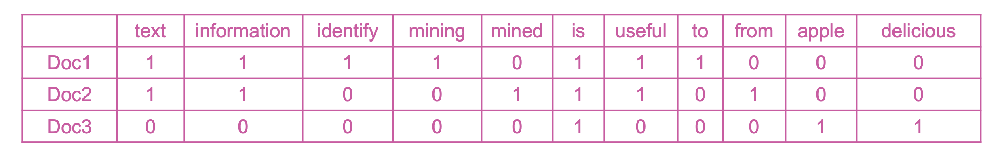
```


## BOW weights: Term frequency

- Idea: a term is more important if it occurs more frequently in a document

- TF Formulas
  
  - Let $t(c,d)$ be the frequency count of term $t$ in doc $d$

  - Raw TF: $tf(t,d) = c(t,d)$
  
## TF: Document - Term matrix (DTM)
```{r, echo=FALSE, out.width="100%", fig.align='center'}
include_graphics("img/tf.png")
```

## BOW weights: TFiDF
- Idea: a term is more discriminative if it occurs a lot but only in fewer documents

Let $n_{d,t}$ denote the number of times the $t$-th term appears in the $d$-th document.

$$TF_{d,t} = \frac{n_{d,t}}{\sum_i{n_{d,i}}}$$
Let $N$ denote the number of documents annd $N_t$ denote the number of documents containing the $t$-th term.

$$IDF_t = log(\frac{N}{N_t})$$
TFiDF weight: 

$$w_{d,t} = TF_{d,t} \cdot IDF_t$$


<!-- ## Bag-of-Words representation -->

<!-- - Term as the basis for vector space -->

<!-- ```{r, echo=FALSE, out.width="80%", fig.align='center'} -->
<!-- 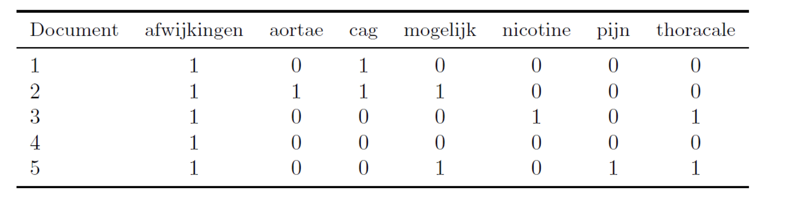 -->
<!-- ``` -->

## TFiDF: Document - Term matrix (DTM)
```{r, echo=FALSE, out.width="100%", fig.align='center'}
include_graphics("img/tfidf.png")
```

## Why document frequency

- How about total term frequency?
    - $ttf(t) = \sum_d{c(t,d)}$

## Why document frequency

- How about total term frequency?
  - $ttf(t) = \sum_d{c(t,d)}$
    
```{r, echo=FALSE, out.width="80%", fig.align='center'}
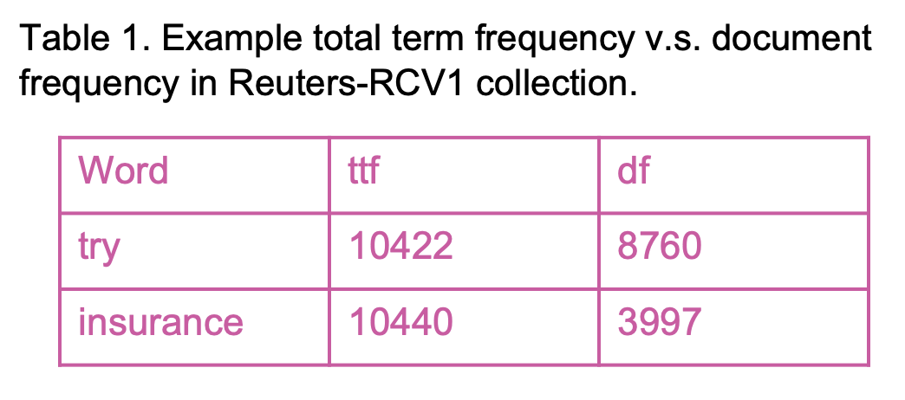
```

  - Cannot recognize words frequently occurring in a subset of documents

## How to define a good similarity metric?

```{r, echo=FALSE, out.width="70%", fig.align='center'}
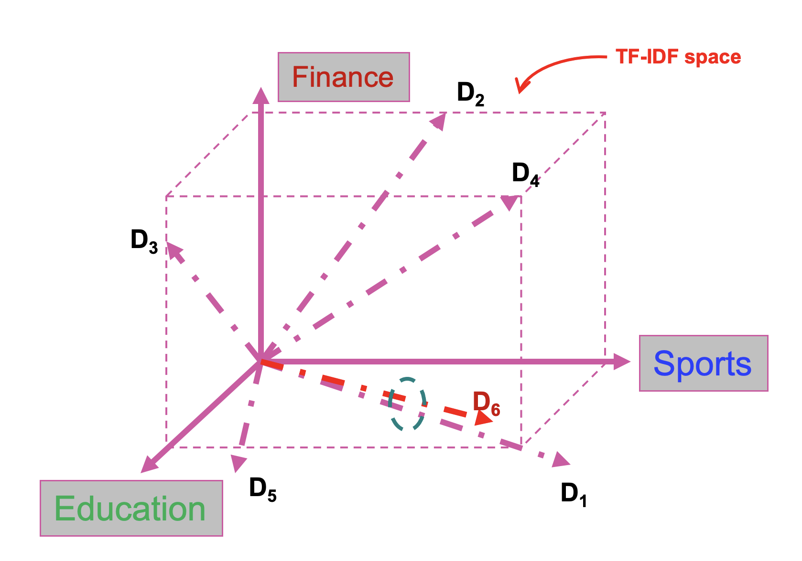
```

## How to define a good similarity metric?

- Euclidean distance

    $dist(d_i, d_j) = \sqrt{\sum_{t\in V}{[tf(t,d_i)idf(t) - tf(t, d_j)idf(t)]^2}}$
    
    - Longer documents will be penalized by the extra words
    
    - We care more about how these two vectors are overlapped
    
- Cosine similarity
  
  - Angle between two vectors:
  
    $cosine(d_i, d_j) = \frac{V_{d_i}^TV_{d_j}}{|V_{d_i}|_2 \times |V_{d_j}|_2}$ <span style="color:red">&#x2190; TF-IDF vector</span>
  
  - Documents are normalized by length
    
## More pre-processing: Named entity recognition
&nbsp;

- Determine text mapping to proper names

```{r, echo=FALSE, out.width="80%", fig.align='center'}
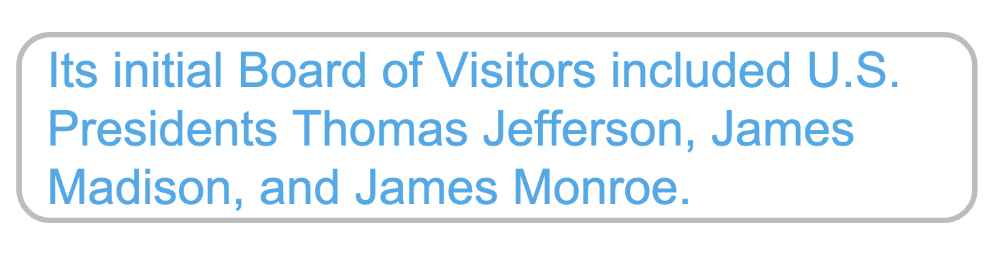
```

## NER

- Determine text mapping to proper names

```{r, echo=FALSE, out.width="80%", fig.align='center'}
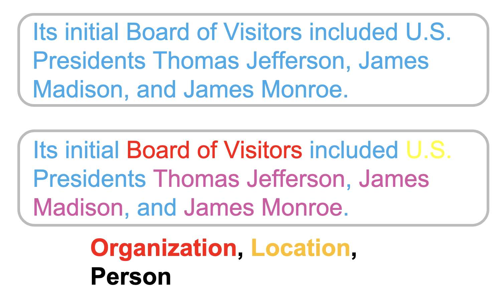
```

## Part Of Speech (POS) tagging

- Annotate each word in a sentence with a part-of-speech.

```{r, echo=FALSE, out.width="80%", fig.align='center'}
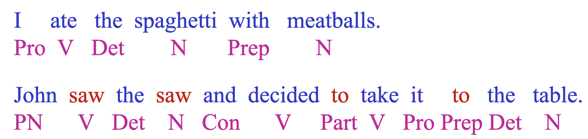
```

- Useful for subsequent syntactic parsing and word sense disambiguation.


## Preprocessing demo

- CogComp: https://cogcomp.seas.upenn.edu/vsa8080/curator

- CCG Demos: https://cogcomp.seas.upenn.edu/page/demos/

- Stanford parser: http://nlp.stanford.edu:8080/parser/index.jsp

# Python | before starting the first practical

## How familiar are you with Python?

- What is your experience level with Python?

  - I don't know anything about Python.
  - I know a bit about Python and/or I have worked with Python years ago.
  - I am familiar with Python, but I use another programming language for my work.
  - I use Python for my daily work, but I don't know it very well.
  - I use Python for my daily work and I know it very well, but I am not an expert.
  - I am an expert with Python.

  - Go to <a hre="www.menti.com">www.menti.com</a> and use the code 7338 2184
  
## Python IDE?

- Which Python IDE do you mostly use? If you use more than one environment fill in the other text boxes.

  - Go to <a href="www.menti.com">www.menti.com</a> and use the code 7338 2184

## Google Colab?

- From 0 (none) to 5 (expert), how familiar are you with Google Colab?
  
  - Go to <a href="www.menti.com">www.menti.com</a> and use the code 7338 2184

## Python

- Latest: <a href="https://www.python.org/downloads/release/python-391/">Python 3.9.1</a>

- Follow the tutorial on Python in Google Colab for the Applied Text Mining course: [link](https://ayoubbagheri.nl/applied_tm/Python_in_Google_Colab_Applied_Text_Mining.html)

- Python For Beginners
    - <a href="https://www.python.org/about/gettingstarted/">https://www.python.org/about/gettingstarted/</a>

- The Python Language Reference
    - <a href="https://docs.python.org/3/reference/">https://docs.python.org/3/reference/</a>

- Python 3.9.1 documentation
    - <a href="https://docs.python.org/3/">https://docs.python.org/3/</a>

## Google Colab

- Colaboratory, or "Colab" for short, allows you to write and execute Python in your browser, with
  - Zero configuration required
  - Free access to GPUs
  - Easy sharing

- [Intro](<a href="https://colab.research.google.com/notebooks/intro.ipynb">https://colab.research.google.com/notebooks/intro.ipynb</a>)

- [Cheat-sheet for Google Colab](https://colab.research.google.com/github/Tanu-N-Prabhu/Python/blob/master/Cheat_sheet_for_Google_Colab.ipynb)

- Keyboard shortcuts:
```{r, echo=FALSE, out.width="90%", fig.align='center'}
include_graphics("img/colab.png")
```

# Summary

## Summary
- Text data is everywhere!
- Language is hard!
- The basic problem of text mining is that text is not a neat data set
- Solution: text pre-processing & VSM

## Practical 1
In a few moments:

- You will be automatically added to a practical session.
- There will be a practical instructor present.
- At the end of the practical, you will be automatically returned to the main meeting.