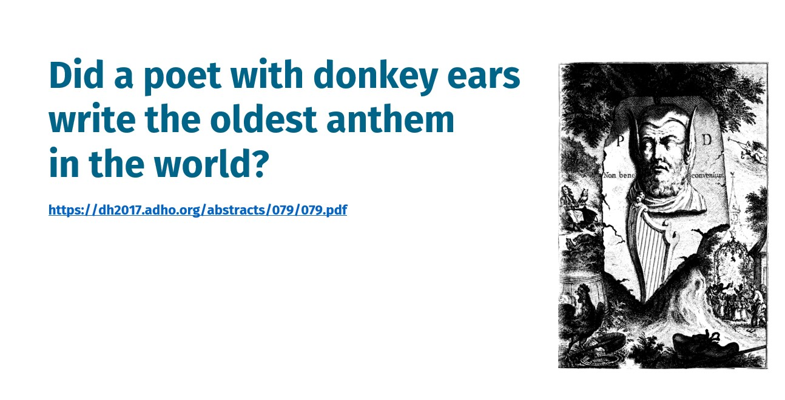

```{r, include=FALSE}
library(knitr)
library(kableExtra)
```

## 
<div style="float: left; width:100%">
```{r, echo=FALSE, fig.align='center', out.width="100%"}

```
</div>


## 
<div style="float: left; width:100%">
```{r, echo=FALSE, fig.align='center', out.width="100%"}

```
</div>


##
<div style="float: left; width:100%">
```{r, echo=FALSE, fig.align='center', out.width="100%"}

```
</div>

# Course Logistics

## Course materials

You can access the course materials quickly from

https://ayoubbagheri.nl/applied_tm/


## Teachers

<div style="float:left; width:50%">
```{r, echo=FALSE, fig.align='center', out.width="30%"}
include_graphics("img/anastasia.png")
```
  <div class="centered">
  **Anastasia**
  </div>
  
  <br/>
```{r, echo=FALSE, fig.align='center', out.width="30%"}
include_graphics("img/arjan.jpg")
```
  <div class="centered">
  **Arjan**
  </div>
  
  <br/>
```{r, echo=FALSE, fig.align='center', out.width="30%"}
include_graphics("img/luka.jpg")
```
  <div class="centered">
  **Luka**
  </div>
</div>

  <br/>
```{r, echo=FALSE, fig.align='center', out.width="20%"}
include_graphics("img/page17dong.png")
```
  <div class="centered">
  **Dong**
  </div>
  
  <br/>
```{r, echo=FALSE, fig.align='center', out.width="20%"}
include_graphics("img/Daniel_Anadria.jpg")
```
  <div class="centered">
  **Daniel**
  </div>
</div>


## Program {.smaller}
```{r, echo = FALSE, warning=FALSE}
time <- c("9:00 - 10:30", "", "10:45 – 11:45", "11:45 – 12:15", "", "13:45 – 15:15", "", "15:30 – 16:30", "16:30 – 17:00")
monday <- c("Lecture 1", "Break", "Practical 1", "Discussion 1", "Lunch", "Lecture 2", "Break", "Practical 2", "Discussion 2")
tuesday <- c("Lecture 3", "Break", "Practical 3", "Discussion 3", "Lunch", "Lecture 4", "Break", "Practical 4", "Discussion 4")
wednesday <- c("Lecture 5", "Break", "Practical 5", "Discussion 5", "Lunch", "Lecture 6", "Break", "Practical 6", "Discussion 6")
thursday <- c("Lecture 7", "Break", "Practical 7", "Discussion 7", "Lunch", "Lecture 8", "Break", "Practical 8", "Discussion 8")
friday <- c("Lecture 9", "Break", "Practical 9", "Discussion 9", "Lunch", "Lecture 10", "Break", "Practical 10", "Discussion 10")

program <- data.frame(Time = time, Monday = monday, Tuesday = tuesday, Wednesday = wednesday, Thursday = thursday, Friday = friday)

program %>% 
  kbl() %>% 
  kable_paper("hover", html_font = "Arial", full_width = T) %>% 
  row_spec(c(1,6), bold = T, color = "#E60B60") %>% 
  row_spec(c(2,7), color = "gray", font_size = 12) %>% 
  row_spec(c(3,8), color = "blue") %>% 
  row_spec(c(4,9), color = "green")
```


## Goal of the course
- Text data are everywhere!
- A lot of world’s data are in the format of unstructured text
- This course teaches 
  - text mining techniques 
  - using Python 
  - on a variety of applications 
  - in many domains.

# Python?

## How familiar are you with Python?

- What is your experience level with Python?

<div style="float: left; width:100%">
```{r, echo=FALSE, fig.align='center', out.width="90%"}
include_graphics("img/q1.jpg")
```
</div>
  
## Python IDE?

- Which Python IDE do you mostly use? If you use more than one environment fill in the other text boxes.

<div style="float: left; width:100%">
```{r, echo=FALSE, fig.align='center', out.width="90%"}
include_graphics("img/q1.jpg")
```
</div>

## Google Colab?

- How familiar are you with Google Colab? (1: limited to 5: expert)
  
<div style="float: left; width:100%">
```{r, echo=FALSE, fig.align='center', out.width="90%"}
include_graphics("img/q1.jpg")
```
</div>

## Python

- Latest: <a href="https://www.python.org/downloads/release/python-3105/">Python 3.10</a>

- Follow the tutorial on Python in Google Colab for the Applied Text Mining course: [link](https://ayoubbagheri.nl/applied_tm/Python_in_Google_Colab_Applied_Text_Mining.html)

- Python For Beginners
    - <a href="https://www.python.org/about/gettingstarted/">https://www.python.org/about/gettingstarted/</a>

- The Python Language Reference
    - <a href="https://docs.python.org/3/reference/">https://docs.python.org/3/reference/</a>

- Python 3.9.1 documentation
    - <a href="https://docs.python.org/3/">https://docs.python.org/3/</a>

## Google Colab

- Colaboratory, or "Colab" for short, allows you to write and execute Python in your browser, with
  - Zero configuration required
  - Free access to GPUs
  - Easy sharing

- [Intro](<a href="https://colab.research.google.com/notebooks/intro.ipynb">https://colab.research.google.com/notebooks/intro.ipynb</a>)

- [Cheat-sheet for Google Colab](https://colab.research.google.com/github/Tanu-N-Prabhu/Python/blob/master/Cheat_sheet_for_Google_Colab.ipynb)

- Keyboard shortcuts:
```{r, echo=FALSE, out.width="90%", fig.align='center'}
include_graphics("img/colab.png")
```


# What is Text Mining?

## Text mining in an example 

<div style="float: left; width: 20%;">
```{r, echo=FALSE}
include_graphics("img/page2_example.png")
```
</div>

<div style="float: right; width: 80%;">
- This is **Garry**!
- **Garry** works at <span style="color:blue">Bol.com</span> (a webshop in the Netherlands)
- He works in the dep of **Customer relationship management**.


- He uses Excel to read and search <span style="color:blue">customers’ reviews</span>, extract <span style="color:blue">aspects</span> they wrote their reviews on, and identify their <span style="color:blue">sentiments</span>.

- Curious about his job? See two examples!
</div>

## 

<div style="float: left; width: 60%;">
This is a nice book for both young and old. It gives beautiful life lessons in a fun way. Definitely worth the money!

<span style="color:green">+ Educational</span>

<span style="color:green">+ Funny</span>

<span style="color:green">+ Price</span>

<hr align=left width="90%" color=#987cb9 size=3>

Nice story for older children.

<span style="color:green">+ Funny</span>

<span style="color:red">- Readability</span>
</div>

<div style="float: right; width: 40%;">
```{r, echo=FALSE}
include_graphics("img/page3_littleprince.png")
```

## Example
<div style="float: left; with: 20%">
```{r, echo=FALSE}
include_graphics("img/page2_example.png")
```
</div>

<div style="float: right; width: 80%">
- Garry likes his job a lot, but sometimes it is frustrating!

- This is mainly because their company is expanding quickly!

- Garry decides to hire **Larry** as his assistant.

```{r, echo=FALSE, fig.align='right'}
include_graphics("img/page4_person2.png")
```
</div>

## Example
<div style="float: left; width: 20%">
```{r, echo=FALSE}
include_graphics("img/page2_example.png")
```


```{r, echo=FALSE, out.width = "80%"}
include_graphics("img/page4_person2.png")
```
</div>

<div style="float: right; width: 80%">
- Still, a lot to do for two people!

- Garry has some budget left to hire another assistant for couple of years!

- He decides to hire **Harry** too!

- Still, manual labeling using Excel is labor-intensive!

```{r, echo=FALSE, fig.align='right'}
include_graphics("img/page5_person3.png")
```
</div>

<!-- ## Challenges? -->

<!-- - What are the challenges they encounter in working with text? -->

<!-- <div style="float: left; width:100%"> -->
<!-- ```{r, echo=FALSE, fig.align='center', out.width="90%"} -->
<!-- include_graphics("img/q1.jpg") -->
<!-- ``` -->
<!-- </div> -->


## Language is hard!

- Different things can mean more or less the same ("data science" vs. "statistics")
- Context dependency ("You have very nice shoes");
- Same words with different meanings ("to sanction", "bank");
- Lexical ambiguity ("we saw her duck")
- Irony, sarcasm ("That's just what I needed today!", "Great!", "Well, what a surprise.")
- Figurative language ("He has a heart of stone")
- Negation ("not good" vs. "good"), spelling variations, jargon, abbreviations
- All the above are different over languages, 99\% of work is on English!

# Text Mining to the Rescue!

## Text mining
- “the discovery by computer of <span style="color:blue">new</span>, <span style="color:blue">previously unknown</span> information, by <span style="color:blue">automatically extracting</span> information from <span style="color:blue">different</span> written resources” Hearst (1999)

- Text mining is about looking for <span style="color:red">patterns in text</span>, in a similar way that <span style="color:red">data mining</span> can be loosely described as looking for patterns in data.

- Text mining describes a set of <span style="color:green">linguistic</span>, <span style="color:green">statistical</span>, and <span style="color:green">machine learning</span> techniques that model and structure the information content of textual sources. (Wikipedia)

## Language is hard!

- We won't solve linguistics ...
- In spite of the problems, text mining can be quite effective!

# Process & Tasks

## Text mining process
```{r, echo=FALSE, out.width="90%", fig.align='center'}
include_graphics("img/page 23.png")
```

## Text mining tasks {.smaller}
- Text classification
- Text clustering
- Sentiment analysis
- Feature selection
- Topic modelling
- Responsible text mining
- Text summarization

## And more in NLP
```{r, echo=FALSE, out.width="80%", fig.align='center'}
include_graphics("img/page 25.png")
```

<br>
<br>
<div style="font-size:12px">
source: https://nlp.stanford.edu/~wcmac/papers/20140716-UNLU.pdf
</div>


# Text Preprocessing

## Text preprocessing
- is an approach for cleaning and noise removal of text data.
- brings your text into a form that is analyzable for your task.
- transforms text into a more digestible form so that machine learning algorithms can perform better.

## Typical steps
- Tokenization (“text”, “ming”, “is”, “the”, “best” , “!”)
- Stemming (“lungs”→“lung”) or Lemmatization (“were”→“is”)
- Lowercasing (“Disease”→“disease”)
- Stopword removal (“text ming is best!”)
- Punctuation removal (“text ming is the best”)
- Number removal (“I42”→“I”)
- Spell correction (“hart”→“heart”)

**Not all of these are appropriate at all times!**

## Tokenization/Segmentation

- Split text into words and sentences
    
```{r, echo=FALSE, out.width="80%", fig.align='center'}
include_graphics("img/page 46_2.png")
```

## N-grams

- N-grams: a contiguous sequence of N tokens from a given piece of text
  
  - E.g., *‘Text mining is to identify useful information.’*
  
  - Bigrams: *‘text_mining’, ‘mining_is’, ‘is_to’, ‘to_identify’, ‘identify_useful’, ‘useful_information’, ‘information_.’*

>- Pros: capture local dependency and order

>- Cons: increase the vocabulary size

## Part Of Speech (POS) tagging

- Annotate each word in a sentence with a part-of-speech.

```{r, echo=FALSE, out.width="80%", fig.align='center'}
include_graphics("img/page 50.png")
```

- Useful for subsequent syntactic parsing and word sense disambiguation.

# Vector Space Model

## Basic idea
- Text is “unstructured data”
- How do we get to something structured that we can compute with?
- **Text must be represented somehow**
- Represent the text as something that makes sense to a computer


## How to represent a document

- Represent by a string?
  
  - No semantic meaning

- Represent by a list of sentences?

  - Sentence is just like a short document (recursive definition)

- Represent by a vector?
  
  - A vector is an ordered finite list of numbers.

## Vector space model

- A vector space is a collection of vectors

- Represent documents by <u>concept</u> vectors
  
  - Each concept defines one dimension

  - k concepts define a high-dimensional space
  
  - Element of vector corresponds to concept weight	


## Vector space model

- Distance between the vectors in this concept space

  - Relationship among documents

- The process of converting text into numbers is called <b>Vectorization</b>

## Vector space model

- Terms are generic features that can be extracted from text

- Typically, terms are single words, keywords, n-grams, or phrases

- Documents are represented as vectors of terms

- Each dimension (concept) corresponds to a separate term

$$d = (w_1, ..., w_n)$$

## An illustration of VS model 

- All documents are projected into this concept space

```{r,echo=FALSE, out.width="70%"}
include_graphics("img/page 38.png")
```

## VSM: How do we represent vectors?

```{r,echo=FALSE, out.width="90%"}
include_graphics("img/vsm.jpg")
```

## Bag of Words (BOW)

- *Terms* are words (more generally we can use n-grams) 
- *Weights* are number of occurrences of the terms in the document
  - Binary
  - Term Frequency (TF)
  - Term Frequency inverse Document Frequency (TFiDF)

## Binary

- Doc1: Text mining is to identify useful information.

- Doc2: Useful information is mined from text.

- Doc3: Apple is delicious.
  
```{r, echo= FALSE, out.width="100%"}
include_graphics("img/page 122.png")
```

## Term Frequency

- Idea: a term is more important if it occurs more frequently in a document

- TF formulas
  
  - Let $t(c,d)$ be the frequency count of term $t$ in doc $d$

  - Raw TF: $tf(t,d) = c(t,d)$
  
## TF: Document - Term Matrix (DTM)
```{r, echo=FALSE, out.width="100%", fig.align='center'}
include_graphics("img/tf.png")
```

## TFiDF
- Idea: a term is more discriminative if it occurs a lot but only in fewer documents

Let $n_{d,t}$ denote the number of times the $t$-th term appears in the $d$-th document.

$$TF_{d,t} = \frac{n_{d,t}}{\sum_i{n_{d,i}}}$$
Let $N$ denote the number of documents annd $N_t$ denote the number of documents containing the $t$-th term.

$$IDF_t = log(\frac{N}{N_t})$$
TFiDF weight: 

$$w_{d,t} = TF_{d,t} \cdot IDF_t$$


<!-- ## Bag-of-Words representation -->

<!-- - Term as the basis for vector space -->

<!-- ```{r, echo=FALSE, out.width="80%", fig.align='center'} -->
<!-- include_graphics("img/page 39.png") -->
<!-- ``` -->

## TFiDF: Document - Term matrix (DTM)
```{r, echo=FALSE, out.width="100%", fig.align='center'}
include_graphics("img/tfidf.png")
```

## How to define a good similarity metric?

```{r, echo=FALSE, out.width="70%", fig.align='center'}
include_graphics("img/page 75_2.png")
```

## How to define a good similarity metric?

- Euclidean distance

    $dist(d_i, d_j) = \sqrt{\sum_{t\in V}{[tf(t,d_i)idf(t) - tf(t, d_j)idf(t)]^2}}$
    
    - Longer documents will be penalized by the extra words
    
    - We care more about how these two vectors are overlapped
    
- Cosine similarity
  
  - Angle between two vectors:
  
    $cosine(d_i, d_j) = \frac{V_{d_i}^TV_{d_j}}{|V_{d_i}|_2 \times |V_{d_j}|_2}$ <span style="color:red">&#x2190; TF-IDF vector</span>
  
  - Documents are normalized by length
    

## Next

- Text classification


<!-- ## Preprocessing demo -->

<!-- - CogComp: https://cogcomp.seas.upenn.edu/vsa8080/curator -->

<!-- - CCG Demos: https://cogcomp.seas.upenn.edu/page/demos/ -->

<!-- - Stanford parser: http://nlp.stanford.edu:8080/parser/index.jsp -->


# Summary

## Summary
- Text data are everywhere!
- Language is hard!
- The basic problem of text mining is that text is not a neat data set
- Solution: text pre-processing & VSM

# Practical 1
