```{r, include=FALSE}
library(knitr)
library(kableExtra)
```

## Recap: RNN in Python

```{r, echo=FALSE, out.width="90%", fig.align='center'}
include_graphics("img/rnn.png")
```

## Lecture plan

1. Convolutional Neural Networks
2. Transformers
3. BERT

<!-- # Convolutional Neural Network -->

## Convolutional Neural Network (CNN)

- Intuition: Neural network with specialized connectivity structure
    - Stacking multiple layers of feature extractors, low-level layers extract local features, and high-level layers extract learn global patterns.
- There are a few distinct types of layers:
    - **Convolution Layer**: detecting local features through filters (discrete convolution)
    <!-- - **Non-linear Layer**: normalization via Rectified Linear Unit (ReLU) -->
    - **Pooling Layer**: merging similar features
    
<!-- ## Building-blocks for CNNs -->

<!-- ```{r, echo=FALSE, out.width="100%", fig.align='center'} -->
<!-- 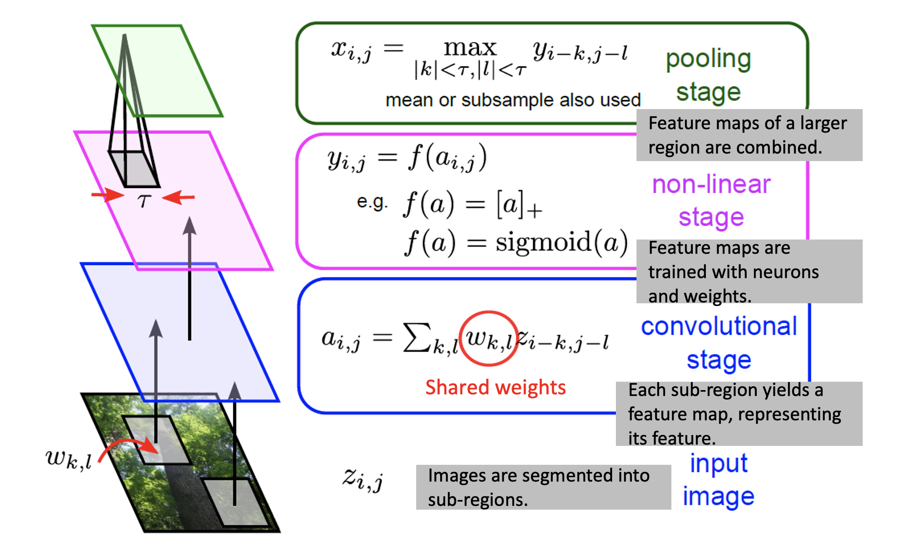 -->
<!-- ``` -->

## Convolution layer

- The core layer of CNNs
- Convolutional layer consists of a set of filters
- Each filter covers a spatially small portion of the input data
- Each filter is convolved across the dimensions of the input data, producing a multidimensional **feature map**.
- As we convolve the filter, we are computing the dot product between the parameters of the filter and the input.
- **Deep Learning algorithm**: During training, the network corrects errors and filters are **learned**, e.g., in Keras, by adjusting weights based on **Stochastic Gradient Descent**, **SGD**.
- The key architectural characteristics of the convolutional layer is **local connectivity** and **shared weights**.

<!-- ```{r, echo=FALSE, out.width="30%", fig.align='center'} -->
<!-- 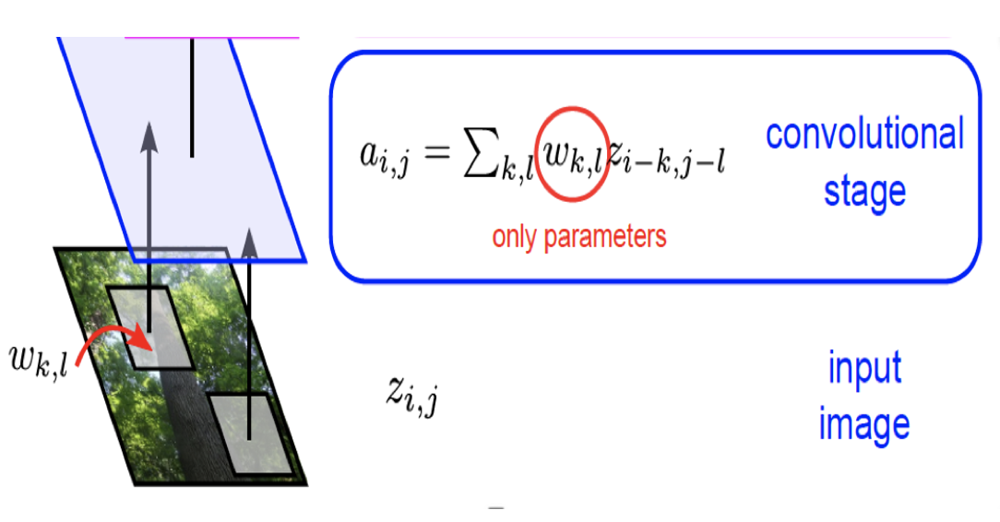 -->
<!-- ``` -->

<!-- ## Convolutional layer: Local connectivity -->

<!-- <div style="float:left; width:60%"> -->
<!--   <ul> -->
<!--       <li>Neurons in layer m are only connected to 3 adjacent neurons in the m-1 layer.</li> -->
<!--       <li>Neurons in layer m+1 have a similar connectivity with the layer below.</li> -->
<!--       <li>Each neuron is unresponsive to variations outside of its <em>receptive field</em> with respect to the input. </li> -->
<!--       <ul><li>Receptive field: small neuron collections which process portions of the input data.</li></ul> -->
<!--       <li>The architecture thus ensures that the learnt feature extractors produce the strongest response to a spatially local input pattern.</li> -->
<!--   </ul> -->
<!-- </div> -->
<!-- <div style="float:left; width:40%"> -->
<!-- ```{r, echo=FALSE, out.width="90%", fig.align='center'} -->
<!-- 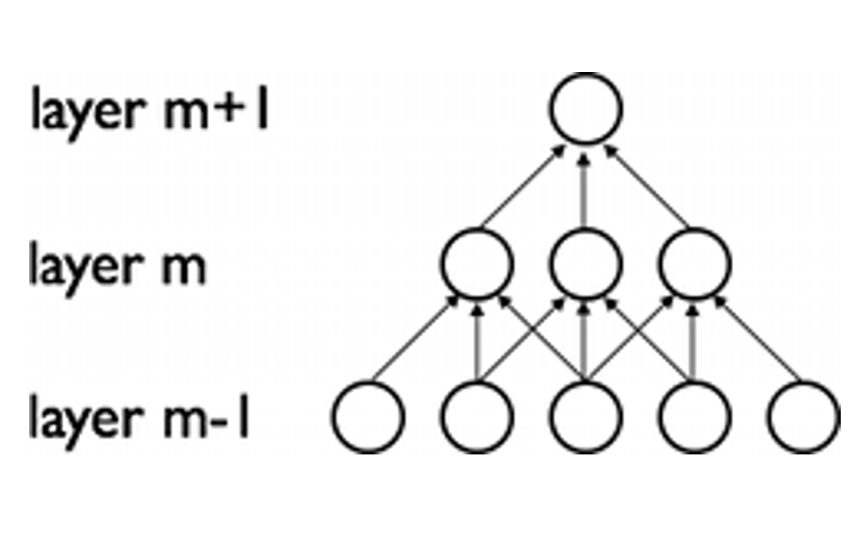 -->
<!-- ``` -->
<!-- </div> -->

<!-- ## Convolutional layer: Shared weights -->

<!-- <div style="float:left; width:60%"> -->
<!--   <ul> -->
<!--       <li>We show 3 hidden neurons belonging to the same feature map (the layer right above the input layer).</li> -->
<!--       <li>Weights of the same color are shared—constrained to be identical.</li> -->
<!--       <li>Replicating neurons in this way allows for features to be detected regardless of their position in the input. </li> -->
<!--       <li>Additionally, <b>weight sharing increases learning efficiency</b> by greatly reducing the number of free parameters being learnt.</li> -->
<!--   </ul> -->
<!-- </div> -->
<!-- <div style="float:left; width:40%"> -->
<!-- ```{r, echo=FALSE, out.width="90%", fig.align='center'} -->
<!-- 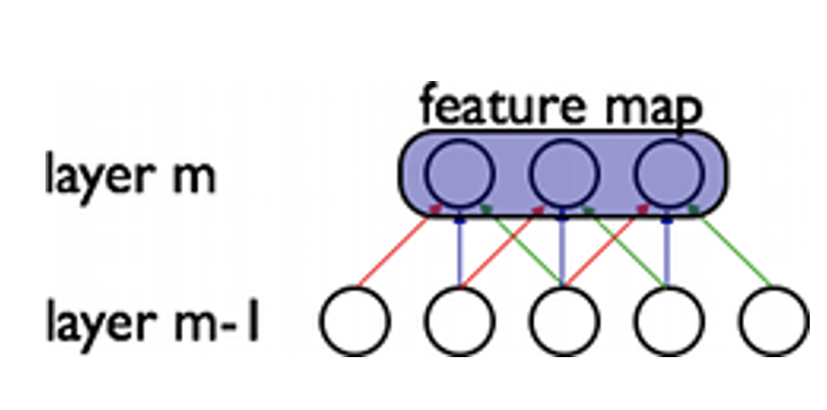 -->
<!-- ``` -->
<!-- </div> -->

## Convolution without padding

```{r, echo=FALSE, out.width="70%", fig.align='center'}
include_graphics("img/page 10.gif")
```


```{r, echo=FALSE, out.width="70%", fig.align='center'}
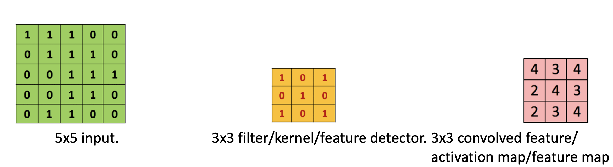
```

## Convolution with padding

<center>

<div style="float:left;width:50%">
```{r, echo=FALSE, out.width="70%", fig.align='center'}
include_graphics("img/page 11_1.gif")
```
  <center>4x4 input. 3x3 filter. Stride = 1. 
2x2 output.</center>
</div>

<div style="float:right;width:50%">
```{r, echo=FALSE, out.width="70%", fig.align='center'}
include_graphics("img/page 11_2.gif")
```
  <center>5x5 input. 3x3 filter. Stride = 1. 
5x5 output.</center>
</div>

https://github.com/vdumoulin/conv_arithmetic</center>

<!-- ## (2) Non-linear layer  -->

<!-- ```{r, echo=FALSE, out.width="40%", fig.align='center'} -->
<!-- 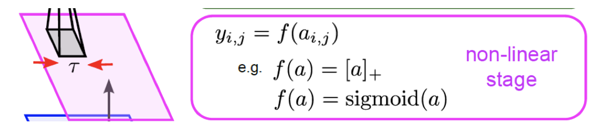 -->
<!-- ``` -->

<!-- - Intuition: Increase the nonlinearity of the entire architecture without affecting the receptive fields of the convolution layer -->
<!-- - A layer of neurons that applies the non-linear activation function, such as, -->
<!--     - **$f(x)=maxa(0,x)$** - Rectified Linear Unit (ReLU);  -->

<!--     fast and most widely used in CNN -->
<!--     - $f(x)=\text{tanh}x$ -->
<!--     - $f(x)=|\text{tanh}a𝑥|$ -->
<!--     - $f(x)=(1+𝑒^{−𝑥})^{−1}$ - sigmoid -->

<!-- ```{r, echo=FALSE, out.width="50%", fig.align='center'} -->
<!-- 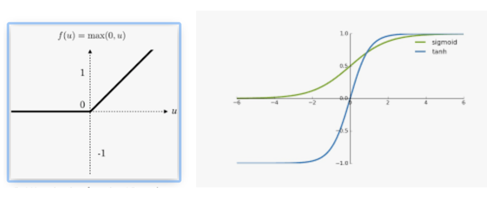 -->
<!-- ``` -->

## Pooling layer

<!-- ```{r, echo=FALSE, out.width="50%", fig.align='center'} -->
<!-- 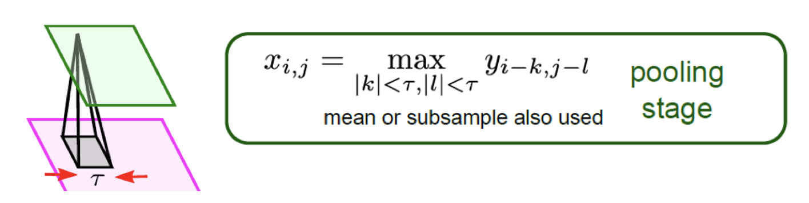 -->
<!-- ``` -->

- Intuition: to progressively reduce the spatial size of the representation to reduce the amount of parameters and computation in the network, and hence to also control overfitting
- Pooling partitions the input image (or documents) into a set of non-overlapping rectangles (n-grams) and, for each such sub-region, outputs the maximum value of the features in that region.

```{r, echo=FALSE, out.width="80%", fig.align='center'}
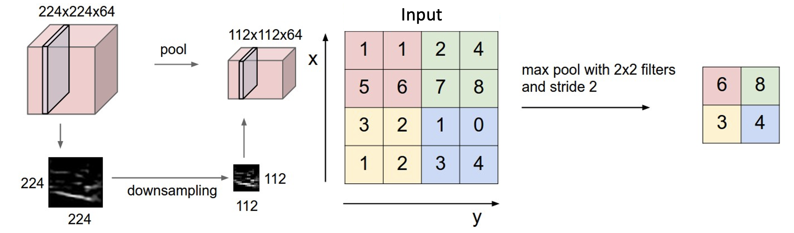
```

## Pooling (down sampling) 

```{r, echo=FALSE, out.width="90%", fig.align='center'}
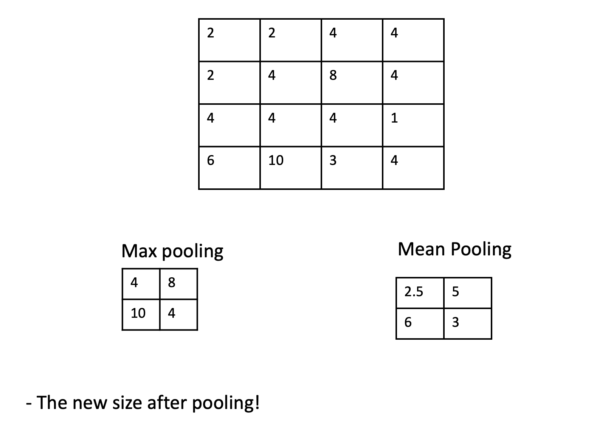
```

## Convolutional neural network

<!-- - Convolutional Neural Networks, or Convolutional Networks, or CNNs, or ConvNets -->
For processing data with a **grid-like** or array topology:

  - 1-D convolution: text data, sequence data, time-series data, sensor signal data
  
  - 2-D convolution: image data
  
  - 3-D convolution: video data

<!-- - CNNs include four key ideas related to natural signals:  -->
<!--     - **Local connections** -->
<!--     - **Shared weights** -->
<!--     - **Pooling** -->
<!--     - **Use of many layers** -->

## Other layers

- The convolution, and pooling layers are typically used as a set. Multiple sets of the above layers can appear in a CNN design.
    <!-- - Input &rarr; <span style="color:green">Conv. &rarr; Non-linear &rarr; Pooling</span> &rarr;  <span style="color:green">Conv. &rarr; Non-linear &rarr; Pooling</span> &rarr; … &rarr; Output -->
<!-- - Recent CNN architectures have 10-20 such layers. -->
- After a few sets, the output is typically sent to one or two **fully connected layers**.
    - A fully connected layer is a ordinary neural network layer as in other neural networks.
    - Typical activation function is the sigmoid function.
    - Output is typically class (classification) or real number (regression).

```{r, echo=FALSE, out.width="50%", fig.align='center'}
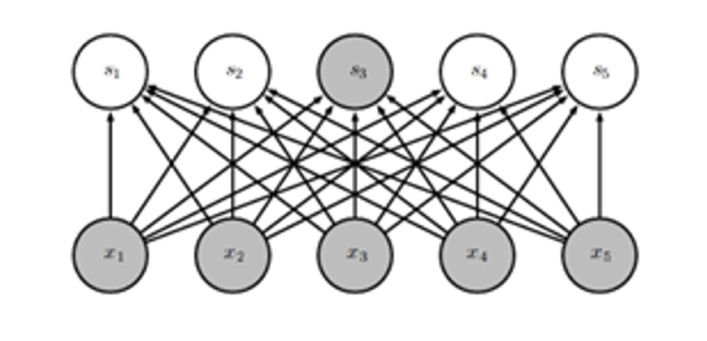
```

## Other layers

- The final layer of a CNN is determined by the research task.
- Classification: Softmax Layer
$$P(y=j|\boldsymbol{x}) = \frac{e^{w_j \cdot x}}{\sum_{k=1}^K{e^{w_k \cdot x}}}$$
    - The outputs are the probabilities of belonging to each class.
- Regression: Linear Layer
$$f(\boldsymbol{x}) = \boldsymbol{w} \cdot \boldsymbol{x}$$
    - The output is a real number.

<span style="color:blue;font-weight:bold">What hyperparameters do we have in a CNN model?</span>

# CNN for Text 

## CNN

Main CNN idea for text:

<span style="color:orange">Compute vectors for n-grams</span> and group them afterwards

<br> <br>

Example: “Utrecht summer school is in Utrecht” compute vectors for: 

Utrecht summer, summer school, school is, is in, in Utrecht, Utrecht summer school, summer school is, school is in, is in Utrecht, Utrecht summer school is, summer school is in, school is in Utrecht, Utrecht summer school is in, summer school is in Utrecht, Utrecht summer school is in Utrecht

<div style="float:left;width:60%">
  
</div>
<div style="float:right;width:40%">
  
</div>

<!-- ## CNN for text classification -->

<!-- ```{r, echo=FALSE, out.width="90%", fig.align='center'} -->
<!-- 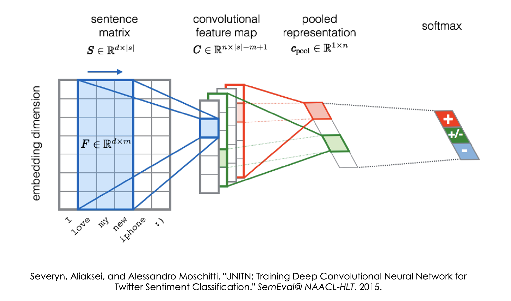 -->
<!-- ``` -->

## CNNs for sentence classification

```{r, echo=FALSE, out.width="90%", fig.align='center'}
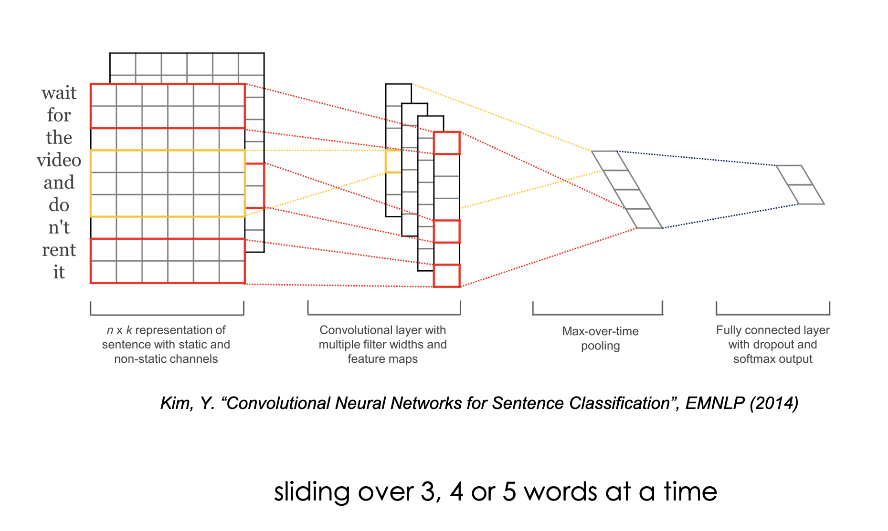
```

https://arxiv.org/pdf/1408.5882.pdf

## Data sets (1)

- **MR**: Movie reviews with one sentence per review. Classification involves detecting positive/negative reviews (Pang and Lee, 2005).
url: https://www.cs.cornell.edu/people/pabo/movie-review-data/

- **SST-1**: Stanford Sentiment Treebank—an extension of MR but with train/dev/test splits provided and fine-grained labels (very positive, positive, neutral, negative, very negative), re-labeled by Socher et al. (2013).
url: https://nlp.stanford.edu/sentiment/

- **SST-2**: Same as SST-1 but with neutral reviews removed and binary labels.

- **Subj**: Subjectivity dataset where the task is to classify a sentence as being subjective or objective (Pang and Lee, 2004).

## Data sets (2)

- **TREC**: TREC question dataset—task involves classifying a question into 6 question types (whether the question is about person, location, numeric information, etc.) (Li and Roth, 2002).
url: https://cogcomp.seas.upenn.edu/Data/QA/QC/

- **CR**: Customer reviews of various products (cameras, MP3s etc.). Task is to predict positive/negative reviews (Hu and Liu, 2004).
url: https://www.cs.uic.edu/~liub/FBS/sentiment-analysis.html

- **MPQA**: Opinion polarity detection subtask of the MPQA dataset (Wiebe et al., 2005).
url: https://mpqa.cs.pitt.edu/corpora/mpqa_corpus/

## Datasets' statistics

```{r, echo=FALSE, out.width="65%", fig.align='center'}
include_graphics("img/datasetsCNN.png")
```

## CNN variations

```{r, echo=FALSE, out.width="60%", fig.align='center'}
include_graphics("img/CNN_var.png")
```

## Similar words

```{r, echo=FALSE, out.width="50%", fig.align='center'}
include_graphics("img/CNN_sim.png")
```

## Results

```{r, echo=FALSE, out.width="100%", fig.align='center'}
include_graphics("img/results.png")
```

<!-- ## Python CNN Implementation -->

<!-- - Prerequisites: -->
<!--     - Python 3.5+ (https://www.python.org/) -->
<!--     - TensorFlow (https://www.tensorflow.org/) -->
<!--     - Keras (https://keras.io/) -->
<!--         - **Keras is a high-level neural networks API, written in Python and capable of running on top of TensorFlow, CNTK, or Theano.** -->
<!-- - Recommended: -->
<!--     - NumPy -->
<!--     - Scikit-Learn -->
<!--     - NLTK -->
<!--     - SciPy -->

<!-- ```{r, echo=FALSE, out.width="50%", fig.align='center'} -->
<!-- 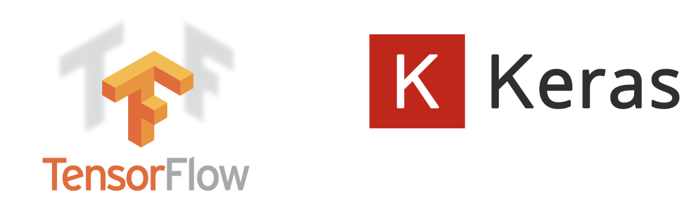 -->
<!-- ``` -->

## CNN with Keras in Python

```{r, echo=FALSE, out.width="80%", fig.align='center'}
include_graphics("img/cnn.png")
```


<!-- <div style="float: left; width:60%"> -->
<!-- - The `Sequential` model is used to build a linear stack of layers. -->
<!-- - The following code shows how a typical CNN is built in Keras. -->

<!-- ``` -->
<!-- import numpy as np -->
<!-- import keras -->
<!-- from keras.models import Sequential -->
<!-- from keras.layers import Dense, Flatten -->
<!-- from keras.layers import Conv2D, MaxPooling2D -->
<!-- from keras.optimizers import SGD -->
<!--  -->
<!-- ``` -->
<!-- </div> -->
<!-- <div style="float: right; width:40%"> -->
<!-- Note: -->

<!-- **Dense is the fully connected layer;** -->

<!-- **Flatten is used after all CNN layers ** -->

<!-- and before fully connected layer; -->

<!-- **Conv2D is the 2D convolution layer;** -->

<!-- **MaxPooling2D is the 2D max pooling layer;** -->

<!-- **SGD is stochastic gradient descent algorithm.** -->
<!-- </div> -->

<!-- ## Build a CNN in Keras -->

<!-- ```{r, echo=FALSE, out.width="100%", fig.align='center'} -->
<!-- 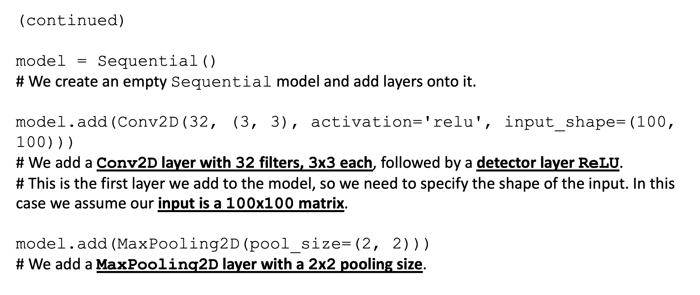 -->
<!-- ``` -->

<!-- ## Build a CNN in Keras -->

<!-- ```{r, echo=FALSE, out.width="100%", fig.align='center'} -->
<!-- 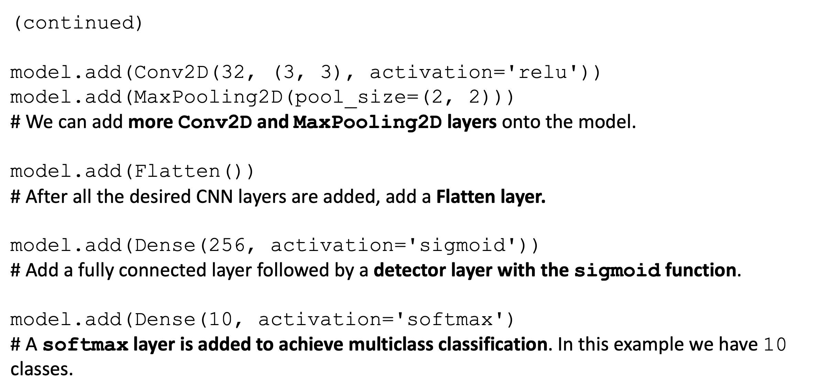 -->
<!-- ``` -->

<!-- ## Build a CNN in Keras -->

<!-- ```{r, echo=FALSE, out.width="100%", fig.align='center'} -->
<!-- 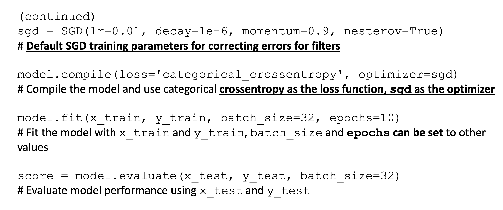 -->
<!-- ``` -->

<!-- # Encoder-Decoder -->

<!-- ## Encoder-Decoder -->

<!-- - **RNN**: input sequence is transformed into output sequence in a one-to-one fashion. -->
<!-- - **Goal**: Develop an architecture capable of generating contextually appropriate, arbitrary length, output sequences -->
<!-- - **Applications**:  -->
<!--     - Machine translation,  -->
<!--     - Summarization,  -->
<!--     - Question answering, -->
<!--     - Dialogue modeling. -->

<!-- ```{r, echo=FALSE, out.width="50%", fig.align='center'} -->
<!-- 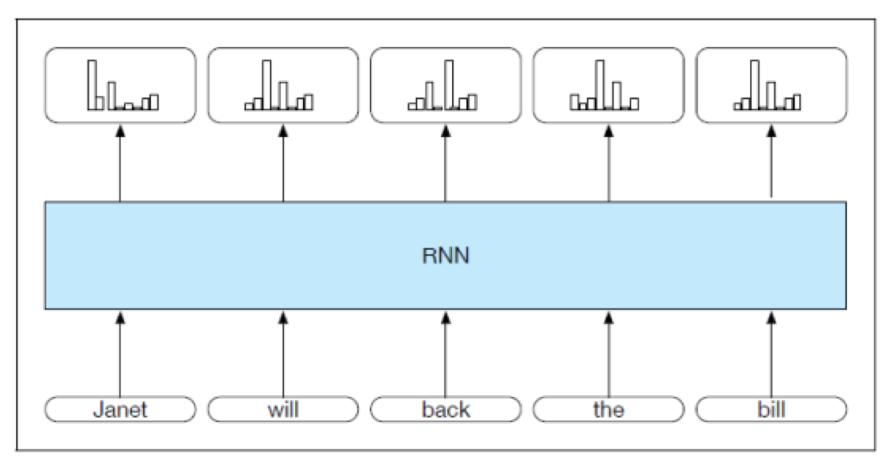 -->
<!-- ``` -->

<!-- ## Simple recurrent neural network illustrated as a feed-forward network -->
<!-- &nbsp; -->

<!-- **Most significant change: new set of weights, U** -->
<!-- - connect the hidden layer from the previous time step to the current hidden layer.  -->
<!-- - determine how the network should make use of past context in calculating the output for the current input. -->

<!-- ```{r, echo=FALSE, out.width="70%", fig.align='center'} -->
<!-- 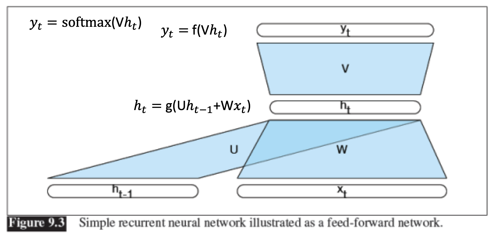 -->
<!-- ``` -->

<!-- ## Simple-RNN abstraction -->

<!-- ```{r, echo=FALSE, out.width="100%", fig.align='center'} -->
<!-- 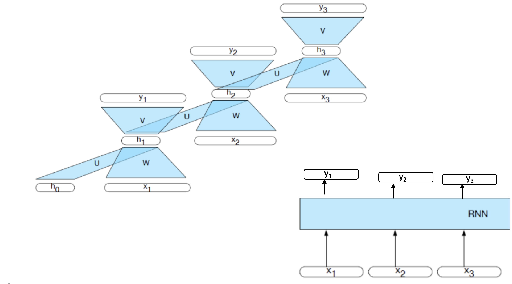 -->
<!-- ``` -->

<!-- ## RNN Applications -->

<!-- ```{r, echo=FALSE, out.width="100%", fig.align='center'} -->
<!-- include_graphics("img/page 30.png") -->
<!-- ``` -->

<!-- ## Sentence Completion using an RNN -->

<!-- ```{r, echo=FALSE, out.width="90%", fig.align='center'} -->
<!-- 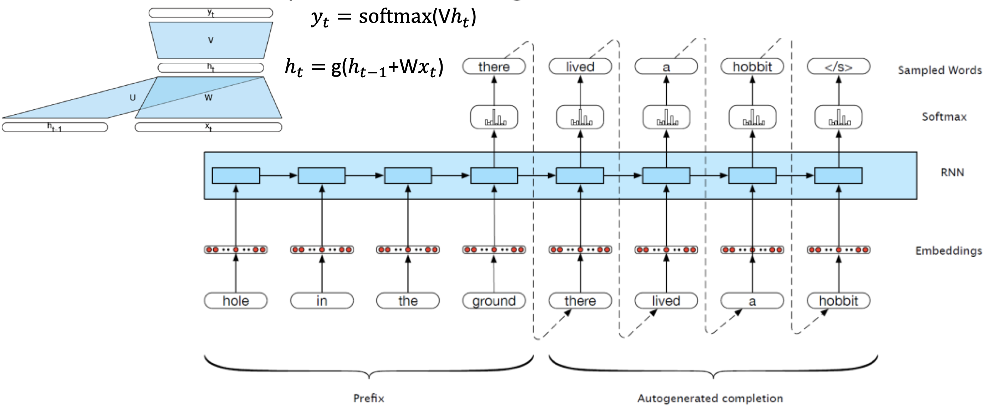 -->
<!-- ``` -->

<!-- - **Trained Neural Language Model** can be used to generate novel sequences  -->
<!-- - Or to complete a given sequence (until end of sentence token <\s> is generated) -->

<!-- ##  -->

<!-- ```{r, echo=FALSE, out.width="100%", fig.align='center'} -->
<!-- 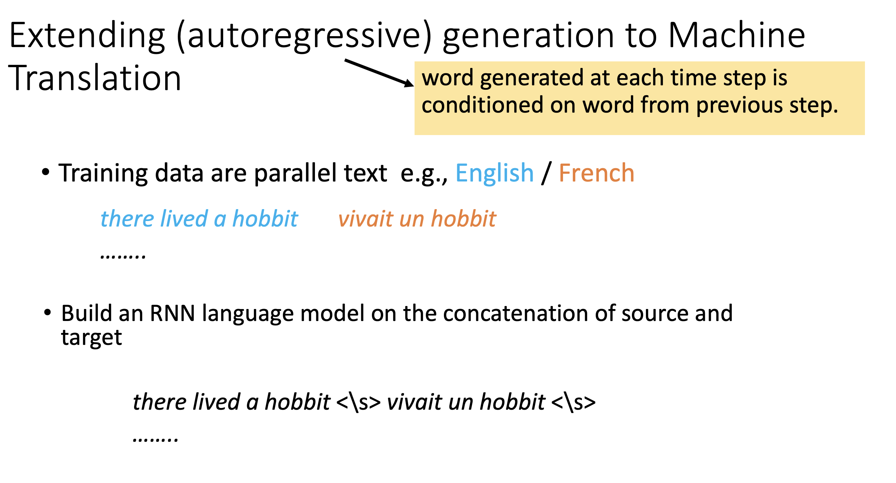 -->
<!-- ``` -->

<!-- ## Extending (autoregressive) generation to Machine Translation -->

<!-- - Translation as Sentence Completion! -->

<!-- ```{r, echo=FALSE, out.width="80%", fig.align='center'} -->
<!-- 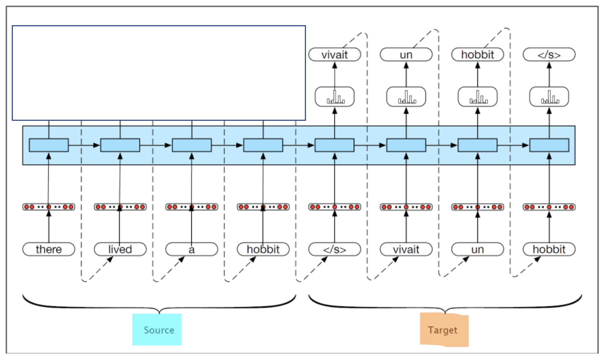 -->
<!-- ``` -->

<!-- ## (Simple) Encoder decoder networks -->
<!-- &nbsp; -->

<!-- ```{r, echo=FALSE, out.width="90%", fig.align='center'} -->
<!-- 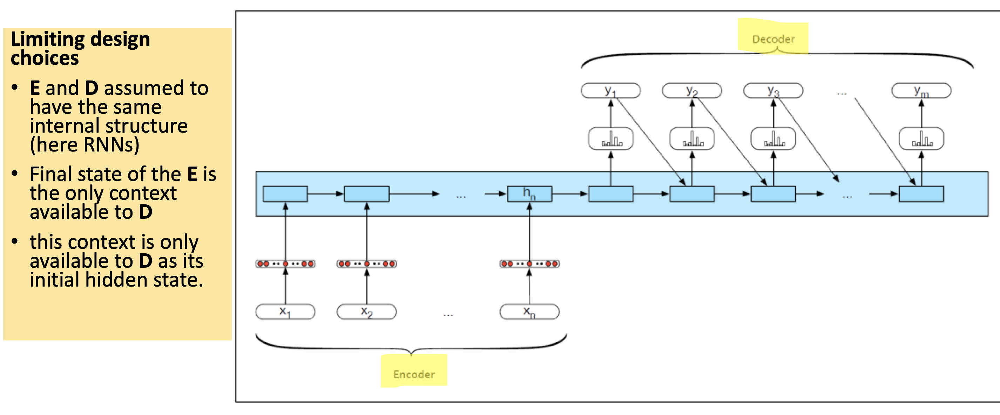 -->
<!-- ``` -->

<!-- - Encoder generates a contextualized representation of the input (last state). -->
<!-- - Decoder takes that state and autoregressively generates a sequence of outputs -->

<!-- ## General encoder decoder networks  -->

<!-- Abstracting away from these choices -->

<!-- 1. Encoder: accepts an input sequence, $x_{1:n}$ and generates a corresponding sequence of contextualized representations, $h_{1:n}$ -->
<!-- 2. Context vector $c$:  function of $h_{1:n}$ and conveys the essence of the input to the decoder. -->
<!-- 3. Decoder: accepts $c$ as input and generates an arbitrary length sequence of hidden states $h_{1:m}$ from which a corresponding sequence of output states $y_{1:m}$ can be obtained. -->

<!-- ```{r, echo=FALSE, out.width="70%", fig.align='center'} -->
<!-- 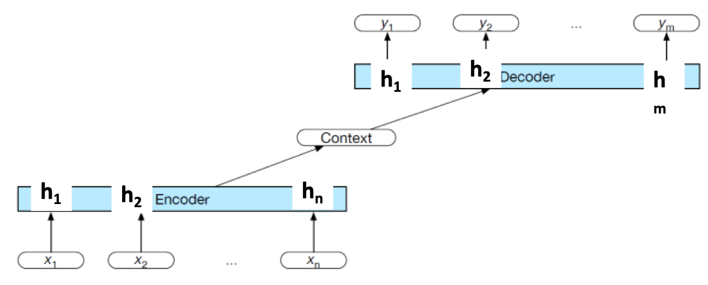 -->
<!-- ``` -->

<!-- ## Popular architectural choices: Encoder -->

<!-- Widely used encoder design: **stacked Bi-LSTMs**  -->
<!-- - Contextualized representations for each time step: **hidden states from top layers** from the forward and backward passes -->

<!-- ```{r, echo=FALSE, out.width="70%", fig.align='center'} -->
<!-- 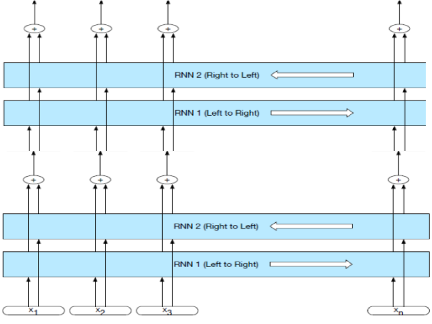 -->
<!-- ``` -->

<!-- ## Decoder basic design -->

<!-- - produce an output sequence an element at a time -->

<!-- ```{r, echo=FALSE, out.width="80%", fig.align='center'} -->
<!-- include_graphics("img/page 37.png") -->
<!-- ``` -->

<!-- ## Decoder design <br> enhancement -->

<!-- ```{r, echo=FALSE, out.width="90%", fig.align='center'} -->
<!-- 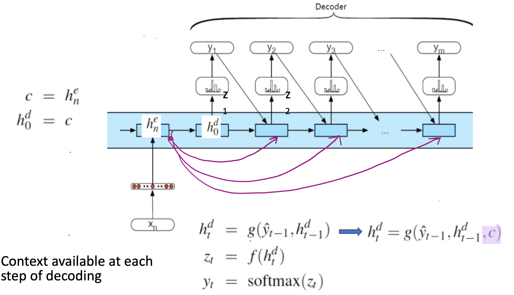 -->
<!-- ``` -->

<!-- ## Decoder: How output y is chosen -->

<!-- - **Sample soft-max** distribution (OK for generating novel output, not OK for e.g. MT or Summ) -->
<!-- - **Most likely output** (doesn’t guarantee individual choices being made make sense together) -->

<!-- ```{r, echo=FALSE, out.width="80%", fig.align='center'} -->
<!-- 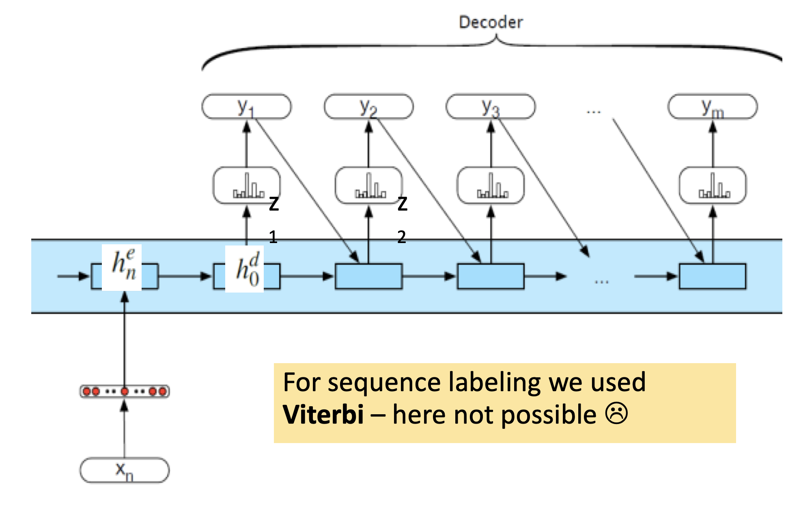 -->
<!-- ``` -->

<!-- ## -->

<!-- ```{r, echo=FALSE, out.width="100%", fig.align='center'} -->
<!-- 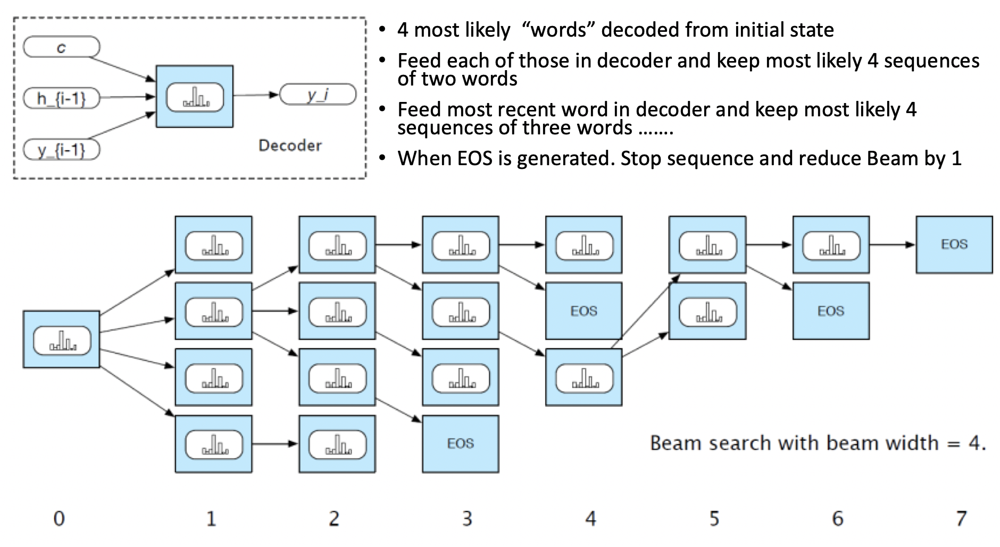 -->
<!-- ``` -->

<!-- # Attention -->

<!-- ## Flexible context: Attention -->

<!-- **Context vector $c$**: function of **$h_{1:n}$** and conveys the essence of the input to the decoder. -->

<!-- ```{r, echo=FALSE, out.width="80%", fig.align='center'} -->
<!-- 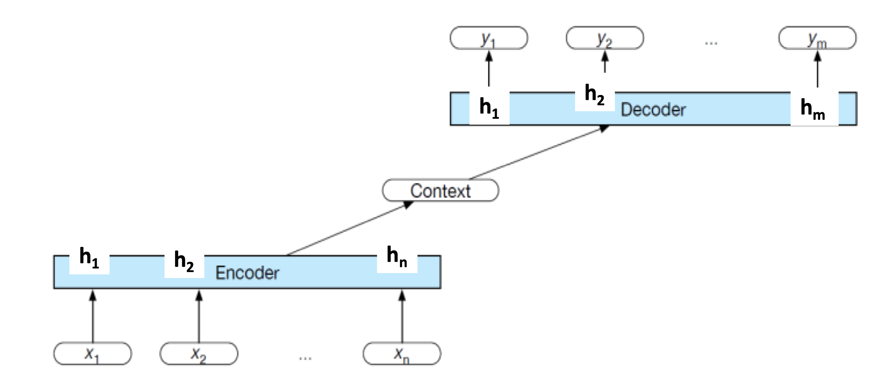 -->
<!-- ``` -->

<!-- ## Flexible context: Attention -->

<!-- **Context vector $c$**: function of **$h_{1:n}$** and conveys the essence of the input to the decoder. -->

<!-- **Flexible?**   -->
<!-- - Different for each $h_i$ -->
<!-- - Flexibly combining the $h_j$  -->

<!-- ```{r, echo=FALSE, out.width="80%", fig.align='center'} -->
<!--  -->
<!-- ``` -->

<!-- ## Attention (1): dynamically derived context -->

<!-- - Replace static context vector with dynamic <span style="color:lightblue">$c_i$</span> -->
<!-- - derived from the encoder hidden states at each point <span style="color:lightblue">$i$</span> during decoding -->

<!-- **Ideas**: -->
<!-- - should be a linear combination of those states  -->
<!-- $$c_i = \sum_j{\alpha_{ij}h^e_j}$$ -->
<!-- - $\alpha_{ij}$ should depend on? -->

<!-- ```{r, echo=FALSE, out.width="40%", fig.align='center'} -->
<!-- 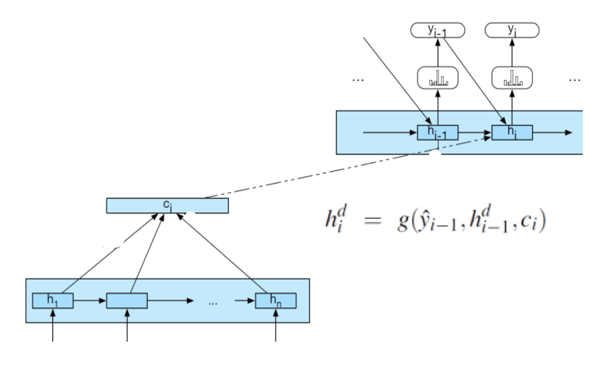 -->
<!-- ``` -->

<!-- ## Attention (2): computing $c_i$ -->

<!-- - Compute a vector of scores that capture the relevance of each encoder hidden state to the decoder state $h_{i-1}^d$ -->
<!-- $$score(h_{i-1}^d, h_j^e)$$ -->

<!-- - Just the similarity -->
<!-- $$score(h_{i-1}^d, h_j^e) = h_{i-1}^d \cdot h_j^e$$ -->

<!-- - Give network the ability to <span style="background-color:lightgray">learn which aspects</span> of similarity between the decoder and encoder states are important to the current application. -->

<!-- $$score(h_{i-1}^d, h_j^e) = h_{i-1}^d W_S h_j^e$$ -->

<!-- ```{r, echo=FALSE, out.width="40%", fig.align='center'} -->
<!-- 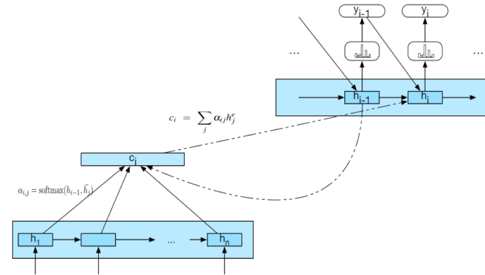 -->
<!-- ``` -->

<!-- ## Attention (3): computing $c_i$ <br> From scores to weights -->

<!-- - Create vector of weights  by normalizing scores -->

<!-- $$ -->
<!-- \begin{align} -->
<!-- a_{ij} &= \text{softmax}(score(h_{i-1}^d, h_j^e)\ \forall j \in e) \\ -->
<!-- &= \frac{exp(score(h_{i-1}^d, h_j^e))}{\sum_k{exp(score(h_{i-1}^d, h_k^e))}} -->
<!-- \end{align} -->
<!-- $$ -->

<!-- - **Goal achieved**: compute a fixed-length context vector for the current decoder state by taking a weighted average over all the encoder hidden states. -->

<!-- ```{r, echo=FALSE, out.width="40%", fig.align='center'} -->
<!-- 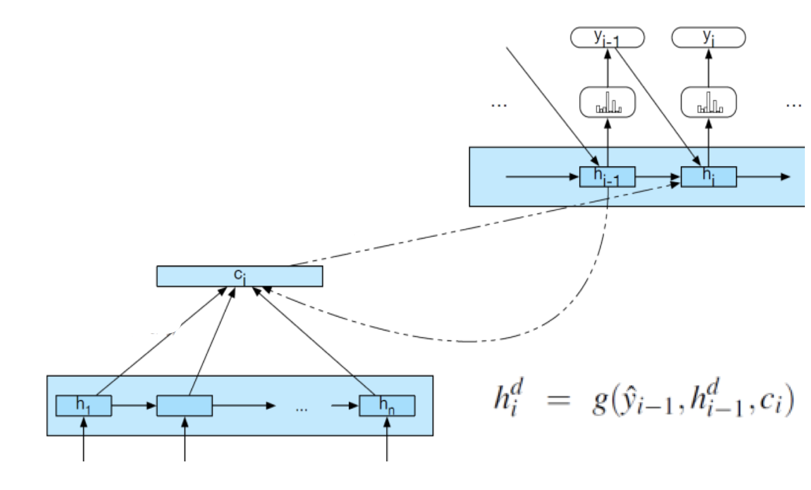 -->
<!-- ``` -->

<!-- ## Attention: Summary -->

<!-- ```{r, echo=FALSE, out.width="100%", fig.align='center'} -->
<!-- 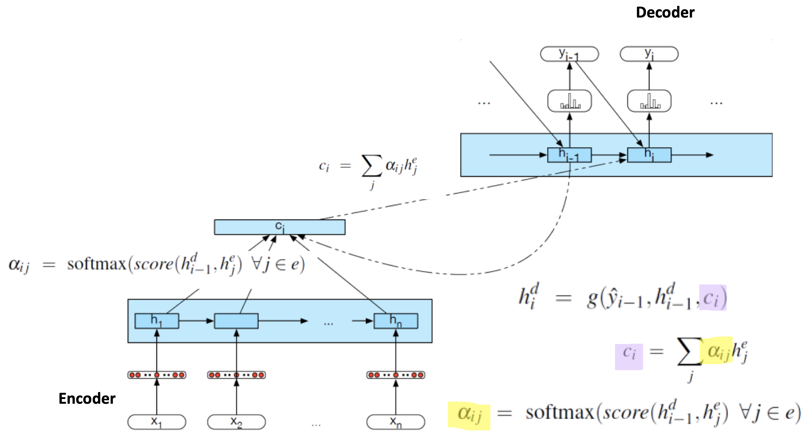 -->
<!-- ``` -->

<!-- ## Explain Y. Goldberg different notation -->

<!-- ```{r, echo=FALSE, out.width="100%", fig.align='center'} -->
<!-- 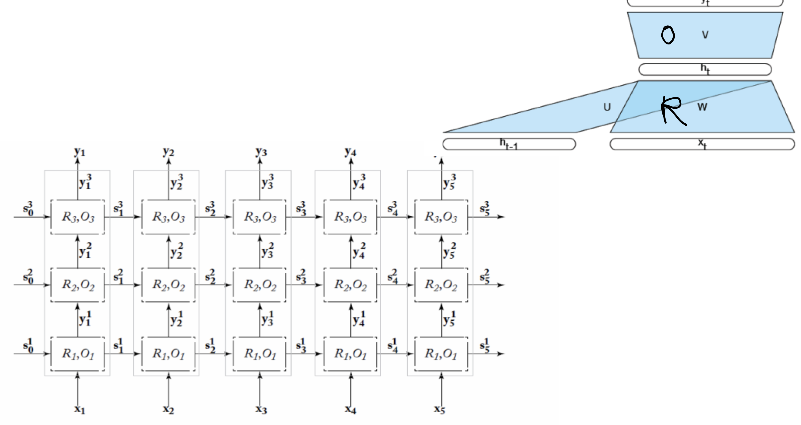 -->
<!-- ``` -->

<!-- ## Intro to Encoder-Decoder and Attention (Goldberg’s notation) -->

<!-- ```{r, echo=FALSE, out.width="100%", fig.align='center'} -->
<!-- include_graphics("img/page 48.png") -->
<!-- ``` -->

# Contextual Word Embeddings <br> & <br> Transformers

## Contextual Word Embeddings
```{r, echo=FALSE, out.width="100%", fig.align='center'}
include_graphics("img/cwe.png")
```


## Transformers

- A transformer adopts an encoder-decoder architecture.

- Transformers were developed to solve the problem of sequence transduction, or neural machine translation. That means any task that transforms an input sequence to an output sequence. 

- More details on the architecture and implementation:

  - https://arxiv.org/abs/1810.04805

  - http://nlp.seas.harvard.edu/2018/04/03/attention.html

  - https://jalammar.github.io/illustrated-transformer/


## The Transformer Encoder-Decoder
```{r, echo=FALSE, out.width="100%", fig.align='center'}
include_graphics("img/trans1.png")
```

## The Transformer Encoder-Decoder
```{r, echo=FALSE, out.width="100%", fig.align='center'}
include_graphics("img/trans2.png")
```

## The Transformer Encoder-Decoder
```{r, echo=FALSE, out.width="100%", fig.align='center'}
include_graphics("img/trans3.png")
```

## Transformers

```{r, echo=FALSE, out.width="100%", fig.align='center'}
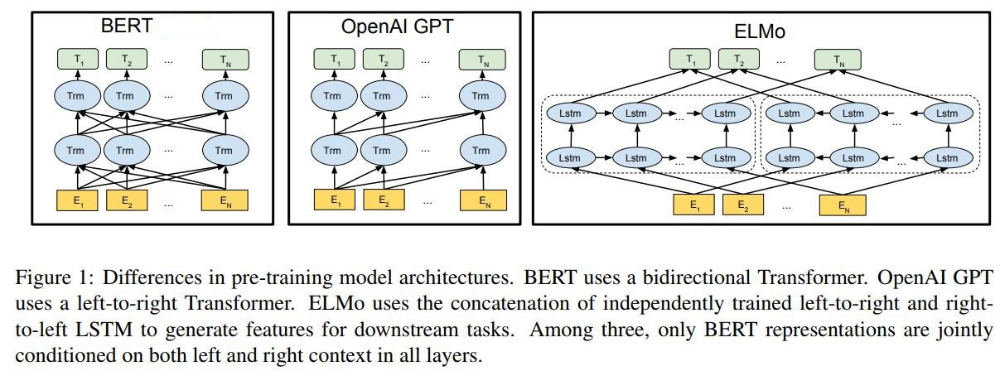
```

## BERT: Bidirectional Encoder Representations from Tranformers
<div align="center">

</div>

## BERT: Bidirectional Encoder Representations from Tranformers
<div align="center">

</div>

## What kinds of things does pretraining learn?
There’s increasing evidence that pretrained models learn a wide variety of things about the statistical properties of language:

*Talk to Transformer:* https://app.inferkit.com/demo

- Utrecht University is located in ...


## Transformers

<div align="center">

</div>

## Transformers

<div align="center">

</div>

## Transformers

<div align="center">

</div>

## What kinds of things does pretraining learn?
There’s increasing evidence that pretrained models learn a wide variety of things about the statistical properties of language:

- **Basic arithmetic:** I was thinking about the sequence that goes 1, 1, 2, 3, 5, 8, 13, 21, ...

## Transformers

<div align="center">

</div>

## What kinds of things does pretraining learn?
There’s increasing evidence that pretrained models learn a wide variety of things about the statistical properties of language:

- **Reasoning:** Garry went into the kitchen to make some tea. Standing next to Garry, Carrie pondered her destiny. Carrie left the ...


## Transformers

<div align="center">

</div>

## Transformers

<div align="center">

</div>

## Transformers

<div align="center">

</div>

## Transformers

- ChatGPT: https://chat.openai.com/

- Write with Transformer: https://transformer.huggingface.co/

- Talk to Transformer: https://app.inferkit.com/demo

- Transformer model for language understanding: https://www.tensorflow.org/text/tutorials/transformer

- Pretrained models: https://huggingface.co/transformers/pretrained_models.html

<!-- ## High-level architecture -->

<!-- - Will only look at the ENCODER(s) part in detail -->

<!-- ```{r, echo=FALSE, out.width="80%", fig.align='center'} -->
<!-- 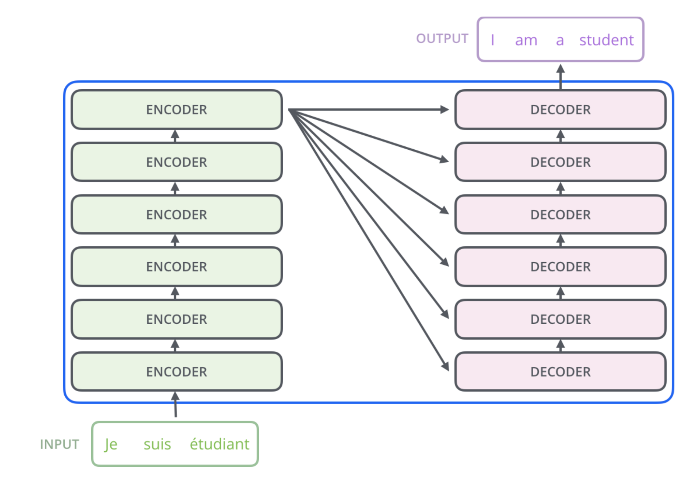 -->
<!-- ``` -->

<!-- ##  -->

<!-- ```{r, echo=FALSE, out.width="100%", fig.align='center'} -->
<!-- include_graphics("img/page 52.png") -->
<!-- ``` -->

<!-- ##  -->

<!-- **Key property of Transformer**: word in each position flows through its own path in the encoder.  -->
<!-- - There are dependencies between these paths in the self-attention layer.  -->
<!-- - Feed-forward layer does not have those dependencies => various paths can be executed in parallel ! -->

<!-- ```{r, echo=FALSE, out.width="80%", fig.align='center'} -->
<!-- 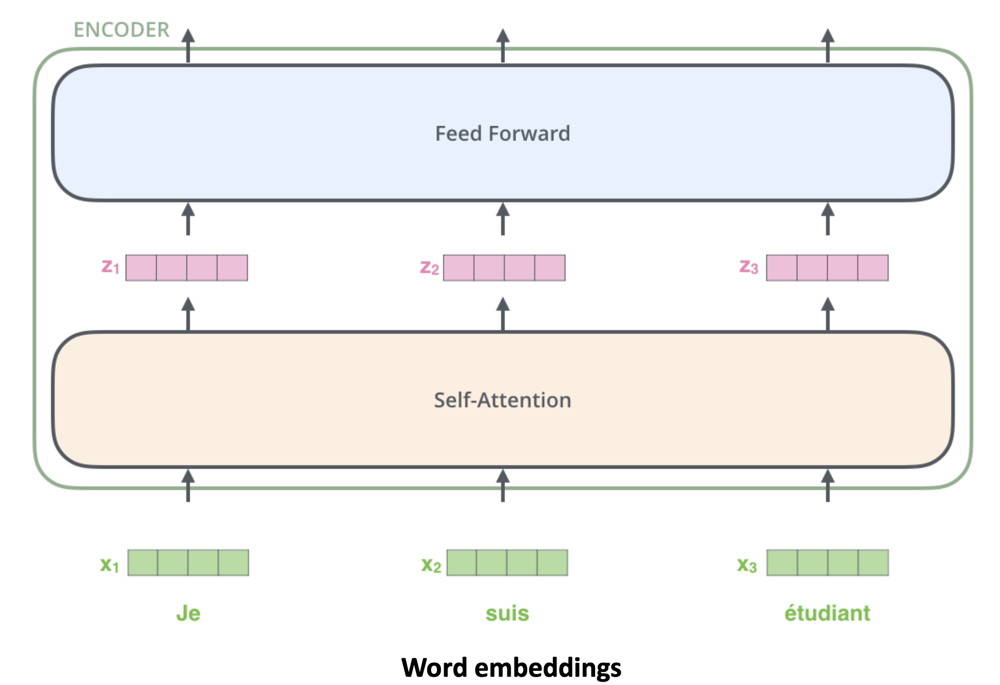 -->
<!-- ``` -->

<!-- ## Visually clearer on two words -->

<!-- - dependencies in self-attention layer.  -->
<!-- - No dependencies in Feed-forward layer  -->

<!-- ```{r, echo=FALSE, out.width="70%", fig.align='center'} -->
<!-- 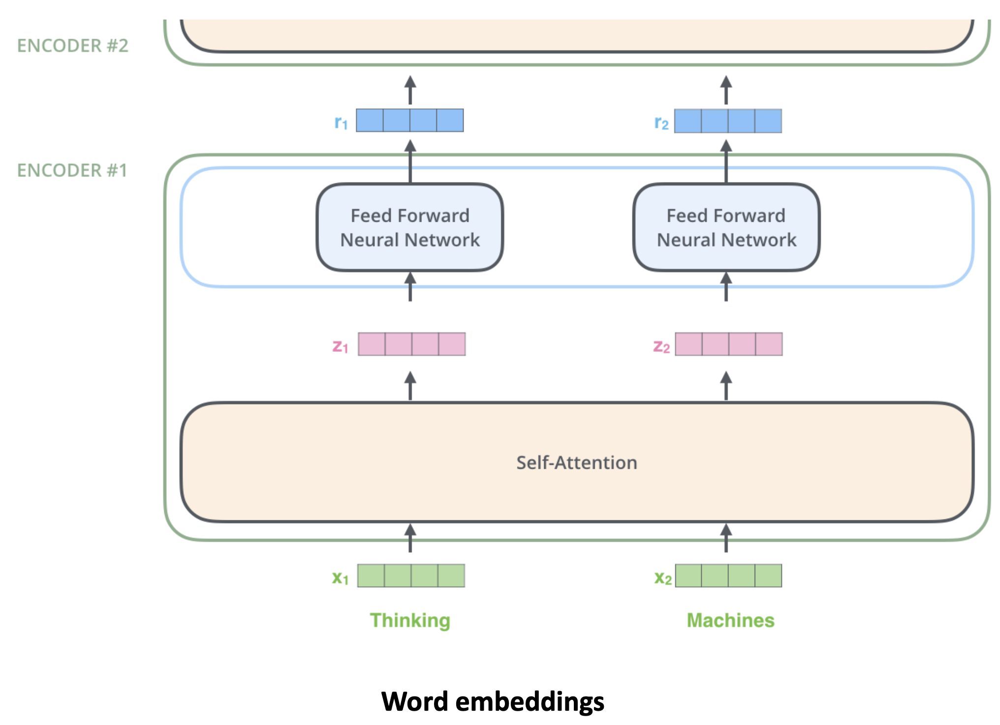 -->
<!-- ``` -->

<!-- ## Self-Attention -->

<!-- While processing **each word** it allows to look at other positions in the input sequence for clues to build a better encoding for **this word**. -->

<!-- **Step1: create three vectors** from each of the encoder’s input vectors:  -->

<!-- <span style="color:purple">Query</span>, a <span style="color:orange">Key</span>, <span style="color:lightblue">Value</span>  (typically smaller dimension).  -->

<!-- by multiplying the embedding by three matrices that we **trained** during the training process. -->

<!-- ```{r, echo=FALSE, out.width="50%", fig.align='center'} -->
<!-- include_graphics("img/page 55.png") -->
<!-- ``` -->

<!-- ## Self-Attention -->

<!-- **Step 2: calculate a score** (like we have seen for regular attention!)  how much focus to place on other parts of the input sentence as we encode a word at a certain position. -->

<!-- Take dot product of the <span style="color:purple">query vector</span> with the <span style="color:orange">key vector</span> of the respective word we’re scoring.  -->


<!-- E.g., Processing the self-attention for word “Thinking” in position $\text{#}1$, the first score would be the dot product of <span style="color:purple">q1</span> and <span style="color:orange">k1</span>. The second score would be the dot product of <span style="color:purple">q1</span> and <span style="color:orange">k2</span>. -->

<!-- ```{r, echo=FALSE, out.width="50%", fig.align='center'} -->
<!-- 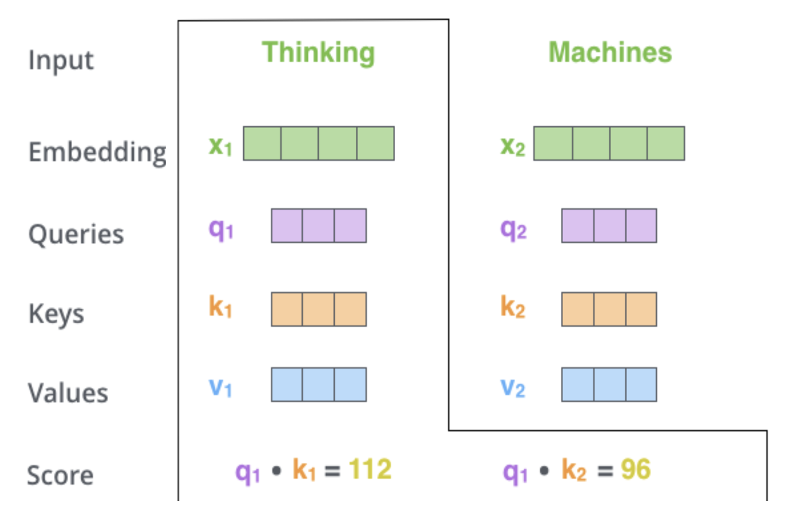 -->
<!-- ``` -->

<!-- ## Self Attention -->

<!-- - **Step 3** divide scores by the square root of the dimension of the <span style="color:orange">key vectors</span>  (more stable gradients).  -->
<!-- - **Step 4** pass result through a softmax operation. (all positive and add up to 1) -->

<!-- **Intuition**: softmax score determines how much each word will be expressed at this position.  -->

<!-- ```{r, echo=FALSE, out.width="60%", fig.align='center'} -->
<!-- 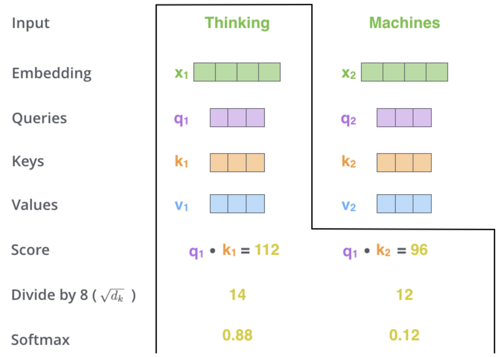 -->
<!-- ``` -->

<!-- ## Self Attention -->

<!-- **Step6** : sum up the weighted <span style="color:blue">value vectors</span>. This produces <span style="color:pink">the output of the self-attention layer</span> at this position -->

<!-- ```{r, echo=FALSE, out.width="70%", fig.align='center'} -->
<!--  -->
<!-- ``` -->

<!-- ## Self Attention -->

<!-- **Step6** : sum up the weighted <span style="color:blue">value vectors</span>. This produces <span style="color:pink">the output of the self-attention layer</span> at this position -->

<!-- More details: -->
<!-- - What we have seen for a word is done **for all words** (using matrices)  -->
<!-- - Need to **encode position** of words -->
<!-- - And improved using a mechanism called “**multi-headed**” attention -->

<!-- (kind of like multiple filters for CNN) -->

<!-- see https://jalammar.github.io/illustrated-transformer/ -->

<!-- ```{r, echo=FALSE, out.width="30%", fig.align='center'} -->
<!-- 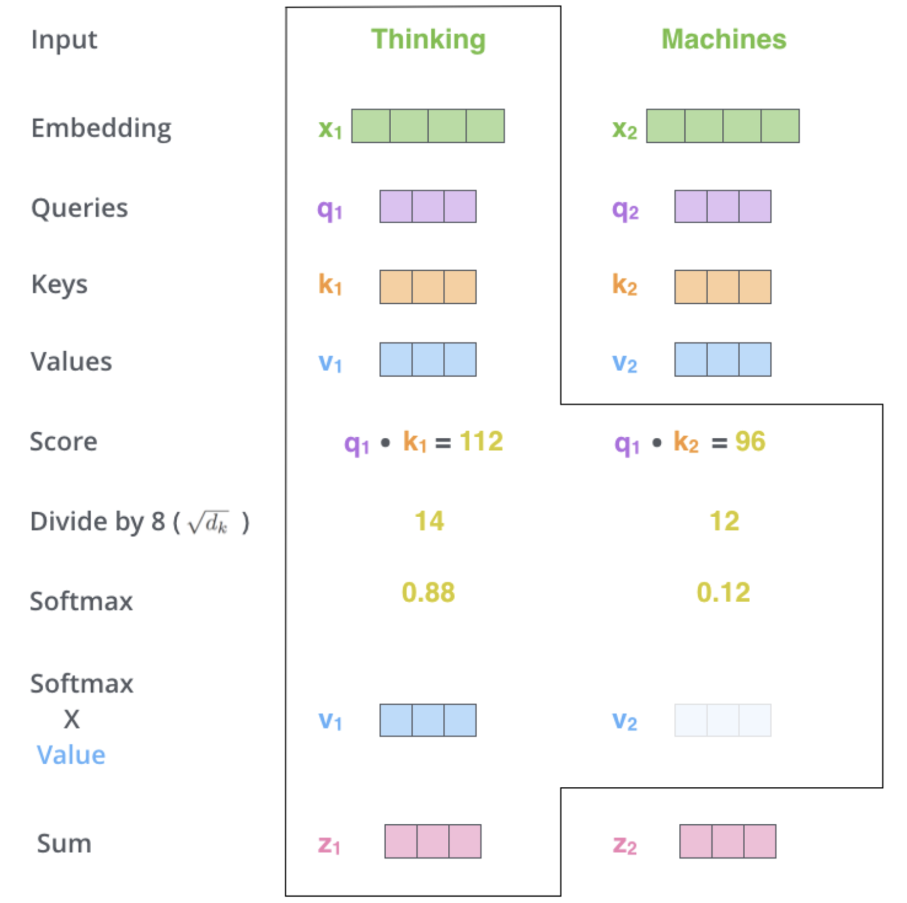 -->
<!-- ``` -->

<!-- ## The Decoder Side -->

<!-- - Relies on most of the concepts on the encoder side -->
<!-- - See animation on https://jalammar.github.io/illustrated-transformer/ -->

<!-- ```{r, echo=FALSE, out.width="70%", fig.align='center'} -->
<!-- 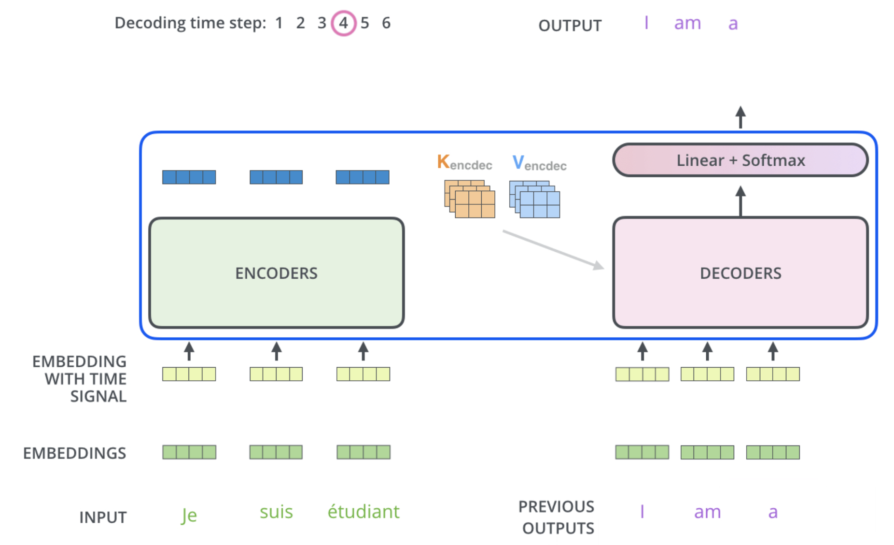 -->
<!-- ``` -->

## ChatGPT (5-min exercise)

- Go to https://chat.openai.com/ and login

- How many hyperparameters has chatgpt-3 model been trained on?

- How many hyperparameters has chatgpt-4 model been trained on?

- What is the next generation NLP?

- Build a neural network model with an LSTM layer of 100 units in Keras. As before, the first layer should be an embedding layer, then the LSTM layer, a Dense layer, and the output Dense layer for the 5 news categories. Compile the model and print its summary.

- Can you make it functional keras?

# Summary

## Summary
- Convolutional Neural Networks

- Transformers
  - “Small” models like BERT have become general tools in a wide range of settings
  - GPT-3 has 175 billion parameters

- These models are still not well-understood

# Practical 7
