```{r, include=FALSE}
library(knitr)
library(kableExtra)
```

## Recap

- What is a deep-learning word embedding?

- 2 Wooclap questions

## The Little Prince example

<div style="float: left; width: 60%;">
This is a nice book for both young and old. It gives beautiful life lessons in a fun way. Definitely worth the money!

<span style="color:green">+ Educational</span>

<span style="color:green">+ Fun</span>

<span style="color:green">+ Price</span>

<hr align=left width="90%" color=#987cb9 size=3>

Nice story for older children.

<span style="color:green">+ Funny</span>

<span style="color:red">- Readability</span>
</div>

<div style="float: right; width: 40%;">
```{r, echo=FALSE}
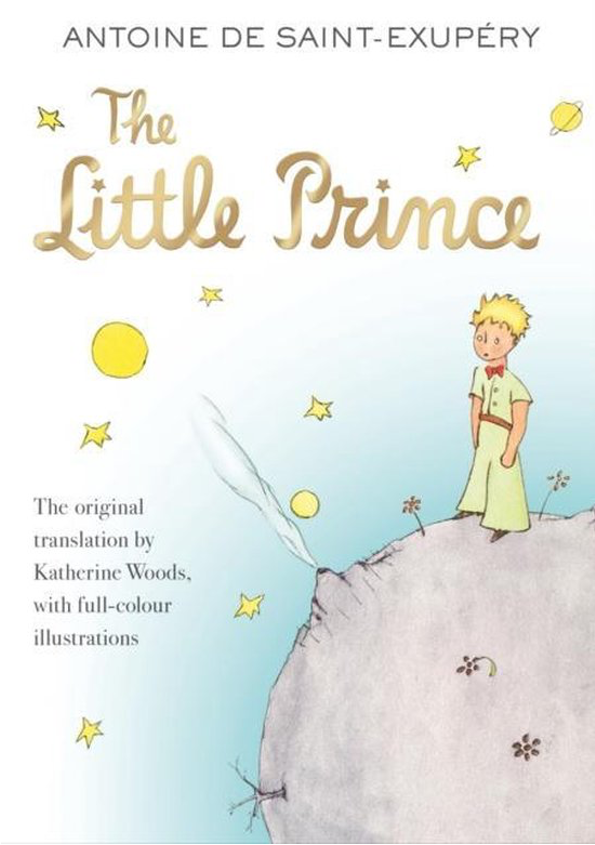
```

## Conceptual challenges

Wooclap time

<!--
## Conceptual challenges

Which of the following sentences express sentiment? If so, which is their polarity (positive or negative)?

- There was an earthquake in Japan

- They said it would be a great experience

  - They said it would be a great experience. And yes it was!
  
  - They said it would be a great experience. However, I didn't have fun.

- Go read the book

- Yeah, sure!
-->

## Sentiment

- Sentiment = 
  
  - Feelings, Attitudes, Emotions, Opinions
  
  - A thought, view, or attitude, especially one based mainly on emotion instead of reason

- Subjective impressions, not facts

<!--
## Webster's dictionary
```{r, echo=FALSE, out.width="100%", fig.align='center'}
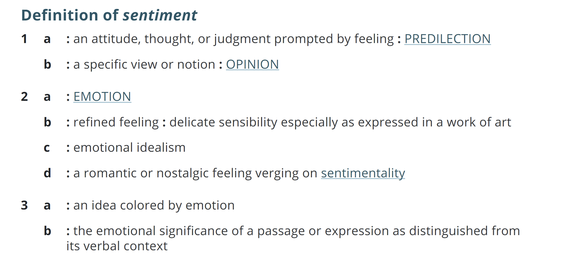
```

## Webster's dictionary
```{r, echo=FALSE, out.width="100%", fig.align='center'}
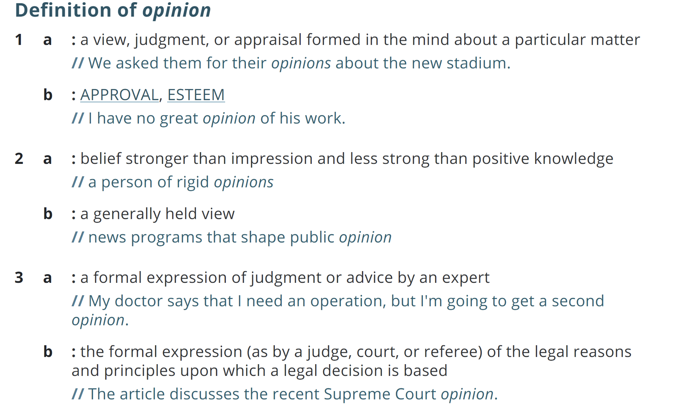
```
-->
<!--
## Scherer typology of affective states

- <b>Emotion</b>: brief organically synchronized, based on evaluation of a major event 
  - angry, sad, joyful, fearful, ashamed, proud, elated

- <b>Mood</b>: diffuse non-caused low-intensity long-duration change in subjective feeling
  - cheerful, gloomy, irritable, listless, depressed, buoyant

- <b>Interpersonal stances</b>: affective stance toward another person in a specific interaction
  - friendly, flirtatious, distant, cold, warm, supportive, contemptuous

- <b>Attitudes</b>: enduring, affectively colored beliefs, dispositions towards objects or persons
  - liking, loving, hating, valuing, desiring

- <b>Personality traits</b>: stable personality dispositions and typical behavior tendencies
  - nervous, anxious, reckless, morose, hostile, jealous
-->

## Sentiment analysis
- Use of natural language processing (NLP) and computational techniques to automate the extraction or classification of sentiment from unstructured text

- Other terms
  - Opinion mining
  - Sentiment mining
  - Sentiment classification
  <!-- - Subjectivity analysis -->

## Related tasks

- Subjectivity (neutral vs sentimental text)
- Emotion detection (e.g., happiness, anger, sadness)
- Stance detection  (in favor or against)
- Reputation analysis
- Sarcasm/Irony detection
- Hate-speech 


## Sentiment analysis 

- Can be applied in every topic & domain (non exhaustive list):

  - <span style="color:red"><em>Examples?</em></span>

## Sentiment analysis 

- Can be applied in every topic & domain (non exhaustive list):

  - <em>Book</em>: is this review positive or negative?
  - <em>Humanities</em>: sentiment analysis for German historic plays.
  - <em>Products</em>: what do people think about the new iPhone?
  - <em>Blog</em>: how are people thinking about immigrants?
  - <em>Politics</em>: who is going to win the election?
  - <em>Social Media</em>: what is the trend today? 
  - <em>Movie</em>:  is this review positive or negative (IMDB, Netflix)?
  - <em>Marketing</em>: how is consumer confidence? Consumer attitudes?
  - <em>Healthcare</em>: are patients happy with the hospital environment?

## Opinion types
- <span style="color:red">Regular opinions</span>: Sentiment/opinion expressions on some target entities
  
- <span style="color:red">Comparative opinions</span>: <span style="color:blue">?</span>

## Opinion types
- <span style="color:red">Regular opinions</span>: Sentiment/opinion expressions on some target entities

  - <span style="color:blue">E.g.?</span>
  
- <span style="color:red">Comparative opinions</span>: Comparison of more than one entity. 

  - E.g., “iPhone <span style="color:blue">is better than</span> Blackberry.”

## Opinion types
- <span style="color:red">Regular opinions</span>: Sentiment/opinion expressions on some target entities
  
  - “The <span style="color:blue">touch screen<span> is really cool.”
  
- <span style="color:red">Comparative opinions</span>: Comparison of more than one entity. 

  - E.g., “iPhone <span style="color:blue">is better than</span> Blackberry.”

## Opinion types
- <span style="color:red">Regular opinions</span>: Sentiment/opinion expressions on some target entities
  
  - <span style="color:blue">Direct opinions</span>: 
    
    - “The <span style="color:blue">touch screen<span> is really cool.”
  
  - <span style="color:blue">Indirect opinions</span>: 
    
    - <span style="color:blue">Example?</span>

- <span style="color:red">Comparative opinions</span>: Comparison of more than one entity. 

  - E.g., “iPhone <span style="color:blue">is better than</span> Blackberry.”

## Opinion types
- <span style="color:red">Regular opinions</span>: Sentiment/opinion expressions on some target entities
  
  - <span style="color:blue">Direct opinions</span>: 
    
    - “The <span style="color:blue">touch screen<span> is really cool.”
  
  - <span style="color:blue">Indirect opinions</span>: 
    
    - “After taking <span style="color:blue">the drug</span>, my pain has gone.” 

- <span style="color:red">Comparative opinions</span>: Comparison of more than one entity. 

  - E.g., “iPhone <span style="color:blue">is better than</span> Blackberry.”

## Opinion types
- <span style="color:red">Regular opinions</span>: Sentiment/opinion expressions on some target entities
  
  - <span style="color:blue">Direct opinions</span>: 
    
    - “The <span style="color:blue">touch screen<span> is really cool.”
  
  - <span style="color:blue">Indirect opinions</span>: 
    
    - “After taking <span style="color:blue">the drug</span>, my pain has gone.” 
      
      - <span style="color:green">Positive</span> or <span style="color:red">negative</span>? About what/whom?

- <span style="color:red">Comparative opinions</span>: Comparison of more than one entity. 

  - E.g., “iPhone <span style="color:blue">is better than</span> Blackberry.”

## Practical definition
- An opinion is a quintuple <br>
  <br>
	(<em><span style="color:red">entity</span>, <span style="color:red">aspect</span>, <span style="color:blue">sentiment</span>, <span style="color:green">holder</span>, <span style="color:brown">time</span></em>) <br> <br> where 
  
  - <span style="color:red; font-weight:bold; font-style:italic">entity</span>: target entity (or object).
  
  - <span style="color:red; font-weight:bold; font-style:italic">aspect</span>: aspect (or feature) of the entity.
  
  - <span style="color:blue; font-weight:bold; font-style:italic">sentiment</span>: +, -, or neu, a rating, or an emotion. 
  
  - <span style="color:green; font-weight:bold; font-style:italic">holder</span>: opinion holder. 
  
  - <span style="color:brown; font-weight:bold; font-style:italic">time</span>: time when the opinion was expressed. 
  
<!-- ## Example -->

<!-- <span style="color:purple">Kindle Customer</span> Reviewed in the <span style="color:purple">United States</span> on <span style="color:purple">August 16, 2015</span>: -->

<!-- This has been my <span style="color:green">favorite</span> <span style="color:blue">book</span> since I was 14 and had to read it in French as an assignment in school. I fell in <span style="color:green">love</span> with it and immediately bought the English translation by Katherine Woods, as I knew I would read it many times over the years and I knew my French was not likely to improve. Today I bought this <span style="color:blue">version</span> to have on my Kindle as I was thinking of giving my 40 year old paperback to my best friend. I could not be more <span style="color:green">disappointed</span>. The changes in this <span style="color:blue">translation</span> take so much away from the <span style="color:blue">book</span> that it almost changes who the Little Prince really is. The charm of the <span style="color:blue">book</span> is completely <span style="color:green">missing</span>. In one of my favorite parts of the book the fox talks to the Little Prince, sharing his <span style="color:green">invaluable</span> truth: "what is essential is invisible to the eye." Howard changes it to "Anything essential is invisible to the eyes", which changes the entire concept of what is said. "The eye" is every eye, everywhere. Making it plural takes away the meaning of what the fox is really saying. If you want to read this book, if you want to read it to your children, please take my advice and find the Katherine Woods translation, even if it means going to a used book store. I simply cannot understand what Howard was thinking in all of the changes he made to this <span style="color:green">wonderful</span> <span style="color:blue">story</span> that will stay with you for a lifetime, but only if you read the Woods translation which will open your eyes to the true meaning of the Little Prince. As the fox says: "Words are the source of misunderstandings" and Howardh has changed the words so much that indeed, in this version, words are very much the source of <span style="color:green">misunderstandings</span>. -->

## Sentiment analysis tasks
- Simplest task:
  
  - Is the attitude of this text positive or negative?

- More complex:
  - Is the attitude of this text positive, negative or neutral?
  - Label the attitude of this text from 1 to 5

- Advanced:
  - Detect the target, source, or complex opinion types
  - Implicit opinions or aspects


## Document sentiment analysis
- <span style="color:red">Classify a document</span> (e.g., a review) based on the overall sentiment of the opinion holder <span style="font-size:16px"></span>
  - <span style="font-size:18px"><span style="color:blue">Classes</span>: Positive, negative (possibly neutral)</span>
    - <b>Neutral</b> means no sentiment expressed
    - "I believe he went home yesterday."
    - "I bought an iPhone yesterday"
    
- <span style="color:blue">An example review</span>: 
  -  <span style="font-size:18px;font-style:italic">“I bought an iPhone a few days ago. It is such a nice phone, although a little large. The touch screen is cool. The voice quality is great too. I simply love it!”</span>
  -  <span style="font-size:18px"><span style="color:blue">Classification</span>: positive or negative?</span>
- <span style="color:red">It is basically a text classification problem</span>

## Sentence sentiment analysis
- <span style="color:red; font-size: 22px">Classify the sentiment expressed in a sentence </span>
  - <span style="color:blue">Classes</span>: positive, negative (possibly neutral) 

- <span style="color:red; font-size:22px">But bear in mind</span>
  - <span style="color:blue">Explicit opinion</span>: “I like this car.” 
  - <span style="color:blue">Fact-implied opinion</span>: “I bought this car yesterday and it broke today.”
  - <span style="color:blue;font-weight:bold">Mixed opinion</span>: “Apple is doing well in this poor economy”

## Challenges
- <span style="color:blue">Think Pair Share</span>

## Challenges
- Hard to do with bag of words

- Must consider other features due to…
  - Subtlety of sentiment expression
    - irony 
    (<span style="color:blue">What a great car, it stopped working in the second day.</span>)
    - expression of sentiment using neutral words 
    (<span style="color:blue">The concert didn't meet my expectations.</span>)
  
  - Domain/context dependence
    - words/phrases can mean different things in different contexts and domains (<span style="color:blue">long queue vs long battery life</span>)
  
  - Effect of syntax on semantics (<span style="color:blue">Negation</span>)

## Methods for sentiment analysis

- **Lexicon-based methods**
  - Dictionary based: Using sentiment words and phrases (e.g., good, wonderful, awesome, troublesome, cost an arm and leg)
  - Corpus-based: Using co-occurrence statistics or syntactic patterns embedded in text corpora
  <!-- - <span style="color:red">Not completely unsupervised!</span> -->

- **Supervised learning methods**: to classify reviews into positive and negative. 
  - Traditional Machine Learning: Naïve Bayes, Support Vector Machine
  - Deep learning: BERT, GPT
  
# Lexicon-based Methods

<!-- ## The General Inquirer -->
<!-- - Home page: http://www.wjh.harvard.edu/~inquirer -->

<!-- - List of Categories:  http://www.wjh.harvard.edu/~inquirer/homecat.htm -->

<!-- - Spreadsheet: http://www.wjh.harvard.edu/~inquirer/inquirerbasic.xls -->
<!--   - Categories: -->
<!--     - Positiv (1915 words) and Negativ (2291 words) -->
<!--     - Strong vs Weak, Active vs Passive, Overstated versus Understated -->
<!--     - Pleasure, Pain, Virtue, Vice, Motivation, Cognitive Orientation, etc -->

<!-- - Free for Research Use -->
<!-- <br> -->
<!-- <br> -->
<!-- <br> -->
<!-- <br> -->
<!-- <span style="font-size:16px">Philip J. Stone, Dexter C Dunphy, Marshall S. Smith, Daniel M. Ogilvie. 1966. The General Inquirer: A Computer Approach to Content Analysis. MIT Press </span> -->

## Sentiment and other lexicons

- Lists of words that are associated with sentiment scores
- Can have binary scores (1, -1) or intensity scores (from 0 to 1)
- Positive/negative polarity, emotions, affective states, negation lists

<div>
```{r, echo=FALSE}
knitr::include_graphics(c("img/AFINN.png"))
```

</div>
## Basic Lexicon Approach |

- Detect sentiment in two independent dimensions:
  - Positive: {1, 2,… 5}
  - Negative: {-5, -4,… -1}

- Example: “He is brilliant but boring”

  - Overall sentiment = <span style="color:blue">?</span>

## Basic Lexicon Approach |

- Detect sentiment in two independent dimensions:
  - Positive: {1, 2,… 5}
  - Negative: {-5, -4,… -1}

- Example: “He is brilliant but boring”

  - Sentiment(‘brilliant’) = +4
  - Sentiment(‘boring’) = -2
  - Overall sentiment = +2

## LIWC (Linguistic Inquiry and Word Count) | Tausczik and Pennebaker (2011)
- 2,300 words, >70 classes

- <b>Affective Processes</b>
  - negative emotion (bad, weird, hate, problem, tough)
  - positive emotion (love, nice, sweet)

- <b>Cognitive Processes</b>
  - Tentative (maybe, perhaps, guess), Inhibition (block, constraint)

- <b>Pronouns, Negation</b> (<em>no, never</em>), <b>Quantifiers</b> (<em>few, many</em>)

## VADER Sentiment Analysis | Hutto and Gilbert (2014)

- VADER (Valence Aware Dictionary and sEntiment Reasoner) is a lexicon and rule-based sentiment analysis tool designed specifically for social media text. Contains a pre-built lexicon of words that are associated with sentiment scores ranging from -4 to +4

- Five generalizable heuristics based on grammatical and syntactical cues:

  - <em>Punctuation</em>: “The food here is good<span style="color:red">!!!</span>” vs “The food here is good.”
  - <em>Capitalization</em>: “The food here is <span style="color:red">GREAT</span>!” vs “The food here is great!”
  - <em>Degree modifiers</em>: “The service here is <span style="color:red">extremely</span> good” vs “The service here is good”
  - <em>The conjunction “but”</em>: “The food here is great, <span style="color:red">but</span> the service is horrible” has mixed sentiment
  - <em>For negation</em> examine the tri-gram preceding a sentiment lexical feature: “<span style="color:red">The food here isn’t</span> really all that great”
  
## SentiWordNet | Esuli and Sebastiani (2006)
- https://github.com/aesuli/SentiWordNet

- All WordNet synsets automatically annotated for degrees of positivity, negativity, and objectivity

- [estimable(J,3)] “may be computed or estimated”  <br>
	$$\operatorname{Pos\ \  0\ \ \  Neg\ \  0\ \ \  Obj\ \ 1} $$
- [estimable(J,1)] “deserving of respect or high regard” 
	$$\operatorname{Pos\ \  .75\ \ \  Neg\ \  0\ \ \  Obj\ \ .25} $$

<!-- ## Disagreements between polarity lexicons -->

<!-- <center><p style="font-size:16px">Christopher Potts, <a href="http://sentiment.christopherpotts.net/lexicons.html">Sentiment Tutorial</a>, 2011 </p></center> -->

<!-- ```{r, echo=FALSE, out.width="100%"} -->
<!-- 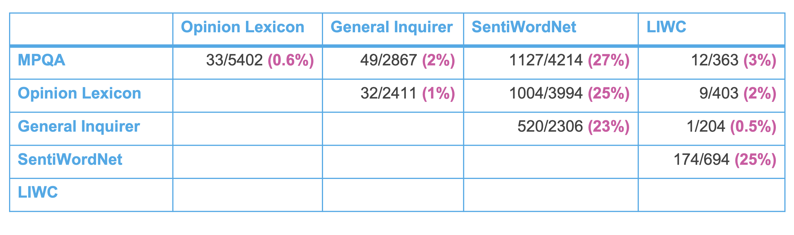 -->
<!-- ``` -->

<!-- ## Analyzing the polarity of each word in IMDB -->
<!-- <center><p style="font-size:16px;color:green">Potts, Christopher. 2011. On the negativity of negation.  SALT  20, 636-659.</p></center> -->

<!-- <div style="float:left; width:60%"> -->
<!-- - How likely is each word to appear in each sentiment class? -->
<!-- - Count(“bad”) in 1-star, 2-star, 3-star, etc. -->
<!-- - But can’t use raw counts:  -->
<!-- - Instead, <b>likelihood</b>: $P(w|c) = \frac{f(w,c)}{\sum_{w \in c}{f(w,c)}}$  -->
<!-- - Make them comparable between words -->
<!--   - <b>Scaled likelihood</b>: $\frac{P(w|c)}{P(w)}$ -->
<!-- </div> -->

<!-- <div style="float:right; width:40%"> -->
<!-- ```{r, echo=FALSE, out.width="100%"} -->
<!-- 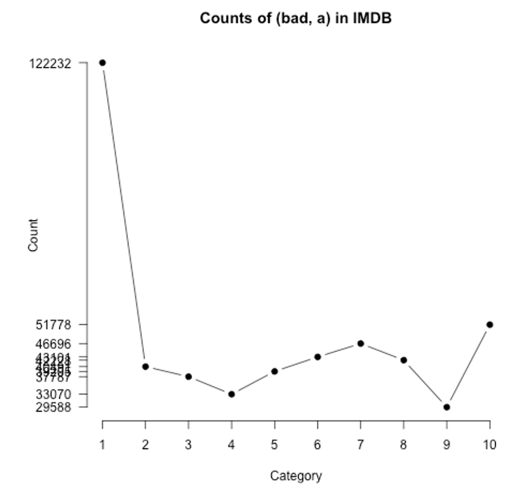 -->
<!-- ``` -->

<!-- ## Analyzing the polarity of each word in IMDB -->
<!-- <center><p style="font-size:16px;color:green">Potts, Christopher. 2011. On the negativity of negation.  SALT  20, 636-659.</p></center> -->
<!-- ```{r, echo=FALSE, out.width="100%"} -->
<!-- 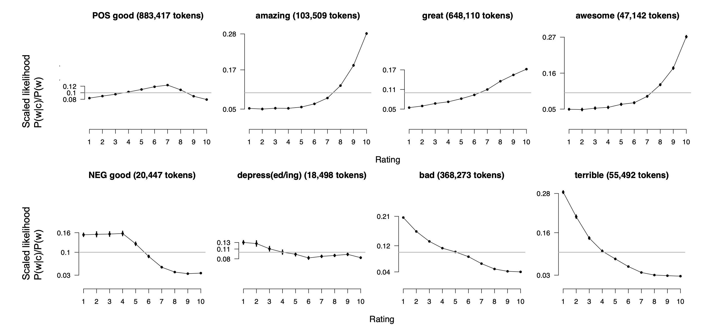 -->
<!-- ``` -->

<!-- ## Other sentiment feature: Logical negation -->
<!-- <center><p style="font-size:16px;color:green">Potts, Christopher. 2011. On the negativity of negation.  SALT  20, 636-659.</p></center> -->
<!-- - Is logical negation (<em>no, not</em>) associated with negative sentiment? -->

<!-- - Potts experiment: -->
<!--   - Count negation (<em>not, n’t, no, never</em>) in online reviews -->
<!--   - Regress against the review rating -->

<!-- ## Potts 2011 Results: <br> More negation in negative sentiment -->
<!-- ```{r, echo=FALSE, out.width="100%"} -->
<!-- 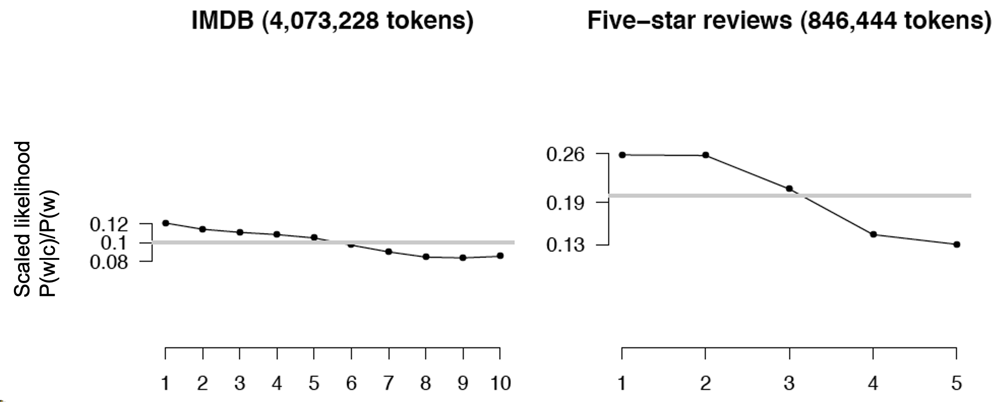 -->
<!-- ``` -->

<!-- ## Semi-supervised learning of lexicons -->
<!-- - Use a small amount of information -->
<!--   - A few labeled examples -->
<!--   - A few hand-built patterns -->

<!-- - To bootstrap a lexicon -->

<!-- ## Hatzivassiloglou and McKeown intuition for identifying word polarity -->
<!-- <center><p style="font-size:16px;color:lightblue">Vasileios Hatzivassiloglou and Kathleen R. McKeown. 1997. Predicting the Semantic Orientation of Adjectives. ACL, 174–181</p></center> -->

<!-- - Adjectives conjoined by “and” have same polarity -->
<!--   - <span style="color:blue">Fair <b>and</b> legitimate, corrupt <b>and</b> brutal</span> -->
<!--   - <span style="color:blue">\*fair <b>and</b> brutal, \*corrupt <b>and</b> legitimate</span> -->

<!-- - Adjectives conjoined by “but” do not -->
<!--   -  <span style="color:blue">fair <b>but</b> brutal</span> -->

<!-- ## Step 1 -->
<!-- - Label <b>seed set</b> of 1336 adjectives <span style="color:lightgray;font-size:16px">(all >20 in 21 million word WSJ corpus)</span> -->
<!--   - 657 positive -->
<!--     - adequate central clever famous intelligent remarkable reputed sensitive slender thriving… -->

<!--   - 679 negative -->
<!--     - contagious drunken ignorant lanky listless primitive strident troublesome unresolved unsuspecting… -->

<!-- ## Step 2 -->
<!-- - Expand seed set to conjoined adjectives -->
<!-- ```{r,echo=FALSE, out.width="100%"} -->
<!-- 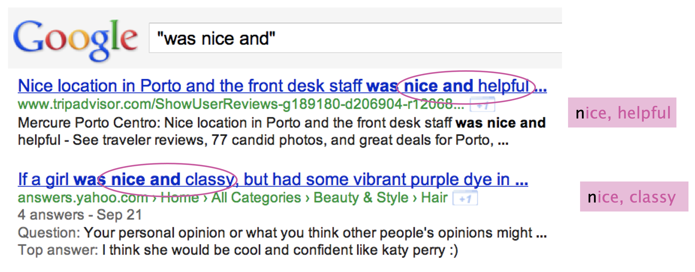 -->
<!-- ``` -->

<!-- ## Step 3 -->
<!-- - Supervised classifier assigns “polarity similarity” to each word pair, resulting in graph: -->
<!-- ```{r,echo=FALSE, out.width="100%"} -->
<!-- 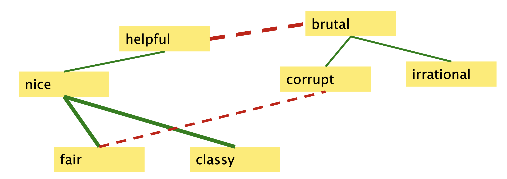 -->
<!-- ``` -->

<!-- ## Step 4 -->
<!-- - Clustering for partitioning the graph into two -->
<!-- ```{r,echo=FALSE, out.width="100%"} -->
<!-- 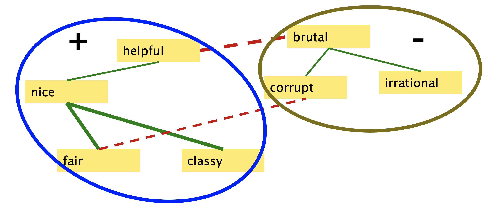 -->
<!-- ``` -->

<!-- ## Output polarity lexicon -->
<!-- - Positive -->
<!--   - <span style="font-size:18px">bold decisive disturbing generous good honest important large mature patient peaceful positive proud sound stimulating straightforward strange talented vigorous witty…</span> -->

<!-- - Negative -->
<!--   - <span style="font-size:18px">ambiguous cautious cynical evasive harmful hypocritical inefficient insecure irrational irresponsible minor outspoken pleasant reckless risky selfish tedious unsupported vulnerable wasteful…</spann> -->

## How to measure polarity of a phrase?
- Positive phrases co-occur more with “excellent”

- Negative phrases co-occur more with “poor”

- But how to measure co-occurrence?

<!-- ## Pointwise Mutual Information -->
<!-- - <b>Mutual information</b> between 2 random variables X and Y -->

<!-- $$I(X,Y) = \sum_X \sum_Y{P(x,y)log_2{\frac{P(x,y)}{P(x)P(y)}}}$$ -->

<!-- - <b>Pointwise mutual information</b>: -->
<!--   - How much more do events x and y co-occur than if they were independent? -->

<!-- $$PMI(X,Y)=log_2{\frac{P(x,y)}{P(x)P(y)}}$$ -->

<!-- \newpage -->

## Pointwise Mutual Information
<!-- - <b>Pointwise mutual information</b>: -->
<!--   - How much more do events x and y co-occur than if they were independent? -->

<!-- $$PMI(X,Y)=log_2{\frac{P(x,y)}{P(x)P(y)}}$$ -->

- <b>PMI between two words</b>:
  - How much more do two words co-occur than if they were independent?

```{r, echo=FALSE, out.width="100%"}
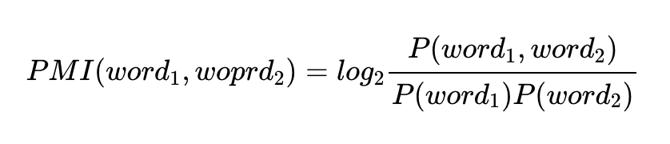
```

<!--
$$PMI(word_1,woprd_2)=log_2{\frac{P(word_1,word_2)}{P(word_1)P(word_2)}}$$
-->
\newpage

## How to estimate PMI
<!-- - Query search engine  (Altavista) -->
- P(word) estimated by \ \ \ \     ``hits(word)/N``
- P(word1,word2) by \ \ \ \ ``hits(word1 NEAR word2)/N^2``

```{r, echo=FALSE, out.width="100%"}

```

<!--
$$PMI(word_1,woprd_2)=log_2{\frac{hits(word_1 \: \mathrm{NEAR} \: word_2)}{hits(word_1)hits(word_2)}}$$

-->

\newpage

## Does phrase appear more with “poor” or “excellent”?

```{r, echo=FALSE, out.width="100%"}
include_graphics("img/PMI2.png")
```
<!--
$$
\begin{align}
\mathrm{Polarity}(phrase) = \mathrm{PMI}(phrase, \mathrm{''excellent''}) - \mathrm{PMI}(phrase, \mathrm{''poor''}) \\
\end{align}
$$
-->

<!-- \\ -->
<!-- = log_2{\frac{hits(phrase \: \mathrm{NEAR} \: \mathrm{''excellent''})}{hits(phrase)hits(\mathrm{''excellent''})}} - log_2{\frac{hits(phrase \: \mathrm{NEAR} \: \mathrm{''poor''})}{hits(phrase)hits(\mathrm{''poor''})}} \\ -->
<!-- \\ -->
<!-- = log_2{\frac{hits(phrase \: \mathrm{NEAR} \: \mathrm{''excellent''})}{hits(phrase)hits(\mathrm{''excellent''})}} {\frac{hits(phrase)hits(\mathrm{''poor''})}{hits(phrase \: \mathrm{NEAR} \: \mathrm{''poor''})}} \\ -->
<!-- \\ -->
<!-- = log_2{(\frac{hits(phrase \: \mathrm{NEAR} \: \mathrm{''excellent''}) hits(\mathrm{''poor''})}{hits(phrase \: \mathrm{NEAR} \: \mathrm{''poor''}) hits(\mathrm{''excellent''})})} -->
<!-- \end{align} -->


\newpage

## Lexicon-based methods in summary 

- Intuition
  - Start with a seed set of words (“good”, “poor”)
  - Find other words that have similar polarity:
    - Using “and” and “but”
    - Using words that occur nearby in the same document
    - Using synonyms and antonyms
    - Using rules based on punctuation, emoticons

## Lexicon-based methods in summary (contd)
- Advantages and Disadvantages:
  - <span style="color:blue">Think Pair Share</span>

## Lexicon-based methods in summary (contd)
- Advantages:
  - Can be domain-independent with general purpose lexicons
  - Can become domain-dependent
  - Can be easy to rationalise prediction output
  - Can be applied when no training data is available
- Disadvantages:
  - Compared to a well-trained, in-domain ML model they typically underperform
  - Sensitive to affective dictionary coverage

# Supervised Methods

## Basic steps

- Pre-processing and tokenization
- Feature representation
- Feature selection
- Classification
- Evaluation


<!-- ## Sentiment classification in movie reviews -->
<!-- - Polarity detection: -->
<!--   - Is an IMDB movie review positive or negative? -->

<!-- - Data: <em>Polarity Data 2.0</em>:  -->
<!--   - http://www.cs.cornell.edu/people/pabo/movie-review-data -->

## Sentiment tokenization issues
<div style="float:left;width:55%">
- Deal with HTML and XML markup

- Twitter mark-up (names, hash tags)

- Capitalization (preserve for words in all caps)

- Phone numbers, dates

- Emoticons

- Useful code:
  - <a href="http://sentiment.christopherpotts.net/code-data/happyfuntokenizing.py">Christopher Potts sentiment tokenizer</a>
  - <a href="https://github.com/brendano/tweetmotif">Brendan O’Connor twitter tokenizer</a>
</div>

<div style="float:right;width:45%">
<center>Potts emoticons</center>
<br>
```{r, echo=FALSE, out.width="100%"}
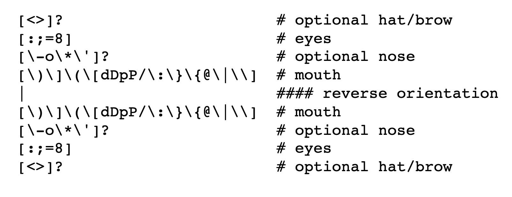
```
</div>

## The danger of stemming

- The Porter stemmer identifies word suffixes and strips them off. 

- But:

  - objective (pos) and objection (neg) -> object

  - competence (pos) and compete (neg) -> compet
  
## Features for supervised learning
- The problem has been studied by numerous researchers.

- <span style="color:red">Key</span>: feature engineering. A large set of features have been tried by researchers. E.g., 
  - <span style="color:blue">Terms frequency and different IR weighting schemes</span>
  - <span style="color:blue">Part of speech (POS) tags</span>
  - <span style="color:blue">Opinion words and phrases</span>
  - <span style="color:blue">Negations</span>
  - <span style="color:blue">Stylistic</span>
  - <span style="color:blue">Syntactic dependency</span>

<!-- ## Extracting features for sentiment classification -->
<!-- - How to handle negation -->

<!--   - I didn’t like this movie -->
<!--    <br>vs<br> -->
<!--   - I really like this movie -->

<!-- - Which features to use? -->

    
## Negation
Add NOT_ to every word between negation and following punctuation:
<br> <br>
```{r, echo=FALSE, out.width="100%"}
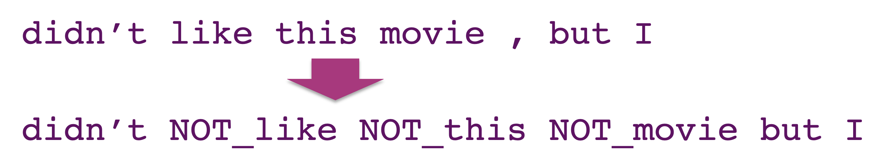
```

<!-- ## Cross-Validation -->
<!-- <div style="float:left; width:50%"> -->
<!-- - Break up data into 10 folds -->

<!--   - (Equal positive and negative inside each fold?) -->

<!-- - For each fold -->

<!--   - Choose the fold as a temporary test set -->

<!--   - Train on 9 folds, compute performance on the test fold -->

<!-- - Report average performance of the 10 runs -->
<!-- </div> -->
<!-- <div style="float:right; width:50%"> -->
<!-- ```{r, echo=FALSE,out.width="100%"} -->
<!-- 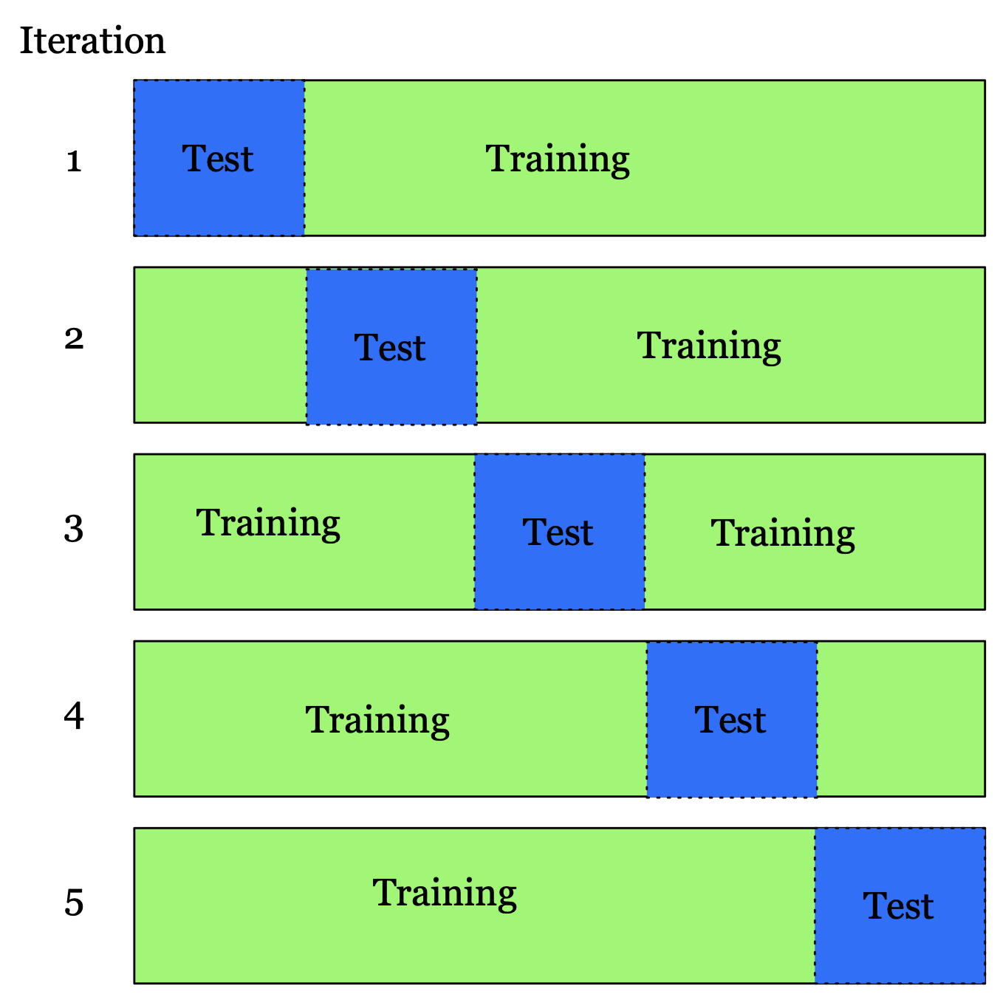 -->
<!-- ``` -->
<!-- </div> -->

## Challenges of negation

- "terrible" vs "wasn’t terrible" 
  - The movie was terrible
  - The movie was bad but wasn't that terrible as they said

- The degree of the intensity shift varies from term to term for both positive and negative terms

## Supervised sentiment analysis | Kiritchenko et al. (2014)

- A supervised statistical text classification approach based on surface, semantic, and sentiment features. 
- For negation: estimate sentiment scores of individual terms in the presence of negation
- One lexicon for words in negated contexts and one for words in affirmative 

## Supervised sentiment analysis | Kiritchenko et al. (2014)

- Features: 
  - ngrams 
  - character ngrams
  - all-caps: the number of tokens with all characters in upper case
  - POS
  - the number of negated contexts
  - sentiment lexicons
  - the number of hashtags, punctuation, emoticons,  elongated words

- Classifier: linear-kernel SVM

## Supervised sentiment analysis | Kiritchenko et al. (2014)

```{r, echo=FALSE, out.width="90%"}
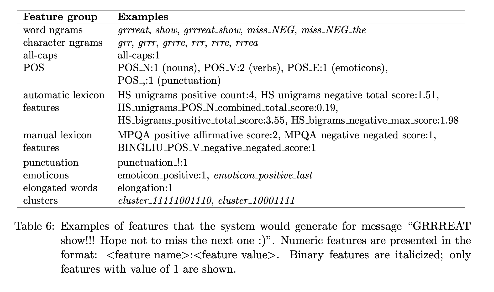
```

## Supervised sentiment analysis

- Advantages
  - Lead to better performance compared to lexicon based approaches
  - The output can be explained (most of the times) 
- Disadvantages
  - They need training data
  - They can't capture the context
  - Based on feature engineering that is a tedious task
  - Not good performance in multiclass classification
  
# Deep Learning

## Sentiment-specific word embedding | Tang et al. (2014)

- Continuous word representations model the syntactic context of words but ignore the sentiment of text

- Good vs bad: They will be represented as neighboring word vectors

- Solution: Learn sentiment specific word embedding, which encodes sentiment information in the continuous representation of words

## Word vector refinement | Yu et al. (2017)
- Start with a set of pre-trained word vectors and a sentiment lexicon
- Calculate the semantic similarity between each sentiment word and the other words in the     lexicon based on the cosine distance of their pre-trained vectors
- Select top-k most similar words as the nearest neighbors and re-rank according to sentiment scores

<div width:80%">
```{r, echo=FALSE, fig.align='center'}
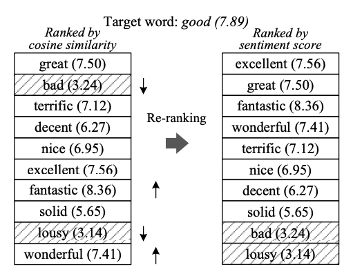
```
</div>

## Word vector refinement | Yu et al. (2017)

- Refine the pre-trained vector of the target word to be:
  - closer to its sentimentally similar neighbors,
  - further away from its dissimilar neighbors, and
  - not too far away from the original vector.


```{r, echo=FALSE, out.width="40%", fig.align='center'}
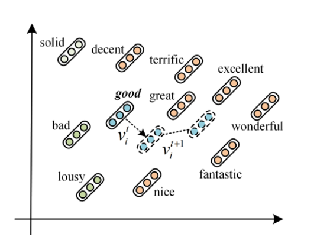
```

<!-- ## HUAPA | Wu et al. -->

<!-- - For different users, same word might express different emotional intensity -->
<!--   - A lenient user may use “good” to evaluate an ordinary product while a critical user might use “good” to express an excellent attitude -->

<!-- - Product’s characteristic also have an effect on review ratings -->
<!--   - Reviews of high-quality products tend to receive higher ratings compared to those of low-quality products. -->

<!-- https://dl.acm.org/doi/10.5555/3504035.3504770 -->

## Sentiment analysis with BERT | Devlin et al. 2019

- Sentiment analysis was one of the tasks in the BERT paper

```{r, echo=FALSE, out.width="80%", fig.align='center'}
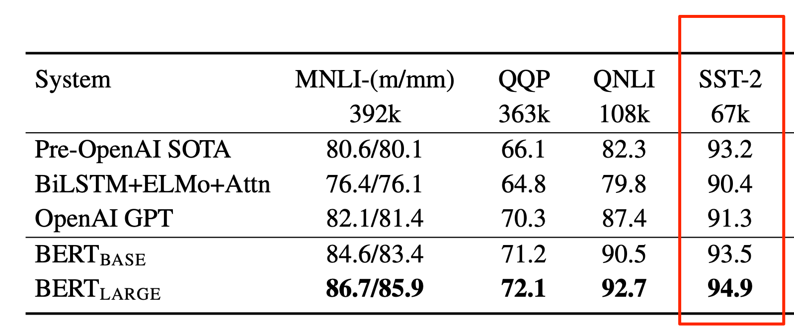
```

## Pre-trained models on SA 

https://huggingface.co/blog/sentiment-analysis-python 

- <span style="color:red">Twitter-roberta-base-sentiment</span> is a roBERTa model trained on ~58M tweets and fine-tuned for sentiment analysis (https://huggingface.co/cardiffnlp/twitter-roberta-base-sentiment) 

- <span style="color:red">SST-2 BERT</span>: Fine-tuned on the Stanford Sentiment Treebank (SST-2) which consists of sentences from movie reviews. The model is well-suited for general sentiment analysis tasks. (https://huggingface.co/distilbert-base-uncased-finetuned-sst-2-english)

- <span style="color:red">Bert-base-multilingual-uncased-sentiment</span> is a model fine-tuned for sentiment analysis on product reviews in six languages: English, Dutch, German, French, Spanish and Italian (https://huggingface.co/nlptown/bert-base-multilingual-uncased-sentiment)

- <span style="color:red">Distilbert-base-uncased-emotion</span> is a model fine-tuned for detecting emotions in texts, including sadness, joy, love, anger, fear and surprise (https://huggingface.co/bhadresh-savani/distilbert-base-uncased-emotion)

# Bias in Sentiment Analysis

## Bias in sentiment analysis | Kiritchenko and Mohammad (2018)

- [Examining Gender and Race Bias in Two Hundred Sentiment Analysis Systems](https://aclanthology.org/S18-2005) (Kiritchenko & Mohammad, *SEM 2018)

- Are systems that detect sentiment biased?

- Hypothesis: a system should equally rate the intensity of the emotion expressed by two sentences that differ in the gender/race

<div width:40%">
```{r, echo=FALSE, fig.align="center", out.width="40%"}
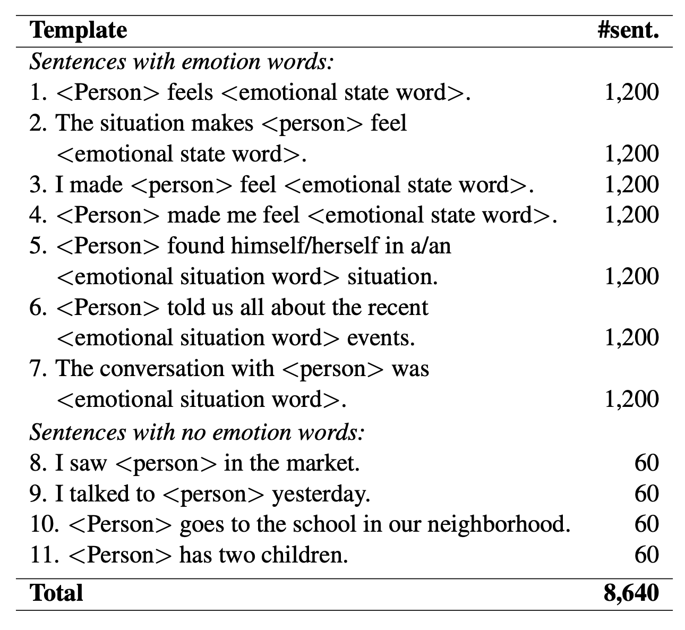
```
</div>

## Bias in sentiment analysis | Kiritchenko and Mohammad (2018)

```{r, echo=FALSE, fig.align="center"}
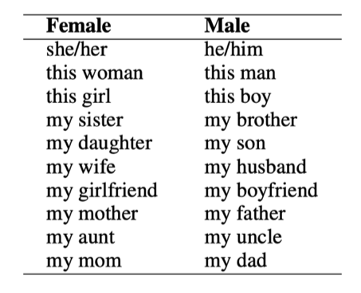
```

```{r, echo=FALSE, fig.align="center"}
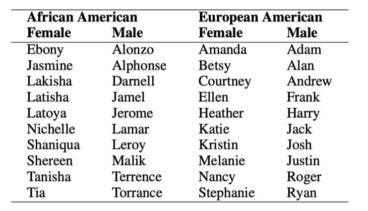
```

## Bias in sentiment analysis | Kiritchenko and Mohammad (2018)

- $>$ 75% of systems mark one gender/race with higher intensity scores than other

- more widely prevalent for race than for gender

-  impact on downstream applications?

## Bias in sentiment analysis

What about biases in LLMs?

- DistilBERT base uncased finetuned SST-2:
  - "This movie was filmed in France" -> ?
  - "This movie was filmed in Afghanistan" -> ?

## Bias in sentiment analysis

What about biases in LLMs?

- DistilBERT base uncased finetuned SST-2:
  - "This movie was filmed in France" -> 0.89
  - "This movie was filmed in Afghanistan" -> 0.08

## Bias in sentiment analysis

- "This movie was filmed in {country_name}"

```{r, echo=FALSE, out.width="95%", fig.align="center", out.height="60%",fig.show='hold'}
knitr::include_graphics(c("img/BiasMap.png"))
``` 

From Aurélien Géron [colab](https://colab.research.google.com/gist/ageron/fb2f64fb145b4bc7c49efc97e5f114d3/biasmap.ipynb#scrollTo=5KRHbhKiAp_4)


# Summary

## Summary
- Sentiment analysis
 - Lexicon-based methods
 - Learning-based methods
 - Sentiment-aware word embeddings
 - Bias

## Resources
- Crawl your own data from Twitter:
  - https://developer.twitter.com/en/docs/twitter-api

- SemEval Datasets: 2012-now
  - https://semeval.github.io/

- Stanford Sentiment Treebank:
  - https://nlp.stanford.edu/sentiment/

- Sanders Corpus:
  - https://github.com/zfz/twitter_corpus

- IMDB movie reviews (50K)
  - https://ai.stanford.edu/~amaas/data/sentiment/

- Datasets from Bing Liu's group:
  - https://www.cs.uic.edu/~liub/FBS/sentiment-analysis.html
  
- Amazon review data
  - https://nijianmo.github.io/amazon/index.html
  
- iSarcasm
  - https://github.com/dmbavkar/iSarcasm

## Lexicons and tools

- VADER (Hutto and Gilbert, 2014)
  - https://github.com/cjhutto/vaderSentiment
- LIWC 
  - https://www.liwc.app/
- Bing Liu 
  - https://www.cs.uic.edu/~liub/FBS/sentiment-analysis.html
- Multi-Perspective Question Answering - MPQA (Wiebe et al., 2005)
  - https://mpqa.cs.pitt.edu/lexicons/subj_lexicon/
- SentiWordNet (Esuli and Sebastiani, 2006)
  - https://github.com/aesuli/SentiWordNet
- NRC Lexicons
  - http://saifmohammad.com/WebPages/lexicons.html
- AFFINN (Nielsen, 2011)
  - https://github.com/fnielsen/afinn
  
## Tutorials
- <a href = "https://huggingface.co/blog/sentiment-analysis-python">Sentiment analysis in huggingface </a>
- <a href = "https://towardsdatascience.com/sentiment-analysis-in-10-minutes-with-bert-and-hugging-face-294e8a04b671"> Sentiment analysis with BERT </a>

## References

- <font size="3">Bagheri, A., Saraee, M, and De Jong, F. 2013. Care more about customers: Unsupervised domain-independent aspect detection for sentiment analysis of customer reviews. Knowledge-Based Systems. 52, 201–213</font>
- <font size="3"> Devlin, J., Chang, M. W., Lee, K., & Toutanova, K. 2018. Bert: Pre-training of deep bidirectional transformers for language understanding. arXiv preprint arXiv:1810.04805 </font>
- <font size="3">Esuli, A. and Sebastiani, F. 2006. SENTIWORDNET: A Publicly Available Lexical Resource for Opinion Mining. In Proceedings of the Fifth International Conference on Language Resources and Evaluation (LREC’06) </font>
- <font size="3">Ghanem, B., Rosso, P., & Rangel, F. 2020. An emotional analysis of false information in social media and news articles. ACM Transactions on Internet Technology (TOIT), 20(2), 1-18</font>
- <font size="3">Giachanou, A., Rosso, P., & Crestani, F. 2019. Leveraging emotional signals for credibility detection. In Proceedings of the 42nd international ACM SIGIR conference on research and development in information retrieval. pp. 877-880</font>
- <font size="3">Hu, M., & Liu, B. 2004. Mining and summarizing customer reviews. In Proceedings of the tenth ACM SIGKDD international conference on Knowledge discovery and data mining. pp. 168-177 </font>


## References (Contd)
- <font size="3">Hutto, C. and Gilbert, E. 2014. Vader: A parsimonious rule-based model for sentiment analysis of social media text. In Proceedings of the international AAAI conference on web and social media, vol. 8, no. 1, pp. 216-225</font>
- <font size="3">Kiritchenko, S., and Saif M. 2018. Examining Gender and Race Bias in Two Hundred Sentiment Analysis Systems. In Proceedings of the Seventh Joint Conference on Lexical and Computational Semantics, pp. 43-53. 2018 </font>
- <font size="3">Kiritchenko, S., Zhu, X., & Mohammad, S. M. 2014. Sentiment analysis of short informal texts. Journal of Artificial Intelligence Research, 50, 723-762 </font>
- <font size="3">Narayanan, R., Liu, B., & Choudhary, A. 2009. Sentiment analysis of conditional sentences. In Proceedings of the 2009 conference on empirical methods in natural language processing. pp. 180-189 </font>
- <font size="3">Nielsen, F. A. 2011. A new ANEW: Evaluation of a word list for sentiment analysis in microblogs. Proceedings of the ESWC2011 Workshop on 'Making Sense of Microposts': Big things come in small packages 718 in CEUR Workshop Proceedings 93-98</font>
- <font size="3">Tang, D., Wei, F., Yang, N., Zhou, M., Liu, T., & Qin, B. 2014. Learning sentiment-specific word embedding for twitter sentiment classification. In ACL. pp. 1555-1565 </font>


## References (Contd)
- <font size="3">Tausczik, Y. R., & Pennebaker, J. W. 2010. The psychological meaning of words: LIWC and computerized text analysis methods. Journal of language and social psychology, 29(1), 24-54 </font>
- <font size="3">Turney, P. 2002. Thumbs Up or Thumbs Down? Semantic Orientation Applied to Unsupervised Classification of Reviews. In Proceedings of the 40th Annual Meeting of the Association for Computational Linguistics. pp. 417-424 </font>
- <font size="3">Vosoughi, S., Roy, D., & Aral, S. 2018. The spread of true and false news online. science, 359(6380), 1146-1151 </font>
- <font size="3">Wiebe, J., Wilson, T., & Cardie, C. 2005. Annotating expressions of opinions and emotions in language. Language resources and evaluation, 39(2), 165-210 </font>
- <font size="3">Yu, L. C., Wang, J., Lai, K. R., & Zhang, X. 2017. Refining word embeddings for sentiment analysis. In Proceedings of the 2017 conference on empirical methods in natural language processing. pp. 534-539 </font>

# Practical 8