```{r, include=FALSE}
library(knitr)
library(kableExtra)
```

## Lecture’s plan

1. How to do feature selection for text data?

2. Is PCA a FS method for text?

3. Other methods?

## An illustration of VS model 

- All documents are projected into this concept space

```{r, echo=FALSE, out.width="70%", fig.align='center'}
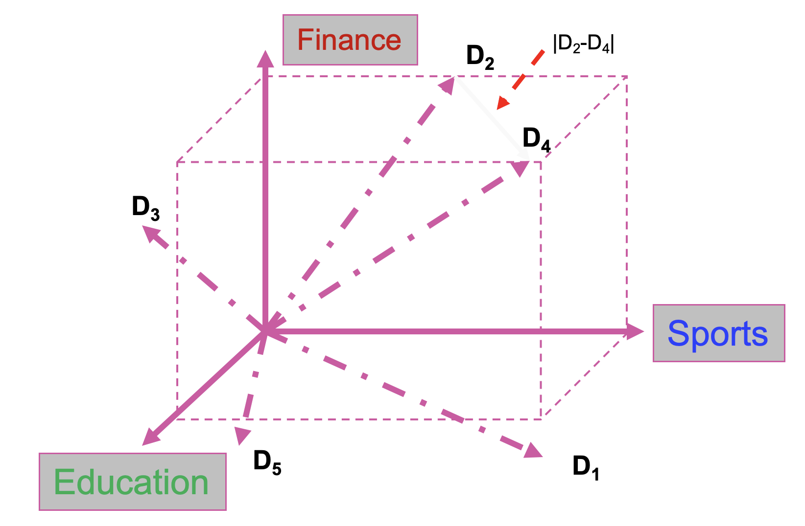
```

## Feature selection:  What

<center><span style="color:red">You have some data, and you want to use it to build a classifier, so that you can predict something
 (e.g. email spam classification)
</span></center>

## Feature selection:  What

<center><span style="color:blue">You have some data, and you want to use it to build a classifier, so that you can predict something (e.g. email spam classification)
</span></center>

<br>

<center><span style="color:red">The data has 10,000 fields (features)</span></center>

## Feature selection:  What

<center><span style="color:red">You have some data, and you want to use it to build a classifier, so that you can predict something (e.g. email spam classification)
</span></center>

<br>

<center><span style="color:blue">The data has 10,000 fields (features)</span></center>

<br>

<center><span style="color:brown">you need to cut it down to 1,000 fields before you try machine learning. Which 1,000? </span></center>

## Feature selection:  What

<center><span style="color:blue">You have some data, and you want to use it to build a classifier, so that you can predict something (e.g. email spam classification)
</span></center>

<br>

<center><span style="color:red">The data has 10,000 fields (features)</span></center>

<br>

<center><span style="color:blue">you need to cut it down to 1,000 fields before you try machine learning. Which 1,000? </span></center>

<br>

<center><span style="color:red">The process of choosing the 1,000 fields to use is called Feature Selection</span></center>

<!-- ## Feature Selection:  Why? -->

<!-- ```{r, echo=FALSE, out.width="80%", fig.align='center'} -->
<!-- 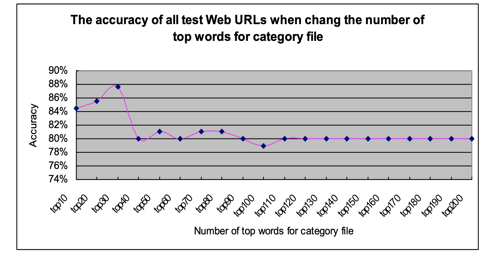 -->
<!-- ``` -->

## Feature selection:  Why

```{r, echo=FALSE, out.width="80%", fig.align='center'}
include_graphics("img/page 9.png")
```

<p style="float:right">From http://elpub.scix.net/data/works/att/02-28.content.pdf</p>

## Why accuracy reduces

- Suppose the best feature set has 20 features. 
- If you *add* another 5 features, typically the accuracy of machine learning may reduce. 
- But you still have the original 20 features! 
- Why does this happen?

## Noise / Explosion

- The additional features typically add *noise*. Machine learning will pick up on spurious correlations, that might be true in the training set, but not in the test set.

- For some ML methods, more features means more *parameters* to learn (more NN weights, more decision tree nodes, etc…) 

- The increased space of possibilities is more difficult to search.


## Feature selection

Why we need FS:

    1. To improve performance (in terms of speed, predictive power, simplicity of the model).

    2. To visualize the data for model selection.

    3. To reduce dimensionality and remove noise.

*Feature Selection* is a process that chooses an optimal subset of features according to a certain criterion.

<!-- ## Feature selection -->

<!-- Reasons for performing FS may include: -->
<!--     - removing irrelevant data. -->
<!--     - increasing predictive accuracy of learned models. -->
<!--     - reducing the cost of the data. -->
<!--     - improving learning efficiency, such as reducing storage requirements and computational cost. -->
<!--     - reducing the complexity of the resulting model description, improving the understanding of the data and the model -->

## Feature selection for text

*Feature selection* is the process of selecting a specific subset of the terms of the training set and using only them in the classification algorithm.

- high dimensionality of text features
- Select the most informative features for model training
    - Reduce noise in feature representation
    - Improve final classification performance
    - Improve training/testing efficiency
        - Less time complexity
        - Fewer training data

# Feature Selection Methods

<!-- ## Feature selection methods -->

<!-- <ul> -->
<!-- <li><span style="color:blue; font-weight:bold">Thousands to millions of features</span>: select the most relevant one to build <span style="color:blue; font-weight:bold">better, faster, and easier to understand</span> learning machines.</li> -->
<!-- </ul> -->

<!-- ```{r, echo=FALSE, out.width="60%", fig.align='center'} -->
<!-- 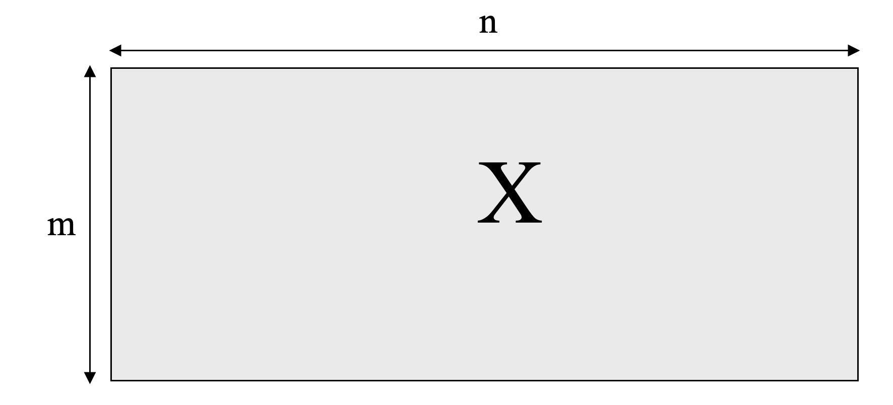 -->
<!-- ``` -->

## Feature selection methods

<ul>
<li><span style="color:blue; font-weight:bold">Thousands to millions of features</span>: select the most relevant one to build <span style="color:blue; font-weight:bold">better, faster, and easier to understand</span> learning machines.</li>
</ul>

```{r, echo=FALSE, out.width="60%", fig.align='center'}
include_graphics("img/page 16_2.png")
```

<!-- ## Other criteria -->

<!-- ## Other criteria -->

<!-- <center>A choice of feature selection ranking methods           depending on the nature of:</center> -->

<!-- ## Other criteria -->

<!-- <center>A choice of feature selection ranking methods           depending on the nature of:</center> -->

<!-- <ul> -->
<!--     <li><u>the variables and the target</u> (binary, categorical, continuous) -->
<!-- </ul> -->

<!-- ## Other criteria -->

<!-- <center>A choice of feature selection ranking methods           depending on the nature of:</center> -->

<!-- <ul> -->
<!--     <li><u>the variables and the target</u> (binary, categorical, continuous) -->
<!-- </li> -->
<!--     <li><u>the problem</u> (dependencies between variables, linear/non-linear relationships between variables and target)</li> -->
<!-- </ul> -->

<!-- ## Other criteria -->

<!-- <center>A choice of feature selection ranking methods           depending on the nature of:</center> -->

<!-- <ul> -->
<!--     <li><u>the variables and the target</u> (binary, categorical, continuous) -->
<!-- </li> -->
<!--     <li><u>the problem</u> (dependencies between variables, linear/non-linear relationships between variables and target)</li> -->
<!--     <li><u>the available data</u> (number of examples and number of variables, noise in data)</li> -->
<!-- </ul> -->

<!-- ## Some criteria -->

<!-- <center>A choice of feature selection ranking methods           depending on the nature of:</center> -->

<!-- <ul> -->
<!--     <li><u>The variables and the target</u> (binary, categorical, continuous) -->
<!-- </li> -->
<!--     <li><u>The problem</u> (dependencies between variables, linear/non-linear relationships between variables and target)</li> -->
<!--     <li><u>The available data</u> (number of examples and number of variables, noise in data)</li> -->
    
## Filters, Wrappers, Embedded, and Hybrid

```{r, echo=FALSE, out.width="80%", fig.align='center'}
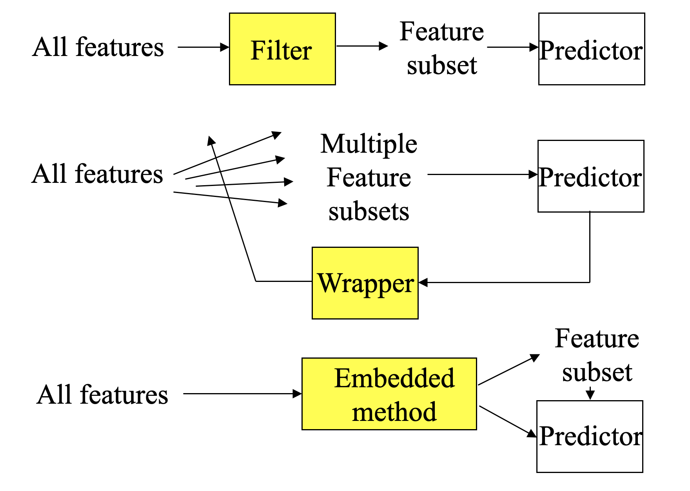
```

# Wrapper Methods

## Feature selection methods

- Wrapper method
    - Find the best subset of features for a particular classification method
    
```{r, echo=FALSE, out.width="80%", fig.align='center'}
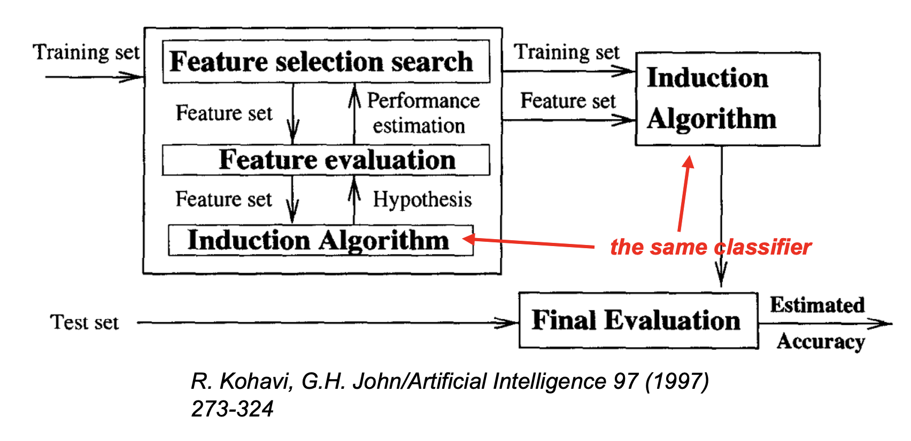
```

## Feature selection: Wrappers

- Optimizes for a specific learning algorithm
- The feature subset selection algorithm is a "wrapper" around the learning algorithm
    1. Pick a feature subset and pass it in to learning algorithm
    2. Create training/test set based on the feature subset
    3. Train the learning algorithm with the training set
    4. Find accuracy (objective) with validation set
    5. Repeat for all feature subsets and pick the feature subset which led to the highest predictive accuracy (or other objective)
- Basic approach is simple
- Variations are based on how to select the feature subsets, since there are an exponential number of subsets

<!-- ## Feature selection: Wrappers -->

<!-- - Exhaustive Search - Exhausting -->
<!-- - Forward Search – $O(n^2 \cdot \text{learning/testing time})$ - Greedy -->
<!--     1. Score each feature by itself and add the best feature to the initially empty set FS (FS will be our final Feature Set) -->
<!--     2. Try each subset consisting of the current FS plus one remaining feature and add the best feature to FS -->
<!--     3. Continue until stop getting significant improvement (over a window) -->
<!-- - Backward Search – $O(n^2 \cdot \text{learning/testing time})$ - Greedy -->
<!--     1. Score the initial complete FS  -->
<!--     2. Try each subset consisting of the current FS minus one feature in FS and drop the feature from FS causing least decrease in accuracy -->
<!--     3. Continue until begin to get significant decreases in accuracy -->
<!-- - Branch and Bound and other heuristic approaches available -->

<!-- ## Wrapper method -->

<!-- - Wrapper method -->
<!--     - Search in the whole space of feature groups -->
<!--         - Sequential forward selection or genetic search to speed up the search -->

<!-- ```{r, echo=FALSE, out.width="80%", fig.align='center'} -->
<!-- 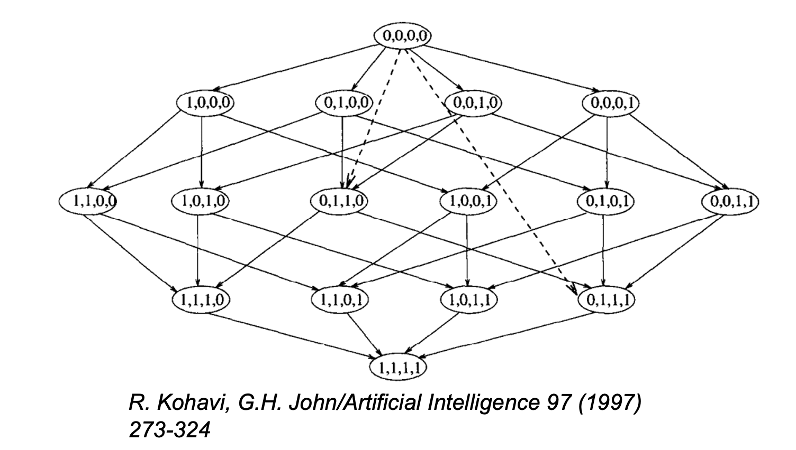 -->
<!-- ``` -->

## Wrapper method

- Wrapper method
    - Consider all possible dependencies among the features
    - Impractical for text categorization
        - Cannot deal with large feature set
        - A NP-complete problem
            - No direct relation between feature subset selection and evaluation

## Wrappers for feature selection

```{r, echo=FALSE, out.width="80%", fig.align='center'}
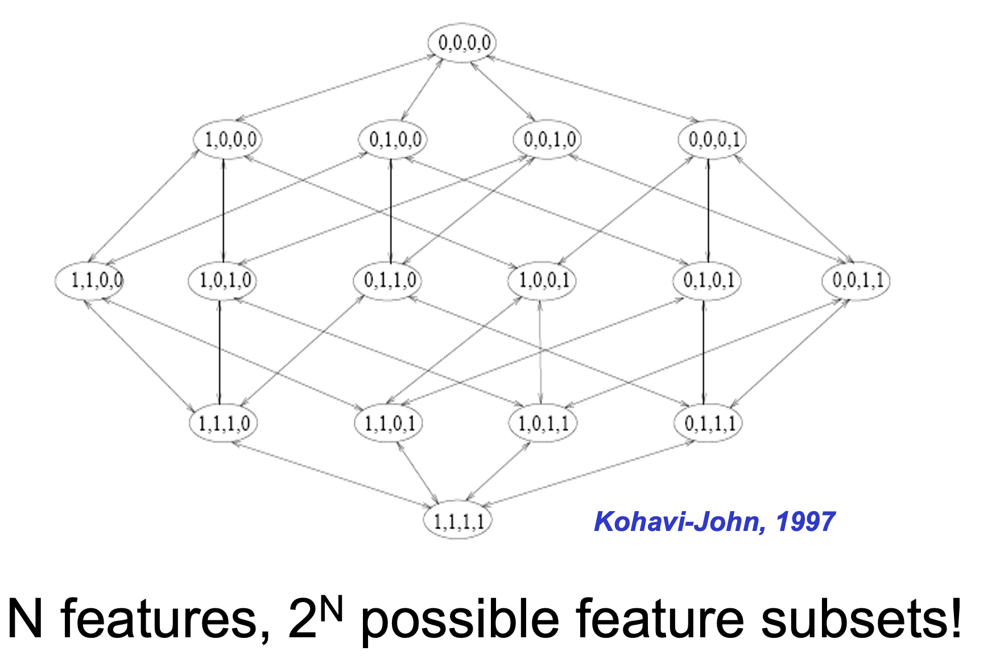
```

## Search strategies

- **Exhaustive search**
- **Greedy search**: forward selection or backward elimination
- **Simulated annealing** 
- **Genetic algorithms**
<!-- - **Beam search**: keep k best path at each step.  -->

<!-- - **PTA(l,r)**: plus l , take away r – at each step, run SFS l times then SBS r times. -->
<!-- - **Floating search** (SFFS and SBFS): One step of SFS (resp. SBS), then SBS (resp. SFS) as long as we find better subsets than those of the same size obtained so far. Any time, if a better subset of the same size was already found, switch abruptly. -->

<!-- ## Forward Selection (wrapper) -->

<!-- ```{r, echo=FALSE, out.width="80%", fig.align='center'} -->
<!-- 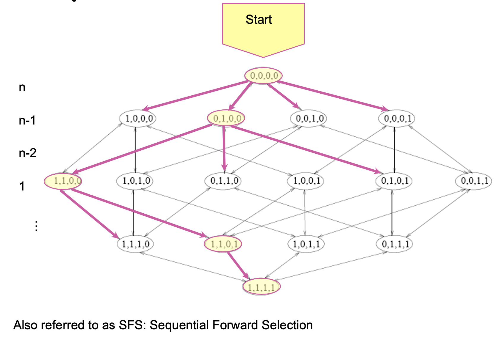 -->
<!-- ``` -->

<!-- ## Forward Selection (embedded) -->

<!-- ```{r, echo=FALSE, out.width="80%", fig.align='center'} -->
<!-- 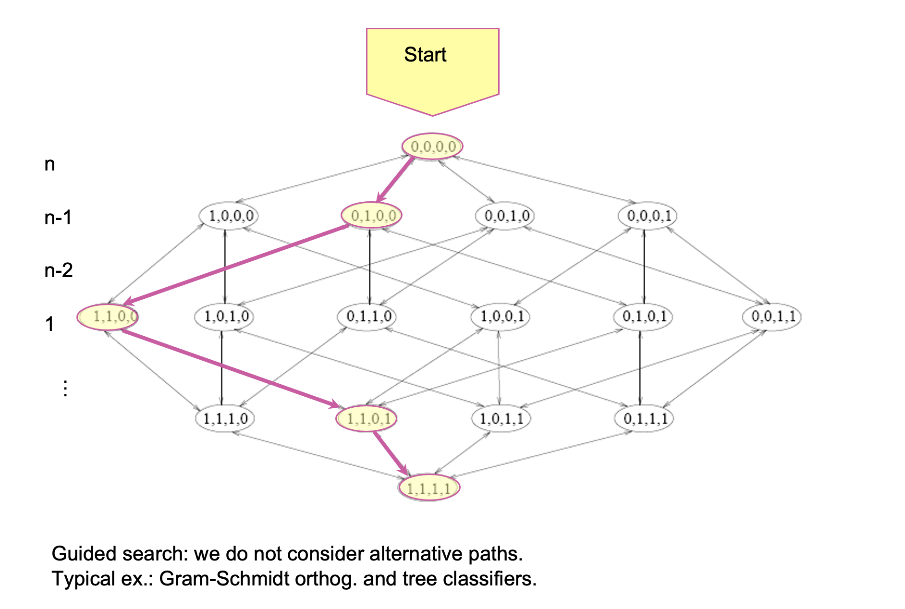 -->
<!-- ``` -->

<!-- ## Backward Elimination (wrapper) -->

<!-- ```{r, echo=FALSE, out.width="80%", fig.align='center'} -->
<!-- 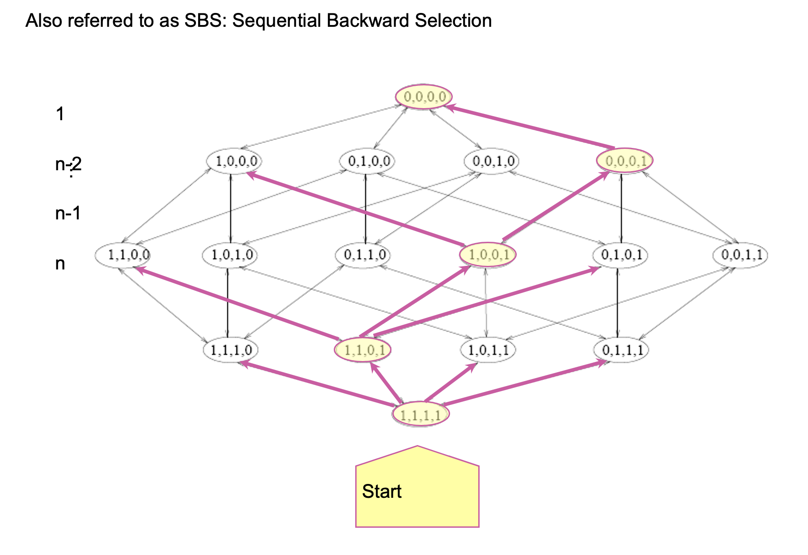 -->
<!-- ``` -->

<!-- ## Backward Elimination (embedded) -->

<!-- ```{r, echo=FALSE, out.width="80%", fig.align='center'} -->
<!-- 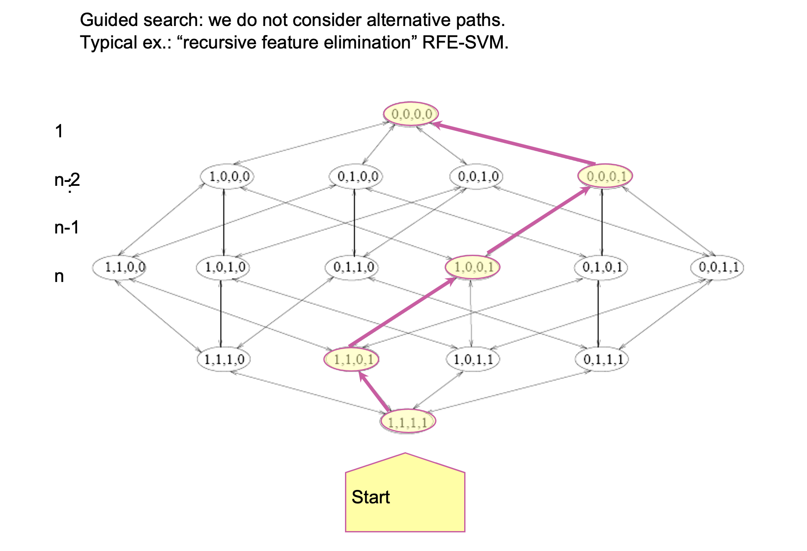 -->
<!-- ``` -->

<!-- ## Scaling Factors -->

<!-- <b>Idea</b>: Transform a discrete space into a continuous space. -->

<!-- ```{r, echo=FALSE, out.width="60%", fig.align='center'} -->
<!-- 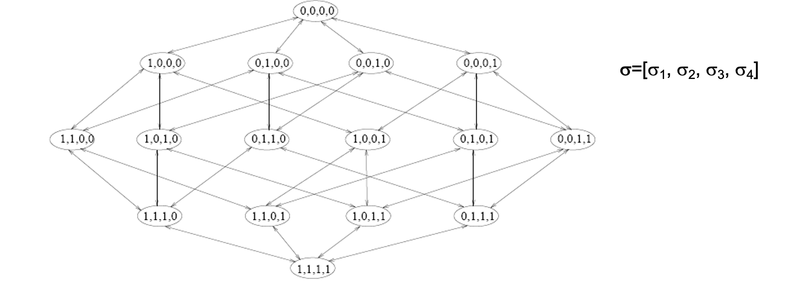 -->
<!-- ``` -->

<!-- <ul> -->
<!--     <li>Discrete indicators of feature presence: $\sigma_i \in \{0,1\}$</li> -->
<!--     <li>Continuous scaling factors: $\sigma_i \in \text{IR}$</li> -->
<!-- </ul> -->
<!-- <br><br> -->
<!-- <center><span style="background-color:yellow; font-size:26pt">Now we can do gradient descent!</span></center> -->

# Filter Methods

## Filter method

- Filter method
    - Evaluate the features <u>independently</u> from the classifier and other features
        - No indication of a classifier’s performance on the selected features
        - No dependency among the features
    - Feasible for very large feature set
<br>

```{r, echo=FALSE, out.width="60%", fig.align='center'}
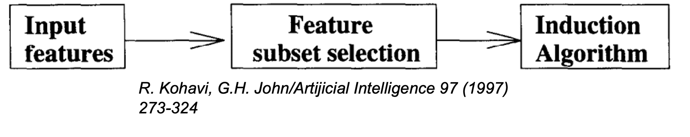
```


## Document frequency

- Rare words: non-influential for global prediction, reduce vocabulary size

```{r, echo=FALSE, out.width="80%", fig.align='center'}
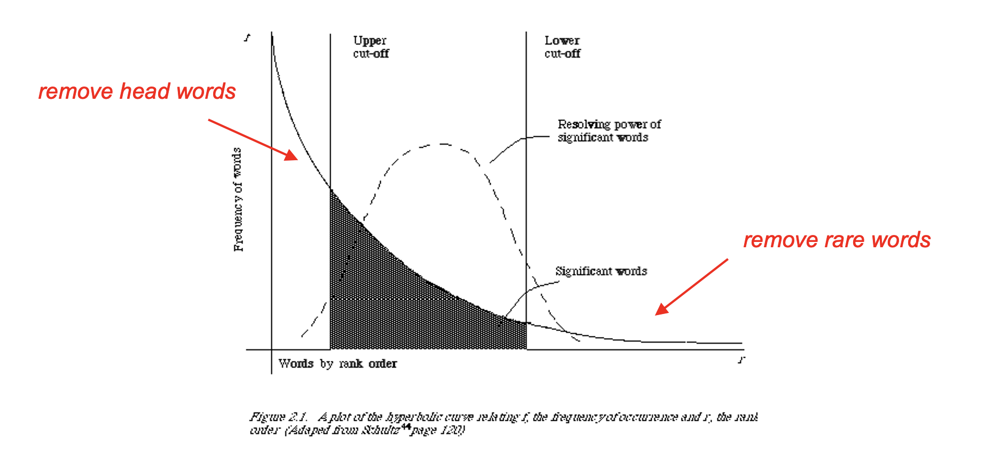
```

<!-- ## Information gain -->

<!-- - Decrease in entropy of categorical prediction when the feature is present or absent -->

<!-- <br> -->

<!-- $$ -->
<!-- \begin{align} -->
<!-- IG(t) = &-\sum_c{p(c)log{p(c)}} \\ -->
<!--         &+ p(t)\sum_c{p(c|t)log{p(c|t)}} \\ -->
<!--         &+ p(\bar t)\sum_c{p(c|\bar t)log{p(c|\bar t)}} -->
<!-- \end{align} -->
<!-- $$ -->

## Information gain

- Decrease in entropy of categorical prediction when the feature is present or absent

```{r, echo=FALSE, out.width="80%", fig.align='center'}
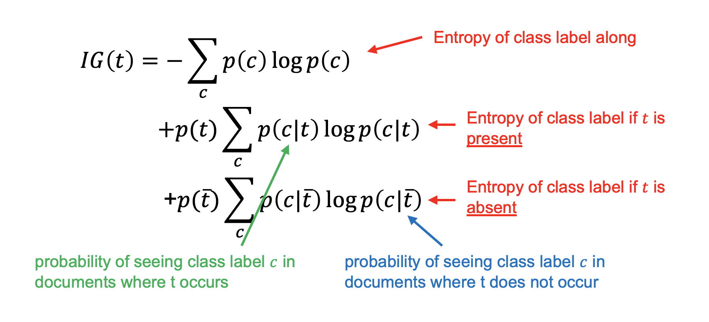
```

## Gini index

Let $p(c | t)$ be the conditional probability that a document belongs to class $c$, given the fact that it contains the term $t$. Therefore, we have:

$$\sum^k_{c=1}{p(c | t)=1}$$

Then, the gini-index for the term $t$, denoted by $G(t)$ is defined as:

$$G(t) = \sum^k_{c=1}{p(c | t)^2}$$

## Gini index 

- The value of the gini-index lies in the range $(1/k, 1)$. 

- Higher values of the gini-index indicate a greater discriminative power of the term $t$. 

- If the global class distribution is skewed, the gini-index may not accurately reflect the discriminative power of the underlying attributes.

- &#10132; normalized gini-index

<!-- ## Normalized Gini Index  -->

<!-- - Let $p(c)$ represent the unconditional probability of class $c$. Then, we determine the normalized probability value $p'(c | t)$ as:  -->

<!-- $$p'(c|t) \equiv \frac{p(c|t)/p(c)}{\sum_{i=1}^k{p(i|t)/p(i)}} $$ -->

<!-- - Then, the gini-index is computed in terms of these normalized probability values.  -->

<!-- $$G(t) \equiv \sum^k_{c=1}{p'(c|t)^2}$$ -->

<!-- ## Mutual Information -->

<!-- - The pointwise mutual information $M_c(t)$ between the term $t$ and the class $c$ is defined on the basis of the level of co-occurrence between the class $c$ and term $t$. Let $p(c)$ be the unconditional probability of class $c$, and $p(c | t)$ be the probability of class $c$, given that the document contains the term $t$.  -->

<!-- - Let $p(t)$ be the fraction of the documents containing the term $t$, i.e. the unconditional probability of term $t$.  -->

<!-- - The expected co-occurrence of class $c$ and term $t$ on the basis of mutual independence is given by $p(c) \cdot p(t)$. The true co-occurrence is of course given by $p(c | t) \cdot p(t)$. -->

<!-- ## Mutual Information  -->

<!-- - In practice, the value of $p(c | t) \cdot p(t)$ may be much larger or smaller than $p(c) \cdot p(t)$, depending upon the level of correlation between the class $c$ and term $t$. The mutual information is defined in terms of the ratio between these two values. -->

<!-- $$M_c(t) = log(\frac{p(c|t) \cdot p(t)}{p(c) \cdot p(t)}) = log(\frac{p(c|t)}{p(c)})$$ -->

<!-- - Clearly, the term $t$ is positively correlated to the class $c$, when $M_c (t) > 0$, and the term $t$ is negatively correlated to class $c$, when $M_c (t) < 0$. -->

<!-- ## Mutual Information  -->

<!-- - Note that $M_c(t)$ is specific to a particular class $c$. We need to compute the overall mutual information as a function of the mutual information of the term $t$ with the different classes. -->

<!-- $$M_{avg}(t) = \sum^k_{c=1}{p(c) \cdot M_c(t)}$$ -->
<!-- $$M_{max}(t) = \max_c{\{M_c(t)\}}$$ -->

<!-- - The second measure is particularly useful, when it is more important to determine high levels of positive correlation of the term $t$ with any of the classes. -->

<!-- ## ${\chi}^2$-Statistic  -->

<!-- - The ${\chi^2}$-statistic is a different way to compute the lack of independence between the term $t$ and a particular class $c$. Let $n$ be the total number of documents, then: -->

<!-- $${\chi}_c^2(t) = \frac{n \cdot p(t)^2 \cdot (p(c|t) - p(c))^2}{p(t) \cdot (1- p(t)) \cdot p(c) \cdot (1 - p(c))}$$ -->

<!-- - As in the case of the mutual information, we can compute a global ${\chi^2}$ statistic from the class-specific values. One major advantage of the ${\chi^2}$-statistic is that it is a normalized value and we can test statistical significance using the ${\chi^2}$ distribution with one degree of freedom. -->

<!-- ##  ${\chi}^2$-Statistic  -->

<!-- - Test whether distributions of two categorical variables are independent of one another -->
<!--   - $H_0$: they are independent -->
<!--   - $H_1$: they are dependent  -->

<!--  -->
<!--  -->

<!-- ## ${\chi}^2$-Statistic -->

<!-- - Test whether distributions of two categorical variables are independent of one another -->

<!--   - Degree of freedom = $(\#col-1) \times (\#row-1)$ -->

<!--   - Significance level: $\alpha$, i.e., $p\mbox{-}value<\alpha$  -->
<!-- <p><span style="color:red">&#8627;</span> Look into ${\chi}^2$ distribution table to find the threshold -->
<!-- </p> -->

<!--  -->

<!-- ## Feature scoring metrics -->

<!-- - ${\chi}^2$ statistics -->

<!--   - Test whether distributions of two categorical variables are independent of one another -->

<!--     - Degree of freedom = $(\#col-1) \times (\#row-1)$ -->

<!--     - Significance level: $\alpha$, i.e., $p\mbox{-}value<\alpha$  -->

<!--     - For the features passing the threshold, rank them by descending order of ${\chi}^2$ values and choose the top $k$ features -->
    
## Feature scoring metrics

- ${\chi}^2$ statistics with multiple categories

  - ${\chi}^2=\sum_c{p(c) {\chi}^2(c,t)}$
    
    - Expectation of ${\chi}^2$ over all the categories
  <br>
  <br>
  - ${\chi}^2(t) = \underset{c}{max}\ {\chi}^2(c,t)$

    - Strongest dependency between a category and a term
    
## Other metrics

- Many other metrics (Same trick as in $\chi^2$ statistics for multi-class cases)
    
  - Mutual information
  
    - Relatedness between term $t$ and class $c$
  
  $$PMI(t;c) = p(t,c)log(\frac{p(t,c)}{p(t)p(c)})$$

  - Odds ratio

    - Odds of term $t$ occurring with class $c$ normalized by that without $c$

$$Odds(t;c) = \frac{p(t,c)}{1 - p(t,c)} \times \frac{1 - p(t,\bar{c})}{p(t,\bar{c})}$$
\newpage

# Embedded Methods

## Formalism

- Many learning algorithms are cast into a minimization of some regularized functional:

$$\min_\alpha{\hat{R}(\alpha, \sigma)} = \min_\alpha{\sum_{k=1}^m{L(f(\alpha, \sigma \circ x_k), y_k) + \Omega(\alpha)}}$$

## Formalism

- Many learning algorithms are cast into a minimization of some regularized functional:

```{r, echo=FALSE, out.width="80%", fig.align='center'}
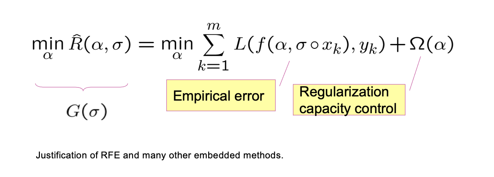
```

<!-- ## Embedded method -->

<!-- - Embedded methods are a good inspiration to design new feature selection techniques for your own algorithms: -->
<!--     - Find a functional that represents your prior knowledge about what a good model is. -->
<!--     - Add the s weights into the functional and make sure it’s either differentiable or you can perform a sensitivity analysis efficiently -->
<!--     - Optimize alternatively according to $\alpha$ and $\sigma$ -->
<!--     - Use early stopping (validation set) or your own stopping criterion to stop and select the subset of features -->

<!-- - Embedded methods are therefore not too far from wrapper techniques and can be extended to multiclass, regression, etc… -->

## Lasso vs Ridge
```{r, echo=FALSE, out.width="90%", fig.align='center'}
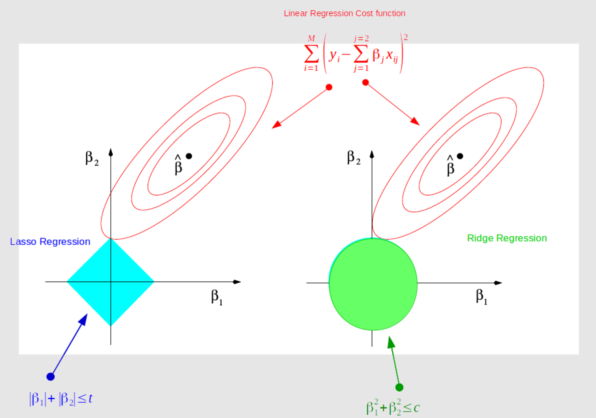
```


## The $l_1$ SVM

- A version of SVM where $\Omega(w) = ||w||^2$ is replaced by the $l_1$ norm $\Omega(w) = \sum_i{|w_i|}$ 
- Can be considered an embedded feature selection method:
    - Some weights will be drawn to zero (tend to remove redundant features)
    - Difference from the regular SVM where redundant features are included

## The $l_0$ SVM

- Replace the regularizer $||w||^2$ by the $l_0$ norm $\sum_{i=1}^n{1_{w_i \neq 0}}$

- Further replace $\sum_{i=1}^n{1_{w_i \neq 0}}$ by $\sum_i{log{(\epsilon + |w_i|)}}$

- Boils down to the following multiplicative update algorithm:
  
  1. Set $\sigma = (1, ..., 1)$
  2. Get $w^*$ solution of an SVM on data set where each input is scaled by $\sigma$
  3. Set $\sigma = |w^*| \circ \sigma$
  4. back to 2

## Comparing methods

```{r, echo=FALSE, out.width="70%", fig.align='center'}
include_graphics("img/diff.png")
```

# PCA

## Feature selection vs feature reduction

<!-- - Given $n$ original features, it is often advantageous to reduce this to a smaller set of features for actual training -->
<!--     - Can improve/maintain accuracy if we can preserve the most relevant information while discarding the most irrelevant information -->
<!--     - and/or Can make the learning process more computationally and algorithmically manageable by working with less features -->
<!--     - Curse of dimensionality requires an exponential increase in data set size in relation to the number of features to learn without overfit – thus decreasing features can be critical -->
- *Feature Selection* seeks a *subset* of the $n$ original features which retains most of the relevant information
    - Wrappers (e.g. forward selection), Filters (e.g. PMI), Embedded (e.g. Lasso, Regularized SVN)
- *Feature Reduction <u>combines/fuses</u>* the $n$ original features into a smaller set of newly created features which hopefully retains most of the relevant information from *all* the original features - Data fusion (e.g. LDA, PCA, etc.)

## PCA: Principal Component Analysis

- PCA is one of the most common feature reduction techniques

- A linear method for dimensionality reduction

- Allows us to combine much of the information contained in $n$ features into $p$ features where $p < n$

- PCA is *unsupervised* in that it does not consider the output class/value of an instance – There are other algorithms which do (e.g. Linear Discriminant Analysis)

- PCA works well in many cases where data have mostly linear correlations

<!-- - Non-linear dimensionality reduction is also a successful area and can give much better results for data with significant non-linearities -->

## PCA overview

- Seek new set of bases which correspond to the highest variance in the data
- Transform $n$-dimensional *normalized* data to a new $n$-dimensional basis
    - The new dimension with the most variance is the first principal component
    - The next is the second principal component, etc.
    - Note $z_1$ <u>combines/fuses</u> significant information from both $x_1$ and $x_2$
- Drop dimensions for which there is little variance

```{r, echo=FALSE, out.width="60%", fig.align='center'}
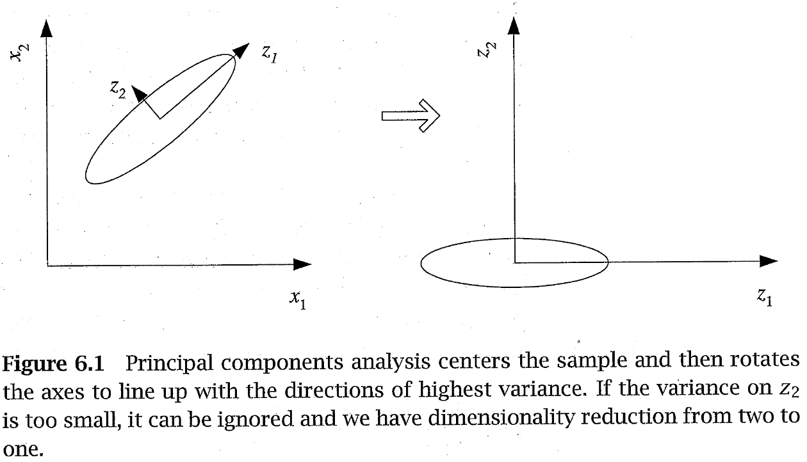
```

## PCA overview

```{r, echo=FALSE, out.width="80%", fig.align='center'}
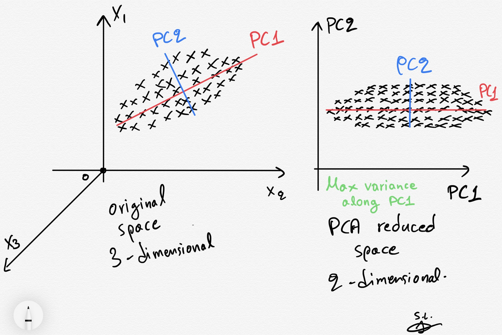
```

https://towardsdatascience.com/

<!-- ## Variance and covariance -->

<!-- - Variance is a measure of data spread in one dimension (feature) -->
<!-- - Covariance measures how two dimensions (features) vary with respect to each other -->

<!-- $$var(X) = \frac{\sum_{i = 1}^n{(X_i - \bar X)(X_i - \bar X)}}{(n - 1)}$$ -->
<!-- $$cov(X,Y) = \frac{\sum_{i = 1}^n{(X_i - \bar X)(Y_i - \bar Y)}}{(n - 1)}$$ -->

<!-- ## Covariance and the covariance matrix -->

<!-- - Considering the sign (rather than exact value) of covariance: -->
<!--     - Positive value means that as one feature increases or decreases the other does also (positively correlated) -->
<!--     - Negative value means that as one feature increases the other decreases and vice versa (negatively correlated) -->
<!--     - A value close to zero means the features are independent -->
<!--     - If highly covariant, are both features necessary? -->
<!-- - Covariance matrix is an $n \times n$ matrix containing the covariance values for all pairs of features in a data set with $n$ features (dimensions) -->
<!-- - The diagonal contains the covariance of a feature with itself which is the variance (which is the square of the standard deviation) -->
<!-- - The matrix is symmetric -->

<!-- ## PCA example -->

<!-- - First step is to center the original data around 0 by subtracting the mean in each dimension -->

<!-- ```{r, echo=FALSE, out.width="80%", fig.align='center'} -->
<!-- 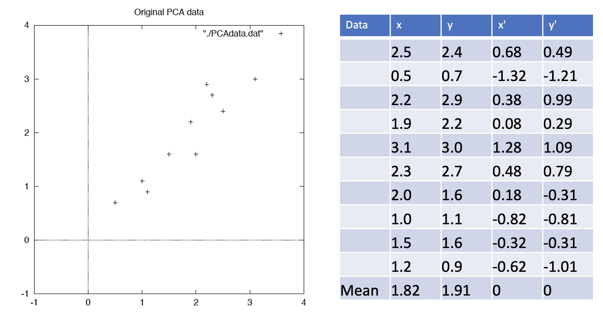 -->
<!-- ``` -->

<!-- ## PCA example -->

<!-- - Second: Calculate the covariance matrix of the centered data -->
<!-- - Only $2 \times 2$ for this case -->

<!-- ```{r, echo=FALSE, out.width="80%", fig.align='center'} -->
<!-- 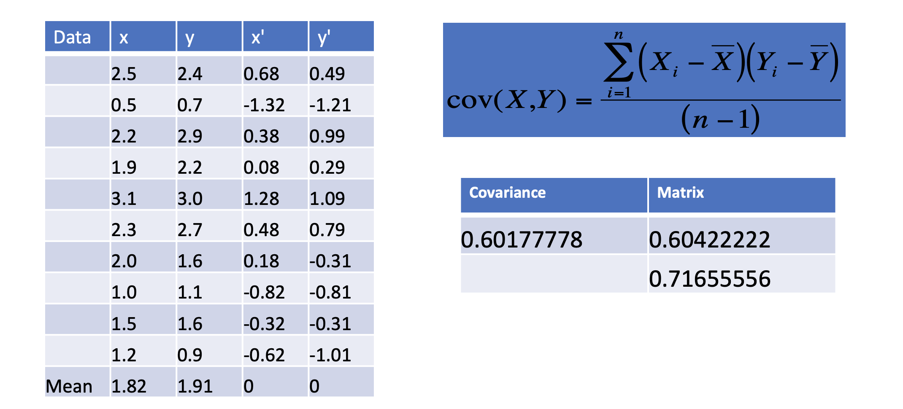 -->
<!-- ``` -->

<!-- ## PCA example -->

<!-- - Third: Calculate the unit eigenvectors and eigenvalues of the covariance matrix (remember linear algebra) -->
<!--     - Covariance matrix is always square $n \times n$ and positive semi-definite, thus n non-negative eigenvalues will exist -->
<!--     - All eigenvectors (principal components) are orthogonal to each other and form the new set of bases/dimensions for the data (columns) -->
<!--     - The magnitude of each eigenvalue corresponds to the variance along that new dimension – Just what we wanted! -->
<!--     - We can sort the principal components according to their eigenvalues -->
<!--     - Just keep those dimensions with the largest eigenvalues -->

<!-- ```{r, echo=FALSE, out.width="70%", fig.align='center'} -->
<!-- 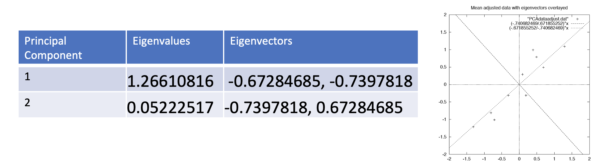 -->
<!-- ``` -->

<!-- ## PCA example -->

<!-- - Below are the two eigenvectors overlaying the centered data -->
<!-- - Which eigenvector has the largest eigenvalue? -->
<!-- - Fourth Step:  Just keep the $p$ eigenvectors with the largest eigenvalues -->
<!--     - Do lose some information, but if we just drop dimensions with small eigenvalues then we lose only a little information, hopefully noise -->
<!--     - We can then have $p$ input features rather than $n$ -->
<!--     - The $p$ features contain the most pertinent *combined* information from all $n$ original features -->
<!--     - How many dimensions $p$ should we keep? -->

<!-- ```{r, echo=FALSE, out.width="60%", fig.align='center'} -->
<!-- 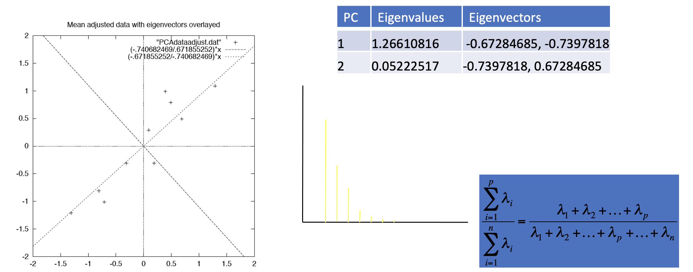 -->
<!-- ``` -->

<!-- ## PCA example -->

<!-- - Last Step:  Transform the $n$ features to the $p$ ($< n$) chosen bases (Eigenvectors) -->
<!-- - Transformed data (m instances) is a matrix multiply $T =  A \times B$ -->
<!--     - $A$ is a $p \times n$ matrix with the $p$ principal components in the rows, component one on top -->
<!--     - $B$ is a $n \times m$ matrix containing the transposed centered original data set -->
<!--     - $T^T$ is a $m \times p$ matrix containing the transformed data set   -->
<!-- - Now we have the new transformed data set with dimensionality $p$ -->
<!-- - Keep matrix $A$ to transform future centered data instances -->
<!-- - Below is shown the transform of both dimensions. Would if we just kept the $1^{st}$ component? -->

<!-- ```{r, echo=FALSE, out.width="50%", fig.align='center'} -->
<!-- 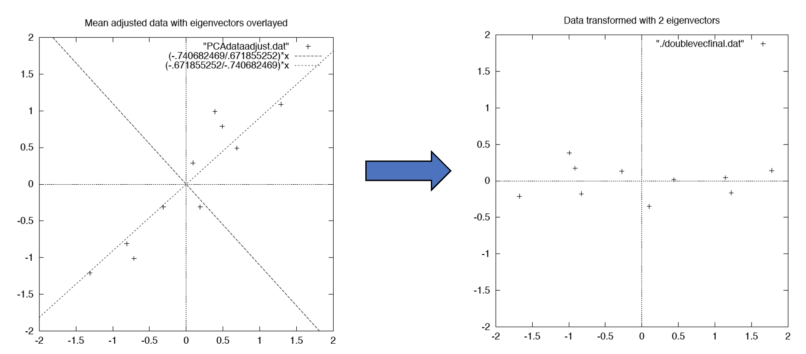 -->
<!-- ``` -->

<!-- ## PCA algorithm summary -->

<!-- 1. Center the $n$ normalized TS features (subtract the n means) -->
<!-- 2. Calculate the covariance matrix of the centered TS -->
<!-- 3. Calculate the unit eigenvectors and eigenvalues of the covariance matrix -->
<!-- 4. Keep the $p$ ($< n$) eigenvectors with the largest eigenvalues -->
<!-- 5. Matrix multiply the p eigenvectors with the centered TS to get a new TS with only $p$ features -->

<!-- - Given a novel instance during execution -->
<!--     1. Center the normalized instance (subtract the $n$ means) -->
<!--     2. Do the matrix multiply (step 5 above) to change the new instance from $n$ to $p$ features -->

<!-- ## PCA for text data -->

<!-- - <a href="https://www.displayr.com/principal-component-analysis-of-text-data/">https://www.displayr.com/principal-component-analysis-of-text-data/</a> -->
<!-- - <a href="https://community.jmp.com/t5/JMP-Blog/Text-analysis-in-the-social-sciences-A-new-spectrum-of/ba-p/45139">https://community.jmp.com/t5/JMP-Blog/Text-analysis-in-the-social-sciences-A-new-spectrum-of/ba-p/45139</a> -->


<!-- ## Menti -->

<!-- ## Bilevel optimization; -->

<!-- <div style="float:left;width:50%"> -->
<!--    -->
<!-- </div> -->
<!-- <div style="float:right;width:50%"> -->
<!--   Split data into 3 sets: <span style="color:red">training</span>, <span style="color:pink">validation</span>, and <span style="color:green">test set</span>. -->
<!-- </div> -->

<!-- ## Bilevel optimization; -->

<!-- <div style="float:left;width:50%"> -->
<!--    -->
<!-- </div> -->
<!-- <div style="float:right;width:50%"> -->
<!--   Split data into 3 sets: <span style="color:red">training</span>, <span style="color:pink">validation</span>, and <span style="color:green">test set</span>. -->
<!-- </div> -->

<!-- ## Bilevel optimization; -->

<!-- <div style="float:left;width:50%"> -->
<!--    -->
<!-- </div> -->
<!-- <div style="float:right;width:50%"> -->
<!--   Split data into 3 sets: <span style="color:red">training</span>, <span style="color:pink">validation</span>, and <span style="color:green">test set</span>. -->
<!-- </div> -->

<!-- ## Bilevel optimization; -->

<!-- <div style="float:left;width:50%"> -->
<!--    -->
<!-- </div> -->
<!-- <div style="float:right;width:50%"> -->
<!--   Split data into 3 sets: <span style="color:red">training</span>, <span style="color:pink">validation</span>, and <span style="color:green">test set</span>. -->
<!-- </div> -->

<!-- ## Bilevel optimization; -->

<!-- <div style="float:left;width:50%"> -->
<!--    -->
<!-- </div> -->
<!-- <div style="float:right;width:50%"> -->
<!--   Split data into 3 sets: <span style="color:red">training</span>, <span style="color:pink">validation</span>, and <span style="color:green">test set</span>. -->

<!-- <ol> -->
<!--     <li>For each feature subset, train predictor on <span style="color:red">training data</span>.</li> -->
<!-- </ol> -->
<!-- </div> -->

<!-- ## Bilevel optimization; -->

<!-- <div style="float:left;width:50%"> -->
<!--    -->
<!-- </div> -->
<!-- <div style="float:right;width:50%"> -->
<!--   Split data into 3 sets: <span style="color:red">training</span>, <span style="color:pink">validation</span>, and <span style="color:green">test set</span>. -->

<!-- <ol> -->
<!--     <li>For each feature subset, train predictor on <span style="color:red">training data</span>.</li> -->
<!--     <li> -->
<!--         Select the feature subset, which performs best on <span style="color:pink">validation data</span>. -->
<!--         <ul> -->
<!--             <li>Repeat and average if you want to reduce variance (cross-validation).</li> -->
<!--         </ul> -->
<!--     </li> -->
<!-- </ol> -->
<!-- </div> -->

<!-- ## Bilevel optimization; -->

<!-- <div style="float:left;width:50%"> -->
<!--    -->
<!-- </div> -->
<!-- <div style="float:right;width:50%"> -->
<!--   Split data into 3 sets: <span style="color:red">training</span>, <span style="color:pink">validation</span>, and <span style="color:green">test set</span>. -->

<!-- <ol> -->
<!--     <li>For each feature subset, train predictor on <span style="color:red">training data</span>.</li> -->
<!--     <li> -->
<!--         Select the feature subset, which performs best on <span style="color:pink">validation data</span>. -->
<!--         <ul> -->
<!--             <li>Repeat and average if you want to reduce variance (cross-validation).</li> -->
<!--         </ul> -->
<!--     </li> -->
<!--     <li>Test on <span style="color:green">test data</span>.</li> -->
<!-- </ol> -->
<!-- </div> -->

# Evaluation| Supervised learning | Which method to use?

## Data Splitting

- Training set
  - Validation set (dev set)
    - A validation dataset is a dataset of examples used to tune the hyperparameters (i.e. the architecture) of a classifier. It is sometimes also called the development set or the "dev set".
    
- Test set

## Cross Validation

```{r, echo=FALSE, out.width="75%"}
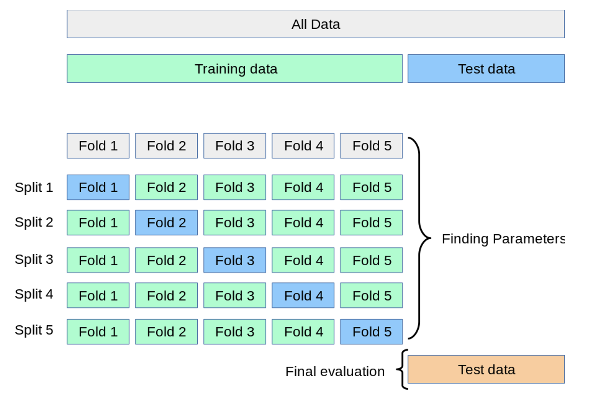
```

<br>
<p style="font-size:12px">https://scikit-learn.org/stable/modules/cross_validation.html</p>


## Confusion matrix

```{r, echo=FALSE, out.width="100%"}
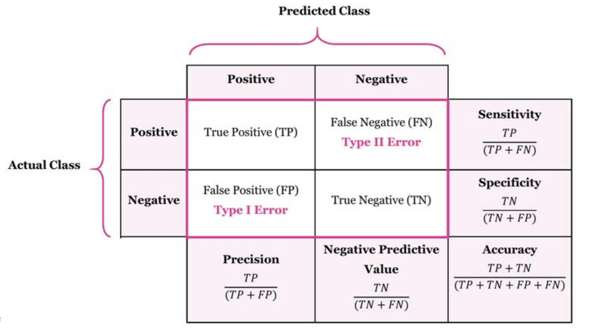
```

\newpage

## Accuracy

- What proportion of instances is correctly classified? <br>
 	<center>TP + TN / TP + FP + FN + TN </center>

- Accuracy is a valid choice of evaluation for classification problems which are well balanced and not skewed. 

- Let us say that our target class is very sparse. Do we want accuracy as a metric of our model performance? What if we are predicting if an asteroid will hit the earth? Just say “No” all the time. And you will be 99% accurate. The model can be reasonably accurate, but not at all valuable.

\newpage

## Precision and recall

- <b>Precision</b>: % of selected items that are correct <br> <b>Recall</b>: % of correct items that are selected

- Precision is a valid choice of evaluation metric when we want to be very sure of our prediction.

- Recall is a valid choice of evaluation metric when we want to capture as many positives as possible.

\newpage

## A combined measure: F

A combined measure that assesses the P/R tradeoff is F measure (weighted harmonic mean):

$$F = \frac{1}{\alpha\frac{1}{P}+(1-\alpha)\frac{1}{R}}=\frac{(\beta^2+1)PR}{\beta^2P + R}$$

The harmonic mean is a very conservative average;

Balanced F1 measure
  -   i.e., with $\beta = 1$ (that is, $\alpha = 1/2$): $F = 2PR/(P+R)$
  

# Summary

## Summary

- Feature selection for text
- Different methods
- Can be quite effective!

# Time for Practical 3!