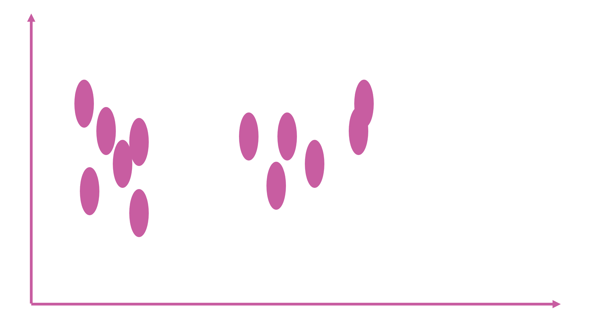
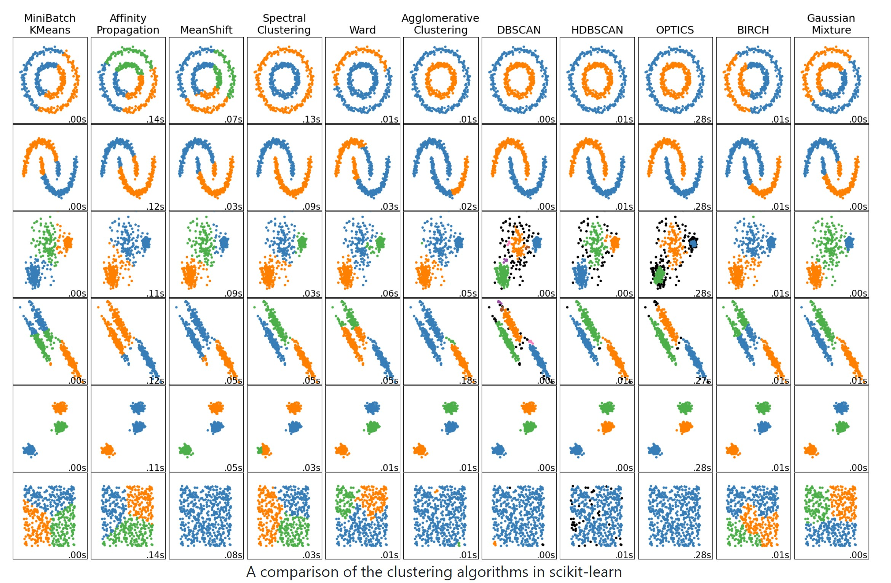
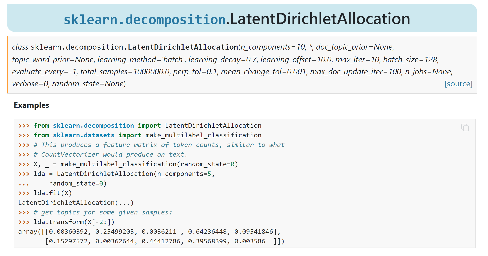
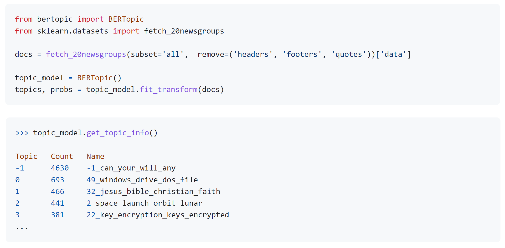

```{r, include=FALSE}
knitr::opts_chunk$set(echo = FALSE)
library(knitr)
library(kableExtra)
library(magick)
library(magrittr)
```

## Lecture plan
1. What is text clustering?

2. What are the applications?

3. How to cluster text data?

## Unsupervised learning
```{r, out.width="100%"}
include_graphics("img/page 3.png")
```

## Clustering versus classification
```{r, echo=FALSE, out.width="100%"}
include_graphics("img/page 4.png")
```

## Clustering
- Clustering: the process of grouping a set of objects into clusters of similar objects

- Discover “natural structure” of data
  
  - What is the criterion? 
  - How to identify them?
  - How to evaluate the results?

```{r, echo=FALSE, out.width="100%"}
include_graphics("img/page 5.png")
```

## Question

Which one is NOT a text clustering task?

- Finding similar patterns in customer reviews
- Grouping tweets and finding their unknown topics
- Cancer detection from patient notes
- Grouping scientific articles into similar clusters

## Question

<div style="float: left; width:100%">
```{r, echo=FALSE, fig.align='center', out.width="100%"}
include_graphics("img/q1.jpg")
```
</div>

## Clustering
  
- Basic criteria

  - high intra-cluster similarity

  - low inter-cluster similarity

- No (little) supervision signal about the underlying clustering structure

- Need similarity/distance as guidance to form clusters

# Clustering Algorithms

## Categories
- Hard versus soft clustering

- Partitional clustering

- Hierarchical clustering

- Topic modeling

## Hard versus Soft clustering
- Hard clustering: Each document belongs to exactly one cluster
  
  - More common and easier to do

- Soft clustering: A document can belong to more than one cluster.
  

# Partitional Clustering

## Partitional clustering algorithms
- Partitional clustering method: Construct a partition of <span style="color:lightgreen">$n$</span> documents into a set of <span style="color:lightgreen">$K$</span> clusters
- Given: a set of documents and the number <span style="color:lightgreen">$K$</span> 
- Find: a partition of <span style="color:lightgreen">$K$</span> clusters that optimizes the chosen partitioning criterion

  - Globally optimal
    - Intractable for many objective functions
    - Ergo, exhaustively enumerate all partitions
  
  - Effective heuristic methods: <em>K</em>-means and <em>K</em>-medoids algorithms
  
## Partitional clustering algorithms
- Typical partitional clustering algorithms
  
  - <em>k</em>-means clustering
    
    - Partition data by its closest mean

```{r, echo=FALSE, out.width="70%", fig.align='right'}
include_graphics("img/page 22.png")
```

## K-Means algorithm
- Assumes documents are real-valued vectors.

- Clusters based on <span style="font-style:italic;color:red">centroids</span> of points in a cluster, $c$:

$$\vec \mu(c)=\frac{1}{|c|}\sum_{\vec a \in c}{\vec x}$$

- Reassignment of instances to clusters is based on distance to the current cluster centroids.
  

## K-Means algorithm
- Select $K$ random docs $\{s_1, s_2,… s_K\}$ as seeds.
- Until clustering converges (or other stopping criterion):
  
  - For each document $d_i$: <br>
   
    - Assign $d_i$ to the cluster $c_j$ such that $dist(x_i, s_j)$ is minimal.
  
  - <span style="color:DarkCyan">(Next, update the seeds to the centroid of each cluster)</span>
  
  - For each cluster cj
    - $s_j = \mu(c_j)$
    
## K-Means example (K=2)
```{r, echo=FALSE, out.width="100%", cache=TRUE}
list.files(path='img/', pattern = 'page 26', full.names = TRUE) %>% 
        image_read() %>% # reads each path file
        image_join() %>% # joins image
        image_animate(fps=0.25) %>% # animates, can opt for number of loops
        image_write("img/kmeans.gif") # write to current dir


```

# Hierarchical Clustering

## Dendrogram: Hierarchical clustering
<div style="float:left;width:50%">
- Build a tree-based hierarchical taxonomy (<em>dendrogram</em>) from a set of documents.

- Clustering obtained by cutting the dendrogram at a desired level: each <b>connected</b> component forms a cluster.
</div>
<div style="float:right;width:50%">
```{r, echo=FALSE, out.width="100%"}
include_graphics("img/page 33.png")
```
</div>

## Clustering algorithms
- Typical hierarchical clustering algorithms
  
  - Bottom-up agglomerative clustering
    
    - Start with individual objects as separated clusters
    - Repeatedly merge closest pair of clusters

```{r, echo=FALSE, out.width="100%"}
include_graphics("img/page 34.png")
```

## Clustering algorithms
- Typical hierarchical clustering algorithms
  
  - Top-down divisive clustering
    
    - Start with all data as one cluster
    
    - Repeatedly splitting the remaining clusters into two

```{r, echo=FALSE, out.width="60%", fig.align='right'}
include_graphics("img/page 35.png")
```

## Hierarchical Agglomerative Clustering (HAC)
- Starts with each document in a separate cluster
  
  - then repeatedly joins the <em><u>closest pair</u></em> of clusters, until there is only one cluster.

- The history of merging forms a binary tree or hierarchy.

## Closest pair of clusters
- Many variants to defining closest pair of clusters (linkage methods):
  
  - <b>Single-link</b>
    - Similarity of the <em>most</em> cosine-similar

  - <b>Complete-link</b>
    - Similarity of the “furthest” points, the <em>least</em> cosine-similar

  - <b>Centroid</b>
    - Clusters whose centroids (centers of gravity) are the most cosine-similar

  - <b>Average-link</b>
    - Average cosine between pairs of elements
    
  - <b>Ward's linkage</b>
    - Ward's minimum variance method, much in common with analysis of variance (ANOVA)
    - The distance between two clusters is computed as the increase in the "error sum of squares" (ESS) after fusing two clusters into a single cluster.

## Clustering in SKlrean
```{r, out.width="100%"}

```

# Topic Modeling

## Topic modeling
```{r,out.width="90%"}
include_graphics("img/topicmodel1.png")
```

<font size="2"> https://thinkinfi.com/</font> 

## Topic models
<div style="float:left;width:60%">
- Three concepts: words, topics, and documents

- Documents are a collection of words and have a probability distribution over topics

- Topics have a probability distribution over words

- Model: 
  
  - Topics made up of words used to generate documents
</div>
<div style="float:right;width:40%">
```{r,out.width="100%"}
include_graphics("img/page 41.png")
```
</div>

## Topic models | Reality: Documents observed, infer  topics
```{r,out.width="80%"}
include_graphics("img/page 42.png")
```

## Topic models
```{r,out.width="90%"}
include_graphics("img/topicmodel2.png")
```

## LDA graphical model
```{r, out.width="100%"}
include_graphics("img/page 46.png")
```

## LDA
```{r,out.width="90%"}
include_graphics("img/topicmodel3.png")
```

## Probabilistic modeling
1. Treat data as observations that arise from a generative probabilistic process that includes hidden variables: For documents, the hidden variables reflect the thematic structure of the collection.

2. Infer the hidden structure using posterior inference: What are the topics that describe this collection?

3. Situate new data into the estimated model: How does this query or new document fit into the estimated topic structure?

## Example
What is latent Dirichlet allocation? It’s a way of automatically discovering topics that these sentences contain.

Suppose you have the following set of sentences:

- I like to eat broccoli and bananas.
- I ate a banana and spinach smoothie for breakfast.
- Chinchillas and kittens are cute.
- My sister adopted a kitten yesterday.
- Look at this cute hamster munching on a piece of broccoli.


## Example
Given these sentences and asked for 2 topics, LDA might produce something like:

- Sentences 1 and 2: 100% Topic A
- Sentences 3 and 4: 100% Topic B
- Sentence 5: 60% Topic A, 40% Topic B
- Topic A: 30% broccoli, 15% bananas, 10% breakfast, 10% munching, … (at which point, you could interpret topic A to be about food)
- Topic B: 20% chinchillas, 20% kittens, 20% cute, 15% hamster, … (at which point, you could interpret topic B to be about cute animals)

How does LDA perform this discovery?

## LDA training
- Go through each document, and randomly assign each word in the document to one of the K topics.
- Notice that this random assignment already gives you both topic representations of all the documents and word distributions of all the topics (albeit not very good ones).
- So to improve on them, for each document d…
- Go through each word w in d…

## LDA training
- And for each topic t, compute two things: 

  - p(topic t | document d) = the proportion of words in document d that are currently assigned to topic t, and
  
  - p(word w | topic t) = the proportion of assignments to topic t over all documents that come from this word w. 

- Reassign w a new topic, where we choose topic t with probability p(topic t | document d) * p(word w | topic t) 

- In other words, in this step, we’re assuming that all topic assignments except for the current word in question are correct, and then updating the assignment of the current word using our model of how documents are generated.

## LDA training
- After repeating the previous step a large number of times, you’ll eventually reach a roughly steady state where your assignments are pretty good. 

- Use these assignments to estimate the topic mixtures of each document (by counting the proportion of words assigned to each topic within that document) and the words associated to each topic (by counting the proportion of words assigned to each topic overall).

## LDA: Identifying structure in text
```{r, out.width="100%"}
include_graphics("img/lda.png")
```

## Variations of LDA

- Hierarchical LDA (hLDA): automatically mine the hierarchical dimension of topics

- Supervised LDA (sLDA): learn topics that are inline with the class label

- Hybrid LDA: extracting topics and other information

- LDA & BERT: we cover deep learning and BERT later

## BERTtopic
- https://github.com/MaartenGr/BERTopic
- BERTopic is a topic modeling technique that leverages 🤗 transformers
- creates dense clusters
- allowing for easily interpretable topics
- https://colab.research.google.com/drive/1BoQ_vakEVtojsd2x_U6-_x52OOuqruj2?usp=sharing

## LDA in Python
```{r, out.width="100%"}

```

## BERTtopic in Python
```{r, out.width="100%"}

```

# Cluster Validation

## Desirable properties of clustering 
- Scalability
  
  - Both in time and space

- Ability to deal with various types of data
  
  - No/less assumption about input data
  
  - Minimal requirement about domain knowledge

- Interpretability and usability

## What is a good clustering?
- Internal criterion: A good clustering will produce high quality clusters in which:

  - The <u>intra-class</u> (that is, intra-cluster) similarity is high
  
  - The <u>inter-class</u> similarity is low

  - The measured quality of a clustering depends on both the document representation and the similarity measure used


## Cluster validation
- Criteria to determine whether the clusters are meaningful
  
  - Internal validation
    
    - Stability and coherence
  
  - External validation
    
    - Match with known categories

## Internal validation

- Coherence

  - Inter-cluster similarity v.s. intra-cluster similarity
  
  - Davies–Bouldin index
    
    - $DB = \frac{1}{k}\sum_{i=1}^k{\underset{j \neq i}{\operatorname{max}}{(\frac{\sigma_i + \sigma_j}{d(c_i,c_j)})}}$  <span style="color:red">&larr;</span> <em>Evaluate every pair of clusters</em>

      - where $k$ is total number of clusters, $\sigma_i$ is average distance of all elements in cluster $i$ from the cluster center, $d(c_i, c_j)$ is the distance between cluster centroid $c_i$ and $c_j$.

<p style="color:red">We prefer smaller DB-index!</p>

<!-- ## Internal validation -->
<!-- - Coherence -->

<!--   - Inter-cluster similarity v.s. intra-cluster similarity -->

<!--   - Dunn index -->

<!--     - $D = \frac{ \underset{1 \leq i < j \leq k}{\operatorname{min}}d(c_i, c_j)}{\underset{1 \leq i \leq k}{\operatorname{max}} \sigma_i}$  \ \ \ \ <span style="color:red">We prefer larger D-index!</span> -->

<!--       - Worst situation analysis -->

<!-- - Limitation -->

<!--   - No indication of actual application’s performance -->

<!--   - Bias towards a specific type of clustering algorithm if that algorithm is designed to optimize a similar metric -->

<!-- ## External validation -->
<!-- - Given class label $\Omega$ (<span style="color:blue; font-size: 18px">Required, might need extra cost</span>) on each instance -->

<!--   - Purity: correctly clustered documents in each cluster -->

<!--     - $purity(\Omega,C) = \frac{1}{N}\sum_{i=1}^k{\underset{j}{\operatorname{max}}|c_i \cap w_j|}$   <span style="color:red; font-size:18px">&larr; Not a good metric if we assign each document into a single cluster</span> -->
<!--       - where $c_i$ is a set of documents in cluster $i$, and $w_j$ is a set of documents in class $j$ -->

<!-- <div style="float: left; width:30%"> -->
<!-- $$purity(\Omega, C) = \\ \frac{1}{17}(5 + 4 + 3)$$ -->
<!-- </div> -->
<!-- <div style="float: right; width:70%"> -->
<!-- ```{r, out.width="80%"} -->
<!-- include_graphics("img/page 59.png") -->
<!-- ``` -->
<!-- </div> -->

<!-- ## External validation -->
<!-- - Given class label Ω on each instance -->

<!--   - Normalized mutual information (NMI) -->

<!--     - $NMI(\Omega, C) = \frac{I(\Omega, C)}{[H(\Omega)+H(C)]/2}$ <span style="color:red; font-size:18px">&swarr; Normalization by entropy will penalize too many clusters</span> -->
<!--       - where $I(\Omega, C) = \sum_i \sum_j P(w_i \cap c_j)log{\frac{P(w_i \cap c_j)}{P(w_i)P(c_j)}} \\ H(\Omega) = - \sum_i{P(w_i) logP(w_i)} \ \ \ \mathrm{and} \ \ \ H(C) = - \sum_j{P(c_j)logP(c_j)}$  -->

<!--     - Indicate the increase of knowledge about classes when we know the clustering results -->

<!-- ## External validation -->
<!-- - Given class label $\Omega$ on each instance -->

<!--   - Rand index -->

<!--     - Idea: we want to assign two documents to the same cluster if and only if they are from the same class -->

<!--     - $RI = \frac{TP + TN}{TP + FP + FN + TN}$ <span style="color:red;font-size:18px">&larr; Essentially it is like classification accuracy</span> -->

<!-- ```{r, out.width="80%", fig.align='center'} -->
<!-- include_graphics("img/page 61.png") -->
<!-- ``` -->

<!-- ## External validation -->
<!-- - Given class label $\Omega$ on each instance -->
<!--   - Rand index -->

<!-- ```{r, out.width="90%", fig.align='center'} -->
<!-- include_graphics("img/page 62.png") -->
<!-- ``` -->

<!-- ## External validation -->
<!-- - Given class label $\Omega$ on each instance -->

<!--   - Precision/Recall/F-measure -->

<!--      - Based on the contingency table, we can also define precision/recall/F-measure of clustering quality -->

<!-- ```{r, out.width="60%", fig.align='center'} -->
<!-- include_graphics("img/page 63.png") -->
<!-- ``` -->

<!-- ## Group Average -->
<!-- - Similarity of two clusters = average similarity of all pairs within merged cluster. -->

<!-- $$sim(c_i, c_j) = \frac{1}{|c_i \cup c_j|(|c_i \cup c_j| - 1)}\sum_{\vec x \in (c_i \cup c_j)} \sum_{\vec y \in (c_i \cup c_j): \vec y \neq \vec x}{sim(\vec x, \vec y)}$$ -->

<!-- - Compromise between single and complete link. -->

<!-- - Two options: -->

<!--   - Averaged across all ordered pairs in the merged cluster  -->

<!--   - Averaged over all pairs between the two original clusters -->

<!-- - No clear difference in efficacy -->

<!-- ## Computing Group Average Similarity -->
<!-- - Always maintain sum of vectors in each cluster. -->

<!-- $$\vec s(c_j) = \sum_{\vec x \in c_j}{\vec x}$$ -->
<!-- - Compute similarity of clusters in constant time: -->

<!-- $$sim(c_i, c_j) = \frac{\vec s(c_i) + \vec s(c_j) \cdot (\vec s(c_j) + \vec s(c_j)) - (|c_i| + |c_j|)}{(|c_i| + |c_j|)(|c_i| + |c_j| - 1)}$$ -->
<!-- \newpage -->

## External criteria for clustering quality
- Quality measured by its ability to discover some or all of the hidden patterns or latent classes in gold standard data

- Assesses a clustering with respect to <u>ground truth</u> … requires <span style="color:green; font-style:italic">labeled data</span>

- Assume documents with $C$ gold standard classes, while our clustering algorithms produce $K$ clusters, $\omega_1$, $\omega_2$, …, $\omega_K$  with $n_i$ members.

<!-- ## External Evaluation of Cluster Quality -->
<!-- - Simple measure: <u>purity</u>, the ratio between the dominant class in the cluster $\pi_i$ and the size of cluster $\omega_i$ -->

<!-- $$Purity(\omega_i) = \frac{1}{n_i}\max_j(n_{ij}) \ \ \ j \in C$$ -->

<!-- - Biased because having n clusters maximizes purity -->

<!-- - Others are entropy of classes in clusters (or mutual information between classes and clusters) -->

<!-- ## Rand index and Cluster F-measure -->

<!-- $$RI = \frac{A + D}{A + B + C + D}$$ -->
<!-- <center style="color:darkred">Compare with standard Precision and Recall:</center> -->

<!-- $$P= \frac{A}{A + B} \ \ \ \ \ \ P = \frac{A}{A + C}$$ -->
<!-- <center style="color:darkred">People also define and use a cluster F-measure, which is probably a better measure</center> -->

## Clustering performance evaluation in SKlearn

- https://scikit-learn.org/stable/modules/clustering.html#clustering-performance-evaluation
- Rand index
- Mutual Information based scores
- Homogeneity, completeness and V-measure
- Fowlkes-Mallows scores
- Silhouette Coefficient
- Calinski-Harabasz Index
- Davies-Bouldin Index
- Contingency Matrix
- Pair Confusion Matrix

# Summary 

## Summary
- Text clustering

- In clustering, clusters are inferred from the data without human input (unsupervised learning)

- Many ways of influencing the outcome of clustering: number of clusters, similarity measure, representation of documents

- Evaluation

# Practical 4
