```{r, include=FALSE}
knitr::opts_chunk$set(echo = FALSE)
library(knitr)
library(kableExtra)
library(magick)
library(magrittr)
```

## Lecture’s plan
1. What is text clustering?

2. What are the applications?

3. How to cluster text data?

## Unsupervised learning
```{r, out.width="100%"}
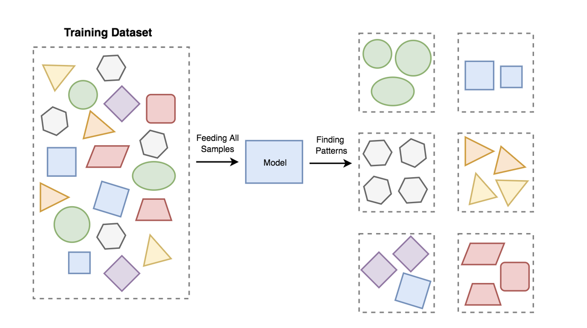
```

## Clustering versus classification
```{r, echo=FALSE, out.width="100%"}
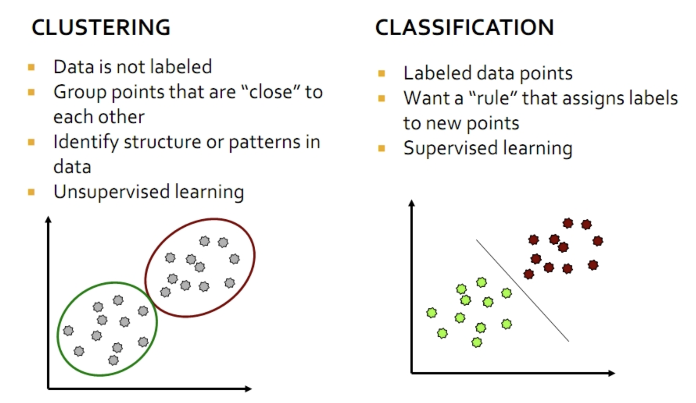
```

## Clustering
- Clustering: the process of grouping a set of objects into clusters of similar objects

- Discover “natural structure” of data
  
  - What is the criterion? 
  - How to identify them?
  - How to evaluate the results?

```{r, echo=FALSE, out.width="100%"}
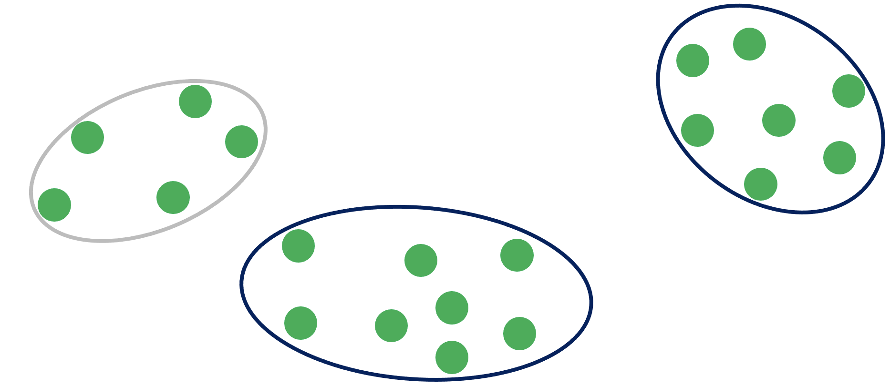
```

## Clustering
  
- Basic criteria

  - high intra-cluster similarity

  - low inter-cluster similarity

- No (little) supervision signal about the underlying clustering structure

- Need similarity/distance as guidance to form clusters

## Applications of text clustering
<div style="float:left; width:50%">
- Organize document collections
  
  - Automatically identify hierarchical/topical relation among documents
</div>
<div style="float:right; width:60%">
```{r, echo=FALSE, out.width="100%"}
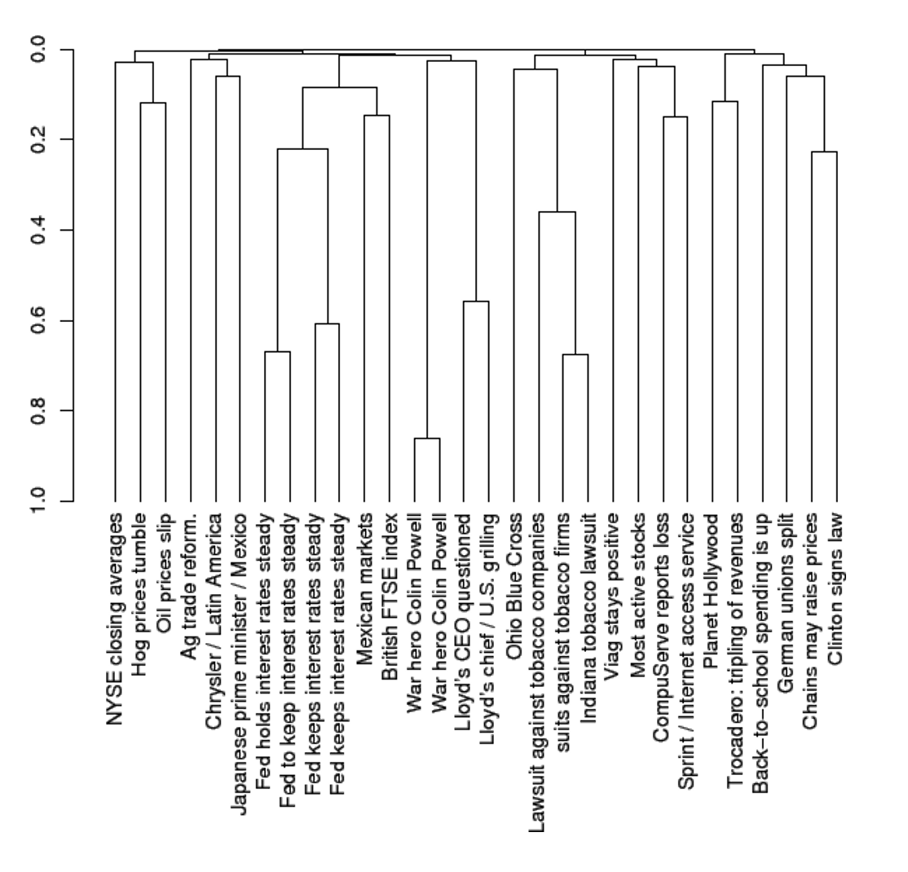
```
</div>

## Applications of text clustering
<div style="float:left; width:50%">
- Grouping search results
  
  - Organize documents by topics
  
  - Facilitate user browsing
</div>
<div style="float:right; width:50%">
```{r, echo=FALSE, out.width="100%"}
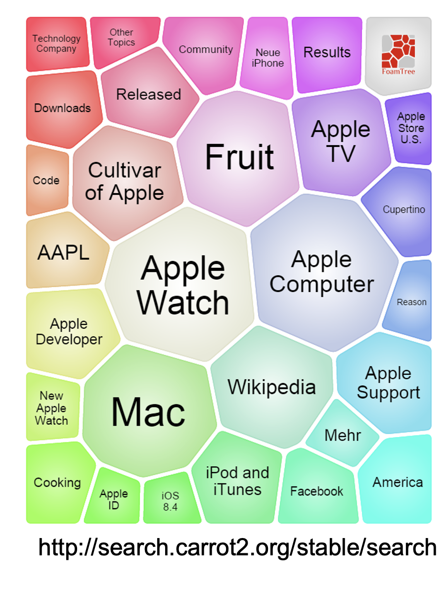
```
</div>

## Applications of text clustering
- Topic modeling
  - Grouping words into topics
  
```{r, echo=FALSE, out.width="100%"}
include_graphics("img/page 9.png")
```

<!-- # Distance metric -->

<!-- ## Distance metric -->
<!-- - Basic properties -->

<!--   - Positive separation -->
<!--     - $𝐷(x,y)>0, \forall x \neq y$ -->
<!--     - $𝐷(x,y)=0, \mathrm{i.f.f.}, x=y$ -->

<!--   - Symmetry  -->
<!--     - $𝐷(x,y)=𝐷(y,x)$ -->

<!--   - Triangle inequality -->
<!--     - $𝐷(x,y)≤𝐷(x,z)+𝐷(z,y)$ -->

<!-- ## Typical distance metric -->
<!-- - Minkowski metric -->

<!--   - $d(x,y) = \sqrt[p]{\sum^V_{i=1}{(x_i-y_i)^p}}$ -->

<!--     - When $p=2$, it is <span style="color:red">Euclidean distance</span> -->

<!-- - Cosine metric -->

<!--   - $𝑑(x,y)=1−cosine(x,y)$ -->

<!--     - when $|x|^2=|y|^2=1$, $1−cosine(x,y)=\frac{r^2}{2}$ -->

<!-- ## Typical distance metric -->
<!-- - Edit distance -->

<!--   - Count the minimum number of operations required to transform one string into the other -->

<!--     - Possible operations: insertion, deletion and replacement -->

<!-- <div style="float:left; width:70%"> -->
<!-- ```{r, echo=FALSE, out.width="70%", fig.align='right'} -->
<!-- 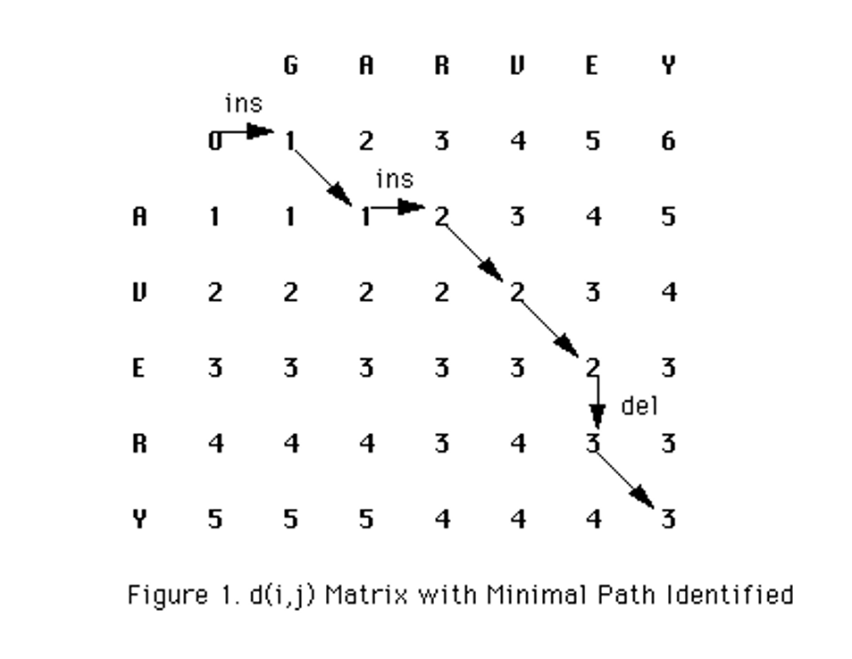 -->
<!-- ``` -->
<!-- </div> -->
<!-- <div style="float:right; width:30%"> -->
<!-- <br> <br> <br> <br>  -->
<!-- <p style="color:red">&larr; Can be efficiently solved by dynamic programming -->
<!-- </p> -->
<!-- </div> -->

<!-- ## Typical distance metric -->
<!-- - Edit distance -->

<!--   - Count the minimum number of operations required to transform one string into the other -->

<!--     - Possible operations: insertion, deletion and replacement -->

<!--   - Extent to distance between sentences -->

<!--     - Word similarity as cost of replacement -->

<!--       - “terrible” -> “bad”: low cost <span style="color:red">&rarr; Lexicon or distributional semantics</span> -->

<!--       - “terrible” -> “terrific”: high cost <span style="color:red">&rarr; Lexicon or distributional semantics</span> -->

<!--     - Preserving word order in distance computation -->

# Clustering algorithms

## Clustering algorithms

- Partitional clustering

- Hierarchical clustering

- Topic modeling

<!-- <ol> -->
<!--   <li>Partitional clustering algorithms</li> -->
<!--   <ul> -->
<!--     <li>Partition the instances into different groups</li> -->
<!--     <li>Flat structure</li> -->
<!--     <ul> -->
<!--       <li>Need to specify the number of classes in advance</li> -->
<!--     </ul> -->
<!--   </ul> -->
<!-- </ol> -->

<!-- ## Clustering algorithms -->
<!-- <ol start="2"> -->
<!--   <li>Hierarchical clustering algorithms</li> -->
<!--   <ul> -->
<!--     <li>Create a hierarchical decomposition of objects</li> -->
<!--     <li>Rich internal structure</li> -->
<!--     <ul> -->
<!--       <li>No need to specify the number of clusters</li> -->
<!--       <li>Can be used to organize objects</li> -->
<!--     </ul> -->
<!--   </ul> -->
<!-- </ol> -->

<!-- ## Clustering algorithms -->
<!-- <ol start="3"> -->
<!--   <li>Topic modeling</li> -->
<!--   <ul> -->
<!--     <li>Topic models are a suite of algorithms that uncover the hidden thematic structure in document collections. These algorithms help us develop new ways to search, browse and summarize large archives of texts.</li> -->
<!--     <li>We want to find themes (or topics) in documents</li> -->
<!--     <li>We don’t want to do supervised topic classification – rather not fix topics in advance nor do manual annotation </li> -->
<!--     <li>Need an approach which automatically teases out the topics</li> -->
<!--     <li>This is essentially a clustering problem - can think of both words and documents as being clustered</li> -->
<!--   </ul> -->
<!-- </ol> -->

## Hard versus soft clustering
- Hard clustering: Each document belongs to exactly one cluster
  
  - More common and easier to do

- Soft clustering: A document can belong to more than one cluster.
  

# Partitional clustering

## Partitional clustering algorithms
- Partitional clustering method: Construct a partition of <span style="color:lightgreen">$n$</span> documents into a set of <span style="color:lightgreen">$K$</span> clusters
- Given: a set of documents and the number <span style="color:lightgreen">$K$</span> 
- Find: a partition of <span style="color:lightgreen">$K$</span> clusters that optimizes the chosen partitioning criterion

  - Globally optimal
    - Intractable for many objective functions
    - Ergo, exhaustively enumerate all partitions
  
  - Effective heuristic methods: <em>K</em>-means and <em>K</em>-medoids algorithms
  
## Partitional clustering algorithms
- Typical partitional clustering algorithms
  
  - <em>k</em>-means clustering
    
    - Partition data by its closest mean

```{r, echo=FALSE, out.width="70%", fig.align='right'}
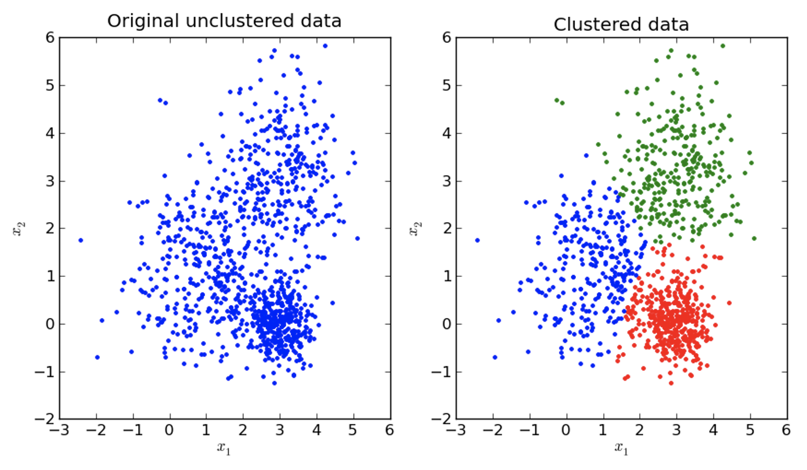
```

<!-- ## Partitional clustering algorithms -->
<!-- <div style="float:left;width:70%"> -->
<!-- - Typical partitional clustering algorithms -->

<!--   - <em>k</em>-means clustering -->

<!--     - Partition data by its closest mean -->

<!--   - Gaussian Mixture Model -->

<!--     - Consider variance within the cluster as well -->
<!-- </div> -->
<!-- <div style="float:right;width:30%"> -->
<!-- ```{r, echo=FALSE,out.width="100%"} -->
<!-- include_graphics("img/page 23.png") -->
<!-- ``` -->
<!-- </div> -->

## K-Means algorithm
- Assumes documents are real-valued vectors.

- Clusters based on <span style="font-style:italic;color:red">centroids</span> of points in a cluster, $c$:

$$\vec \mu(c)=\frac{1}{|c|}\sum_{\vec a \in c}{\vec x}$$

- Reassignment of instances to clusters is based on distance to the current cluster centroids.
  

## K-Means algorithm
- Select $K$ random docs $\{s_1, s_2,… s_K\}$ as seeds.
- Until clustering converges (or other stopping criterion):
  
  - For each doc $d_i$: <br>
   
    - Assign $d_i$ to the cluster $c_j$ such that $dist(x_i, s_j)$ is minimal.
  
  - <span style="color:DarkCyan">(Next, update the seeds to the centroid of each cluster)</span>
  
  - For each cluster cj
    - $s_j = \mu(c_j)$
    
## K-Means example (K=2)

```{r, out.width="100%"}
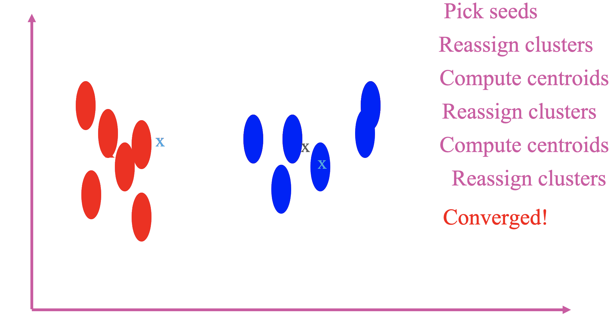
```

<!-- ## Termination conditions -->
<!-- - Several possibilities, e.g., -->

<!--   - A fixed number of iterations. -->

<!--   - Doc partition unchanged. -->

<!--   - Centroid positions don’t change. -->

<!-- ## Convergence -->
<!-- - Why should the <em>K</em>-means algorithm ever reach a <em>fixed point</em>? -->

<!--   - A state in which clusters don’t change. -->

<!-- - <em>K</em>-means is a special case of a general procedure known as the <em>Expectation Maximization (EM) algorithm</em>. -->

<!--   - EM is known to converge. -->

<!--   - Number of iterations could be large. -->

<!--     - But in practice usually isn’t -->

<!-- ## Seed Choice -->
<!-- - Results can vary based on random seed selection. -->

<!-- - Some seeds can result in poor convergence rate, or convergence to sub-optimal clusterings. -->

<!--   - Select good seeds using a heuristic (e.g., doc least similar to any existing mean) -->

<!--   - <span style="color:blue">Try out multiple starting points</em> -->

<!--   - Initialize with the results of another method. -->

<!-- ## <em>K</em>-means issues, variations, etc. -->
<!-- - Recomputing the centroid after every assignment (rather than after all points are re-assigned) can improve speed of convergence of <em>K</em>-means -->

<!-- - Assumes clusters are spherical in vector space -->

<!--   - Sensitive to coordinate changes, weighting etc.  -->

<!-- - Disjoint and exhaustive -->

<!--   - Doesn’t have a notion of “outliers” by default -->

<!--   - But can add outlier filtering -->

# Hierarchical Clustering

## Dendrogram: Hierarchical clustering
<div style="float:left;width:50%">
- Build a tree-based hierarchical taxonomy (<em>dendrogram</em>) from a set of documents.

- Clustering obtained by cutting the dendrogram at a desired level: each <b>connected</b> component forms a cluster.
</div>
<div style="float:right;width:50%">
```{r, out.width="100%"}
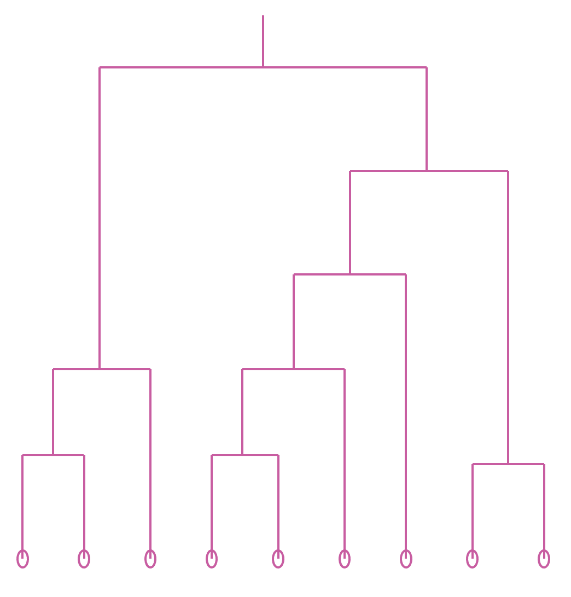
```
</div>

## Clustering algorithms
- Typical hierarchical clustering algorithms
  
  - Bottom-up agglomerative clustering
    
    - Start with individual objects as separated clusters
    - Repeatedly merge closest pair of clusters

```{r, out.width="100%"}
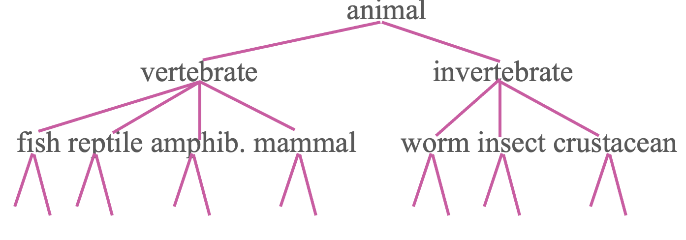
```

## Clustering algorithms
- Typical hierarchical clustering algorithms
  
  - Top-down divisive clustering
    
    - Start with all data as one cluster
    
    - Repeatedly splitting the remaining clusters into two

```{r, out.width="60%", fig.align='right'}
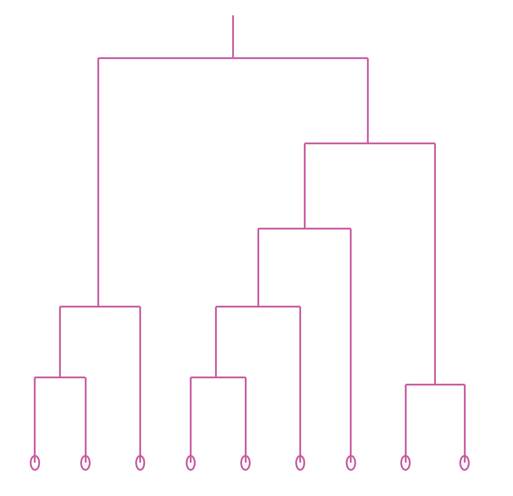
```

## Hierarchical Agglomerative Clustering (HAC)
- Starts with each doc in a separate cluster
  
  - then repeatedly joins the <em><u>closest pair</u></em> of clusters, until there is only one cluster.

- The history of merging forms a binary tree or hierarchy.

## Closest pair of clusters
- Many variants to defining closest pair of clusters (linkage methods):
  
  - <b>Single-link</b>
    - Similarity of the <em>most</em> cosine-similar

  - <b>Complete-link</b>
    - Similarity of the “furthest” points, the <em>least</em> cosine-similar

  - <b>Centroid</b>
    - Clusters whose centroids (centers of gravity) are the most cosine-similar

  - <b>Average-link</b>
    - Average cosine between pairs of elements
    
  - <b>Ward's linkage</b>
    - Ward's minimum variance method, much in common with analysis of variance (ANOVA)
    - The distance between two clusters is computed as the increase in the "error sum of squares" (ESS) after fusing two clusters into a single cluster.

<!-- ## Single Link Agglomerative Clustering -->
<!-- - Use maximum similarity of pairs: -->

<!-- $$sim(c_i, c_j) = \max_{x \in c_i, y\in c_j}{sim(x,y)}$$ -->

<!-- - Can result in “straggly” (long and thin) clusters due to chaining effect. -->

<!-- - After merging $c_i$ and $c_j$, the similarity of the resulting cluster to another cluster, $c_k$, is: -->

<!-- $$sim((c_i \cup c_j), c_k) = max(sim(c_i, c_k), sim(c_j, c_k))$$ -->
<!-- \newpage -->

<!-- ## Complete Link -->
<!-- - Use minimum similarity of pairs: -->

<!-- $$sim(c_i, c_j) = \min_{x \in c_i, y\in c_j}{sim(x,y)}$$ -->

<!-- - Makes “tighter,” spherical clusters that are typically preferable. -->

<!-- - After merging $c_i$ and $c_j$, the similarity of the resulting cluster to another cluster, $c_k$, is: -->

<!-- $$sim((c_i \cup c_j), c_k) = min(sim(c_i, c_k), sim(c_j, c_k))$$ -->
<!-- ```{r, out.width="100%"} -->
<!-- 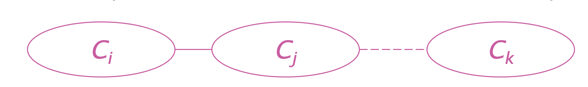 -->
<!-- ``` -->

# Topic Modeling

## Topic models
<div style="float:left;width:60%">
- Three concepts: words, topics, and documents

- Documents are a collection of words and have a probability distribution over topics

- Topics have a probability distribution over words

- Model: 
  
  - Topics made up of words used to generate documents
</div>
<div style="float:right;width:40%">
```{r,out.width="100%"}
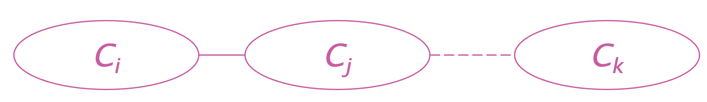
```

</div>

## Topic models | Reality: Documents observed, infer  topics
```{r,out.width="80%"}
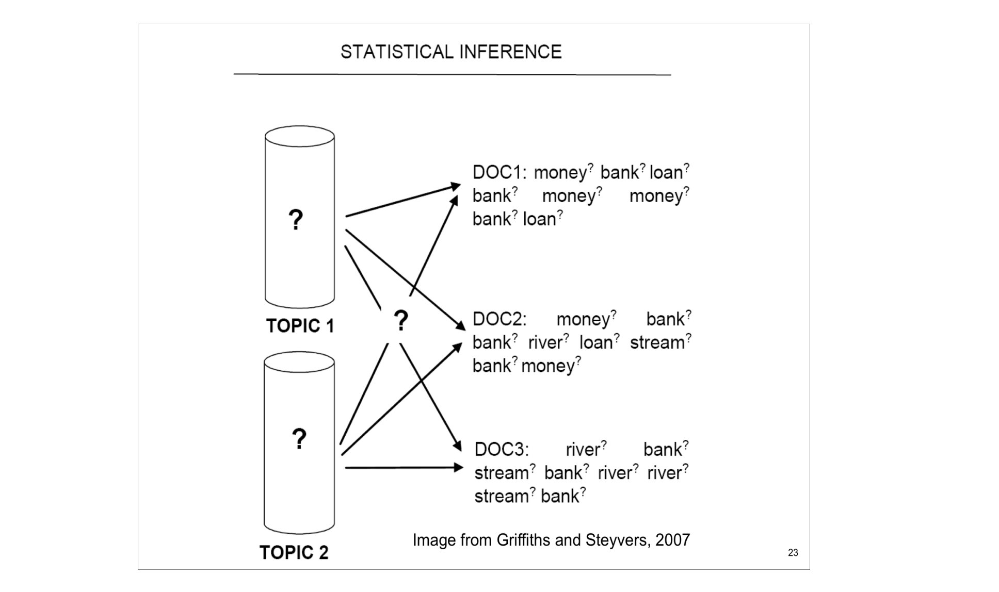
```

## LDA graphical model
```{r, out.width="100%"}
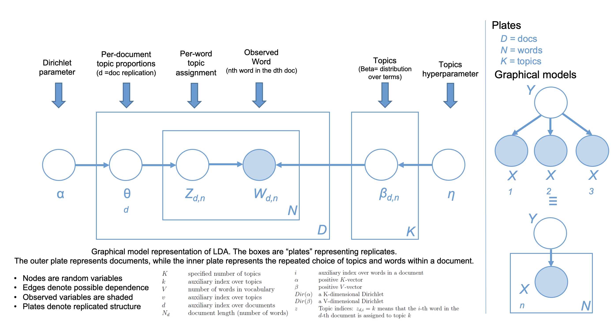
```

## Probabilistic modeling
1. Treat data as observations that arise from a generative probabilistic process that includes hidden variables: For documents, the hidden variables reflect the thematic structure of the collection.

2. Infer the hidden structure using posterior inference: What are the topics that describe this collection?

3. Situate new data into the estimated model: How does this query or new document fit into the estimated topic structure?

## LDA: Identifying structure in text
```{r, out.width="100%"}
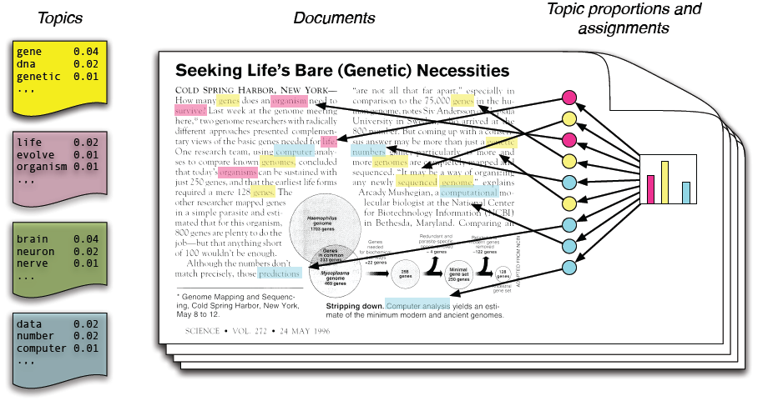
```

<!-- ##  -->
<!-- ```{r,out.width="100%"} -->
<!-- 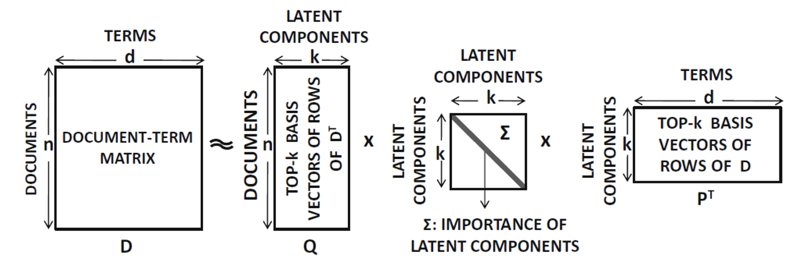 -->
<!-- ``` -->

<!-- ## Latent Dirichlet Allocation -->
<!-- ```{r} -->
<!-- question <- c("What is Latent Dirichlet Allocation (LDA)?", "What is used for?", "How is it related to text mining and other machine learning techniques?") -->

<!-- answers <- c("A generative probabilistic model for collections of discrete data such as text corpora. LDA is a three-level hierarchical Bayesian model, in which each item of a collection is modeled as a finite mixture over an underlying set of latent topics. Each observed word originates from a topic that we do not directly observe. Each topic is, in turn, modeled as an infinite mixture over an underlying set of topic probabilities.", -->
<!-- "The fitted model can be used to estimate the similarity between documents as well as between a set of specified keywords using an additional layer of latent variables which are referred to as topics. -->
<!-- ", -->
<!-- "Topic models can be seen as classical text mining or natural language processing tools. Fitting topic models based on data structures from the text mining usually done by considering the problem of modeling text corpora and other collections of discrete data. One of the advantages of LDA over related latent variable models is that it provides well-defined inference procedures for previously unseen documents (LSI uses a singular value decomposition)") -->
<!-- lda <- data.frame(q = question, a = answers) -->
<!-- lda[1] <- cell_spec(lda[[1]],bold = T,font_size = 24) -->
<!-- colnames(lda) <- c("", "") -->
<!-- lda %>%  -->
<!--   kbl(booktabs = T, escape = F, align = "l") %>%  -->
<!--   kable_styling(fixed_thead = T) %>% -->
<!--   kable_paper("hover", full_width=T) %>%  -->
<!--   column_spec(1, width = "18em") -->
<!-- ``` -->

<!-- ## Topic Matrix -->
<!-- ```{r, out.width="100%"} -->
<!-- 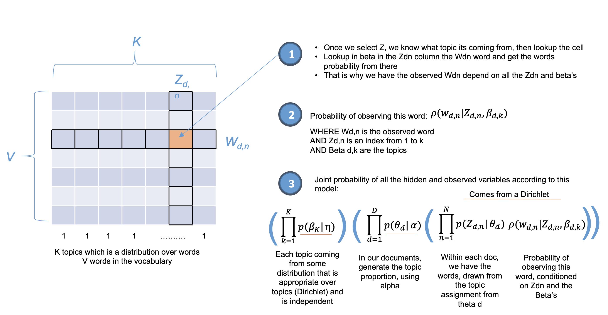 -->
<!-- ``` -->

<!-- ## The Dirichlet Distribution -->
<!-- <div style="float:left; width:40%"> -->
<!-- ```{r, out.width="100%"} -->
<!-- 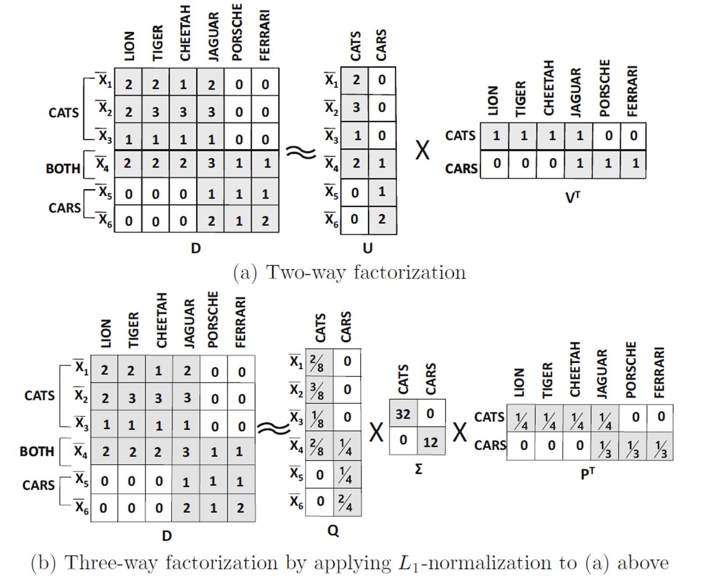 -->
<!-- ``` -->
<!-- </div> -->

<!-- <div style="float:right; width:60%"> -->
<!-- 1. The Dirichlet distribution is an exponential family distribution over the simplex, i.e., positive vectors that sum to one -->

<!-- $$p(\theta|\vec a) = \frac{\Gamma(\sum_i{a_i})}{\prod_i{\Gamma(\alpha_i)}}\prod_i{\theta_i^{\alpha_i - 1}}$$ -->

<!-- 2. The Dirichlet is <u>conjugate</u> to the multinomial. Given a multinomial -->
<!-- observation, the posterior distribution of $\theta$ is a Dirichlet. -->

<!-- 3. The parameter $\alpha$ controls the mean shape and sparsity of $\theta$. Parameter $\alpha$ is a k-vector with components $\alpha_i$ >0   -->

<!-- 4. The topic proportions are a K dimensional Dirichlet. The topics are a V dimensional Dirichlet. -->

<!-- </div> -->

<!-- ## Geometric Interpretation of LDA -->
<!-- <div style="float:left; width:45%"> -->
<!-- ```{r, out.width="100%"} -->
<!-- 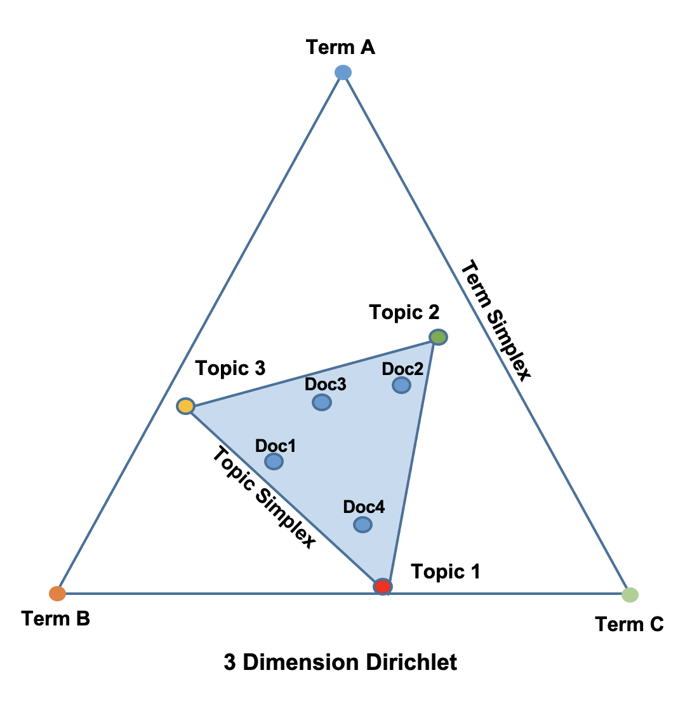 -->
<!-- ``` -->
<!-- </div> -->

<!-- <div style="float:right; width:55%"> -->
<!-- as we draw random variables from theta, I’m going to get distributions over 3 elements.  -->

<!-- $\theta$ ~ Dirichlet(1,1,1) = $\alpha_1$ = $\alpha_2$ = $\alpha_3$ = 1, uniform distribution as an example -->

<!-- ```{r,out.width="80%"} -->
<!-- 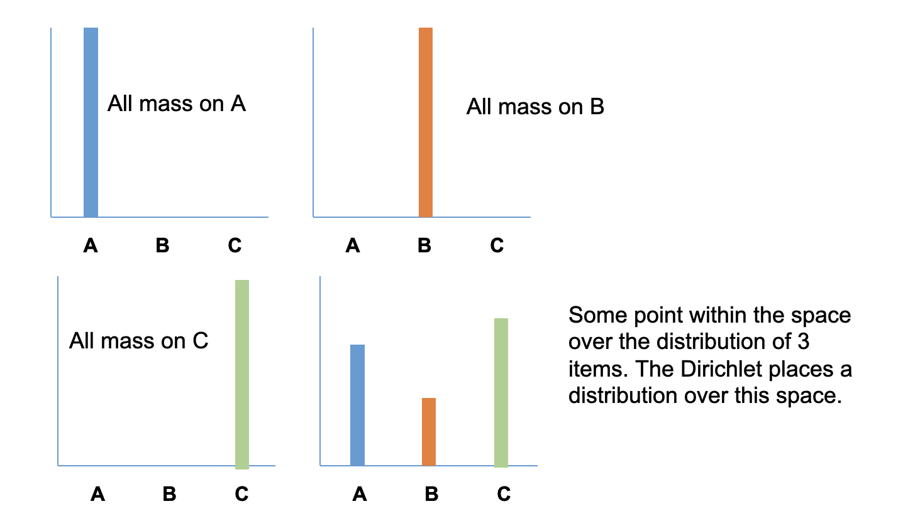 -->
<!-- ``` -->

<!-- Dirichlet is parameterized by $\alpha$, so as $\alpha$ increases the chart gets more peaky. -->
<!-- </div> -->

<!-- ## Density Example -->
<!-- <div style="float:left;width:40%"> -->
<!-- ```{r,out.width="100%"} -->
<!-- 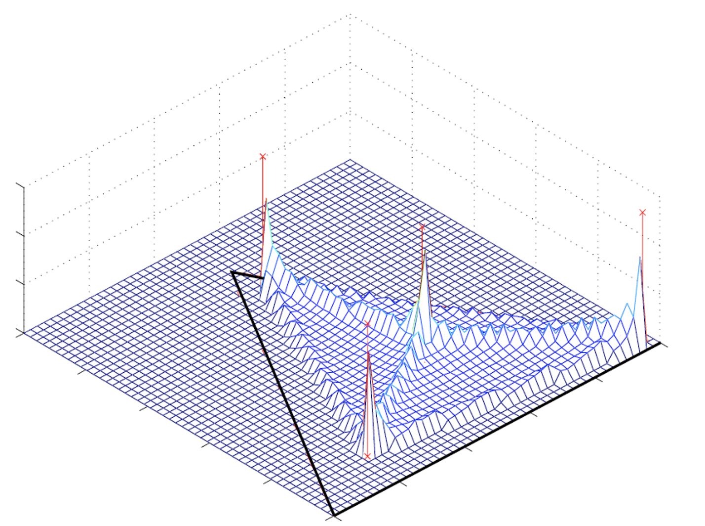 -->
<!-- ``` -->

<!-- When $\alpha < 1 (s < k)$, you get sparsity and on the 3 simplex you get a figure with increased probability at the corners. -->
<!-- </div> -->
<!-- <div style="float:right;width:60%"> -->
<!-- <span style="font-size:20px">Important piece of info:</span><br> -->
<!-- <ol>  -->
<!--   <li>The expectations of the posterior (sometimes called M for mean)</li> -->
<!--   <li>The sum of the alphas, which determines the peaky-ness of the Dirichlet </li> -->
<!--   <ul> -->
<!--     <li>If this sum is small, the Dirichlet will be more spread out</li> -->
<!--     <li>If large, the Dirichlet will have more peaks at its expectation (sometimes called S for scaling)</li> -->
<!--   </ul> -->
<!-- </ol> -->
<!-- ```{r,out.width="50%", fig.align='center'} -->
<!-- 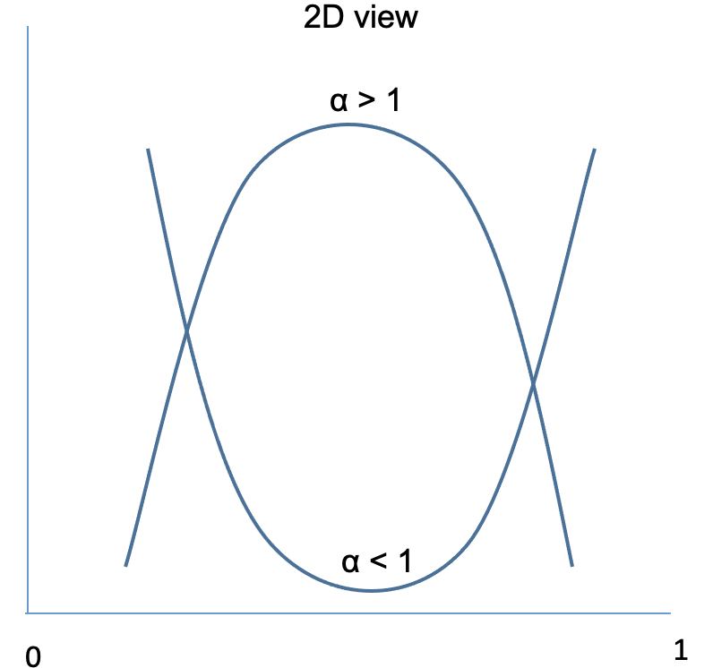 -->
<!-- ``` -->
<!-- </div> -->

<!-- ## LDA Inferences -->
<!-- ```{r, out.width="100%"} -->
<!-- 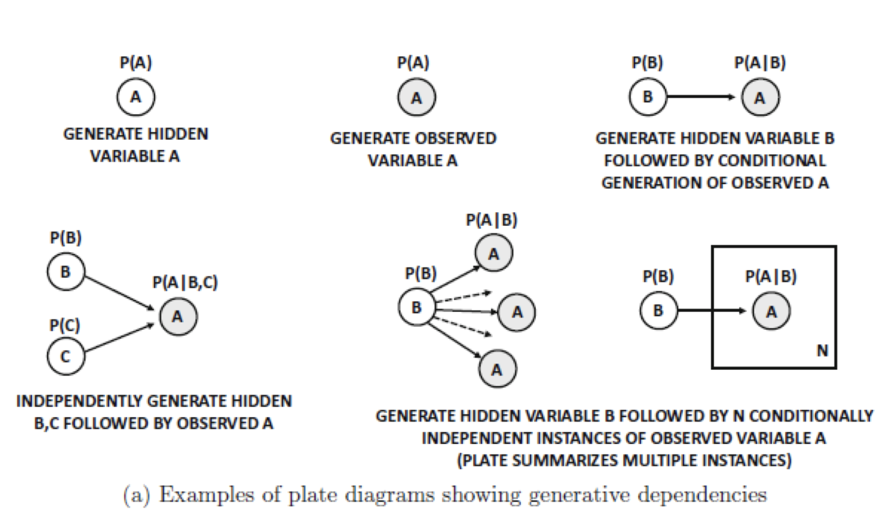 -->
<!-- ``` -->

<!-- ## Posterior distribution & model estimation for LDA -->
<!-- ```{r, out.width="100%"} -->
<!-- 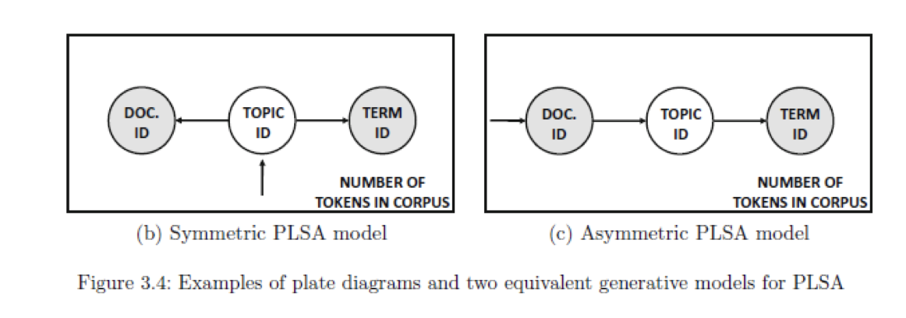 -->
<!-- ``` -->

<!-- ## Maximum likelihood (Ml) estimation -->
<!-- ```{r, out.width="100%"} -->
<!-- 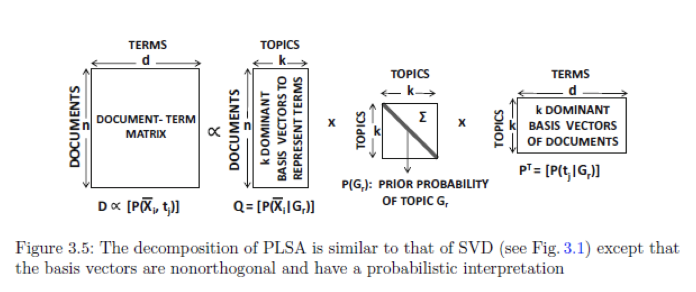 -->
<!-- ``` -->

# Cluster Validation

## Desirable properties of clustering algorithms 
- Scalability
  
  - Both in time and space

- Ability to deal with various types of data
  
  - No/less assumption about input data
  
  - Minimal requirement about domain knowledge

- Interpretability and usability

## What is a good clustering?
- Internal criterion: A good clustering will produce high quality clusters in which:

  - the <u>intra-class</u> (that is, intra-cluster) similarity is high
  
  - the <u>inter-class</u> similarity is low

  - The measured quality of a clustering depends on both the document representation and the similarity measure used


## Cluster validation
- Criteria to determine whether the clusters are meaningful
  
  - Internal validation
    
    - Stability and coherence
  
  - External validation
    
    - Match with known categories

## Internal validation

- Coherence

  - Inter-cluster similarity v.s. intra-cluster similarity
  
  - Davies–Bouldin index
    
    - $DB = \frac{1}{k}\sum_{i=1}^k{\underset{j \neq i}{\operatorname{max}}{(\frac{\sigma_i + \sigma_j}{d(c_i,c_j)})}}$  <span style="color:red">&larr;</span> <em>Evaluate every pair of clusters</em>

      - where $k$ is total number of clusters, $\sigma_i$ is average distance of all elements in cluster $i$ from the cluster center, $d(c_i, c_j)$ is the distance between cluster centroid $c_i$ and $c_j$.

<p style="color:red">We prefer smaller DB-index!</p>

<!-- ## Internal validation -->
<!-- - Coherence -->

<!--   - Inter-cluster similarity v.s. intra-cluster similarity -->

<!--   - Dunn index -->

<!--     - $D = \frac{ \underset{1 \leq i < j \leq k}{\operatorname{min}}d(c_i, c_j)}{\underset{1 \leq i \leq k}{\operatorname{max}} \sigma_i}$  \ \ \ \ <span style="color:red">We prefer larger D-index!</span> -->

<!--       - Worst situation analysis -->

<!-- - Limitation -->

<!--   - No indication of actual application’s performance -->

<!--   - Bias towards a specific type of clustering algorithm if that algorithm is designed to optimize a similar metric -->

<!-- ## External validation -->
<!-- - Given class label $\Omega$ (<span style="color:blue; font-size: 18px">Required, might need extra cost</span>) on each instance -->

<!--   - Purity: correctly clustered documents in each cluster -->

<!--     - $purity(\Omega,C) = \frac{1}{N}\sum_{i=1}^k{\underset{j}{\operatorname{max}}|c_i \cap w_j|}$   <span style="color:red; font-size:18px">&larr; Not a good metric if we assign each document into a single cluster</span> -->
<!--       - where $c_i$ is a set of documents in cluster $i$, and $w_j$ is a set of documents in class $j$ -->

<!-- <div style="float: left; width:30%"> -->
<!-- $$purity(\Omega, C) = \\ \frac{1}{17}(5 + 4 + 3)$$ -->
<!-- </div> -->
<!-- <div style="float: right; width:70%"> -->
<!-- ```{r, out.width="80%"} -->
<!-- 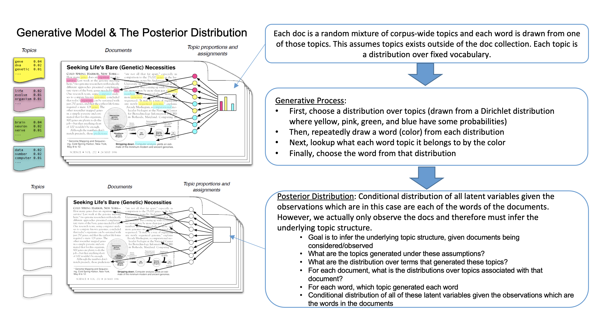 -->
<!-- ``` -->
<!-- </div> -->

<!-- ## External validation -->
<!-- - Given class label Ω on each instance -->

<!--   - Normalized mutual information (NMI) -->

<!--     - $NMI(\Omega, C) = \frac{I(\Omega, C)}{[H(\Omega)+H(C)]/2}$ <span style="color:red; font-size:18px">&swarr; Normalization by entropy will penalize too many clusters</span> -->
<!--       - where $I(\Omega, C) = \sum_i \sum_j P(w_i \cap c_j)log{\frac{P(w_i \cap c_j)}{P(w_i)P(c_j)}} \\ H(\Omega) = - \sum_i{P(w_i) logP(w_i)} \ \ \ \mathrm{and} \ \ \ H(C) = - \sum_j{P(c_j)logP(c_j)}$  -->

<!--     - Indicate the increase of knowledge about classes when we know the clustering results -->

<!-- ## External validation -->
<!-- - Given class label $\Omega$ on each instance -->

<!--   - Rand index -->

<!--     - Idea: we want to assign two documents to the same cluster if and only if they are from the same class -->

<!--     - $RI = \frac{TP + TN}{TP + FP + FN + TN}$ <span style="color:red;font-size:18px">&larr; Essentially it is like classification accuracy</span> -->

<!-- ```{r, out.width="80%", fig.align='center'} -->
<!-- 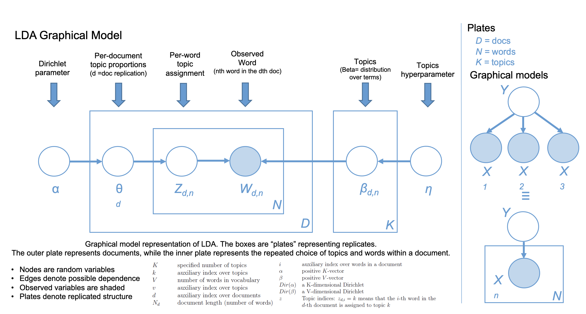 -->
<!-- ``` -->

<!-- ## External validation -->
<!-- - Given class label $\Omega$ on each instance -->
<!--   - Rand index -->

<!-- ```{r, out.width="90%", fig.align='center'} -->
<!-- 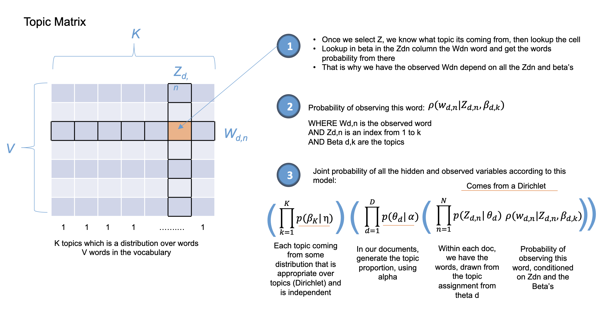 -->
<!-- ``` -->

<!-- ## External validation -->
<!-- - Given class label $\Omega$ on each instance -->

<!--   - Precision/Recall/F-measure -->

<!--      - Based on the contingency table, we can also define precision/recall/F-measure of clustering quality -->

<!-- ```{r, out.width="60%", fig.align='center'} -->
<!-- 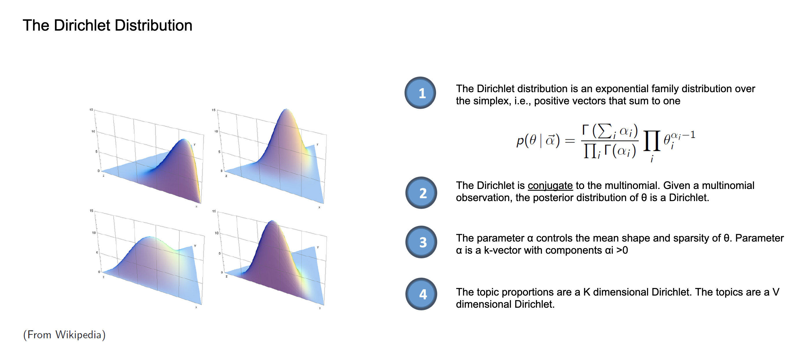 -->
<!-- ``` -->

<!-- ## Group Average -->
<!-- - Similarity of two clusters = average similarity of all pairs within merged cluster. -->

<!-- $$sim(c_i, c_j) = \frac{1}{|c_i \cup c_j|(|c_i \cup c_j| - 1)}\sum_{\vec x \in (c_i \cup c_j)} \sum_{\vec y \in (c_i \cup c_j): \vec y \neq \vec x}{sim(\vec x, \vec y)}$$ -->

<!-- - Compromise between single and complete link. -->

<!-- - Two options: -->

<!--   - Averaged across all ordered pairs in the merged cluster  -->

<!--   - Averaged over all pairs between the two original clusters -->

<!-- - No clear difference in efficacy -->

<!-- ## Computing Group Average Similarity -->
<!-- - Always maintain sum of vectors in each cluster. -->

<!-- $$\vec s(c_j) = \sum_{\vec x \in c_j}{\vec x}$$ -->
<!-- - Compute similarity of clusters in constant time: -->

<!-- $$sim(c_i, c_j) = \frac{\vec s(c_i) + \vec s(c_j) \cdot (\vec s(c_j) + \vec s(c_j)) - (|c_i| + |c_j|)}{(|c_i| + |c_j|)(|c_i| + |c_j| - 1)}$$ -->
<!-- \newpage -->

## External criteria for clustering quality
- Quality measured by its ability to discover some or all of the hidden patterns or latent classes in gold standard data

- Assesses a clustering with respect to <u>ground truth</u> … requires <span style="color:green; font-style:italic">labeled data</span>

- Assume documents with $C$ gold standard classes, while our clustering algorithms produce $K$ clusters, $\omega_1$, $\omega_2$, …, $\omega_K$  with $n_i$ members.

<!-- ## External Evaluation of Cluster Quality -->
<!-- - Simple measure: <u>purity</u>, the ratio between the dominant class in the cluster $\pi_i$ and the size of cluster $\omega_i$ -->

<!-- $$Purity(\omega_i) = \frac{1}{n_i}\max_j(n_{ij}) \ \ \ j \in C$$ -->

<!-- - Biased because having n clusters maximizes purity -->

<!-- - Others are entropy of classes in clusters (or mutual information between classes and clusters) -->

<!-- ## Rand index and Cluster F-measure -->

<!-- $$RI = \frac{A + D}{A + B + C + D}$$ -->
<!-- <center style="color:darkred">Compare with standard Precision and Recall:</center> -->

<!-- $$P= \frac{A}{A + B} \ \ \ \ \ \ P = \frac{A}{A + C}$$ -->
<!-- <center style="color:darkred">People also define and use a cluster F-measure, which is probably a better measure</center> -->

# Summary 

## Summary
- Text clustering

- In clustering, clusters are inferred from the data without human input (unsupervised learning)

- Many ways of influencing the outcome of clustering: number of clusters, similarity measure, representation of documents

- Evaluation

# Practical 5
