```{r, include=FALSE}
library(knitr)
library(kableExtra)
```

## Lecture’s Plan

1. Feed-forward neural net
2. Recurrent neural net
    1. SRN
    2. LSTM
    3. GRU
    4. Bi-LSTM

## What is Deep Learning (DL) ? 

A machine learning subfield of learning <span style="color:orange;">representations</span> of data. Exceptional effective at <span style="color:orange;">learning patterns</span>.

Deep learning algorithms attempt to learn (multiple levels of) representation by using a <span style="color:orange;">hierarchy of multiple layers</span>

If you provide the system <span style="color:orange;">tons of information</span>, it begins to understand it and respond in useful ways.

```{r, echo=FALSE, out.width="70%", fig.align='center'}
include_graphics("img/page 3.png")
```

## Multi-Layer Feed-Forward Networks

- Multi-layer networks can represent arbitrary functions, but an effective learning algorithm for such networks was thought to be difficult.
- A typical multi-layer network consists of an input, hidden and output layer, each fully connected to the next, with activation feeding forward.

```{r, echo=FALSE, out.width="70%", fig.align='center'}
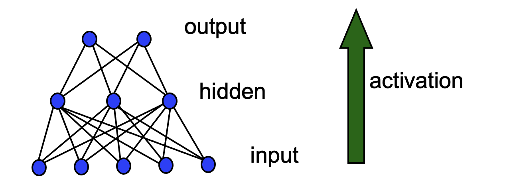
```

- The weights determine the function computed. Given an arbitrary number of hidden units, any boolean function can be computed with a single hidden layer.

## Neural Network Intro

<div style="float:left;width:50%">
```{r, echo=FALSE, out.width="100%", fig.align='center'}
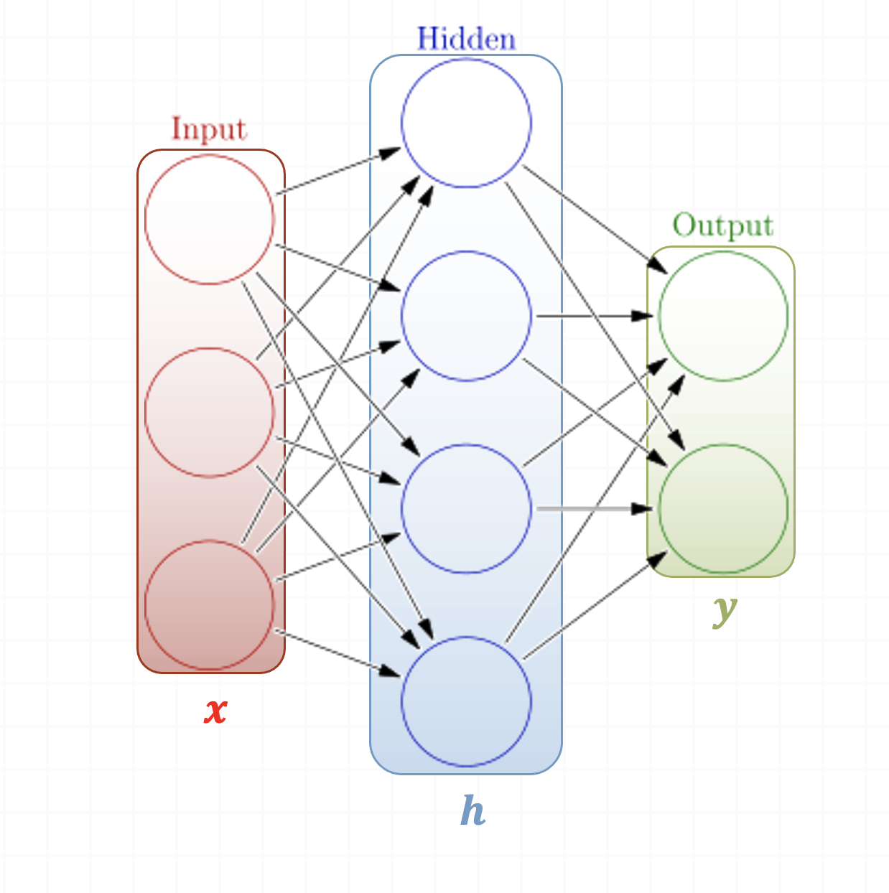
```
</div>
<div style="float:right;width:50%">
  <span style="color:blue">$$h = \sigma(W_1x + b_1)$$</span>
  <span style="color:green">$$y = \sigma(W_2h + b_2)$$</span>
</div>

## Neural Network Intro

<div style="float:left;width:50%">
```{r, echo=FALSE, out.width="100%", fig.align='center'}

```
</div>
<div style="float:right;width:50%">
  <span style="color:blue">$$h = \sigma(W_1x + b_1)$$</span>
  <span style="color:green">$$y = \sigma(W_2h + b_2)$$</span>
  <br> <br> <br> <br>
    
4 + 2 = 6 neurons (not counting inputs)
<br>
    
[3 x 4] + [4 x 2] = 20 weights 
<br>
    
4 + 2 = 6 biases
<br>
    
<span style="color:orange">26 learnable <b>parameters</b></span>
</div>

## Neural Network Intro

```{r, echo=FALSE, out.width="100%", fig.align='center'}
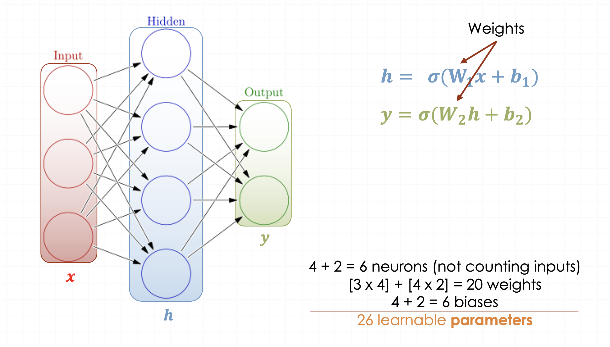
```

## Neural Network Intro

```{r, echo=FALSE, out.width="100%", fig.align='center'}
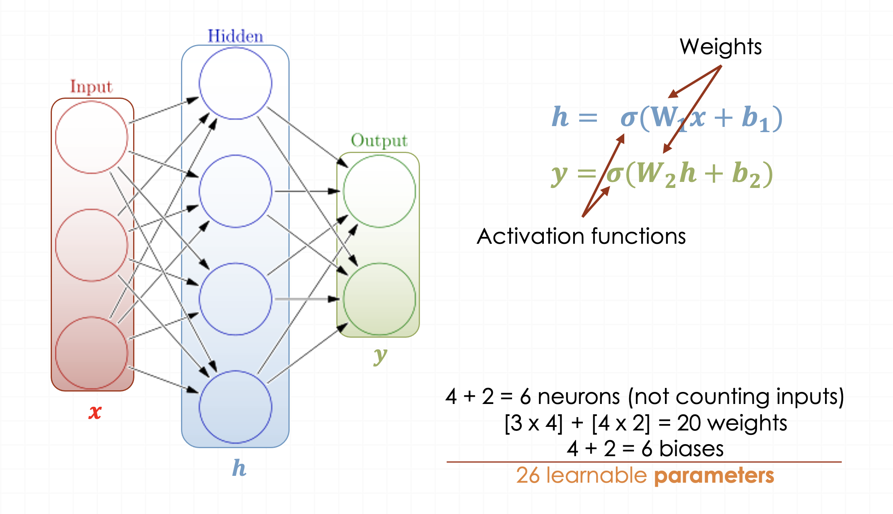
```

## Neural Network Intro

```{r, echo=FALSE, out.width="100%", fig.align='center'}
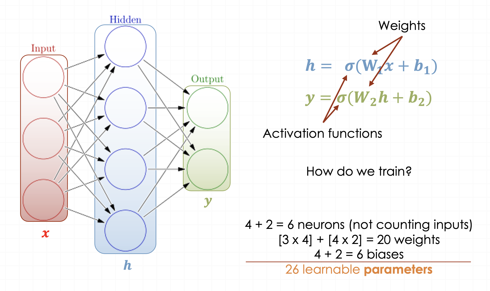
```

## Training

<center><span style="font-size: 8px">https://medium.com/@ramrajchandradevan/the-evolution-of-gradient-descend-optimization-algorithm-4106a6702d39</span></center>

<center></center>

<div style="float:left;width:75%">
Optimize (min. or max.) <span style="color:orange;font-weight:bold">objective/cost function <b>$J$</b>$(\theta)$</span>
<br>

Generate <span style="color:orange;font-weight:bold">error signal</span> that measures difference between predictions and target values
<br> &nbsp; 
    
<br> &nbsp;

</div>
<div style="float:right;width:25%">

</div>
<br> <br>

<div style="float:left;width:30%">

</div>
<div style="float:right;width:70%">
Use error signal to change the <span style="color:orange;font-weight:bold">weights</span> and get more accurate predictions 
<br> <br>
    
Subtracting a fraction of the <span style="color:orange;font-weight:bold">gradient</span> moves you towards the <span style="color:orange;font-weight:bold">(local) minimum of the cost function</span>
</div>

## Gradient Descent

- Define objective to minimize error:
$$E(W) = \sum_{d \in D} \sum_{k \in K} (t_{kd} - O_{kd})^2$$

    where $D$ is the set of training examples, $K$ is the set of output units, $t_{kd}$ and $o_{kd}$ are, respectively, the teacher and current output for unit $k$ for example $d$.
- The derivative of a sigmoid unit with respect to net input is:
$$\frac{\partial{o_j}}{\partial{net_j}} = o_j(1-o_j)$$    
- Learning rule to change weights to minimize 
$$\Delta w_{ji} = - \eta \frac{\partial{E}}{\partial{w_{ji}}}$$

## Backpropagation Learning Rule

- Each weight changed by:
$$\Delta w_{ji} = \eta \delta_j o_i $$
$$\delta_j = o_j(1 - o_j)(t_j - o_j) \ \ \ \text{if } j \text{ is an output unit}$$
$$\delta_j = o_j(1 - o_j)\sum_k{\delta_k w_{kj}} \ \ \ \text{if } j \text{ is a hidden unit}$$
    
    where $\eta$ is a constant called the learning rate
    
    $t_j$ is the correct teacher output for unit $j$
    
    $\delta_j$ is the error measure for unit $j$

## Gradient Descent

<span style="color:orange;font-weight:bold">objective/cost function <b>$J$</b>$(\theta)$</span>

Update each element of $\theta$:

$$\theta^{new}_j = \theta^{old}_j - \alpha \frac{d}{\theta^{old}_j} J(\theta)$$ 

Matrix notation for all parameters (<span style="color:red">$\alpha$: learning rate</span>):

$$\theta^{new}_j = \theta^{old}_j - \alpha \nabla _{\theta}J(\theta)$$  
```{r, echo=FALSE, out.width="30%", fig.align='center'}
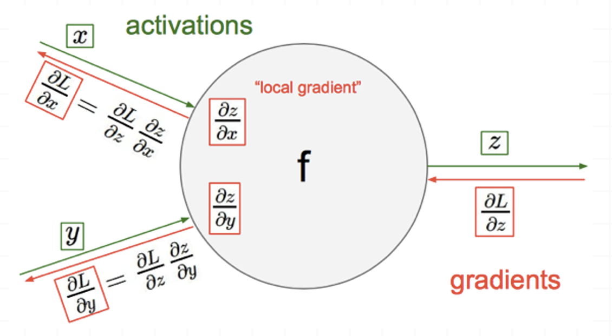
```

Recursively apply <span style="color:orange;font-weight:bold">chain rule</span> though each node

## Gradient Descent

<span style="color:orange;font-weight:bold">objective/cost function <b>$J$</b>$(\theta)$</span> &nbsp;&nbsp;&nbsp;&nbsp; <span style="color:darkred"><u>Review of backpropagation</u></span>

Update each element of $\theta$:

$$\theta^{new}_j = \theta^{old}_j - \alpha \frac{d}{\theta^{old}_j} J(\theta)$$ 

Matrix notation for all parameters (<span style="color:red">$\alpha$: learning rate</span>):

$$\theta^{new}_j = \theta^{old}_j - \alpha \nabla _{\theta}J(\theta)$$

```{r, echo=FALSE, out.width="30%", fig.align='center'}

```

Recursively apply <span style="color:orange;font-weight:bold">chain rule</span> though each node

## Error Backpropagation

<ul><li>First calculate error of output units and use this to change the top layer of weights.</li></ul>

<div style="float:left;width:50%">
</div>
<div style="float:right;width:50%">
```{r, echo=FALSE, out.width="100%", fig.align='center'}
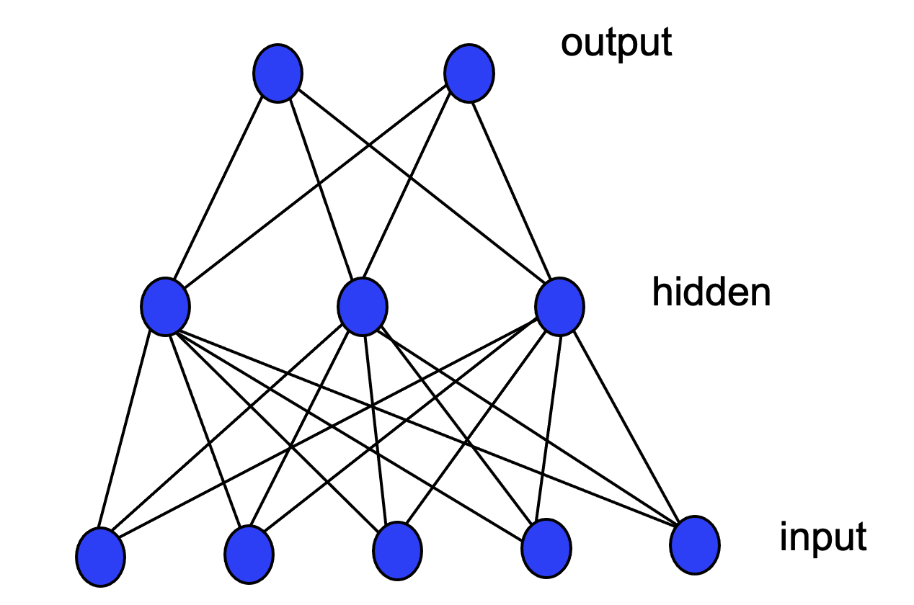
```
</div>

## Error Backpropagation

<ul><li>First calculate error of output units and use this to change the top layer of weights.</li></ul>

<div style="float:left;width:50%">
Current output: $o_j=0.2$

</div>
<div style="float:right;width:50%">
```{r, echo=FALSE, out.width="100%", fig.align='center'}

```
</div>

## Error Backpropagation

<ul><li>First calculate error of output units and use this to change the top layer of weights.</li></ul>

<div style="float:left;width:50%">
Current output: $o_j=0.2$
<br>
    
Correct output: $t_j=1.0$
    
</div>
<div style="float:right;width:50%">
```{r, echo=FALSE, out.width="100%", fig.align='center'}

```
</div>

## Error Backpropagation

<ul><li>First calculate error of output units and use this to change the top layer of weights.</li></ul>

<div style="float:left;width:50%">
Current output: $o_j=0.2$
<br>
    
Correct output: $t_j=1.0$
<br>
    
Error $\delta_j = o_j(1–o_j)(t_j–o_j)$
<br>
    
$0.2(1–0.2)(1–0.2)=0.128$
</div>
<div style="float:right;width:50%">
```{r, echo=FALSE, out.width="100%", fig.align='center'}

```
</div>

## Error Backpropagation

<ul><li>First calculate error of output units and use this to change the top layer of weights.</li></ul>

<div style="float:left;width:50%">
Current output: $o_j=0.2$
<br>
    
Correct output: $t_j=1.0$
<br>
    
Error $\delta_j = o_j(1–o_j)(t_j–o_j)$
<br>
    
$0.2(1–0.2)(1–0.2)=0.128$
<br>
    
Update weights into $j$
    
$$\Delta w_{ji} = \eta \delta_j o_i$$
</div>
<div style="float:right;width:50%">
```{r, echo=FALSE, out.width="100%", fig.align='center'}

```
</div>

## Error Backpropagation

<ul><li>First calculate error of output units and use this to change the top layer of weights.</li></ul>

<div style="float:left;width:50%">
Current output: $o_j=0.2$
<br>
    
Correct output: $t_j=1.0$
<br>
    
Error $\delta_j = o_j(1–o_j)(t_j–o_j)$
<br>
    
$0.2(1–0.2)(1–0.2)=0.128$
<br>
    
Update weights into $j$
<br>  

$$\Delta w_{ji} = \eta \delta_j o_i$$
</div>
<div style="float:right;width:50%">
```{r, echo=FALSE, out.width="100%", fig.align='center'}
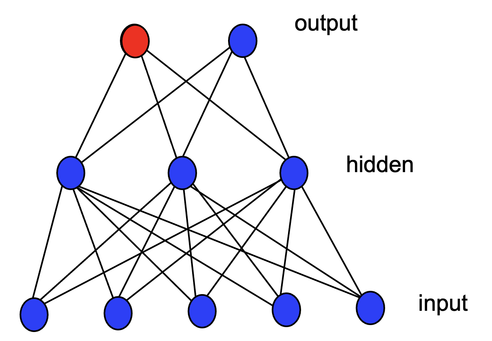
```
</div>

## Error Backpropagation

<ul><li>First calculate error of output units and use this to change the top layer of weights.</li></ul>

<div style="float:left;width:50%">
Current output: $o_j=0.2$
<br>  

Correct output: $t_j=1.0$
<br>
    
Error $\delta_j = o_j(1–o_j)(t_j–o_j)$
<br>
    
$0.2(1–0.2)(1–0.2)=0.128$
<br>
    
Update weights into $j$
<br>
    
$$\Delta w_{ji} = \eta \delta_j o_i$$
</div>
<div style="float:right;width:50%">
```{r, echo=FALSE, out.width="100%", fig.align='center'}
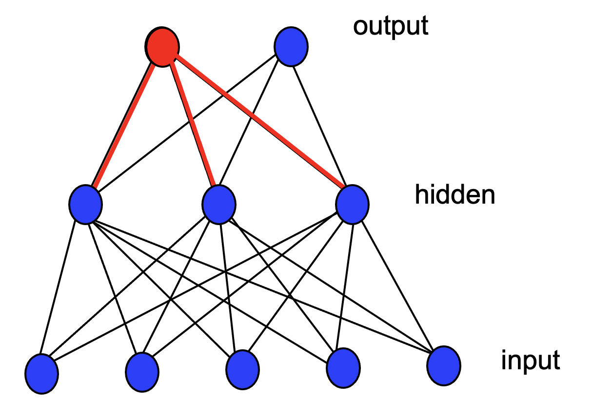
```
</div>

## Error Backpropagation

<ul><li>Next calculate error for hidden units based on errors on the output units it feeds into.</li></ul>

<div style="float:left;width:50%">

</div>
<div style="float:right;width:50%">
```{r, echo=FALSE, out.width="100%", fig.align='center'}
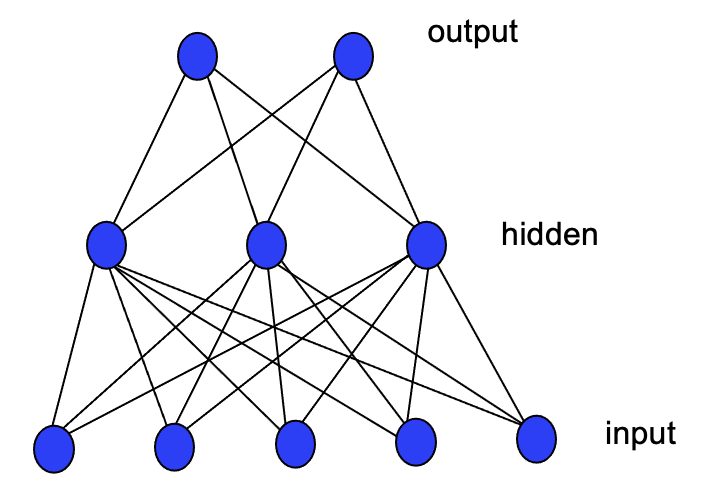
```
</div>

## Error Backpropagation

<ul><li>Next calculate error for hidden units based on errors on the output units it feeds into.</li></ul>

<div style="float:left;width:50%">

$$\delta_j = o_j(1-o_j)\sum_k{\delta_kw_{kj}}$$
    
</div>
<div style="float:right;width:50%">
```{r, echo=FALSE, out.width="100%", fig.align='center'}

```
</div>

## Error Backpropagation

<ul><li>Next calculate error for hidden units based on errors on the output units it feeds into.</li></ul>

<div style="float:left;width:50%">

$$\delta_j = o_j(1-o_j)\sum_k{\delta_kw_{kj}}$$
    
</div>
<div style="float:right;width:50%">
```{r, echo=FALSE, out.width="100%", fig.align='center'}
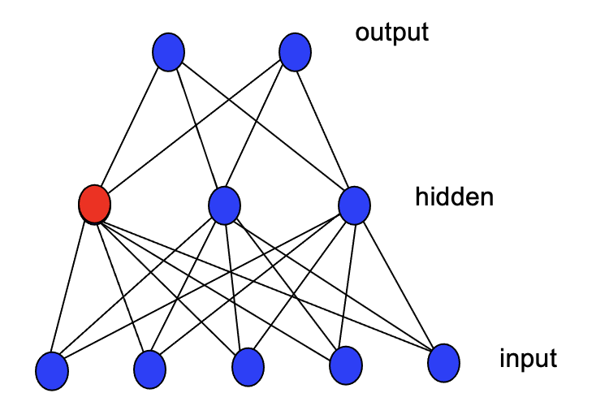
```
</div>

## Error Backpropagation

<ul><li>Next calculate error for hidden units based on errors on the output units it feeds into.</li></ul>

<div style="float:left;width:50%">

$$\delta_j = o_j(1-o_j)\sum_k{\delta_kw_{kj}}$$
    
</div>
<div style="float:right;width:50%">
```{r, echo=FALSE, out.width="100%", fig.align='center'}
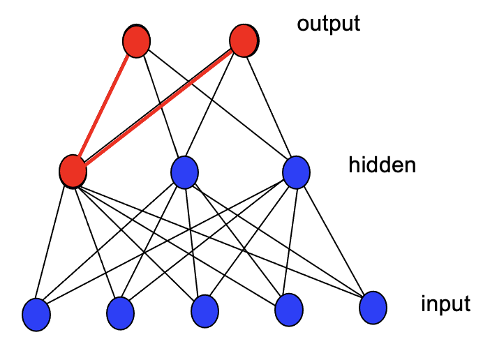
```
</div>

## Error Backpropagation

<ul><li>Finally update bottom layer of weights based on errors calculated for hidden units.</li></ul>

<div style="float:left;width:50%">

$$\delta_j = o_j(1-o_j)\sum_k{\delta_kw_{kj}}$$ 

</div>
<div style="float:right;width:50%">
```{r, echo=FALSE, out.width="100%", fig.align='center'}
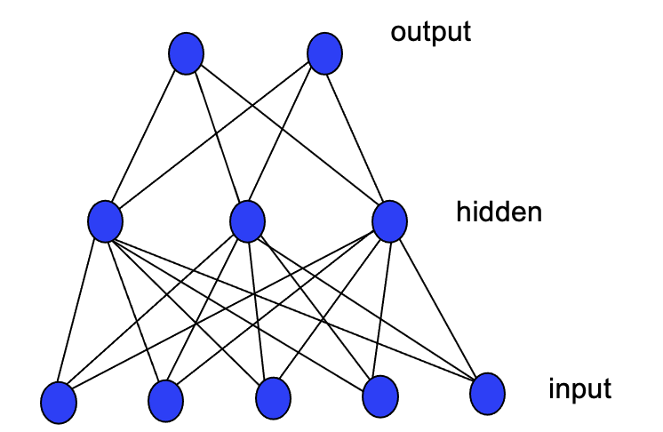
```
</div>

## Error Backpropagation

<ul><li>Finally update bottom layer of weights based on errors calculated for hidden units.</li></ul>

<div style="float:left;width:50%">

$$\delta_j = o_j(1-o_j)\sum_k{\delta_kw_{kj}}$$ 

</div>
<div style="float:right;width:50%">
```{r, echo=FALSE, out.width="100%", fig.align='center'}
include_graphics("img/page 12_2.png")
```
</div>

## Error Backpropagation

<ul><li>Finally update bottom layer of weights based on errors calculated for hidden units.</li></ul>

<div style="float:left;width:50%">

$$\delta_j = o_j(1-o_j)\sum_k{\delta_kw_{kj}}$$

Update weights into $j$
    
$$\Delta w_{ji} = \eta \delta_j o_i$$    

</div>
<div style="float:right;width:50%">
```{r, echo=FALSE, out.width="100%", fig.align='center'}
include_graphics("img/page 12_2.png")
```
</div>

## Error Backpropagation

<ul><li>Finally update bottom layer of weights based on errors calculated for hidden units.</li></ul>

<div style="float:left;width:50%">

$$\delta_j = o_j(1-o_j)\sum_k{\delta_kw_{kj}}$$

Update weights into $j$
    
$$\Delta w_{ji} = \eta \delta_j o_i$$    

</div>
<div style="float:right;width:50%">
```{r, echo=FALSE, out.width="100%", fig.align='center'}
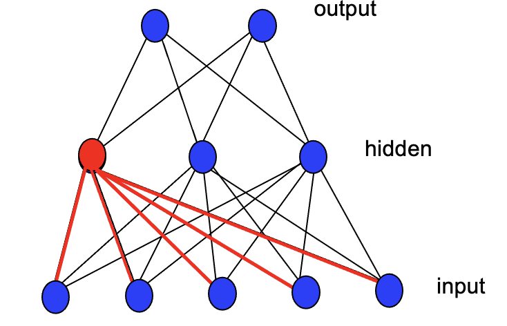
```
</div>

## Backpropagation Training Algorithm
&nbsp;

- Create the 3-layer network with $H$ hidden units with full connectivity between layers. Set weights to small random real values.

- Until all training examples produce the correct value (within $\epsilon$), or mean squared error ceases to decrease, or other termination criteria:
    
  - Begin epoch
       
  - For each training example, $d$, do:

      - Calculate network output for $d$’s input values 
      - Compute error between current output and correct output for $d$
      - Update weights by backpropagating error and using learning rule
  - End epoch
      
## Comments on Training Algorithm

- Not guaranteed to converge to zero training error, may converge to local optima or oscillate indefinitely.
- However, in practice, does converge to low error for many large networks on real data.
- Many epochs (thousands) may be required, hours or days of training for large networks.
- To avoid local-minima problems, run several trials starting with different random weights (*random restarts*).
    - Take results of trial with lowest training set error.
    - Build a committee of results from multiple trials (possibly weighting votes by training set accuracy).

## Hidden Unit Representations

- Trained hidden units can be seen as newly constructed features that make the target concept linearly separable in the transformed space.
- On many real domains, hidden units can be interpreted as representing meaningful features such as vowel detectors or edge detectors, etc..
- However, the hidden layer can also become a distributed representation of the input in which each individual unit is not easily interpretable as a meaningful feature.

## One forward pass

```{r, echo=FALSE, out.width="100%", fig.align='center'}
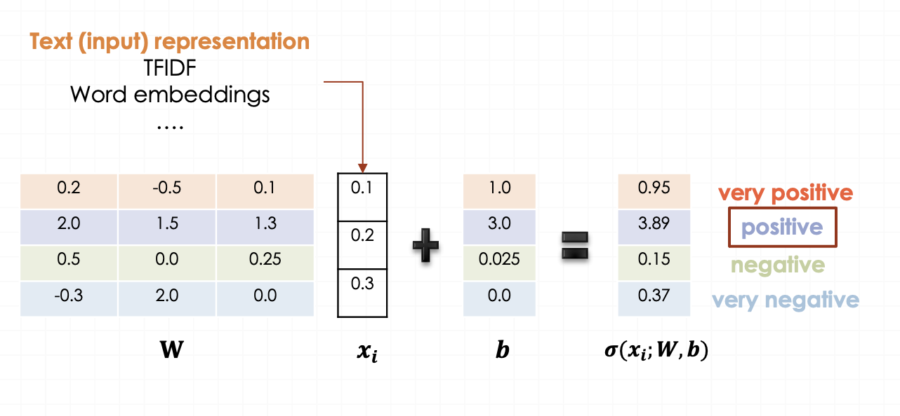
```

## Activation functions

Non-linearities needed to learn complex (non-linear) representations of data, otherwise the NN would be just a linear function $W_1W_2x = Wx$

```{r, echo=FALSE, out.width="80%", fig.align='center'}
include_graphics("img/page 17.png")
```

More layers and neurons can approximate more complex functions

Full list: https://en.wikipedia.org/wiki/Activation_function 

## Activation: Sigmoid

<div style="float:left;width:50%">
```{r, echo=FALSE, out.width="50%", fig.align='center'}
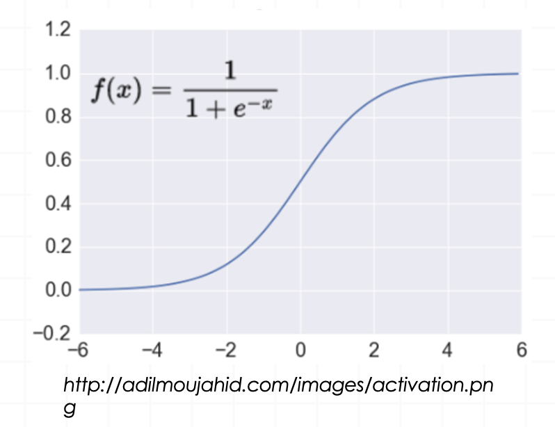
```
</div>
<div style="float:right;width:50%">
Takes a real-valued number and “squashes” it into range between 0 and 1. 
$$R^n \rightarrow [0,1]$$

<br> <br> <br> 
</div>

- $+$ Nice interpretation as the <span style="color:orange;font-weight:bold">firing rate</span> of a neuron
  - 0 = not firing at all 
  - 1 = fully firing

- $-$ Sigmoid neurons <span style="color:orange;font-weight:bold">saturate</span> and <span style="color:orange;font-weight:bold">kill gradients</span>, thus NN will barely learn
    - when the neuron’s activation are 0 or 1 (saturate)
        - gradient at these regions almost zero 
        - almost no signal will flow to its weights 
        - if initial weights are too large then most neurons would saturate

## Activation: Tanh

<div style="float:left;width:50%">
```{r, echo=FALSE, out.width="50%", fig.align='center'}
include_graphics("img/page 19.png")
```
</div>
<div style="float:right;width:50%">
Takes a real-valued number and “squashes” it into range between -1 and 1. 
$$R^n \rightarrow [-1,1]$$

<br> <br> <br>
</div>

- Like sigmoid, tanh neurons <span style="color:orange;font-weight:bold">saturate</span>
- Unlike sigmoid, output is <span style="color:orange;font-weight:bold">zero-centered</span>
- Tanh is a <span style="color:orange;font-weight:bold">scaled sigmoid</span>: $tanh⁡(x)=2sigm(2x)−1$

## Activation: Tanh

Most Deep Networks use ReLU nowadays 

<div style="float:left;width:50%">
```{r, echo=FALSE, out.width="50%", fig.align='center'}
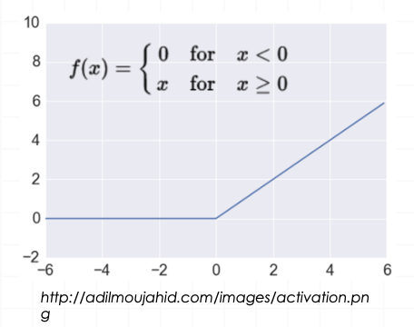
```
</div>
<div style="float:right;width:50%">
Takes a real-valued number and thresholds it at zero $f(x) = max(0,x)$
$$R^n \rightarrow R^n_+$$
<br> <br> <br>
</div>

- $+$ Trains much <span style="color:orange;font-weight:bold">faster</span>
    - accelerates the convergence of SGD
    - due to linear, non-saturating form 
- $+$ Less expensive operations
    - compared to sigmoid/tanh (exponentials etc.)
    - implemented by simply thresholding a matrix at zero
- $+$ More <span style="color:orange;font-weight:bold">expressive </span>
- $+$ Prevents the <span style="color:orange;font-weight:bold">gradient vanishing problem</span>

## Overfitting
&nbsp;

Learned hypothesis may <span style="color:orange;font-weight:bold">fit</span> the training data very well, even outliers (<span style="color:orange;font-weight:bold">noise</span>) but fail to <span style="color:orange;font-weight:bold">generalize</span> to new examples (test data)

<div style="float:left;width:50%">
```{r, echo=FALSE, out.width="100%", fig.align='center'}
include_graphics("img/page 21_1.png")
```
</div>
<div style="float:right;width:50%">
```{r, echo=FALSE, out.width="100%", fig.align='center'}
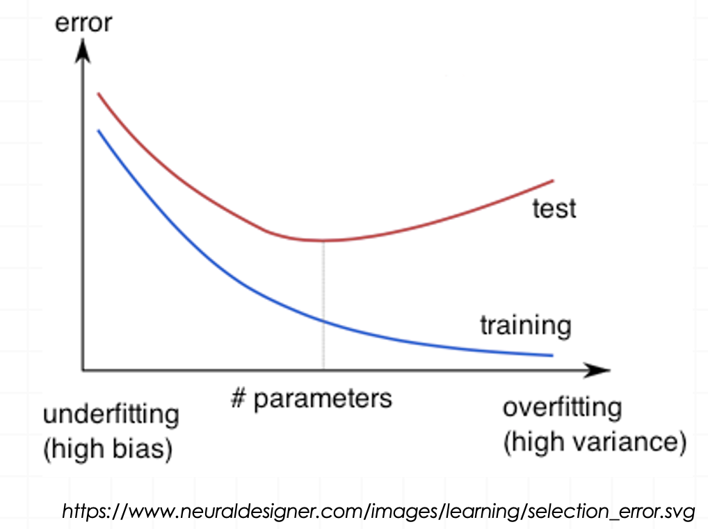
```
</div>

## Overfitting Prevention

- Running too many epochs can result in over-fitting.

```{r, echo=FALSE, out.width="80%", fig.align='center'}
include_graphics("img/page 22.png")
```

- Keep a hold-out validation set and test accuracy on it after every epoch. Stop training when additional epochs actually increase validation error.
- To avoid losing training data for validation:
    - Use internal 10-fold CV on the training set to compute the average number of epochs that maximizes generalization accuracy.
    - Train final network on complete training set for this many epochs.
    
## Regularization

<div style="float:left;width:60%">
<span style="font-weight:bold;color:orange">Dropout</span>
<ul>
    <li>Randomly drop units (along with their connections) during training</li>
    <li>Each unit retained with fixed probability $p$, independent of other units </li>
    <li><span style="color:orange">Hyper-parameter</span> $p$ to be chosen (tuned)</li>
</ul>
</div>
<div style="float:right;width:40%">
```{r, echo=FALSE, out.width="90%", fig.align='center'}
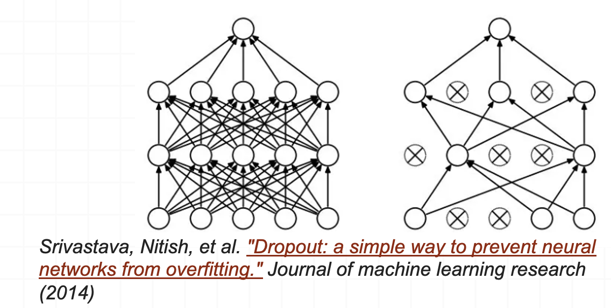
```  

<span style="font-weight:bold;color:orange">L2 = weight decay</span>
<ul>
    <li>Regularization term that penalizes big weights, added to the objective $J_{reg}(\theta) = J(\theta) + \lambda\sum_k{\theta_k^2}$ </li>
    <li>Weight decay value determines how dominant regularization is during gradient computation</li>
    <li>Big weight decay coefficient &rarr big penalty for big weights</li>
</ul>
</div>

<span style="font-weight:bold;color:orange">Early-stopping</span>
<ul>
    <li>Use validation error to decide when to stop training</li>
    <li>Stop when monitored quantity has not improved after n subsequent epochs</li>
    <li>$n$ is called patience</li>
</ul>

## Tuning hyper-parameters {.smaller}

```{r, echo=FALSE, out.width="90%", fig.align='center'}
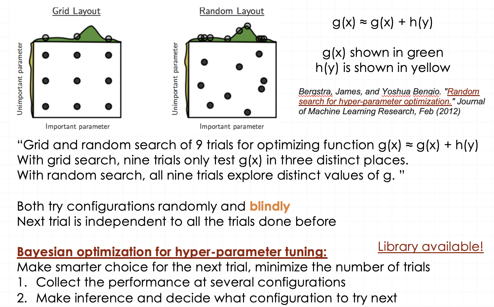
```  

## Loss functions and output

```{r, echo=FALSE, out.width="90%", fig.align='center'}
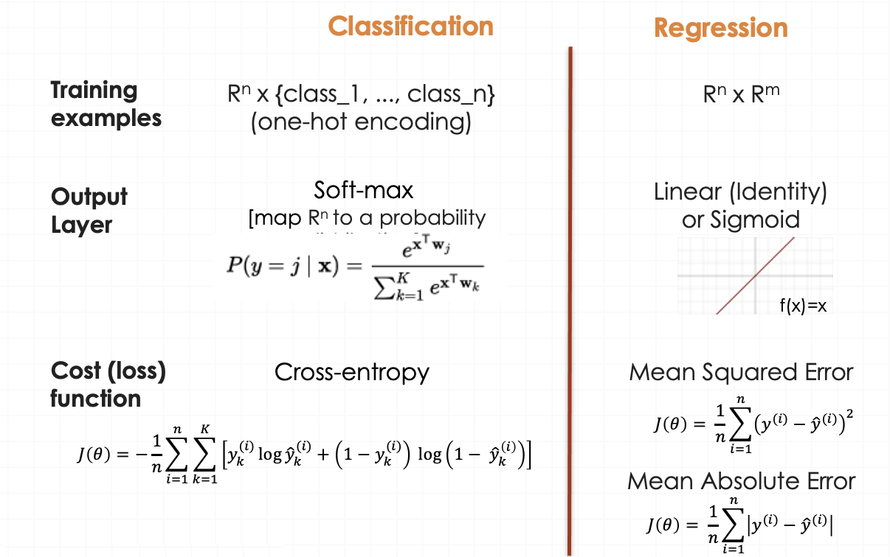
```  

## Determining the Best <br> Number of Hidden Units

- Too few hidden units prevents the network from adequately fitting the data.
- Too many hidden units can result in over-fitting.

```{r, echo=FALSE, out.width="80%", fig.align='center'}
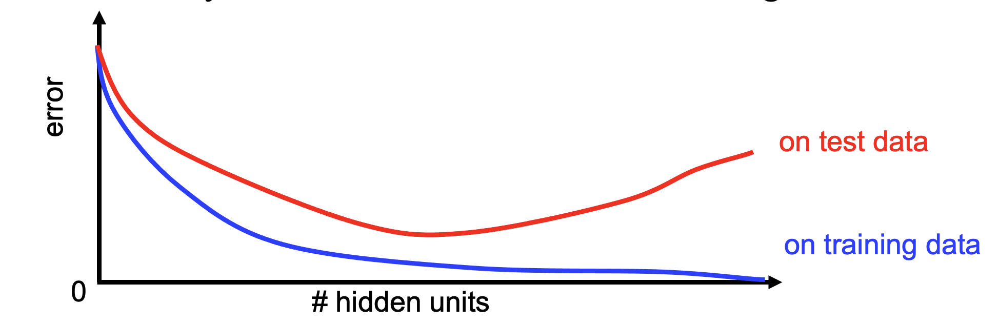
```  

- Use internal cross-validation to empirically determine an optimal number of hidden units.

# Recurrent Neural Network

## Recurrent Neural Networks (RNN)

- Add feedback loops where some units’ current outputs determine some future network inputs.
- RNNs can model dynamic finite-state machines, beyond the static combinatorial circuits modeled by feed-forward networks. 

## Simple Recurrent Network (SRN)

- Initially developed by Jeff Elman (“*Finding structure in time*,” 1990).
- Additional input to hidden layer is the state of the hidden layer in the previous time step.

```{r, echo=FALSE, out.width="80%", fig.align='center'}
include_graphics("img/page 29.png")
```  

## Unrolled RNN

- Behavior of RNN is perhaps best viewed by “unrolling” the network over time.

```{r, echo=FALSE, out.width="80%", fig.align='center'}
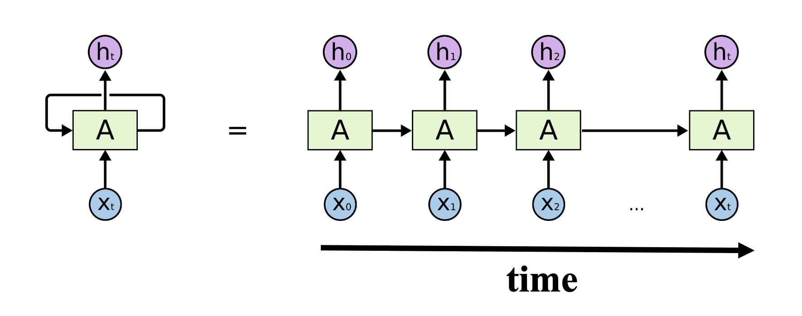
```  

## Training RNN’s

- RNNs can be trained using “backpropagation through time.”
- Can viewed as applying normal backprop to the unrolled network.

```{r, echo=FALSE, out.width="80%", fig.align='center'}
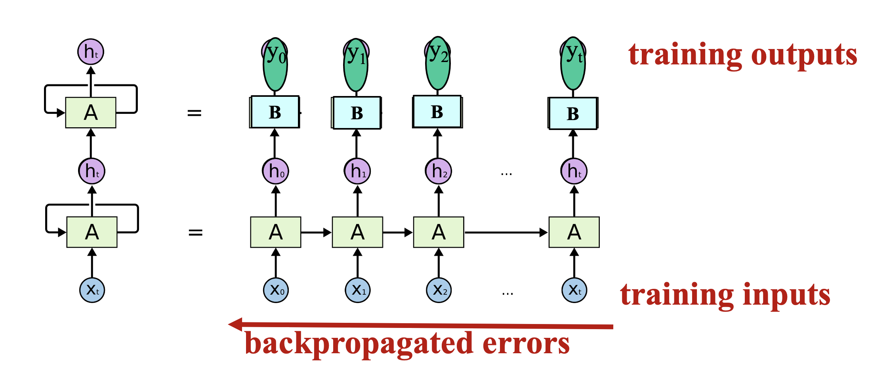
```  

# LSTM

## Vanishing/Exploding Gradient Problem

- Backpropagated errors multiply at each layer, resulting in exponential decay (if derivative is small) or growth (if derivative is large).
- Makes it very difficult train deep networks, or simple recurrent networks over many time steps.

## Long Distance Dependencies

- It is very difficult to train SRNs to retain information over many time steps
- This make is very difficult to learn SRNs that handle long-distance dependencies, such as subject-verb agreement.

```{r, echo=FALSE, out.width="80%", fig.align='center'}
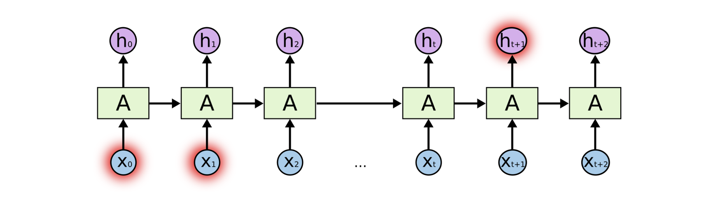
```  

## Long Short Term Memory

- LSTM networks, add additional gating units in each memory cell.
    - Forget gate
    - Input gate
    - Output gate
- Prevents vanishing/exploding gradient problem and allows network to retain state information over longer periods of time.

## LSTM Network Architecture

```{r, echo=FALSE, out.width="100%", fig.align='center'}
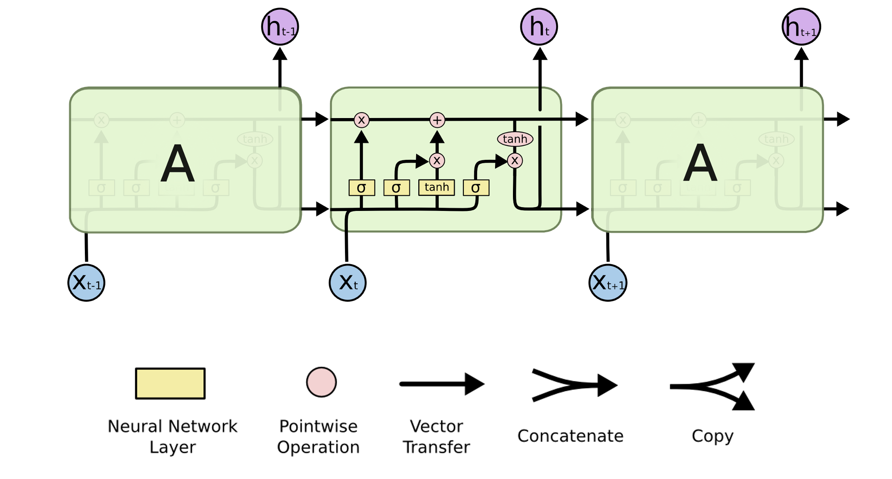
```  

## Cell State

- Maintains a vector $C_t$ that is the same dimensionality as the hidden state, $h_t$
- Information can be added or deleted from this state vector via the forget and input gates.

```{r, echo=FALSE, out.width="80%", fig.align='center'}
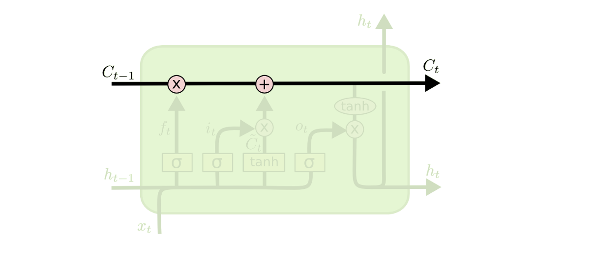
```  

## Cell State Example

- Want to remember person & number of a subject noun so that it can be checked to agree with the person & number of verb when it is eventually encountered.
- Forget gate will remove existing information of a prior subject when a new one is encountered.
- Input gate "adds" in the information for the new subject

## Forget Gate

- Forget gate computes a 0-1 value using a logistic sigmoid output function from the input, $x_t$, and the current hidden state, $h_t$:
- Multiplicatively combined with cell state, "forgetting" information where the gate outputs something close to 0.

```{r, echo=FALSE, out.width="70%", fig.align='center'}
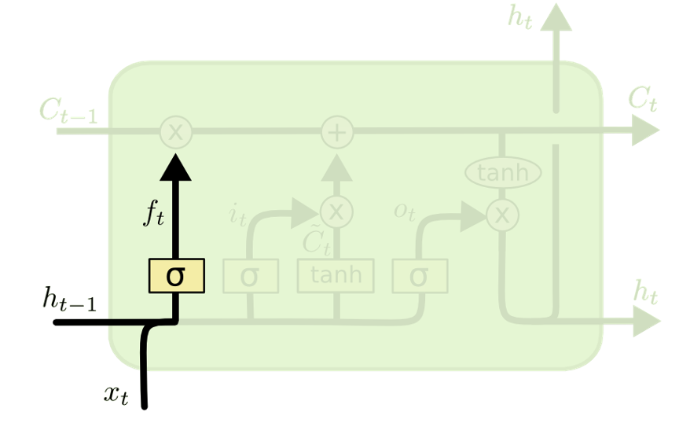
```  

$$f_t = \sigma(W_f \cdot [h_{t-1}, x_t] + b_f)$$
\newpage

## Hyperbolic Tangent Units

- Tanh can be used as an alternative nonlinear function to the sigmoid logistic (0-1) output function.
- Used to produce thresholded output between –1 and 1.

```{r, echo=FALSE, out.width="80%", fig.align='center'}
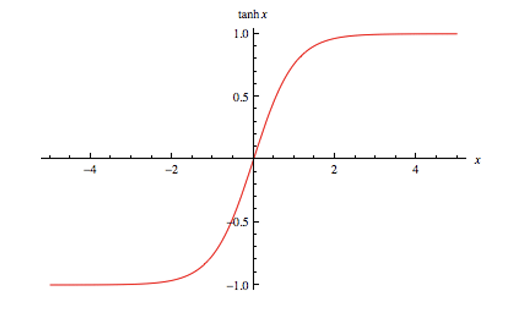
```  

## Input Gate

- First, determine which entries in the cell state to update by computing 0-1 sigmoid output.
- Then determine what amount to add/subtract from these entries by computing a tanh output (valued –1 to 1) function of the input and hidden state.

```{r, echo=FALSE, out.width="60%", fig.align='center'}
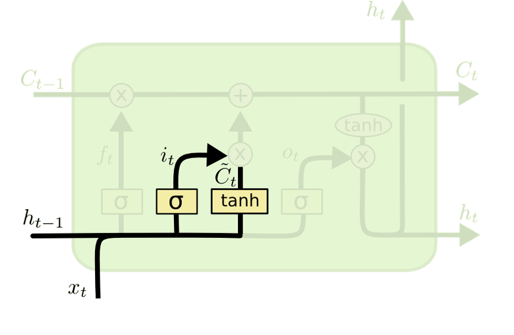
```  

$$i_t = \sigma(W_i \cdot [h_{t-1}, x_t] + b_i)$$
$$\tilde{C}_t = tanh(W_C \cdot [h_{t-1}, x_t] + b_C)$$
\newpage

## Updating the Cell State

- Cell state is updated by using component-wise vector multiply to "forget" and vector addition to "input" new information.

```{r, echo=FALSE, out.width="70%", fig.align='center'}
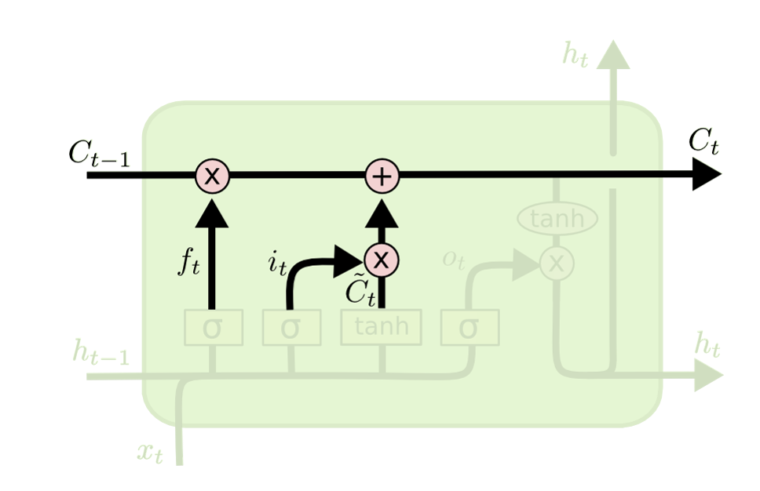
```  

$$C_t = f_t * C_{t-1} + i_t * \tilde{C}_t$$
\newpage

## Output Gate

- Hidden state is updated based on a "filtered" version of the cell state, scaled to –1 to 1 using tanh.
- Output gate computes a sigmoid function of the input and current hidden state to determine which elements of the cell state to "output".

```{r, echo=FALSE, out.width="60%", fig.align='center'}
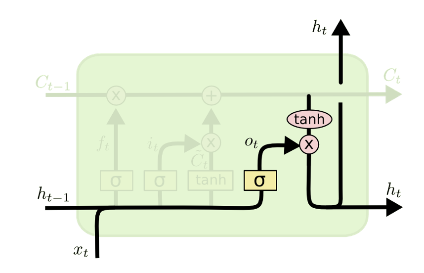
```  

$$o_t = \sigma(W_o[h_{t-1}, x_t] + b_o)$$
$$h_t = o_t * tanh(C_t)$$

\newpage

## Overall Network Architecture

- Single or multilayer networks can compute LSTM inputs from problem inputs and problem outputs from LSTM outputs.

```{r, echo=FALSE, out.width="80%", fig.align='center'}
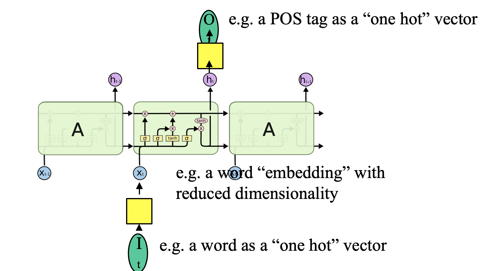
```  

## LSTM Training

- Trainable with backprop derivatives such as:
    - Stochastic gradient descent (randomize order of examples in each epoch) with momentum (bias weight changes to continue in same direction as last update).
    - ADAM optimizer (Kingma & Ma, 2015)
- Each cell has many parameters ($W_f$, $W_i$, $W_C$, $W_o$)
    - Generally requires lots of training data.
    - Requires lots of compute time that exploits GPU clusters.

## General Problems Solved with LSTMs

- Sequence labeling 
    - Train with supervised output at each time step computed using a single or multilayer network that maps the hidden state ($h_t$) to an output vector ($O_t$).
- Language modeling
    - Train to predict next input ($O_t =I_{t+1}$)
- Sequence (e.g. text) classification
    - Train a single or multilayer network that maps the final hidden state ($h_n$) to an output vector ($O$).

## Sequence to Sequence <br> Transduction (Mapping)

- Encoder/Decoder framework maps one sequence to a "deep vector" then another LSTM maps this vector to an output sequence.

```{r, echo=FALSE, out.width="80%", fig.align='center'}
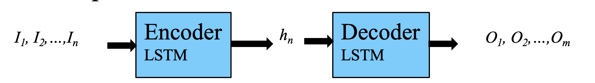
```  

- Train model "end to end" on I/O pairs of sequences.

## Summary of <br> LSTM Application Architectures

```{r, echo=FALSE, out.width="100%", fig.align='center'}
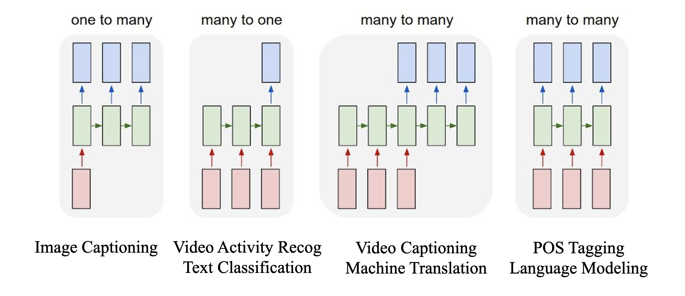
```  

## Successful Applications of LSTMs

- Speech recognition: Language and acoustic modeling
- Sequence labeling
  - POS Tagging 
    
    https://www.aclweb.org/aclwiki/index.php?title=POS_Tagging_(State_of_the_art)
  - NER
  - Phrase Chunking 
- Neural syntactic and semantic parsing
- Image captioning: CNN output vector to sequence
- Sequence to Sequence
  - Machine Translation (Sustkever, Vinyals, & Le, 2014)
  - Video Captioning (input sequence of CNN frame outputs)

## Bi-directional LSTM (Bi-LSTM)

- Separate LSTMs process sequence forward and backward and hidden layers at each time step are concatenated to form the cell output.

```{r, echo=FALSE, out.width="80%", fig.align='center'}
include_graphics("img/page 50.png")
```  

## Gated Recurrent Unit (GRU)

- Alternative RNN to LSTM that uses fewer gates (Cho, et al., 2014)
    - Combines forget and input gates into “update” gate.
    - Eliminates cell state vector

```{r, echo=FALSE, out.width="40%", fig.align='center'}
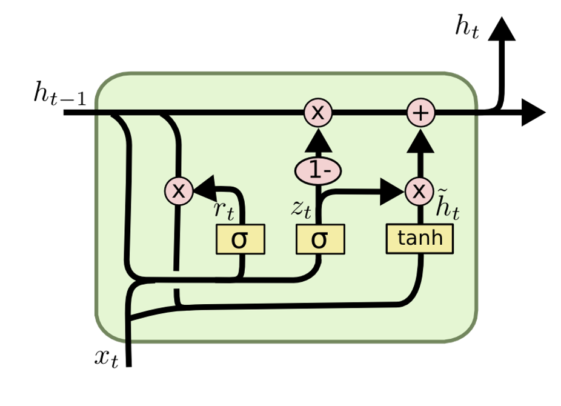
```  

$$z_t = \sigma(W_z \cdot [h_{t-1}, x_t])$$
$$r_t = \sigma(W_r \cdot [h_{t-1}, x_t])$$
$$\tilde{h}_t = tanh(W \cdot [r_t * h_{t-1}, x_t])$$
$$h_t = (1 - z_t) * h_{t-1} + z_t * \tilde(h)_t$$
\newpage

## GRU vs. LSTM

- GRU has significantly fewer parameters and trains faster.
- Experimental results comparing the two are still inconclusive, many problems they perform the same, but each has problems on which they work better.

## Menti

## Attention

- For many applications, it helps to add “attention” to RNNs.
- Allows network to learn to attend to different parts of the input at different time steps, shifting its attention to focus on different aspects during its processing.
- Used in image captioning to focus on different parts of an image when generating different parts of the output sentence.
- In MT, allows focusing attention on different parts of the source sentence when generating different parts of the translation.

## Attention Mechanism

```{r, echo=FALSE, out.width="80%", fig.align='center'}
include_graphics("img/page 55.png")
```  

## Attention - Scoring

```{r, echo=FALSE, out.width="80%", fig.align='center'}
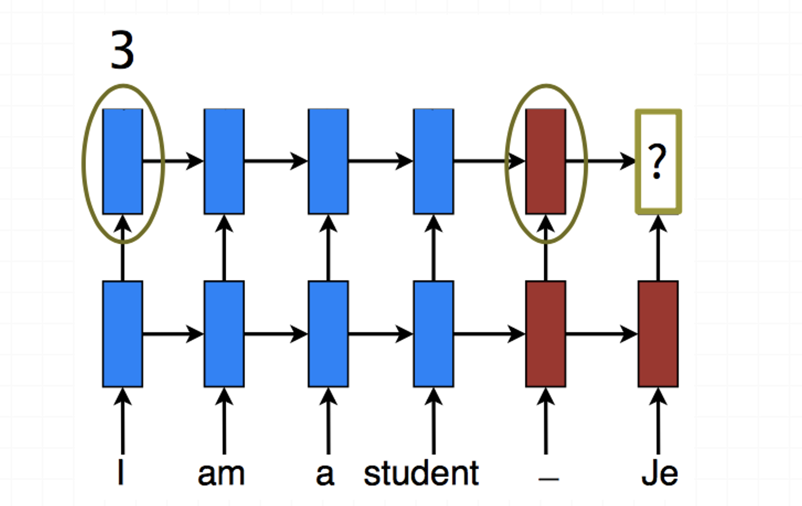
```  

$$score(h_{t-1},\bar{h}_s) = h_t^T\bar{h}_s$$

<span style="color:orange;font-weight:bold">Compare</span> target and source hidden states

## Attention - Scoring

```{r, echo=FALSE, out.width="70%", fig.align='center'}
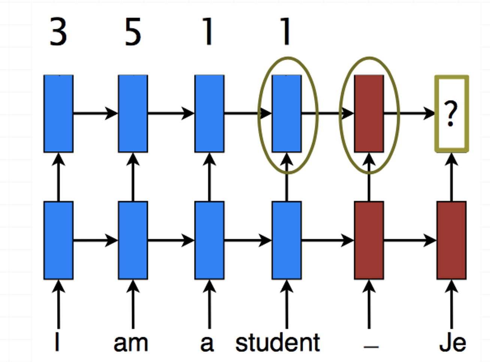
```  

$$score(h_{t-1},\bar{h}_s) = h_t^T\bar{h}_s$$

<span style="color:orange;font-weight:bold">Compare</span> target and source hidden states

## Attention - Normalization

```{r, echo=FALSE, out.width="65%", fig.align='center'}
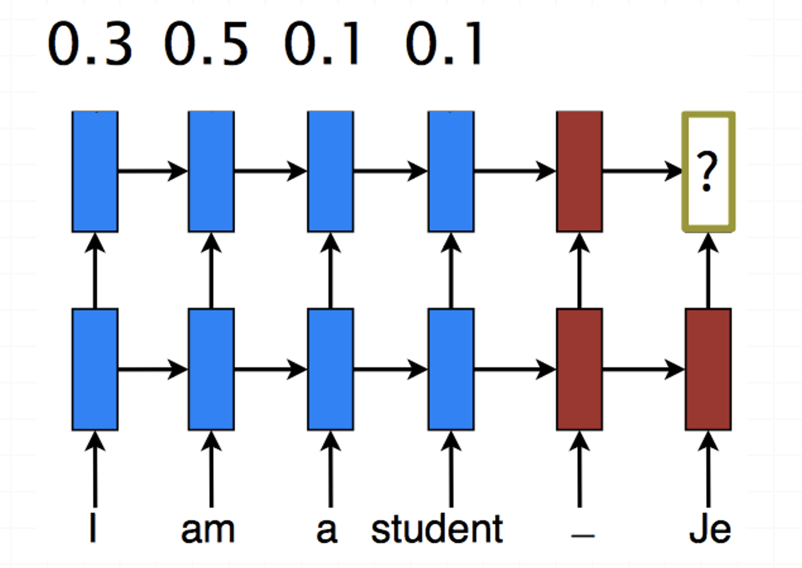
```  

$$a_t(s) = \frac{e^{score(s)}}{\sum_{s'}{e^{score(s')}}}$$

<span style="color:orange;font-weight:bold">Convert</span> into alignment weights

## Attention - Context

```{r, echo=FALSE, out.width="60%", fig.align='center'}
include_graphics("img/page 58.png")
```  

$$c_t = \sum_s{a_t(s)\bar{h}_s}$$

Build <span style="color:orange;font-weight:bold">context</span> vector: weighted average

## Attention - Context

```{r, echo=FALSE, out.width="60%", fig.align='center'}
include_graphics("img/page 59.png")
```  

$$h_t = f(h_{t-1}, c_t, e_t)$$

Compute <span style="color:orange;font-weight:bold">next</span> hidden state

# Summary

## Summary: what did we learn?

# Time for Practical 6!